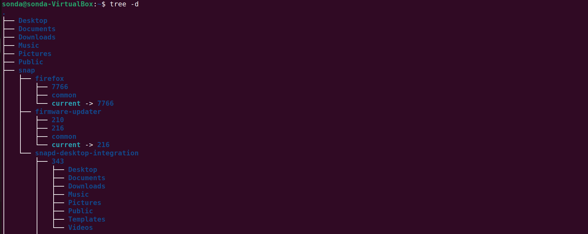

- [Introducing the Linux operating system](#introducing-the-linux-operating-system)
  - [Core Concepts: OS, Kernel, and Unix](#core-concepts-os-kernel-and-unix)
  - [The "Linux" Identity: GNU + Linux](#the-linux-identity-gnu--linux)
  - [Why Linux Matters](#why-linux-matters)
- [Linux Distributions](#linux-distributions)
  - [What is a Linux Distribution](#what-is-a-linux-distribution)
  - [Common Linux distributions](#common-linux-distributions)
- [Introducing the Linux shell](#introducing-the-linux-shell)
  - [Explaining the command structure](#explaining-the-command-structure)
  - [Consulting the manual](#consulting-the-manual)
- [The Linux filesystem](#the-linux-filesystem)
  - [Directory structure](#directory-structure)
    - [Exploring the Linux filesystem from the command line](#exploring-the-linux-filesystem-from-the-command-line)
  - [Understanding file paths](#understanding-file-paths)
    - [Absolute Paths](#absolute-paths)
    - [Relative Paths](#relative-paths)
  - [Symbolic Links](#symbolic-links)
  - [Hard Links](#hard-links)
- [Managing Users and Groups](#managing-users-and-groups)
  - [Managing users](#managing-users)
  - [Understanding sudo](#understanding-sudo)
    - [Elevating privileges: `sudo`](#elevating-privileges-sudo)
- [Linux Software Management](#linux-software-management)
  - [The DEB package’s anatomy](#the-deb-packages-anatomy)
    - [Updating the Package List](#updating-the-package-list)
  - [Upgrading Software](#upgrading-software)
    - [Managing Packages (Install/Remove)](#managing-packages-installremove)
    - [`apt` vs. `apt-get`](#apt-vs-apt-get)
  - [The RPM packages anatomy](#the-rpm-packages-anatomy)
    - [Updating the System](#updating-the-system)
    - [Managing Software (Install/Remove)](#managing-software-installremove)
  - [Enabling Additional Repositories](#enabling-additional-repositories)
- [Bash Shell](#bash-shell)
  - [How to execute several commands](#how-to-execute-several-commands)
  - [The `echo` command](#the-echo-command)
  - [The `pwd` command](#the-pwd-command)
  - [The `cd` command](#the-cd-command)
  - [The `ls` Command](#the-ls-command)

# Introducing the Linux operating system

## Core Concepts: OS, Kernel, and Unix

- Operating System (OS): The system software that manages hardware and provides services (like UI and networking) for programs.

- Kernel: The "heart" of the OS. It is the specific layer responsible for managing the processor, memory, and hardware devices.

- Unix: A powerful, multi-user, and multitasking OS that serves as the architectural foundation for most modern systems (including macOS/iOS).

## The "Linux" Identity: GNU + Linux

**The term "Linux" as we use it today is actually a combination of two distinct projects:**

- The GNU Project (1983): Created by Richard Stallman with the goal of building a completely free and open-source Unix-like OS. It provided the utilities and tools (shell, compilers, etc.) but lacked a working kernel for a long time.

- The Linux Kernel (1991): Created by Linus Torvalds to manage hardware. It was released under the GPL (General Public License), ensuring the source code remains free and modifiable.

- Technical Distinction: Technically, what we use is GNU/Linux. The Linux kernel handles the hardware, while the GNU tools provide the user environment. In common language, we simply call the entire package "Linux."

## Why Linux Matters

- Versatility: It runs everything from massive data centers and cloud servers to Android smartphones and IoT devices.

- Unix-like: It replicates the power of the original proprietary Unix systems but remains open-source and free to modify.

- Multi-user/Multitasking: It inherently supports different permission levels and running multiple apps simultaneously, making it highly secure and efficient.

# Linux Distributions

## What is a Linux Distribution

- A Linux distribution (or "distro") is an operating system built on top of the GNU/Linux core (the Kernel plus GNU software).
  - **Customization**: Each distro adds specific software and default configurations to cater to different user groups.

  - **Software Overlap**: While many tools (like web servers) are available across all distros, the way they are configured or managed may vary slightly.

  - **Cost**: Most are free under open-source licenses, though some enterprise versions require a paid license for support and access.

## Common Linux distributions

- Fedora, CentOS Stream, Rocky Linux and RHEL
- Debian
- Ubuntu
- Linux Mint
- openSUSE

# Introducing the Linux shell

- Linux has its roots in the Unix operating system, and one of its main strengths is the **command-line interface**. In the old days, this was called the **shell**
- The shell is a program that has two streams: an input stream and an output stream. The input is a
  command given by the user, and the output is the result of that command, or an interpretation of it.
- In other words, the shell is the primary interface between the user and the machine
- The main shell in major Linux distributions is called **Bash**, which is an acronym for Bourne Again
  Shell, named after Steve Bourne, the original creator of the shell in UNIX
- Alongside Bash, there are other shells available in Linux, such as **ksh**, **tcsh**, and **zsh**

- One shell can be assigned to each user. Users on the same system can use different shells. One way
  to check the default shell is by accessing the command

```bash
cat /etc/passwd | grep <<user>>

# <<user>> is user account in linux system
```

- An easier way to see the current shell is by running the following command

```bash
echo $0
```

## Explaining the command structure

- In a nutshell, Unix and Linux commands have the following form:
  - The command’s name
  - The command’s options
  - The command’s arguments

```bash
command [-option(s)] [argument(s)]
```

## Consulting the manual

- Almost all commands in Linux have a `--help` option. You can use this for quick reference.

```bash
 <<commnad_name>> --help

# commnad_name is name of command
```

- The `man` command is the standard way to read comprehensive, built-in manuals for almost any program. Syntax `man [command]`

# The Linux filesystem

## Directory structure

- Linux uses a hierarchical filesystem structure. It is similar to an upside-down tree, with the root (`/`) at the base of the filesystem. From that point, all the branches (directories) spread throughout the filesystem.
- The following are the directories that exist on almost all versions of Linux
  - `/`: Root directory. The root for all other directories.
  - `/bin`: Essential command binaries. The place where binary programs are stored.
  - `/boot`: Static files of the boot loader. The place where the kernel bootloader, and initramfs are stored
  - `/dev`: Device files. Nodes to the device equipment, a kernel device list.
  - `/etc`: Host-specific system configuration. Essential config files for the system, boot time loading scripts, crontab, fstab device storage tables, passwd user accounts file.
  - `/home`: user Home directory. The place where the user’s files are stored.
  - `/lib`: Essential shared libraries and kernel modules. Shared libraries are similar to Dynamic Link Library (DLL) files in Windows.
  - `/media`: Mount point for removable media. For external devices and USB external media.
  - `/mnt`: Mount point for mounting a filesystem temporarily. Used for legacy systems.
  - `/opt`: Add-on application software packages. The place where optional software is installed.
  - `/proc`: Virtual filesystem managed by the kernel. a special directory structure that contains files essential for the system.
  - `/sbin`: Essential system binaries. Vital programs for the system’s operation.
  - `/srv`: Data for services provided by this system.
  - `/tmp`: Temporary files.
  - `/usr`: Secondary hierarchy. The largest directory in Linux that contains support files for regular system users
  - `/usr/bin` – system-executable files
  - `/usr/lib` – shared libraries from `/usr/bin`
  - `/usr/local` – source compiled programs not included in the distribution
  - `/usr/sbin` – specific system administration programs
  - `/usr/share` – data shared by the programs in /usr/bin such as config files, icons, wallpapers or sound files
  - `/usr/share/doc` – documentation for the system-wide files
  - `/var`: Variable data. Only data that is modifiable by the user is stored here, such as databases, printing spool files, user mail, and others; `/var/log` – contains log files that register system activity

### Exploring the Linux filesystem from the command line

- Feel free to explore the filesystem yourself by using the tree command. In Fedora Linux, it is already
  installed, but if you use Ubuntu, you will have to install it by using the following command

```bash
sudo apt install tree
```

- You can use the ls command to list the contents of directories, but tree offers different graphics. The following image shows you the differences between the outputs



- In our example, the command will go down one level, starting from the root directory, represented by the forward slash as an argument

```bash
tree -L 1
```

## Understanding file paths

### Absolute Paths

- Absolute paths define the complete address of a file or folder starting from the root of the system.
  - **Starting Point**: They always start with a forward slash (/), representing the root directory.

  - **Consistency**: They work from anywhere in the system, regardless of your current working directory.

  - **Special Shortcut**: The tilde (`~`) is also treated as an absolute path because the shell (Bash) automatically expands it to the full path of your home directory (e.g., /home/username) before running the command.

Examples:

- `/home/giannis/Desktop`
- `~/Desktop`
- `/etc/network`

### Relative Paths

- Relative paths define a location relative to your Current Working Directory (PWD).
  - Starting Point: They do not start with a slash. They start with a folder name or a special dot notation.

  - Dependency: Their success depends entirely on where you are currently "standing" in the terminal.

- Common Notations:
  - `Desktop/` or `./Desktop/`: Look for a folder named "Desktop" inside the current folder.

  - `../`: Move one level up to the parent directory.

  - `../Documents`: Move one level up, then look for a folder named "Documents".

## Symbolic Links

- a symbolic link (also known as a soft link or symlink)
- The command used to create a symlink is `ln -s`. The syntax is: `ln -s [target_path] [link_name]`
- Why use Symbolic Links:
  - Suppose we install version 2.6 of “foo,” which has the filename “foo-2.6,” and then create a symbolic link
    simply called “foo” that points to “foo-2.6.” This means that when a program opens the file “foo,” it is actually opening the file “foo-2.6.” Now everybody is happy. The programs that rely on “foo” can find it, and we can still see what actual version is installed. When it is time to upgrade to “foo-2.7,” we just add the file to our system, delete the symbolic link “foo,” and create a new one that points to the new version. Not only does this solve the problem of the version upgrade, it also allows us to keep both versions on our machine. Imagine that “foo-2.7” has a bug (damn those developers!), and we need to revert to the old version. Again, we just delete the symbolic link pointing to the new version and create a new symbolic link pointing to the old version

## Hard Links

# Managing Users and Groups

## Managing users

- In this context, a user is anyone using a computer or a system resource. In its simplest form, a Linux
  user or user account is identified by a name and a unique identifier, known as a UID.

- Linux categorizes users based on their role and level of access to the system:
  - **System Accounts**: These are used to run background tasks and services (like web servers or databases). Notably, they usually do not have a home directory.

  - **Regular Users**: These are standard accounts created for people.
    - They have a dedicated home directory for personal files.

    - They are restricted from accessing other users' files or performing administrative tasks by default.

  - **Superuser** (Root): This is the most powerful account on the system.
    - It has unrestricted access to every file and setting.

    - It can add/remove users, install software, and modify system configurations.

## Understanding sudo

### Elevating privileges: `sudo`

- The root user is the default superuser account in Linux, and it has the ability to do anything on a
  system. Ideally, acting as root on a system should generally be avoided due to safety and security
  reasons.
- With `sudo`, Linux provides a mechanism for promoting a regular user account to superuser
  privilege.
  - **Temporary Elevation**: It doesn't turn you into the root user permanently; it only elevates the specific command you are running.

  - **Authentication**: When using sudo, the system asks for your user password, not the root password.

  - **Configuration**: Not all users can use sudo. During installation (Ubuntu/CentOS), a user must be designated as an "administrator" or added to the "sudoers" list to have this ability.

- Syntax `sudo command [-option(s)] [argument(s)]`

```bash
ls /root
# ls: cannot open directory '/root': Permission denied

sudo ls /root
# snap
```

- Built-in command can't run with sudo command

```bash
sudo cd vandtt
# sudo: "cd" is a shell built-in command, it cannot be run directly.
```

- The "Nuclear" Warning: Risk of High Privileges
  - The most critical takeaway is that sudo removes the system's "safety rails." To demonstrate, the instructor runs a destructive command: `sudo rm -rf /etc`

  - The Result: This command deletes the /etc folder, which contains essential system configuration files.

  - The Aftermath: Upon rebooting, the system fails to load, showing multiple "Failed" messages.

  - Lesson: Always **double-check** commands before using sudo. In a real-world environment (not a Virtual Machine), this would result in catastrophic data loss and system failure.

# Linux Software Management

- In Linux, applications come bundled into **repositories**. A **repository** is a centrally managed location that consists of software packages maintained by developers
- Each Linux distribution comes with several official repositories, but on top of those, you can add some new ones
  - Ubuntu uses deb packages, as it is based on Debian
  - Fedora (or Rocky Linux and AlmaLinux) uses rpm packages, as it is based on RHEL

## The DEB package’s anatomy

### Updating the Package List

- Before installing or upgrading software, you must synchronize your local database with the online repositories.

- Command: `sudo apt update`

- Purpose: This does not install new software. It only refreshes the list of available packages and their versions.

- Note: This requires sudo (root privileges) because it accesses protected system files.

## Upgrading Software

- Once the list is updated, you can move to the actual upgrade process.
- Command
  - `sudo apt upgrade`: Performs a "small" upgrade. It updates existing packages and, in the apt version, will install new dependencies if required.

  - `sudo apt full-upgrade` (or dist-upgrade): Performs a "large" upgrade. It can install new packages or remove existing ones if they conflict with the upgrade. It is more thorough but carries a slightly higher risk of changing system behavior.

- Kernel Updates: If the system upgrades the kernel (the core of the OS), a reboot is usually required.

### Managing Packages (Install/Remove)

- The lecture demonstrates how to add or take away specific tools:

- Install: `sudo apt install <package_name>` (e.g., cowsay `sudo apt install cowsay`).

- Remove: `sudo apt remove <package_name>`.

- Cleanup: `sudo apt autoremove` deletes packages that were installed as dependencies but are no longer needed by any current software. This is a common troubleshooting step for resolving upgrade conflicts.

### `apt` vs. `apt-get`

- The instructor notes that while apt and apt-get are often used interchangeably, there is a subtle difference:

- `apt upgrade` will install new dependencies if needed.

- `apt-get upgrade` generally will not install new dependencies; it only updates what is already there.

## The RPM packages anatomy

### Updating the System

- In CentOS, keeping the system current is straightforward because the package manager automatically handles list refreshes.

- Commands: `sudo dnf upgrade` or `sudo dnf update`.

- Key Difference from Ubuntu: Unlike `apt`, you do not need a separate "update" command to refresh package lists; DNF does this automatically before upgrading.

- Rebooting: If the kernel is updated, a system restart is strongly recommended to apply the changes.

### Managing Software (Install/Remove)

- Install: `sudo dnf install <package_name>`

- Remove: `sudo dnf remove <package_name>`

- Legacy Support: The older command `yum` still works as an alias for `dnf` for those familiar with older versions of CentOS.

## Enabling Additional Repositories

- Additional repositories are third-party or non-standard software sources added to a Linux system to install specific applications not available in default repositories
- Example on CentOS
  - Install EPEL: `sudo dnf install epel-release` (This adds new "servers" or sources for software).

  - Enable CodeReady Builder (CRB): Many EPEL packages require the CRB power tools. This is enabled via `sudo crb enable`.

  - Refresh: Run `sudo dnf update` again to sync the newly added lists.

  - Security: You may be asked to confirm GPG keys (digital signatures) during installation to ensure the software is authentic.

# Bash Shell

## How to execute several commands

- The semicolon allows you to chain commands together so they run sequentially (one after the other).

- Syntax: `command1 ; command2 ; command3`

- Execution: The shell runs command1, waits for it to finish, then runs command2, and so on.

- Trailing Semicolon: You can put a semicolon at the very end of the line, but it is optional and usually omitted.

-Example: `echo -n "Hello " ; echo "World"`

## The `echo` command

- The primary purpose of echo is to output text to the terminal.
- **Quotes**: In Bash, single quotes are used to wrap strings
- Working with Options
  - `-n` (No newline): By default, echo adds a line break at the end. Using `-n` prevents this, causing the terminal prompt to appear immediately after the output.

  - `-e` (Enable backslash escapes): This allows the command to interpret special characters like `\n` as an actual line break within the string.

  - Combining Options: You can use options separately (e.g., `-n -e`) or combine them into a single block (e.g., `-ne` or `-en`). The order usually does not matter for most Unix commands

```
echo -e 'This is my car\nThis is my car'

# This is my car
# This is my car

echo -en "Danh sách mua sắm:\n\t* Táo\n\t* Chuối\n"

# Danh sách mua sắm:
#     * Táo
#     * Chuối
```

## The `pwd` command

- `pwd` (Print Working Directory): Use this command to display the full path of your current location.

```bash
pwd
# home/sonda
```

## The `cd` command

- The `cd` command is used to move between folders. You can navigate using different types of paths:

- Linux/Unix Structure: There are no drive letters (like C:). Everything starts from the root folder (`/`).

- Home Directory: Represented by the tilde (`~`)` symbol, this is your user-specific folder (e.g., /home/username or /Users/username on macOS)

- Navigation Methods

| Command                | Result                                                                        |
| :--------------------- | :---------------------------------------------------------------------------- |
| **`pwd`**              | **Print Working Directory**: Displays the full path of the current directory. |
| **`cd [folder]`**      | Moves into a subfolder of your current directory (e.g., `cd Desktop`).        |
| **`cd /`**             | Moves to the **Root** directory (the base of the entire system).              |
| **`cd ..`**            | Moves up one level to the **Parent** directory.                               |
| **`cd ../..`**         | Moves up two levels.                                                          |
| **`cd ~`** or **`cd`** | Returns you instantly to your **Home** directory.                             |
| **`cd -`**             | Moves back to the previous directory you were in.                             |

- Pro-Tips for Efficiency
  - Tab Autocomplete: Type the first few letters of a folder name and press Tab. The shell will automatically complete the name for you, saving time and preventing typos.

- Example absolute path

```bash
[me@linuxbox usr]$ pwd
/# usr

[me@linuxbox usr]$ cd /usr/bin
[me@linuxbox bin]$ pwd
# /usr/bin
```

- Example relative path

```bash
[me@linuxbox usr]$ pwd
/# usr

[me@linuxbox usr]$ cd ./bin
[me@linuxbox bin]$ pwd
# /usr/bin
```

## The `ls` Command

- The `ls` command shows the contents of your current working directory.
  - Context: By default, it operates on your Present Working Directory (PWD), but it can be pointed at any path.

- Command Options (Flags)

| Command                | Description                                                         |
| :--------------------- | :------------------------------------------------------------------ |
| **`ls`**               | List files/folders in the current directory.                        |
| **`ls -a`**            | List **all** files (including hidden files starting with `.`).      |
| **`ls -t`**            | Sort contents by **time** (newest first).                           |
| **`ls -r`**            | **Reverse** the sorting order.                                      |
| **`ls -rt`**           | Sort by time in reverse (useful to see newest files at the bottom). |
| **`ls [path]`**        | List contents of a **specific folder** (e.g., `ls /etc`).           |
| **`ls --color=never`** | Disable colorized output.                                           |
| **`ls -l`**            | Display results in long format                                      |

- Directory Arguments
  - You can provide a specific path as an argument to see what is inside a different folder without leaving your current location.

```bash
# will list everything in the root directory while you stay in your home folder

ls ~
```

- Combined Flags: `ls -la` is a very common shortcut to see all files in a detailed list format.

```bash
ls -la

# drwxr-xr-x  2 user user  4096 Mar 10 10:00 Desktop
# -rw-r--r--  1 user user   220 Mar 10 09:00 .bashrc
```

- Linux `ls -l` Output Breakdown

| Component                   | Example        | Description                                                                                                                                                                                                |
| :-------------------------- | :------------- | :--------------------------------------------------------------------------------------------------------------------------------------------------------------------------------------------------------- |
| **File Type & Permissions** | `drwxr-xr-x`   | The first character indicates the type (`d` for directory, `-` for regular file). The next 9 characters represent permissions for **Owner**, **Group**, and **Others** ($r$=read, $w$=write, $x$=execute). |
| **Hard Links**              | `2`            | The number of hard links pointing to the file or directory.                                                                                                                                                |
| **Owner**                   | `user`         | The username of the account that owns the file.                                                                                                                                                            |
| **Group**                   | `user`         | The name of the group that has specific permissions for this file.                                                                                                                                         |
| **Size**                    | `4096`         | The file size in bytes. (Tip: Use `ls -lh` to see this in "human-readable" format like KB or MB).                                                                                                          |
| **Timestamp**               | `Mar 10 10:00` | The date and time the file was last modified.                                                                                                                                                              |
| **Name**                    | `Desktop`      | The actual name of the file or directory.                                                                                                                                                                  |
