- [Introducing the Linux operating system](#introducing-the-linux-operating-system)
  - [Core Concepts: OS, Kernel, and Unix](#core-concepts-os-kernel-and-unix)
  - [The "Linux" Identity: GNU + Linux](#the-linux-identity-gnu--linux)
  - [Why Linux Matters](#why-linux-matters)
- [Linux Distributions](#linux-distributions)
  - [What is a Linux Distribution](#what-is-a-linux-distribution)
  - [Common Linux distributions](#common-linux-distributions)
- [The Linux filesystem](#the-linux-filesystem)
  - [What is a File?](#what-is-a-file)
  - [Naming Files](#naming-files)
  - [File system hierachy](#file-system-hierachy)
  - [Understanding file paths](#understanding-file-paths)
    - [Absolute Paths](#absolute-paths)
    - [Relative Paths](#relative-paths)
  - [Understanding the File Commands](#understanding-the-file-commands)
  - [How Data is Stored: The Inode System](#how-data-is-stored-the-inode-system)
  - [The Unix Philosophy: "Everything is a File"](#the-unix-philosophy-everything-is-a-file)
    - [Identifying File Types in the Terminal](#identifying-file-types-in-the-terminal)
  - [Symbolic Links](#symbolic-links)
    - [Working with Symlinks via CLI](#working-with-symlinks-via-cli)
    - [Why use Symbolic Links:](#why-use-symbolic-links)
  - [Hard Links](#hard-links)
    - [What is hardlink?](#what-is-hardlink)
    - [How it Works](#how-it-works)
    - [Working with hard link via CLI](#working-with-hard-link-via-cli)
      - [Creating a Hard Link](#creating-a-hard-link)
      - [Identify a Symlink and View Destination](#identify-a-symlink-and-view-destination)
      - [Copy files with a hard link](#copy-files-with-a-hard-link)
      - [Deleting](#deleting)
        - [How to Completely Delete Data (Find all Hard Links).](#how-to-completely-delete-data-find-all-hard-links)
  - [Hard Links vs. Symbolic Links](#hard-links-vs-symbolic-links)
  - [Inode](#inode)
    - [What is an Inode?](#what-is-an-inode)
    - [Monitoring Inodes](#monitoring-inodes)
    - [Identify physical disk partitions or boundaries of a file](#identify-physical-disk-partitions-or-boundaries-of-a-file)
    - [The Problem: Reaching the Limit](#the-problem-reaching-the-limit)
    - [Solutions to Inode Exhaustion](#solutions-to-inode-exhaustion)
  - [The difference between Buffered and Unbuffered I/O](#the-difference-between-buffered-and-unbuffered-io)
    - [What is an I/O Device?](#what-is-an-io-device)
    - [Unbuffered I/O](#unbuffered-io)
    - [Buffered I/O](#buffered-io)
  - [How devices are handled within a Unix-based system](#how-devices-are-handled-within-a-unix-based-system)
    - [What is a Device?](#what-is-a-device)
    - [Main Types of Devices](#main-types-of-devices)
    - [Practical Interaction](#practical-interaction)
  - [Example pseudo devices](#example-pseudo-devices)
    - [The "Black Hole": `/dev/null`](#the-black-hole-devnull)
    - [Random Data Generators](#random-data-generators)
      - [`/dev/random` (The High-Security Version)](#devrandom-the-high-security-version)
      - [`/dev/urandom` (The Faster Version)](#devurandom-the-faster-version)
    - [Standard Streams: `stdin`, `stdout`, and `stderr`](#standard-streams-stdin-stdout-and-stderr)
  - [`/proc` directory](#proc-directory)
    - [`/proc/cpuinfo`](#proccpuinfo)
    - [`/proc/meminfo`](#procmeminfo)
    - [`/proc/version`](#procversion)
    - [`/proc/uptime`](#procuptime)
    - [`/proc/loadavg`](#procloadavg)
  - [Exploring the Linux filesystem from the command line](#exploring-the-linux-filesystem-from-the-command-line)
- [Managing Users and Groups](#managing-users-and-groups)
  - [Understanding sudo - Elevating privileges: `sudo`](#understanding-sudo---elevating-privileges-sudo)
  - [Temporary change privileges: `sudo`](#temporary-change-privileges-sudo)
    - [What does the sudo command do?](#what-does-the-sudo-command-do)
    - [Configuring sudo access](#configuring-sudo-access)
      - [Those are configured in the file `/etc/sudoers`](#those-are-configured-in-the-file-etcsudoers)
      - [Add user to the `sudo` group](#add-user-to-the-sudo-group)
    - [How can we use sudo in the Terminal ?](#how-can-we-use-sudo-in-the-terminal-)
    - [How to Use `sudo` to Switch Users](#how-to-use-sudo-to-switch-users)
  - [Managing users](#managing-users)
    - [Linux has different kind of users](#linux-has-different-kind-of-users)
    - [Groups](#groups)
    - [On Linux, user information is stored in various files](#on-linux-user-information-is-stored-in-various-files)
      - [Basic account info - `/etc/passwd`](#basic-account-info---etcpasswd)
      - [Encrypted passwords and aging info - `/etc/shadow`](#encrypted-passwords-and-aging-info---etcshadow)
      - [List of groups and their members - `/etc/group`](#list-of-groups-and-their-members---etcgroup)
    - [Managing user](#managing-user)
      - [Creating the User: `useradd`](#creating-the-user-useradd)
      - [Managing Passwords: `passwd`](#managing-passwords-passwd)
      - [Modify user: `usermod`](#modify-user-usermod)
      - [Deleting users: `userdel`](#deleting-users-userdel)
      - [`adduser` / `deluser` (Debian/Ubuntu Specific):](#adduser--deluser-debianubuntu-specific)
  - [How do groups work?](#how-do-groups-work)
    - [Primary Group](#primary-group)
    - [Secondary Groups](#secondary-groups)
    - [Lists the group memberships for a specific user](#lists-the-group-memberships-for-a-specific-user)
    - [Existing groups in Ubuntu](#existing-groups-in-ubuntu)
  - [Managing groups](#managing-groups)
    - [Add a user to a group - `usermod`](#add-a-user-to-a-group---usermod)
      - [`-G`: Change secondary groups](#-g-change-secondary-groups)
      - [`-aG`: Add secondary group](#-ag-add-secondary-group)
    - [Create own groups - `groupadd`](#create-own-groups---groupadd)
    - [Modifying a Group: `groupmod`](#modifying-a-group-groupmod)
    - [Deleting a Group: `groupdel`](#deleting-a-group-groupdel)
  - [Switch user: `su`](#switch-user-su)
    - [Managing Root Access with `su`](#managing-root-access-with-su)
- [File Permissions](#file-permissions)
  - [Why do we need file permissions?](#why-do-we-need-file-permissions)
  - [The Fundamentals of Permissions](#the-fundamentals-of-permissions)
    - [Ownership Levels](#ownership-levels)
    - [Permission Types](#permission-types)
    - [Managing Permissions and Ownership](#managing-permissions-and-ownership)
      - [Changing Permissions - `chmod`](#changing-permissions---chmod)
      - [`chmod` with numeric value](#chmod-with-numeric-value)
      - [Changing Ownership `chown`](#changing-ownership-chown)
      - [How do file permissions work for directories?](#how-do-file-permissions-work-for-directories)
      - [Change permissions / ownership for a whole directory structure](#change-permissions--ownership-for-a-whole-directory-structure)
      - [Use case](#use-case)
  - [Advanced file permissions: `umask`](#advanced-file-permissions-umask)
    - [Why do we need a umask?](#why-do-we-need-a-umask)
    - [How does it work?](#how-does-it-work)
    - [Managing `umask`](#managing-umask)
  - [Sticky bit](#sticky-bit)
    - [For files](#for-files)
    - [For directories](#for-directories)
    - [How can we set the sticky bit?](#how-can-we-set-the-sticky-bit)
    - [How it Works](#how-it-works-1)
    - [Identifying the Sticky Bit](#identifying-the-sticky-bit)
  - [Set user Id (SUID) and Set group Id (SGID)](#set-user-id-suid-and-set-group-id-sgid)
    - [Understanding SUID and SGID](#understanding-suid-and-sgid)
    - [How to Inspect and Identify](#how-to-inspect-and-identify)
    - [Managing the Bits](#managing-the-bits)
    - [Be careful](#be-careful)
  - [Special permissions](#special-permissions)
- [Linux Processes](#linux-processes)
  - [What are processes?](#what-are-processes)
    - [Key Process Attributes](#key-process-attributes)
    - [Process Hierarchy \& Dependencies](#process-hierarchy--dependencies)
  - [The Role of the Kernel](#the-role-of-the-kernel)
  - [Viewing Processes - `ps` command](#viewing-processes---ps-command)
    - [The Basics of `ps`](#the-basics-of-ps)
    - [Viewing All Processes](#viewing-all-processes)
    - [Formatting and Detail](#formatting-and-detail)
    - [Hierarchy and Trees](#hierarchy-and-trees)
    - [Select by PID](#select-by-pid)
    - [Filtering and Navigation](#filtering-and-navigation)
    - [Common and Practical `ps` Commands](#common-and-practical-ps-commands)
  - [Monitoring system activity - `top` command](#monitoring-system-activity---top-command)
    - [Overview](#overview)
    - [Using the `top` command](#using-the-top-command)
    - [Interface \& Display Management](#interface--display-management)
    - [Process Management](#process-management)
    - [Configuration Persistence](#configuration-persistence)
    - [`top` information Fields](#top-information-fields)
  - [Monitoring system activity - `htop` command](#monitoring-system-activity---htop-command)
    - [Installation across Distributions](#installation-across-distributions)
    - [Function Key Shortcuts (The Lower Menu Bar)](#function-key-shortcuts-the-lower-menu-bar)
  - [How does multitasking work?](#how-does-multitasking-work)
  - [The Priority of a Process](#the-priority-of-a-process)
    - [What is Niceness?](#what-is-niceness)
    - [Setting Priority with `nice` and `renice`](#setting-priority-with-nice-and-renice)
  - [Getting the process Id for a program - `pgrep`](#getting-the-process-id-for-a-program---pgrep)
  - [Signal](#signal)
    - [What are Signals?](#what-are-signals)
    - [The Operating System Role](#the-operating-system-role)
    - [What kind of messages do signals deliver?](#what-kind-of-messages-do-signals-deliver)
    - [The signal: SIGINT (Ctrl+C)](#the-signal-sigint-ctrlc)
  - [The `kill` command](#the-kill-command)
  - [More signals we can send to a program](#more-signals-we-can-send-to-a-program)
    - [View all available signals on your system](#view-all-available-signals-on-your-system)
    - [The signal: SIGTERM](#the-signal-sigterm)
    - [The signal: SIGKILL](#the-signal-sigkill)
    - [The signal: SIGHUP (Signal Hangup)](#the-signal-sighup-signal-hangup)
    - [The signal: SIGSTOP (Signal Stop)](#the-signal-sigstop-signal-stop)
    - [The signal: SIGCONT (Signal Continue)](#the-signal-sigcont-signal-continue)
      - [Practical Case Study: Network Behavior with wget](#practical-case-study-network-behavior-with-wget)
    - [SIGTERM vs. SIGINT](#sigterm-vs-sigint)
  - [kill vs. /usr/bin/kill vs. /bin/kill (kill command vs kill program)](#kill-vs-usrbinkill-vs-binkill-kill-command-vs-kill-program)
    - [Shell Built-ins vs. System Executables](#shell-built-ins-vs-system-executables)
    - [Locating the System Executable](#locating-the-system-executable)
    - [Comparing `kill -l` (Built-in) vs. `usr/bin/kill -l` (Executable)](#comparing-kill--l-built-in-vs-usrbinkill--l-executable)
    - [Cross-Shell Variations](#cross-shell-variations)
  - [The killall command](#the-killall-command)
    - [Overview of the killall Command](#overview-of-the-killall-command)
    - [Sending Specific Signals](#sending-specific-signals)
  - [What Happens When a Process Exits?](#what-happens-when-a-process-exits)
    - [Understanding Exit Codes - `$?`](#understanding-exit-codes---)
  - [Orphan Processes](#orphan-processes)
  - [Zombie Processes](#zombie-processes)
    - [Why Do Zombies Happen?](#why-do-zombies-happen)
    - [The Danger of Zombie Processes](#the-danger-of-zombie-processes)
    - [Identifying and Resolving Zombies](#identifying-and-resolving-zombies)
  - [Process states](#process-states)
    - [Running State - R](#running-state---r)
    - [Sleeping / Interruptible Sleep State - S](#sleeping--interruptible-sleep-state---s)
    - [Uninterruptible Sleep State - D](#uninterruptible-sleep-state---d)
    - [Traced / Stopped State (T)](#traced--stopped-state-t)
    - [Zombie State - Z](#zombie-state---z)
- [Job control (Navigate Background and foreground operations)](#job-control-navigate-background-and-foreground-operations)
  - [What is a Job?](#what-is-a-job)
    - [Job vs. Process](#job-vs-process)
  - [Foreground Jobs](#foreground-jobs)
  - [Background Jobs](#background-jobs)
    - [Keyboard Inputs](#keyboard-inputs)
    - [Key Behaviors of Background Jobs:](#key-behaviors-of-background-jobs)
  - [Job management in Bash](#job-management-in-bash)
    - [Listing Background Jobs](#listing-background-jobs)
    - [Bringing Jobs to the Foreground](#bringing-jobs-to-the-foreground)
    - [Send a job to the background or Suspending a Foreground Job](#send-a-job-to-the-background-or-suspending-a-foreground-job)
    - [Resuming a Suspended Job](#resuming-a-suspended-job)
    - [Resume in the Background - `bg`](#resume-in-the-background---bg)
    - [Resume in the Foreground - `fg`](#resume-in-the-foreground---fg)
    - [How can we kill a job (Terminating Jobs)?- `kill`](#how-can-we-kill-a-job-terminating-jobs--kill)
      - [The Critical Role of the Percentage Sign (%)](#the-critical-role-of-the-percentage-sign-)
      - [Bash Built-in kill vs. System kill](#bash-built-in-kill-vs-system-kill)
    - [Stop jobs with output](#stop-jobs-with-output)
      - [The Problem: The Background Output Dilemma](#the-problem-the-background-output-dilemma)
      - [The Solution: The `stty` tostop Feature](#the-solution-the-stty-tostop-feature)
  - [Waiting for background jobs - `wait`](#waiting-for-background-jobs---wait)
    - [The Purpose of the `wait` Command](#the-purpose-of-the-wait-command)
    - [`wait` Command Syntax and Variations](#wait-command-syntax-and-variations)
    - [How to use `wait` command: Chaining Commands with Semicolons](#how-to-use-wait-command-chaining-commands-with-semicolons)
  - [Keep a program running - `nohup`](#keep-a-program-running---nohup)
    - [The Problem: The **SIGHUP** Signal](#the-problem-the-sighup-signal)
    - [The Solution: The `nohup` Command](#the-solution-the-nohup-command)
    - [Core Behaviors of `nohup`](#core-behaviors-of-nohup)
    - [The Anatomy of the Ultimate Background Command](#the-anatomy-of-the-ultimate-background-command)
      - [No Ampersand: `nohup ping google.com`](#no-ampersand-nohup-ping-googlecom)
      - [Ampersand Only: `ping google.com &`](#ampersand-only-ping-googlecom-)
      - [The Combined Approach: `nohup ping google.com &`](#the-combined-approach-nohup-ping-googlecom-)
    - [Under the Hood: Process Parenting and Orphan Adoption](#under-the-hood-process-parenting-and-orphan-adoption)
- [Linux Software Management](#linux-software-management)
  - [What is Package Management?](#what-is-package-management)
  - [Why Package Management is Crucial](#why-package-management-is-crucial)
  - [The DEB package’s anatomy](#the-deb-packages-anatomy)
    - [The Ubuntu \& Debian Relationship](#the-ubuntu--debian-relationship)
    - [dpkg: Debian Package Manager](#dpkg-debian-package-manager)
      - [What is dpkg?](#what-is-dpkg)
      - [Manual Installation](#manual-installation)
    - [Managing sofware packages: `apt` / `apt-get`](#managing-sofware-packages-apt--apt-get)
      - [dpkg vs. apt / apt-get](#dpkg-vs-apt--apt-get)
      - [A package source / repository in apt](#a-package-source--repository-in-apt)
      - [Updating the Package List](#updating-the-package-list)
      - [Managing Packages (Search/Install/Remove)](#managing-packages-searchinstallremove)
      - [Managing upgrades (Upgrading Software)](#managing-upgrades-upgrading-software)
        - [`apt` vs. `apt-get`](#apt-vs-apt-get)
      - [Auto-removing packages](#auto-removing-packages)
    - [How does the sources.list work?](#how-does-the-sourceslist-work)
      - [What is sources.list?](#what-is-sourceslist)
      - [Anatomy of a Repository Line](#anatomy-of-a-repository-line)
    - [Custom repositories](#custom-repositories)
      - [How Custom Repositories](#how-custom-repositories)
      - [The Practical Example: Installing Wine](#the-practical-example-installing-wine)
    - [Third party packages: Personal Package Archive](#third-party-packages-personal-package-archive)
    - [Verifying installation: `debsums`](#verifying-installation-debsums)
      - [What is the Tool?](#what-is-the-tool)
      - [Installation and Core Commands](#installation-and-core-commands)
    - [Dependency management](#dependency-management)
      - [How APT Manages Dependencies](#how-apt-manages-dependencies)
      - [Show dependencies](#show-dependencies)
      - [Conflict resolution](#conflict-resolution)
        - [What is a Dependency Conflict?](#what-is-a-dependency-conflict)
        - [Resolution](#resolution)
        - [Best Practices to Avoid Dependency Conflict](#best-practices-to-avoid-dependency-conflict)
    - [Reconfiguring packages](#reconfiguring-packages)
      - [Practical Example: Managing Locales](#practical-example-managing-locales)
    - [Package management with snap](#package-management-with-snap)
      - [The Problem with APT (Traditional Package Management)](#the-problem-with-apt-traditional-package-management)
      - [What is SNAP?](#what-is-snap)
      - [The Trade-off](#the-trade-off)
      - [How to Find and Install Snaps](#how-to-find-and-install-snaps)
  - [The RPM packages anatomy](#the-rpm-packages-anatomy)
    - [Manual Package Management via rpm](#manual-package-management-via-rpm)
      - [What is an RPM Package?](#what-is-an-rpm-package)
      - [Official CentOS Stream Repositories](#official-centos-stream-repositories)
      - [The Core Limitation: Dependency Hell](#the-core-limitation-dependency-hell)
      - [Manual Installation](#manual-installation-1)
    - [Managing sofware packages: dnf](#managing-sofware-packages-dnf)
      - [Understanding Package Management \& Formats](#understanding-package-management--formats)
      - [Setting Up Repositories](#setting-up-repositories)
      - [Searching for Package](#searching-for-package)
      - [Updating the System](#updating-the-system)
      - [Managing Software (Install/Remove)](#managing-software-installremove)
- [The System Boot Process and systemd](#the-system-boot-process-and-systemd)
  - [What is Boot?](#what-is-boot)
  - [The Bootloader](#the-bootloader)
    - [What is a Bootloader?](#what-is-a-bootloader)
    - [Configuring GRUB2](#configuring-grub2)
      - [Additional variables](#additional-variables)
    - [GRUB Features and System Recovery](#grub-features-and-system-recovery)
      - [Security Trade-offs: Accessibility vs. Hardening](#security-trade-offs-accessibility-vs-hardening)
  - [The Kernel](#the-kernel)
    - [What is the Linux Kernel?](#what-is-the-linux-kernel)
    - [Kernel Modules](#kernel-modules)
      - [What are kernel modules?](#what-are-kernel-modules)
      - [Guarding Updates: Locking the Kernel Version](#guarding-updates-locking-the-kernel-version)
        - [How to Lock the Kernel on Ubuntu (APT)](#how-to-lock-the-kernel-on-ubuntu-apt)
        - [How to Lock the Kernel on CentOS / RHEL (DNF)](#how-to-lock-the-kernel-on-centos--rhel-dnf)
      - [How do we communicate with the hardware?](#how-do-we-communicate-with-the-hardware)
  - [The systemd](#the-systemd)
    - [What is systemd?](#what-is-systemd)
    - [The Historical "init" Link](#the-historical-init-link)
    - [`systemd` is an extensive set of tools](#systemd-is-an-extensive-set-of-tools)
      - [Practical Automation Problems systemd Solves](#practical-automation-problems-systemd-solves)
  - [General structure - `systemd`](#general-structure---systemd)
    - [System mode](#system-mode)
    - [User Mode](#user-mode)
    - [System Mode vs. User Mode](#system-mode-vs-user-mode)
    - [Basic Building Blocks: Units \& Services](#basic-building-blocks-units--services)
    - [The format of a unit file](#the-format-of-a-unit-file)
      - [The Unit Section](#the-unit-section)
      - [The Service Section](#the-service-section)
      - [The Install Section](#the-install-section)
      - [The Timer Section](#the-timer-section)
        - [Monotonic Timers (Relative Time)](#monotonic-timers-relative-time)
        - [Realtime Timers (Calendar Time)](#realtime-timers-calendar-time)
        - [Important Helper Options](#important-helper-options)
        - [Helpful systemd Utilities](#helpful-systemd-utilities)
      - [The Service Slice](#the-service-slice)
        - [Key Attributes in systemd Slices](#key-attributes-in-systemd-slices)
    - [Systemd manages "Units"](#systemd-manages-units)
  - [What is a systemd Target?](#what-is-a-systemd-target)
    - [View current default target](#view-current-default-target)
    - [Change default target](#change-default-target)
    - [Listing Available Targets](#listing-available-targets)
  - [How do we manage a unit? - `systemd`](#how-do-we-manage-a-unit---systemd)
    - [A list of all directories from which unit files - `systemd-analyze unit-paths`](#a-list-of-all-directories-from-which-unit-files---systemd-analyze-unit-paths)
    - [Prints the source files of one or more units](#prints-the-source-files-of-one-or-more-units)
    - [List units](#list-units)
    - [How can we edit a unit](#how-can-we-edit-a-unit)
      - [Edit a unit manually](#edit-a-unit-manually)
      - [Edit a unit using built-in commands](#edit-a-unit-using-built-in-commands)
    - [Get the status of a unit](#get-the-status-of-a-unit)
    - [Change the status of a unit](#change-the-status-of-a-unit)
    - [How to enable / disable a unit](#how-to-enable--disable-a-unit)
      - [The Hook: How Units Bind to systemd targets](#the-hook-how-units-bind-to-systemd-targets)
      - [Enabling a unit](#enabling-a-unit)
        - [Behind the Scenes: The Symlink Machinery](#behind-the-scenes-the-symlink-machinery)
      - [Disabling a unit](#disabling-a-unit)
    - [Show all active timers](#show-all-active-timers)
    - [Editing and Restarting Timers](#editing-and-restarting-timers)
    - [Example](#example)
    - [Inspecting `systemctl status` Metadata](#inspecting-systemctl-status-metadata)
    - [Key Takeaway](#key-takeaway)
    - [Command Reference Table](#command-reference-table)
  - [Project: Let's launch our own program on boot!](#project-lets-launch-our-own-program-on-boot)
    - [The goal in this lecture](#the-goal-in-this-lecture)
    - [Create own unit file](#create-own-unit-file)
      - [Step 1: Create my-network-log.service](#step-1-create-my-network-logservice)
        - [The SElinux Gotcha (CentOS vs. Ubuntu)](#the-selinux-gotcha-centos-vs-ubuntu)
        - [`Requires=` vs. `After=`](#requires-vs-after)
        - [Command line](#command-line)
      - [Step 2: Enable a unit and reboot system](#step-2-enable-a-unit-and-reboot-system)
  - [Project: Schedule tasks for our own program](#project-schedule-tasks-for-our-own-program)
    - [Step 1: Disable my-network-log.service](#step-1-disable-my-network-logservice)
    - [Step 2: Create and enable a timer unit file](#step-2-create-and-enable-a-timer-unit-file)
  - [systemd and logging: journald](#systemd-and-logging-journald)
    - [Introduction](#introduction)
    - [Key features](#key-features)
    - [How Systemd Logging Flows](#how-systemd-logging-flows)
    - [Generating Custom Logs with `systemd-cat`](#generating-custom-logs-with-systemd-cat)
    - [The `journalctl` Command Reference](#the-journalctl-command-reference)
  - [What is a cgroup?](#what-is-a-cgroup)
    - [Core Concepts \& Overview](#core-concepts--overview)
    - [Key Advantages](#key-advantages)
    - [Core Features of Cgroups](#core-features-of-cgroups)
    - [Structural Concepts inside cgroup](#structural-concepts-inside-cgroup)
    - [Command Reference Table](#command-reference-table-1)
  - [Cgroup example: Limit Firefox to 100MB RAM](#cgroup-example-limit-firefox-to-100mb-ram)
    - [Configuration Paths](#configuration-paths)
    - [Step-by-Step Configuration Guide](#step-by-step-configuration-guide)
      - [Step 1: Create the Nested User Directories](#step-1-create-the-nested-user-directories)
      - [Step 2: Define the Slice Unit File](#step-2-define-the-slice-unit-file)
      - [Step 3: Reload the User Daemon](#step-3-reload-the-user-daemon)
      - [Step 4: Launching Applications within a Slice](#step-4-launching-applications-within-a-slice)
      - [Step 5: Troubleshooting Package Wrappers: Native vs. Snap](#step-5-troubleshooting-package-wrappers-native-vs-snap)
      - [How to Find and Target the Real Binary](#how-to-find-and-target-the-real-binary)
- [Mounts and Volumes](#mounts-and-volumes)
  - [Storage device](#storage-device)
    - [What is a Storage Device?](#what-is-a-storage-device)
    - [What is it used for?](#what-is-it-used-for)
    - [Common Types of Storage Devices](#common-types-of-storage-devices)
  - [Storage Size Units (KB vs KiB, MB vs MiB, GB vs GiB)](#storage-size-units-kb-vs-kib-mb-vs-mib-gb-vs-gib)
    - [Bit and Byte](#bit-and-byte)
    - [Decimal Units (Base 10)](#decimal-units-base-10)
    - [Binary Units (Base 2)](#binary-units-base-2)
    - [Difference Between Decimal and Binary Units](#difference-between-decimal-and-binary-units)
      - [Example](#example-1)
    - [Historical Confusion](#historical-confusion)
  - [How data is stored](#how-data-is-stored)
  - [Partition Table](#partition-table)
    - [Viewing Partitions with GParted](#viewing-partitions-with-gparted)
      - [Ubuntu Partition Layout](#ubuntu-partition-layout)
  - [Partitioning Schemes](#partitioning-schemes)
    - [What are Partitioning Schemes?](#what-are-partitioning-schemes)
    - [What is partitioning scheme used for?](#what-is-partitioning-scheme-used-for)
    - [Common Partitioning Schemes](#common-partitioning-schemes)
  - [Filesystems](#filesystems)
- [Introducing the Linux shell](#introducing-the-linux-shell)
  - [What is a shell?](#what-is-a-shell)
  - [Identifying Commands](#identifying-commands)
    - [Shell command types - `type`](#shell-command-types---type)
    - [Display an Executable’s Location - `which`](#display-an-executables-location---which)
  - [Explaining the command structure](#explaining-the-command-structure)
  - [Consulting the manual](#consulting-the-manual)
  - [Wildcards (File name expansion - Globbing)](#wildcards-file-name-expansion---globbing)
    - [The Asterisk (`*`) Wildcard](#the-asterisk--wildcard)
    - [The Single Character Wildcard (?)](#the-single-character-wildcard-)
    - [Square Brackets (\[\]) and Ranges](#square-brackets--and-ranges)
    - [The Globstar (`**`)](#the-globstar-)
    - [Wildcards](#wildcards)
    - [Commonly Used Character Classes](#commonly-used-character-classes)
    - [Pattern Examples](#pattern-examples)
  - [Pitfalls of Globbing](#pitfalls-of-globbing)
    - [The Problem: File Names as Commands](#the-problem-file-names-as-commands)
  - [Standard streams: stdin, stdout, stderr](#standard-streams-stdin-stdout-stderr)
    - [Redirecting Standard Output](#redirecting-standard-output)
    - [Why Redirection Sometimes "Fails"](#why-redirection-sometimes-fails)
  - [Redirect Standard Error](#redirect-standard-error)
    - [Why Redirect Standard Error?](#why-redirect-standard-error)
    - [Redirection Syntax](#redirection-syntax)
  - [Redirect stderr to stdout](#redirect-stderr-to-stdout)
    - [Why Redirect stderr to stdout?](#why-redirect-stderr-to-stdout)
    - [The Syntax](#the-syntax)
    - [Redirection is Sequential](#redirection-is-sequential)
      - [Case 1: The Successful Redirect (`> file 2>&1`)](#case-1-the-successful-redirect--file-21)
      - [Case 2: The Failed Redirect (`2>&1 > out.txt`)](#case-2-the-failed-redirect-21--outtxt)
      - [Summary](#summary)
  - [Disposing of Unwanted Output](#disposing-of-unwanted-output)
  - [What about stdin](#what-about-stdin)
  - [The Stdin Redirector (`<`)](#the-stdin-redirector-)
  - [Chaining Concepts](#chaining-concepts)
  - [Pipes - Data processing through command chaining](#pipes---data-processing-through-command-chaining)
    - [What is a Pipe?](#what-is-a-pipe)
    - [Practical Examples:](#practical-examples)
  - [Environment variables](#environment-variables)
    - [The Nature of Environment Variables](#the-nature-of-environment-variables)
    - [Definition and Conventions](#definition-and-conventions)
    - [Viewing Variables](#viewing-variables)
    - [Accessing Variables](#accessing-variables)
    - [`SHELL` variable](#shell-variable)
    - [`HOME` The Home Directory](#home-the-home-directory)
      - [Why Relying on $HOME is Often Safer](#why-relying-on-home-is-often-safer)
    - [`PWD` \& `OLDPWD` (The Path Tracking)](#pwd--oldpwd-the-path-tracking)
    - [`USER` The Unix Username](#user-the-unix-username)
    - [`PS1` variable](#ps1-variable)
    - [Creating and Deleting Environment Variables](#creating-and-deleting-environment-variables)
      - [Creating Variables - `export`](#creating-variables---export)
      - [Modifying Variables](#modifying-variables)
      - [Deleting Variables - `unset`](#deleting-variables---unset)
    - [`PATH` environment variable](#path-environment-variable)
      - [What is the `PATH` Variable?](#what-is-the-path-variable)
      - [How It Works](#how-it-works-2)
      - [Modiffy `PATH` variable](#modiffy-path-variable)
    - [Creating custom executable file](#creating-custom-executable-file)
      - [The Shebang - `#!`](#the-shebang---)
    - [Storing custom shell configurations](#storing-custom-shell-configurations)
      - [Interactive Login Shell](#interactive-login-shell)
      - [Interactive Non-Login Shell:](#interactive-non-login-shell)
      - [Non-Interactive Non-Login Shell](#non-interactive-non-login-shell)
      - [Non-Interactive Login Shell](#non-interactive-login-shell)
  - [Alias](#alias)
    - [What is an Alias?](#what-is-an-alias)
    - [Viewing Alias](#viewing-alias)
    - [Managing Aliases](#managing-aliases)
    - [Making Aliases Permanent](#making-aliases-permanent)
  - [Configure the Bash shell](#configure-the-bash-shell)
    - [`shopt` vs `set`: Why both?](#shopt-vs-set-why-both)
    - [`set` Command](#set-command)
      - [Key Feature: X-Trace](#key-feature-x-trace)
    - [`shopt` command](#shopt-command)
      - [Practical Examples](#practical-examples-1)
  - [Command substitution](#command-substitution)
  - [Style terminal line use `tput` and `infocmp` command](#style-terminal-line-use-tput-and-infocmp-command)
  - [Shel expansions](#shel-expansions)
    - [Filename expansion or Pathname Expansion](#filename-expansion-or-pathname-expansion)
    - [Tilde expansion - `~`](#tilde-expansion---)
    - [Variable expansion - `$`](#variable-expansion---)
    - [Shell Parameter Expansion](#shell-parameter-expansion)
    - [Arithmetic Expansion](#arithmetic-expansion)
    - [Word Splitting](#word-splitting)
      - [What is Word Splitting?](#what-is-word-splitting)
      - [The Role of IFS](#the-role-of-ifs)
      - [Disabling Splitting with Quotes - `' '`](#disabling-splitting-with-quotes----)
    - [No Quotes vs Single Quotes `''` vs Double Quotes `""`](#no-quotes-vs-single-quotes--vs-double-quotes-)
    - [Shell expensions: Be careful!](#shell-expensions-be-careful)
      - [The Danger of "Accidental" Commands](#the-danger-of-accidental-commands)
      - [Filenames as Flags (The "Minus" Problem)](#filenames-as-flags-the-minus-problem)
      - [The "Golden Rule" of Variables](#the-golden-rule-of-variables)
      - [Best practice](#best-practice)
    - [Escaping](#escaping)
      - [Handling Whitespace](#handling-whitespace)
      - [Printing Quotes](#printing-quotes)
      - [The "Single Quote" Exception](#the-single-quote-exception)
      - [The Conflict: Shell vs. Command (Escaped parentheses `()`)](#the-conflict-shell-vs-command-escaped-parentheses-)
    - [Brace expansion](#brace-expansion)
    - [Command substitution](#command-substitution-1)
    - [Process Substitution](#process-substitution)
      - [Output-to-Input Substitution](#output-to-input-substitution)
      - [Input-from-Output Substitution](#input-from-output-substitution)
  - [Choosing the Right Tool: Pipe vs. Substitutions](#choosing-the-right-tool-pipe-vs-substitutions)
    - [Use Pipe `|`](#use-pipe-)
    - [Use Process Substitution `<(command)`](#use-process-substitution-command)
    - [Use Command Substitution `$()`](#use-command-substitution-)
- [Bash Shell](#bash-shell)
  - [Shell autocompletion](#shell-autocompletion)
  - [How to execute several commands](#how-to-execute-several-commands)
  - [Ending a Terminal Session](#ending-a-terminal-session)
  - [Searching History](#searching-history)
  - [Other](#other)
    - [The `echo` command](#the-echo-command)
    - [The `date` command](#the-date-command)
      - [Common Format Placeholders](#common-format-placeholders)
      - [Adding/Subtracting Time from a Specific Date](#addingsubtracting-time-from-a-specific-date)
      - [Practical Problems \& Solutions](#practical-problems--solutions)
  - [Basic file operations](#basic-file-operations)
    - [The `pwd` command](#the-pwd-command)
    - [The `cd` command](#the-cd-command)
    - [Listing files - The `ls` Command](#listing-files---the-ls-command)
    - [Create files - The `touch` command](#create-files---the-touch-command)
    - [Creating directories - The `mkdir` Command](#creating-directories---the-mkdir-command)
    - [Moving and renaming files - The `mv` Command](#moving-and-renaming-files---the-mv-command)
    - [Copying and moving files - The `cp` Command](#copying-and-moving-files---the-cp-command)
    - [Deleting files - The `rm` Command](#deleting-files---the-rm-command)
    - [Deleting directories - The `rmdir` Command](#deleting-directories---the-rmdir-command)
    - [Read file Command (`cat`,`head`, `tail`)](#read-file-command-cathead-tail)
      - [The `cat` Command](#the-cat-command)
      - [`head` and `tail` Commands](#head-and-tail-commands)
      - [The `less` command](#the-less-command)
      - [The Word Count Program (`wc` command)](#the-word-count-program-wc-command)
      - [Disk Usage (`du` command)](#disk-usage-du-command)
  - [Commands for file properties](#commands-for-file-properties)
    - [The `stat` command](#the-stat-command)
  - [Commands for locating files](#commands-for-locating-files)
    - [The `which` command](#the-which-command)
    - [The `find` Command](#the-find-command)
      - [Operators](#operators)
      - [Predefined Actions](#predefined-actions)
      - [User-Defined Actions](#user-defined-actions)
      - [xargs](#xargs)
      - [Find file types](#find-file-types)
      - [Search by filename](#search-by-filename)
      - [Find Permission Mode](#find-permission-mode)
      - [Search by Group](#search-by-group)
      - [Search by User ID](#search-by-user-id)
      - [Find Size Units](#find-size-units)
      - [Search by modified or accessed or created time](#search-by-modified-or-accessed-or-created-time)
      - [Find Tests](#find-tests)
    - [How to edit files](#how-to-edit-files)
  - [Pipelines](#pipelines)
    - [The `tee` command](#the-tee-command)
    - [The `grep` Command](#the-grep-command)
  - [Text Processing](#text-processing)
    - [The `sort` command](#the-sort-command)
      - [Practical Use Case - Standard:](#practical-use-case---standard)
      - [Practical Use Case - Using Pipes:](#practical-use-case---using-pipes)
      - [Practical Use Case - Check a file is already sorted](#practical-use-case---check-a-file-is-already-sorted)
      - [Practical Use Case - Sorts the file and removes duplicates in a single step](#practical-use-case---sorts-the-file-and-removes-duplicates-in-a-single-step)
      - [Practical Use Case - Sorts by a specific column](#practical-use-case---sorts-by-a-specific-column)
      - [Multiple sort keys](#multiple-sort-keys)
      - [Offsets in `--key` or `-k`](#offsets-in---key-or--k)
      - [Some files don’t use tabs and spaces as field delimiters](#some-files-dont-use-tabs-and-spaces-as-field-delimiters)
    - [The `uniq` command](#the-uniq-command)
    - [The `tr` command](#the-tr-command)
    - [The `rev` Command (Reverse Command)](#the-rev-command-reverse-command)
    - [The `cut` command](#the-cut-command)
      - [Cutting by Bytes (-b)](#cutting-by-bytes--b)
      - [Cutting by Characters (-c)](#cutting-by-characters--c)
      - [Cutting by Fields (-f)](#cutting-by-fields--f)
    - [The `sed` command](#the-sed-command)
      - [s (substitute) command.](#s-substitute-command)


# Introducing the Linux operating system

## Core Concepts: OS, Kernel, and Unix

- Operating System (OS): The system software that manages hardware and provides services (like UI and networking) for programs.

- Kernel: The "heart" of the OS. It is the specific layer responsible for managing the processor, memory, and hardware devices.

- Unix: A powerful, multi-user, and multitasking OS that serves as the architectural foundation for most modern systems (including macOS/iOS).

## The "Linux" Identity: GNU + Linux

**The term "Linux" as we use it today is actually a combination of two distinct projects:**

- The GNU Project (1983): Created by Richard Stallman with the goal of building a completely free and open-source Unix-like OS. It provided the utilities and tools (shell, compilers, etc.) but lacked a working kernel for a long time.

- The Linux Kernel (1991): Created by Linus Torvalds to manage hardware. It was released under the GPL (General Public License), ensuring the source code remains free and modifiable.

- Technical Distinction: Technically, what we use is GNU/Linux. The Linux kernel handles the hardware, while the GNU tools provide the user environment. In common language, we simply call the entire package "Linux."

## Why Linux Matters

- Versatility: It runs everything from massive data centers and cloud servers to Android smartphones and IoT devices.

- Unix-like: It replicates the power of the original proprietary Unix systems but remains open-source and free to modify.

- Multi-user/Multitasking: It inherently supports different permission levels and running multiple apps simultaneously, making it highly secure and efficient.

# Linux Distributions

## What is a Linux Distribution

- A Linux distribution (or "distro") is an operating system built on top of the GNU/Linux core (the Kernel plus GNU software).
  - **Customization**: Each distro adds specific software and default configurations to cater to different user groups.

  - **Software Overlap**: While many tools (like web servers) are available across all distros, the way they are configured or managed may vary slightly.

  - **Cost**: Most are free under open-source licenses, though some enterprise versions require a paid license for support and access.

## Common Linux distributions

- Fedora, CentOS Stream, Rocky Linux and RHEL
- Debian
- Ubuntu
- Linux Mint
- openSUSE

# The Linux filesystem

## What is a File?

- A file is defined as a container for storing and managing data, identified by a unique name and path. Every file possesses specific attributes (metadata), including:
  - Size: The amount of data stored in the file
  - Permissions: Who can read, write, or execute the file
  - Ownership: Which user and group owns the file
  - Timestamps: When the file was created, last accessed, or modified

## Naming Files

- To avoid confusion, it is recommended that you restrict any non-alphanumeric symbols in your Linux filenames to the dot `(.)`, the dash `(-)`, and the underscore `(_)`
- A few characters have special meaning and should never be used in filenames: asterisk `(*)`, question mark `(?)`, forward slash `(/)`, backslash `(\)`, quotation mark `(")`
- In fact, filenames can begin with a dot. These so-called **dot files (hidden files)** are **hidden** from view by most utilities that display files, so they’re popular for storing configuration files in your home directory 
  - Example: `.index.html`, this only means that `ls` will not list them unless you say `ls -a`
- Be aware the Linux filenames are case sensitive. For example, Filename.txt is different from filename.txt or FILENAME.TXT. All three fi les can exist in a single Linux directory, and they are treated as completely different fi les
- Linux has no concept of a “file extension” like some other operating systems. You may name files any way you like. The contents or purpose of a file is determined by other means. Although Unix-like operating systems don’t use file extensions to determine the contents/purpose of files, many application programs do.

## File system hierachy

- Linux uses a hierarchical filesystem structure. It is similar to an upside-down tree, with the root (`/`) at the base of the filesystem. From that point, all the branches (directories) spread throughout the filesystem.
- `/`: Root directory. The root for all other directories.
- `/bin`: Essential command binaries. The place where binary programs are stored.
  - Many modern distributions (like Ubuntu) are merging `/bin` into `/usr/bin`
  - In these cases, `/bin` is no longer a physical folder but a symbolic link (symlink) pointing to `/usr/bin` to simplify the structure
- `/boot`: Static files of the boot loader. The place where the kernel bootloader, and initramfs are stored
- `/dev`: Device files. Nodes to the device equipment, a kernel device list.
  - Examples:
    - `/dev/sda` (a hard drive)
    - `/dev/tty` (terminal devices)
    - `/dev/null` (a virtual "black hole" for data)
    - `/dev/random` (Random Data Generators-The High-Security Version)
    - `/dev/urandom` (Random Data Generators-The Faster Version)
    - `/dev/stdin` (Where the program reads its input, usually the keyboard)
    - `/dev/stdout` (Where the program sends its normal, data usually the terminal)
    - `/dev/stderr` (Where the program sends error messages)
- `/etc`: Host-specific system configuration. Essential config files for the system, boot time loading scripts, crontab, fstab device storage tables, passwd user accounts file.
  - These are typically plain text files that can be edited to change system behavior.
  - `/etc/shells`: the list of approved paths for shells on your system
  - `/etc/passwd`: Contains basic user account information
  - `/etc/shadow`: Stores encrypted user passwords and password aging information
  - `/etc/group`: Contains information about the groups, and their members
  - `/etc/sudoers`: Allow access for specific users or groups
- `/home`: user Home directory. The place where the user’s files are stored.
  - Structure: Each user has their own subfolder (e.g., /home/username).
  - Permissions: For security, users typically cannot access each other's home folders.
  - Content: Contains personal documents, downloads, and user-specific configuration files.
- `/lib`: Essential shared libraries and kernel modules. Shared libraries are similar to Dynamic Link Library (DLL) files in Windows.
  - Contains library files that supports the binaries located under `/bin` and `/sbin`
  - Depending on the system, we might also have additional lib folders for additional architectures. Example Example: `/lib32`, `/lib64`
  - Similar to `/bin`, these are increasingly becoming symbolic links to `/usr/lib` in modern distributions.
- `/media`: Mount point for removable media. For external devices and USB external media.
- `/mnt`: Mount point for mounting a filesystem temporarily. Used for legacy systems.
- `/opt`: Add-on application software packages. The place where optional software is installed.
- `/proc`: Virtual filesystem managed by the kernel. a special directory structure that contains files essential for the system.
  - `/proc/cpuinfo`
  - `/proc/meminfo`
  - `/proc/version` (Displays the Linux kernel version)
  - `/proc/uptime`
  - `/proc/loadavg`
- `/run`: Run-time data
  - Files here will be removed / emptied during boot, or will be discarded on shutdown
- `/sbin`: Essential system binaries. Vital programs for the system’s operation.
- `/srv`: Data for services provided by this system.
- `/sys`: Information about devices, drivers and kernel features
- `/tmp`: Temporary files.
  - Contains temporary files created by system and users
  - These files are typically deleted on reboot
  - To prevent apps from snooping on each other, modern Linux uses "private" temporary folders (often via systemd). While an app thinks it’s writing to `/tmp`, it is actually writing to a isolated sub-folde
- `/usr`: Despite the name, it doesn’t hold "user files" (those are in /home). Instead, it holds shareable, read-only system resources. In theory, if you lost this folder, your personal data would be safe, but the OS wouldn't function until you reinstalled the software packages.
- `/usr/bin` – system-executable files
- `/usr/lib` – shared libraries from `/usr/bin`
- `/usr/local` – source compiled programs not included in the distribution
- `/usr/sbin` – specific system administration programs
- `/usr/share` – data shared by the programs in /usr/bin such as config files, icons, wallpapers or sound files
- `/usr/share/doc` – documentation for the system-wide files
- `/var`: Variable data. Only data that is modifiable by the user is stored here, such as databases, printing spool files, user mail, and others. Backup Priority: This is arguably the most important folder to back up because it contains your unique data (databases, emails, web content).
  - `/var/log` – contains log files that register system activity
  - `/var/www` - Website files (for servers like Apache or Nginx).
  - `/var/lib` - Databases (like MySQL or PostgreSQL).

## Understanding file paths

### Absolute Paths

- Absolute paths define the complete address of a file or folder starting from the root of the system.
  - **Starting Point**: They always start with a forward slash (/), representing the root directory.

  - **Consistency**: They work from anywhere in the system, regardless of your current working directory.

  - **Special Shortcut**: The tilde (`~`) is also treated as an absolute path because the shell (Bash) automatically expands it to the full path of your home directory (e.g., /home/username) before running the command.

Examples:

- `/home/giannis/Desktop`
- `~/Desktop`
- `/etc/network`

### Relative Paths

- Relative paths define a location relative to your Current Working Directory (PWD).
  - Starting Point: They do not start with a slash. They start with a folder name or a special dot notation.

  - Dependency: Their success depends entirely on where you are currently "standing" in the terminal.

- Common Notations:
  - `Desktop/` or `./Desktop/`: Look for a folder named "Desktop" inside the current folder.

  - `../`: Move one level up to the parent directory.

  - `../Documents`: Move one level up, then look for a folder named "Documents".


## Understanding the File Commands

- More detail in [Basic file operations](#basic-file-operations)

## How Data is Stored: The Inode System


- On most Linux file systems (like ext4), files are managed through a structure called an Inode:
  - Filename: The name we see (e.g., file.txt) points to an Inode.

  - Inode: This stores all metadata (permissions, size, etc.) and the physical location of the data on the disk, but not the filename itself.

  - Data Blocks: The actual content stored on the disk. For a folder, the "data" is simply a list of the files and Inodes it contains.

- Note: While older spinning hard drives (HDD - Hard Disk Drive) required "defragmentation" to keep data blocks together for speed, modern SSDs handle split data blocks efficiently without performance loss.

## The Unix Philosophy: "Everything is a File"

- In Unix, almost everything—including hardware—is represented as a file. There are several types:
  - Ordinary Files: Standard text or binary data.

  - Directories: Folders (which are technically special files containing a list of other files).

  - Links: Symbolic links (shortcuts).

  - Special Files: Hardware devices (character/block devices) , named pipes, and sockets for process communication.

### Identifying File Types in the Terminal

- To see file details, use the command `ls -l`. The first character of the output indicates the file type:
  - `-` : Ordinary file
  - `d` : Directory
  - `l` : Symbolic link
  - `c` : Character devices
  - `b` : block devices
  - `p` : pipes
  - `s` : Sockets
- Hidden Files: Any file or folder starting with a dot (e.g., `.bashrc`) is hidden by default. To view them, use the `ls -la` command.


## Symbolic Links

- A symbolic link (Symlink or Softlink) is a special type of file that serves as a reference or a "shortcut" to another file or directory. Unlike Windows shortcuts, which are often just files recognized by the graphical interface, Unix symlinks are resolved at the system level, making them transparent to most applications.
- Key Characteristics
  - Path Reference: It stores the text of the destination path (target).
  - Runtime Resolution: The system resolves the link every time you access it. If the target is moved or deleted, the link becomes "broken."
  - Transparency: To the system and most applications, a symlink to a folder behaves exactly like a real folder.

### Working with Symlinks via CLI

- Create a Symlink: `ln -s [target_path] [symlink_name]`
  - The `target_path` and `symlink_name` should be absolute paths.You shouldn't use a dot `.` in the file path.
- Identify a Symlink and View Destination: `ls -l` (Look for `l `as the first character in the permissions string)
- Deleting a symbolic link (symlink) is straightforward and safe. Deleting the link only removes the "shortcut" and does not affect the original file or folder it points to
  - `rm symlink_name`: This is the most common method. Treat the symlink as if it were a regular file.
  - `unlink symlink_name`: This is a dedicated tool for removing links. It can only remove one link at a time and cannot delete actual directories.

### Why use Symbolic Links:

- Suppose we install version 2.6 of “foo,” which has the filename “foo-2.6,” and then create a symbolic link
  simply called “foo” that points to “foo-2.6.” This means that when a program opens the file “foo,” it is actually opening the file “foo-2.6.” Now everybody is happy. The programs that rely on “foo” can find it, and we can still see what actual version is installed. When it is time to upgrade to “foo-2.7,” we just add the file to our system, delete the symbolic link “foo,” and create a new one that points to the new version. Not only does this solve the problem of the version upgrade, it also allows us to keep both versions on our machine. Imagine that “foo-2.7” has a bug (damn those developers!), and we need to revert to the old version. Again, we just delete the symbolic link pointing to the new version and create a new symbolic link pointing to the old version

```bash
ln -s /mnt/d/udemy/Mastering\ Linux\ The\ Comprehensive\ Guide/ ~/udemy_linux
```


## Hard Links

### What is hardlink?


- A hard link is essentially an additional name for an existing file. Unlike a symbolic link (shortcut) which points to a path, a hard link points directly to the inode—the data structure on the disk that stores everything about a file except its name and the actual data content.

### How it Works

- **When you create a file**, you are creating its first hard link. The file system uses an inode to store the file's metadata (permissions, type, size) and the pointers to where the actual data lives on the disk

- **Shared Identity**: Multiple hard links point to the same inode. This means they share the same permissions, owner, and data. If you change the content of one, the other reflects that change immediately because they are the same data.

- **Reference Counting**: The inode keeps track of how many hard links point to it. The second column in the `ls -l` output, after the permission information.

- **Deletion Logic**: If you delete a hard link, the data remains on the disk as long as at least one other hard link still exists. The data is only deleted when the hard link count reaches zero.

### Working with hard link via CLI

#### Creating a Hard Link

- Use the `ln` command without any flags

```bash
ln target_file link_name
```


- No Directories: You cannot create hard links for directories to prevent infinite loops in the file system structure


- Same File System Only: Hard links cannot cross physical partitions or disk boundaries because inode numbers are only unique within a specific file system


```
PHYSICAL DISK (SSD 512GB)         |       LOGICAL TREE (Linux)
======================================== | ========================================
                                         |
 [ /dev/nvme0n1 ]                        |            [ Root Directory ]
 +------------------------------------+  |                   /
 | Partition 1 (200GB)                |--|--[Mount]-->     /
 | (File System A)                    |  |                 /etc, /bin, /var
 | Inodes: 1 to 500,000               |  |
 +------------------------------------+  |
 |          DISK BOUNDARY             |  | <--- CANNOT CROSS WITH HARD LINK
 +------------------------------------+  |
 | Partition 2 (312GB)                |--|--[Mount]-->     /home
 | (File System B)                    |  |                   └── /sonda
 | Inodes: 1 to 800,000               |  |
 +------------------------------------+  |
```

#### Identify a Symlink and View Destination

```bash
ls -l
```

- Appearance: To the user and most applications, a hard link looks like a regular, independent file

#### Copy files with a hard link

- You can "copy" a directory structure using hard links for the files to save space:

```bash
cp -al source_folder destination_folder
```

- `-a`: Archive mode (preserves attributes and recurses).

- `-l`: Create hard links instead of copying the actual data.

- Result: A new folder structure is created, but the files inside point to the original data blocks.

#### Deleting

- Basic Deletion
  - What happens? The system reduces the link count of the inode by 1.
  - Is the data deleted? Only if the link count reaches zero. If another name (the original file or another hard link) still points to that data, the data remains on the disk.

```bash
rm link_name
# OR
unlink link_name
```

##### How to Completely Delete Data (Find all Hard Links).

- If your goal is to wipe the data entirely, you must find and delete every file name associated with that specific Inode.

- Step 1: Identify the Inode number

```bash
ls -i filename
# Output example: 1234567 filename (1234567 is the Inode)
```

- Step 2: Find all filenames sharing that Inode

```bash
find /path/to/search -inum 1234567
```

-Step 3: Delete them all

```bash
find /path/to/search -inum 1234567 -delete
```

## Hard Links vs. Symbolic Links

| Feature              | Hard Link             | Symbolic Link (Symlink)     |
| -------------------- | --------------------- | --------------------------- |
| Points to            | Inode (Physical Data) | File Path (String)          |
| Cross File Systems   | No                    | Yes                         |
| Link to Directories  | No                    | Yes                         |
| If original is moved | Link still works      | Link breaks (Dangling link) |

## Inode

### What is an Inode?

- An **inode** (index node) is a data structure on a file system that stores information about a file or directory (such as ownership, permissions, and location on the disk), but not the actual content or the filename itself.
  - The Process: A directory entry points to an inode. The inode points to the data blocks on the disk.
  - The Limitation: Inodes are stored in a centralized table that is created when the file system is first formatted. This space is fixed; you cannot simply "expand" it like a regular folder without risk.

### Monitoring Inodes

- You can check your current inode usage using the df (disk free) command with specific flags:

```bash
df -ih
```

- `-i`: Displays inode information instead of block usage.

- `-h`: "Human-readable" format (showing numbers in thousands/millions).

- The output shows the total inodes available, how many are used, and the percentage of usage. Even if your disk is only 10% full of data, you could be at 100% inode usage if you have millions of tiny files.


### Identify physical disk partitions or boundaries of a file

```bash
df -ih <target_path>
```


### The Problem: Reaching the Limit

- If you run out of inodes, the system cannot create new files, even if there are gigabytes of free space. This can cause:
  - Applications to crash or fail to start.
  - System-wide instability or OS crashes.
  - Specific issues with environments like JavaScript/Node.js, which often install hundreds of thousands of small dependency files (e.g., node_modules).

### Solutions to Inode Exhaustion

- If you hit the limit, you have several strategies to fix it:
  - Delete Unnecessary Files: Clear out old logs, temporary files, or cache.

  - Archive Files (The "Tar" Method): Move many small files into a single .tar archive. A .tar file contains many files but consumes only one inode on the host file system.

  - Mount Additional Drives: Add a new physical or virtual drive and "mount" it to a specific folder to provide a fresh pool of inodes.

  - Reformat the File System: Recreate the file system with a higher inode density (usually done on a new drive to avoid data loss).

## The difference between Buffered and Unbuffered I/O

### What is an I/O Device?

- An I/O device is any hardware or interface that generates input or receives output.
  - Storage: Hard drives or SSDs.
  - Peripherals: Keyboards, mice, and sensors.
  - Connectivity: Network connections (often treated as files in systems like Linux).

### Unbuffered I/O

- In unbuffered I/O, data is handled directly between the device and the program. Every single piece of data (even a single byte) is processed immediately as it arrives or is sent.

- Advantages:
  - Real-time: Provides immediate access to data with no delays.

  - Precision: Gives the application total control over timing.

  - Use Cases:
    - Mouse Movements: You need the cursor to move instantly; waiting for a buffer to fill would cause lag. Try this command `sudo cat /dev/input/mice` to see how unbuffered I/O work
    - Keyboard Input: Capturing keystrokes in real-time.
    - Sensors: Reading critical, immediate environmental data.

### Buffered I/O

- Buffered I/O uses a temporary storage area (a buffer) to hold data before it is sent to its final destination. Instead of many small, individual transfers, data is collected and moved in larger "chunks."

- Advantages:
  - Efficiency: Reduces the number of system calls or physical operations (like disk spins), which are "expensive" in terms of processing power.
  - Performance: Significantly faster for large-scale data transfers.
  - Integrity: Easier to perform error checks on a 1KB block of data than on individual bytes.

- Use Cases:
  - Reading/Writing Files: It is much faster to read a block of a file into memory than to access the disk for every single character.
  - Network Transfers: Sending large packets of data at once rather than bit by bit.

| Feature       | Unbuffered I/O                         | Buffered I/O                           |
| ------------- | -------------------------------------- | -------------------------------------- |
| Data Handling | Direct / Immediate                     | Accumulated in temporary storage       |
| Speed         | Slower for large tasks (more overhead) | Faster for large tasks (less overhead) |
| Latency       | Extremely low (Real-time)              | Higher (Waiting for buffer to fill)    |
| Best For      | Mice, keyboards, real-time sensors     | Hard drives, file transfers, streaming |

## How devices are handled within a Unix-based system

- The core philosophy is that **"everything is a file," or more accurately, "everything is a stream of bytes."**

### What is a Device?

- A device refers to a physical or virtual entity that can be accessed through a file-like interface
- Devices in Unix serve as the interface between the operating system and various hardware or virtual components
- They allow applications and users to interact with these components by reading from and writing to their
  corresponding device files

### Main Types of Devices

- The lecture distinguishes between two primary categories based on how data is accessed:

| Type             | Indicator (`ls -l`) | Data Handling                                                                | Example                           |
| ---------------- | ------------------- | ---------------------------------------------------------------------------- | --------------------------------- |
| Character Device | c                   | Unbuffered: Accesses data byte-by-byte (or character-by-character) directly. | Keyboards, Virtual Terminals      |
| Block Device     | b                   | Buffered: Groups bytes into blocks (e.g., 512 bytes) to improve performance. | Hard drives (HDD/SSD), USB drives |

- Pseudo-Devices: Not all devices represent physical hardware. Pseudo-devices (or virtual devices) provide specific system features.
  - Example: A partition like `/dev/sda1` is a pseudo-device because it represents a logical section of a physical disk (`/dev/sda`)

### Practical Interaction

- The `/dev` Directory: This is where the operating system stores all device files

```bash
cd /dev
ls -l
```

- Modern terminal windows are pseudo-devices. If you find the device path for one terminal (using the `tty` command). You can send text to it from a completely different terminal window by redirecting output
- The `tty` command in Linux displays the name of the terminal device linked to your standard input. In simple terms, it shows which terminal session you're currently using

```bash
# open terminal 1
tty
# /dev/pts/0
```

```bash
# open terminal 2
tty
# /dev/pts/2

# send text to terminal 1
echo 'SONDA vo doi' >/dev/pts/0
```

## Example pseudo devices

### The "Black Hole": `/dev/null`

- This is arguably the most used pseudo device. It is a data sink.

- Writing to it: Any data sent here is immediately discarded (deleted).

- Reading from it: It always returns an "End of File" (EOF) marker, essentially acting as an empty file.

- Use Case: Use it to silence a chatty program by redirecting its output: `command > /dev/null`.

```bash
ping google.com >/dev/null 2>/mnt/d/error.txt
```

### Random Data Generators

- Linux provides two main ways to get random numbers directly from the kernel. These rely on Entropy, which is randomness collected from "noise" like keyboard timings, mouse movements, or hardware sensors.

#### `/dev/random` (The High-Security Version)

- Behavior: It only provides data as long as there is enough "noise" (entropy) available. If the system runs out of entropy, the file blocks (stops outputting) until more noise is generated.

- Best for: Cryptographic keys or high-security operations where "true" randomness is required.

```bash
cat /dev/random >~/random.tx
```

#### `/dev/urandom` (The Faster Version)

- Behavior: It stands for "unlimited random." It reuses entropy. If it runs out of environmental noise, it uses a formula to keep generating "pseudo-random" data. It never blocks.

- Best for: Most general-purpose scripts or generating random files for testing

### Standard Streams: `stdin`, `stdout`, and `stderr`

- Every time you run a command, it automatically opens these three "files" located in `/dev/`

| Device Path | Purpose                                                         |
| ----------- | --------------------------------------------------------------- |
| /dev/stdin  | Where the program reads its input (usually the keyboard).       |
| /dev/stdout | Where the program sends its normal data (usually the terminal). |
| /dev/stderr | Where the program sends error messages.                         |

- Why this matters: When you type `echo 'Hello'`, the text isn't just "appearing"; the program is literally writing that string to the file `/dev/stdout`. When you use a redirect (`>`), you are simply telling the shell to swap `/dev/stdout` for a different file (like `echo 'Hello' > hello.txt` ).

## `/proc` directory

- The files in `/proc` are "virtual," meaning they are generated on the fly by the kernel to provide real-time data

### `/proc/cpuinfo`


- Logical vs. Physical Cores: It lists how the operating system sees the cores. Due to Hyperthreading, one physical core may appear as two logical cores
- CPU Flags: These indicate specific instruction sets (like matrix multiplication) that can significantly boost performance for tasks like video transcoding or data processing.

### `/proc/meminfo`


- Provides a breakdown of system memory (RAM). It shows total, free, and available memory, allowing users to verify if they are receiving the RAM promised by a provider

### `/proc/version`


- Displays the Linux kernel version, the specific distribution, and the version of the compiler (GCC) used to build the kernel

### `/proc/uptime`


- Shows two numbers in seconds: how long the system has been running and how much total time the cores have spent idling

### `/proc/loadavg`


- Monitors system load over the last 1, 5, and 15 minutes (number of currently running processes /number of threads) and shows the number of currently running processes and the last Process ID (PID) created.


## Exploring the Linux filesystem from the command line

- Feel free to explore the filesystem yourself by using the tree command. In Fedora Linux, it is already
  installed, but if you use Ubuntu, you will have to install it by using the following command

```bash
sudo apt install tree
```

- You can use the ls command to list the contents of directories, but tree offers different graphics. The following image shows you the differences between the outputs


- In our example, the command will go down one level, starting from the root directory, represented by the forward slash as an argument

```bash
tree -L 1
```

# Managing Users and Groups

## Understanding sudo - Elevating privileges: `sudo`

- The root user is the default superuser account in Linux, and it has the ability to do anything on a system. Ideally, acting as root on a system should generally be avoided due to safety and security reasons.
- With `sudo`, Linux provides a mechanism for promoting a regular user account to superuser privilege.
  - **Temporary Elevation**: It doesn't turn you into the root user permanently; it only elevates the specific command you are running.

  - **Authentication**: When using sudo, the system asks for your user password, not the root password.

  - **Configuration**: Not all users can use sudo. During installation (Ubuntu/CentOS), a user must be designated as an "administrator" or added to the "sudoers" list to have this ability.

- Syntax `sudo command [-option(s)] [argument(s)]`

```bash
ls /root
# ls: cannot open directory '/root': Permission denied

sudo ls /root
# snap
```

- Built-in command can't run with sudo command

```bash
sudo cd vandtt
# sudo: "cd" is a shell built-in command, it cannot be run directly.
```

- The "Nuclear" Warning: Risk of High Privileges
  - The most critical takeaway is that sudo removes the system's "safety rails." To demonstrate, the instructor runs a destructive command: `sudo rm -rf /etc`

  - The Result: This command deletes the /etc folder, which contains essential system configuration files.

  - The Aftermath: Upon rebooting, the system fails to load, showing multiple "Failed" messages.

  - Lesson: Always **double-check** commands before using sudo. In a real-world environment (not a Virtual Machine), this would result in catastrophic data loss and system failure.

## Temporary change privileges: `sudo`

### What does the sudo command do?

- `sudo` stands for "superuser do"
- It gives us temporarily privileges of another user - by default from the root user
- It thus executes commands with elevated / changed permissions
- Requires user authentication (with the user's password)
- The user must be allowed to use `sudo`

### Configuring sudo access

- How do we allow a user to use sudo?
- `sudo` group or the `wheel` group on some distributions

#### Those are configured in the file `/etc/sudoers`
- We should only use the `visudo` command to safely edit this file. `visudo` creates a temporary file and performs a syntax check before saving. If you make a mistake that would create a syntax error, the system will alert you and refuse to save the changes, preventing you from accidentally locking yourself out of administrative access
- We can allow access for specific users or groups
- A standard line in the `/etc/sudoers` file follows this structure: `[User] [Host] = ([RunAsUser]:[RunAsGroup]) [Options] [Command]`
- We can also specify `NOPASSWD:`, to allow sudo without a password (potential security risk). This might also be a security issue:
  - I could also remove any program I want
  - I could install any program I want
  - Some of those programs might start a service that runs in the background... and executes files
  - Those then might be executed with additional privileges

| Component   | Description                                                                 |
|------------|-----------------------------------------------------------------------------|
| User       | The Unix username (or group with a `%` prefix).                            |
| Host       | The hostname the rule applies to. Usually set to `ALL` to work everywhere.  |
| RunAs      | (Optional) Defines which user/group the command runs as. Defaults to root.  If we don't specify this, we can only sudo into the root user|
| Options    | Directives like `NOPASSWD:` to override password requirements.             |
| Command    | The specific binary path or `ALL` for every command.                        |

```bash
jannis ALL= NOPASSWD: /usr/bin/apt-get 
# Only allow to execute this command as the root user.
# This would give jannis access to only the program apt-get
```

```bash
# how to edit /etc/sudoers file
sudo visudo /etc/sudoers

# In the /etc/sudoers file, you can add the following command
# Allow vandtt user to execute any command
%vandtt   ALL=(ALL:ALL) ALL
```

- Modular Configuration: Instead of bloating the main /etc/sudoers file, use the directory-based approach (`/etc/sudoers.d/`). You can create a file (e.g., `/etc/sudoers.d/yannis_rules`) to house specific overrides. This keeps your configuration organized and easier to audit.

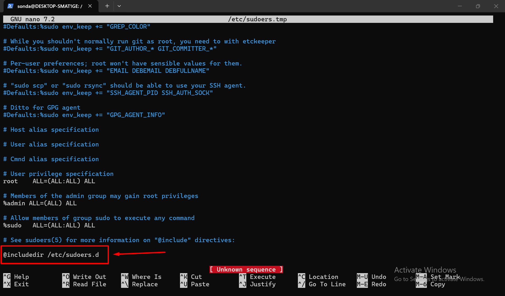
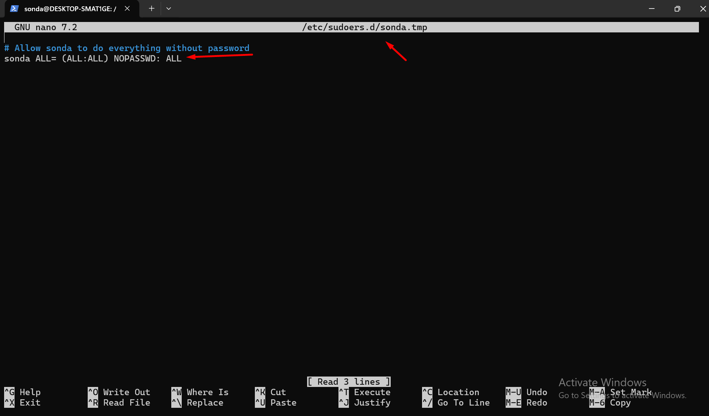

```bash
sudo visudo /etc/sudoers.d/sonda

# In the /etc/sudoers.d/sonda file, you can add the following command
# Allow sonda user to execute any command without password
sonda ALL= (ALL:ALL) NOPASSWD: ALL
```


#### Add user to the `sudo` group

```bash
usermod -aG sudo vandtt
```

### How can we use sudo in the Terminal ?

- We can just prefix the command with `sudo`. We then need to enter our user password
- `sudo` will be stored in a session (by default: 15 minutes)
- We can expire the session with the command `sudo -k` 
- To start an interactive shell with elevated (root) privileges, use `sudo -s` or `sudo bash`

```bash
sudo apt-get update

# elevated (root) privileges
sudo -s
# or sudo bash
```

### How to Use `sudo` to Switch Users
- To execute a command or start a shell as a different user, you use the `-u` (user) flag
- You generally do not need to use the `-g` (group) flag. When you switch users with `-u`, the system automatically assigns the user's primary group by default.
- Syntax: `sudo -u [username] [command]`

```bash
# This creates a file owned by "lauren" in her home directory using your password, not hers.
sudo -u lauren touch /home/lauren/file_sudo.txt
```

```bash
# Starting a shell as that user. This drops you into a bash shell acting as "lauren," allowing you to browse her files or perform tasks as if you were logged in as h
sudo -u lauren -s
```

## Managing users

- In this context, a user is anyone using a computer or a system resource. In its simplest form, a Linux
  user or user account is identified by a name and a unique identifier, known as a UID.

### Linux has different kind of users

- Linux categorizes users based on their role and level of access to the system:
  - **System Accounts/ Service users**:
    - These are used to run background tasks and services (like web servers or databases). Notably, they usually do not have a home directory.
    - Accounts like `sshd`, `www-data`, or `mysql`. They aren't meant for humans to log into; they exist so that if a web server is hacked, the attacker is "trapped" within that service user's limited permissions

  - **Regular Users**:
    - These are standard accounts created for people.
    - They have a dedicated home directory for personal files.
    - They are restricted from accessing other users' files or performing administrative tasks by default.
    - Limited privileges
    - We can allow regular users to temporarily get root access through `sudo` command

  - **Superuser/Root** :
    - This is the most powerful account on the system. Highest privileges
    - It has unrestricted access to every file and setting.
    - It can add/remove users, install software, and modify system configurations.
    - It has the user ID: 0
    - There can only be one root user on the system

### Groups

- All users have a primary group
- And can be assigned to zero to unlimited additional groups

### On Linux, user information is stored in various files

#### Basic account info - `/etc/passwd`

- Contains basic user account information
- Username, user ID (UID) , group ID (GID), user description (fullname), home directory and default shell
- Readable by all users
- The Shell (`/bin/bash` vs `/usr/sbin/nologin`): In `/etc/passwd`, the last field defines what happens when a user logs in. For service users, it is set to `nologin` or `false` to prevent anyone from getting a command prompt through that account.
- Linux internals actually care about the number (UID). If you see a file owned by 1001 instead of a name, it means the user was deleted, but the UID remains on the file

```bash
cat /etc/passwd

# sonda:x:1000:1000:,,,:/home/sonda:/bin/bash
# sonda - user
# 1000 - User Id
# 1000 - Group ID
# /home/sonda - Home directory
# /bin/bash - Default shell should be launched when user login
```


#### Encrypted passwords and aging info - `/etc/shadow`

- Stores encrypted user passwords and password aging information
- Also stores additional information, such as the date of the last password change, expiry dates,...
- Readable only by the root users (or users with root privileges)

```bash
sudo cat /etc/shadow
```


#### List of groups and their members - `/etc/group`

- Contains information about the groups, and their members
- Readable by all users

```bash
cat /etc/group

# sonda:x:1000:
# This is the primary group of sonda user
# docker:x:1001:sonda
# docker - group name
# sonda: The user is a member of the Docker group
```


### Managing user

#### Creating the User: `useradd`

- Syntax: `useradd [options] username`
- The most important options are:
  - `-m`: Create home directory.
    - This is important if the user should be a regular user and we want this user to be able to log in to linux system
    - Why do we have users without home directories? Let's say we have a service user for our web server then this user doesn't necessarily need to log into our system. It doesn't need to store any data
  - `-d`: Set custom home directory
  - `-s`: Specify default shell
  - Manage groups
    - `-g`: Specify primary group instead of using the default configuration. Often, default configuration is that a new group will be created with the same name as the username
    - `-G`: Add user to secondary groups
- System Defaults: On many distributions (like Ubuntu/Debian), a group with the same name as the username is created automatically when create a new user

```bash
sudo useradd -m -d /home/vandtt -s /bin/bash vandtt
```

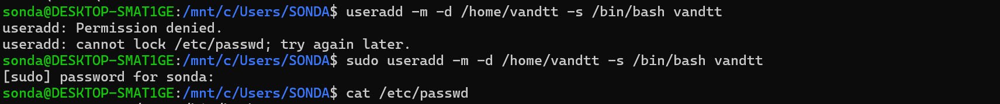
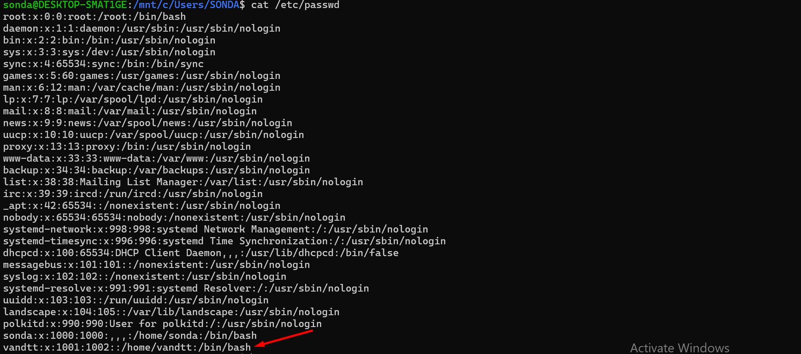

#### Managing Passwords: `passwd`

- With the `passwd` command, we can set the password for users
- Syntax: `passwd [options] [username]`
- The most important options are:
  - `-S`: Display password status
  - `-d`: Delete password
  - `-n`: Set minimum password age (days)
  - `-x`: Set maximum password age (days)
- We can also use it to lock / unlock the account:
  - `-l`: Lock user account
  - `-u`: Unlock user account
- Changing Your Password: `passwd` without any option and username
- Changing Password for other user: `sudo passwd username` without any option

```bash
passwd -S

# sonda P 2026-03-05 0 99999 7 -1
# sonda: The username.
# P: The password status. P indicates that the password is usable (set). Other statuses include L (locked) or N (no password).
# 2026-03-05: The date the password was last changed (YYYY-MM-DD).
# 0:	The minimum number of days required between password changes. 0 means the user can change it immediately.
# 99999:	The maximum number of days the password is valid. 99999 effectively means the password never expires.
# 7:	The number of days of warning before the password expires.
# -1:	The period of inactivity (in days) after the password expires before the account is disabled. -1 means the account will never be disabled due to inactivity. If my password expires, I can still log in
```

#### Modify user: `usermod`

- The `usermod` command allows administrators to modify user account details. Because these changes affect system-level configurations, **root/sudo** privileges are required
- Syntax: `usermod [options] username`
- Quick Reference: `usermod` Options

| Option | Action   | Description                                                |
| ------ | -------- | ---------------------------------------------------------- |
| -c     | Comment  | Change the user's description (full name/GECOS field).     |
| -s     | Shell    | Change the login shell (e.g., /bin/bash).                  |
| -d     | Home Dir | Change the login directory.                                |
| -m     | Move     | Used with -d to move the existing home directory contents. |
| -l     | Login    | Change the Unix username.                                  |
| -g     | Group    | Change the user's primary group.                           |
| -G     | Groups   | Change the user's supplementary (secondary) groups.        |
| -aG    | Groups   | Add secondary group                                        |
| -U     | Unlock   | Unlock the user                                            |

```bash
sudo usermod -s /bin/bash -c 'Lauren M' lauren
```

- Administrative vs. User-Level Changes
  - Administrator `sudo usermod -s /bin/bash`: Has root power and can assign any binary as a shell, regardless of whether it is listed in `/etc/shells`
  - Standard User `chsh -s /bin/bash`: Users can change their own shell, but they are restricted to shells explicitly defined in `/etc/shells` for security purpose

#### Deleting users: `userdel`

- To delete a user in Linux, you use the `userdel` command.
- Because modifying user accounts is a system-level action, you must execute these commands with `sudo`
- Syntax: `userdel [option] username`
- There are quite a few options
  | Command | Description |
  |-----------------------------|-----------------------------------------------------------------------------|
  | `sudo userdel <username>` | Deletes the user account, but keeps the user's home directory and mail spool. |
  | `sudo userdel -r <username>`| Deletes the user account and removes the user's home directory and mail spool. |
  | `sudo userdel -f <username>`| A forceful removal; deletes the user even if they are currently logged in. Might also delete a group with the same name as this user (depending on system configuration)|

```bash
userdel max
# max: username
```

- Manual Cleanup: If you use `userdel` without the `-r` flag, the home directory remains on the system. You must manually delete it (e.g., `sudo rm -rf /home/<username>`) if you want to free up that space.

- Mail Spool: The `-r` flag attempts to delete the user's mailbox. If your system is not configured to handle mail, you may see a warning indicating the mail spool could not be deleted; this is normal and safe to ignore

#### `adduser` / `deluser` (Debian/Ubuntu Specific):

- These tools offer a more intuitive, user-friendly way to modify group memberships without needing to re-specify the entire list of groups
- Add: `sudo adduser username groupname`
- Remove: `sudo deluser username groupname`

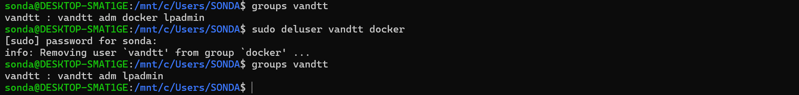

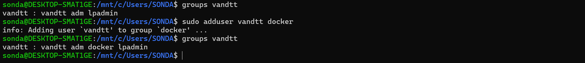

## How do groups work?

- Purpose: Groups enable resource sharing, collaboration, and simplified permission management (e.g., granting a group access to printers or log files rather than configuring each user individually).

### Primary Group

- Every user must have exactly one primary group.
- It is defined in `/etc/passwd`.
- It serves as the default group ownership for any new files created by that user.

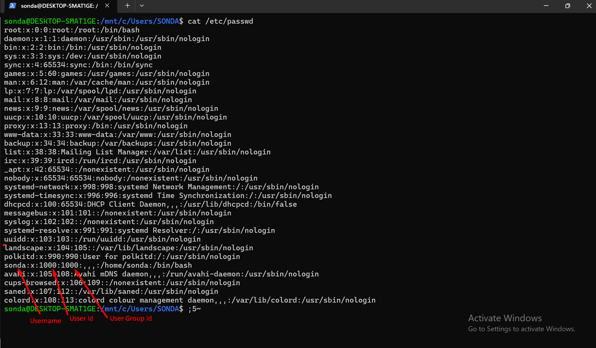

### Secondary Groups

- A user can be a member of zero or many secondary groups.
- These are defined in `/etc/group`.
- They provide fine-grained control, allowing users to gain specific privileges (e.g., administrative access or hardware control)

### Lists the group memberships for a specific user

- `groups [username]`: Lists the group memberships for a specific user. If no username is provided, it lists the groups for the current user. (The first listed group is the primary group; the others are secondary)

```bash
groups sonda
# sonda : sonda adm dialout cdrom floppy sudo audio dip video plugdev users netdev docker
# sonda : sonda this is username and primary group
# adm dialout cdrom floppy sudo audio dip video plugdev users netdev docker: This is primary secondary group
```

- The `id` command in Linux is a utility used to display the real and effective user and group IDs. It is essential for troubleshooting permissions, verifying user identities, and managing group affiliations

```bash
# current user
id
# specific user
id sonda
# uid=1000(sonda) gid=1000(sonda) groups=1000(sonda),4(adm),20(dialout),24(cdrom),25(floppy),27(sudo),29(audio),30(dip),44(video),46(plugdev),100(users),107(netdev),1001(docker),109(lpadmin)
```

### Existing groups in Ubuntu

- `root`: The superuser group with administrative privileges, allowing complete control over the system
- `sudo` (or `wheel`): Members can use `sudo`. May also be called `wheel`. Grants members the ability to use the sudo command to perform administrative tasks.
- `adm`: Allows members to read system log files (e.g., `tail /var/log/syslog`).
- `lpadmin` / `lp`: Members may manage printers and print queues (CUPS). May also be called "lp"
- `www-data`: A group for web server processes (such as Apache or Nginx), gives access to web content
- `plugdev`: Allow this user to manage pluggable devices (USB sticks, external HDDs,...)

## Managing groups

### Add a user to a group - `usermod`

- Syntax: `usermod [options] username`

#### `-G`: Change secondary groups

- `usermod -G` (Overwriting): Sets the secondary groups for a user. You must list all groups the user should belong to. If you omit an existing group from this list, the user will be removed from it.

```bash
groups vandtt
# vandtt : vandtt
sudo usermod -G adm,plugdev,lpadmin vandtt
groups vandtt
# vandtt : vandtt adm plugdev lpadmin
sudo usermod -G adm vandtt
groups vandtt
# vandtt : vandtt adm
```

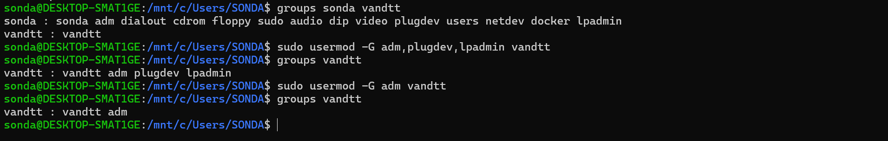

#### `-aG`: Add secondary group

- Adds a user to a specific group without removing them from their existing secondary groups. The `-a` (append) flag is essential here.

```bash
groups vandtt
# vandtt : vandtt adm lpadmin
sudo usermod -aG docker vandtt
groups vandtt
# vandtt : vandtt adm docker lpadmin
```

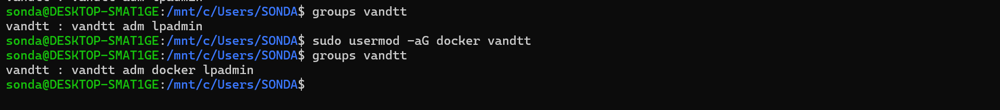

### Create own groups - `groupadd`

- Syntax: `sudo groupadd -g [GID] [group_name]`
- The `-g` option allows you to manually set a Group ID (GID).
- Best practice: Use GIDs above 1000 for custom groups (or a specific range, e.g., 5000–10000, for organizational consistency).
- If no GID is provided, the system assigns one automatically.
- GIDs must be unique; the command will fail if the ID is already in use
- The group info is then stored in the `/etc/group` file

```bash
# create own group
sudo groupadd -g 2500 myapp
# Check the group after creation
cat /etc/group
```

### Modifying a Group: `groupmod`

- Syntax: `sudo groupmod -n [new_name] -g [new_GID] [old_group_name]`
- `-n`: Change the name of the group
- `-g`: Change the group Id (GID)
- **Crucial Warning**: Files are linked to the group via the GID, not the name. If you change the GID after creating files, those files will lose their association with that group. Proceed with caution.

```bash
# Modifying myapp group
sudo groupmod -n my-app -g 5000 myapp
# Check the group after the change
cat /etc/group
```

### Deleting a Group: `groupdel`

- Syntax: `sudo groupdel [group_name]`
- Removes the group from the system and updates the relevant configuration files.
- **Important**:
  - This command does not delete files owned by the group.
  - This command will update `/etc/group` and `/etc/passwd`.
- **Restriction**: You cannot delete a group if it is currently defined as the primary group for any user.

```bash
sudo groupdel my-app
```

## Switch user: `su`
- We can switch the user with the `su` command. `su` stands for "switch user"
- Basic Syntax: `su username`
- Behavior: When you switch to another user, you remain in the current working directory. You will need to manually change directories (e.g., `cd`) to access the new user's home folder.
- Exiting: To leave the switched session and return to your original user account, simply type `exit`.

```bash
su vandtt

# return to your original user account
exit
```

### Managing Root Access with `su`
- By default, the root user often has its password locked for security reasons.
- Setting a Password: To use `su` to become `root`, the `root`user must have a password. You can set this using `sudo passwd root`.
- Locking the Account: If you have enabled root access and wish to disable it again
- Verification: You can check the status of the root account by looking at the `/etc/shadow` file. An exclamation mark `!` or asterisk `*` in the password field indicates that the account is locked.

```bash
# login root user

su
# Password:
# su: Authentication failure

sudo passwd root
# Setting a Password

su root 
# login root user

sudo passwd -dl root
# Locking the root account

sudo cat /etc/shadow
# root:!:20565:0:99999:7:::
# !: password is disable
```

# File Permissions

## Why do we need file permissions?
- Control access to files and directories
- Determine who can read, write and execute those files

## The Fundamentals of Permissions

- Linux assigns permissions based on three ownership levels and three permission types.

### Ownership Levels

- **Owner (u)**: The user who created or currently owns the file.
- **Group (g)**: A defined set of users who share access to the file.
- **Others (o)**: All other users on the system.
- **All users(a)**: Owner + Group + Others


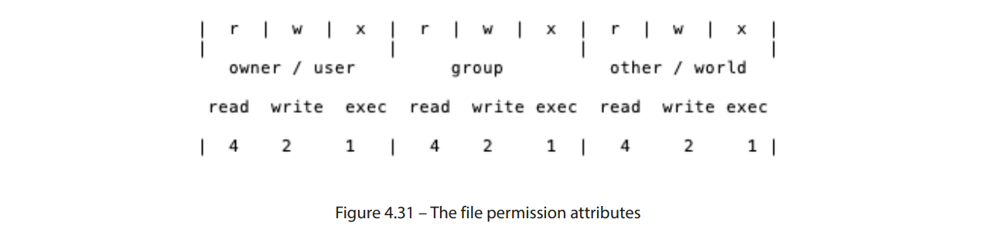

### Permission Types

- **Read (r/4)**: A read permission of a file allows users to view the content of the file. On a directory, the read permission allows users to list the content of the directory
- **Write (w/2)**: A write permission of a file allows users to modify the content of the file. For a directory, the write permission allows users to modify the content of the directory by adding, deleting, or renaming files
- **Execute (x/1)**: An execute or executable permission of a file allows users to run the related script, application, or service appointed by the file. For a directory, the execute permission allows users to enter the directory and make it the current working directory (using the cd command)

### Managing Permissions and Ownership

- To view the current permissions of a file, use the command: `ls -l [file-path]`
- we can query the octal value with the stat command, as follows `stat --format '%a' [file-path]`

```bash
ls -l /etc/passwd

# -rw-r--r-- 1 root root 2010 Mar  9 08:57 /etc/passwd
```

- `-rw-r--r--`: The file access permissions
  - The first character (attribute) is reserved for the file type
  - The next 9 characters represent a 9-bit field, defining the effective permissions as 3 sequences of 3 attributes (bits) each: **user owner permissions**, **group owner permissions**, and **all other users’ permissions**
  - As previously noted, the access permissions are represented by a 9-bit field, a group of 3 sequences,
each with 3 bits, defined as follows:
    - Bits 1-3: User owner permissions
    - Bits 4-6: Group owner permissions
    - Bits 7-9: All other users’ (or world) permissions
  - Here are the permission attributes with their respective octal values:
    - `r`: Read permission; 2 ^ 2 = 4 (bit 2 set)
    - `w`: Write permission: 2 ^ 1 = 2 (bit 1 set)
    - `x`: Execute permission: 2 ^ 0 = 1 (bit 0 set)
    - `-`: No permission: 0 (no bits set)
- `1`: The number of hard links
- `root`: The user who is the owner of the file
- `root`: The group that is the owner of the file
- `2010`: The size of the file
- `Mar`: The month the file was created
- `9`: The day of the month the file was created
- `08:57`: The time of day the file was created
- `/etc/passwd`: The filename

#### Changing Permissions - `chmod`

-  A  combination of the letters ugoa controls which users' access to the file will be changed: the user who owns
it (u), other users in the file's group (g), other users not in the file's group (o), or all  users  (a). If none  of  these  are given, the effect is as if (a) were given, but bits that are set in the umask are not affected.
- The `chmod` command modifies the access rights for the owner, group, or others using symbols (`+` to add, `-` to remove)
- `chmod u+x file.txt`: Gives the owner execution rights.
- `chmod g-w file.txt`: Removes write rights from the group.
- `chmod o+r file.txt`: Grants read access to others.
- `chmod a+r file.txt`: Grants read access to all user.
- Note: Changes to system files often require `sudo` for elevated privileges.

```bash
chmod u-r,ug-w,o-rwx myfile

# Remove the read (r) permission for the owner (u)
# Remove the write (w) permission for the owner (u) and group (g)
# Remove the read (r), write (w), and execute (x) permissions for everyone else (o)
```

#### `chmod` with numeric value

- Permission levels: Owner (u), group (g), others (o)
- Type of permissions: Read (r / 4), write (w / 2), execute (x / 1)

```bash
sudo chmod 777 permissions.txt

# Use sudo if the current user is not authorized to change file permissions.
# 7: Owner permissions = 4 + 2 + 1 = rwx  
# 7: Group permissions = 4 + 2 + 1 = rwx  
# 7: Others permissions = 4 + 2 + 1 = rwx

sudo chmod 754 permissions.txt
# First Digit (7 = 4+2+1): Owner has read, write, and execute access.
# Second Digit (5 = 4+0+1): Group has read and execute access (no write).
# Third Digit (4 = 4+0+0): Others have read-only access.
```

#### Changing Ownership `chown`

- To change who owns a file or which group it belongs to, use the `chown` command.
- Syntax `chown user:group filename`: Changes both the owner and the group.
- This is useful for fine-grained access control, allowing you to restrict write access to a specific group rather than giving "others" access to the file.

```bash
ls -la
# --w-r--r--  1 sonda sonda   13 Apr 25 10:52 permission.txt
chown sonda:vandtt permission.txt
# chown: changing ownership of 'permission.txt': Operation not permitted
sudo chown sonda:vandtt permission.txt
ls -la
# --w-r--r--  1 sonda vandtt   13 Apr 25 10:52 permission.txt
```

```bash
sudo chown :developers data.txt
# Change group owner only

sudo chown john data.txt
# Change user owner only

sudo chown john:developers data.txt
# Change user and group owner 
```

#### How do file permissions work for directories?

- File permissions for directories
  - **Read (r)**: Access directory contents
  - **Write (w)**: Add or remove files (we also need execute permissions for this though)
  - **Execute (x)**: Enter and traverse directory
- Permission Combinations for Directories
  - Need `x` to enter: Without execute permissions, you cannot `cd` into a directory.
  - Need `r` to list: Without read permissions, you cannot see the files inside with `ls`.
  - Need `w + x` to write: To create or delete files, you must have both write (to modify) and execute (to enter/traverse) permissions.
  - Edge Case: If you have `w + x` but no `r`, you can modify or delete known files if you have the path, but you **cannot list the directory contents or use tab-completion to see file names**

#### Change permissions / ownership for a whole directory structure

- To apply permission or ownership changes to a directory and all of its subdirectories and files, use the recursive flag `-R`:
- `chmod -R [mode] [directory]`: Recursively sets permissions for the entire structure.
- `chown -R [user]:[group] [directory]`: Recursively changes ownership for the entire structure.
- **Privileges**: Changing ownership (via chown) usually requires root privileges (`sudo`), whereas changing permissions (via `chmod`) depends on file ownership.

```bash
ls -al ./file_permission/

# total 16
# dr-x------  2 sonda sonda  4096 Apr 28 08:53 .
# drwxr-x--- 12 sonda sonda  4096 Apr 27 18:16 ..
# -rw-r--r--  1 sonda sonda    31 Apr 28 09:09 index.html
# -rw-r--r--  1 sonda vandtt   13 Apr 25 10:52 permission.txt

chmod 777 -R ./file_permission/
ls -al ./file_permission/

# total 16
# drwxrwxrwx  2 sonda sonda  4096 Apr 28 08:53 .
# drwxr-x--- 12 sonda sonda  4096 Apr 27 18:16 ..
# -rwxrwxrwx  1 sonda sonda    31 Apr 28 09:09 index.html
# -rwxrwxrwx  1 sonda vandtt   13 Apr 25 10:52 permission.txt

chown :sonda -R ./file_permission/
ls -al ./file_permission/

# total 16
# drwxrwxrwx  2 sonda sonda 4096 Apr 28 08:53 .
# drwxr-x--- 12 sonda sonda 4096 Apr 27 18:16 ..
# -rwxrwxrwx  1 sonda sonda   31 Apr 28 09:09 index.html
# -rwxrwxrwx  1 sonda sonda   13 Apr 25 10:52 permission.txt
```

#### Use case

- Which command ensures new files created within the directory sales are owned by the group sales? (Choose two.)
  - `chmod g+s sales` or `chmod 2775 sales`

```bash
ls -l
# drwxrwxr-x 2 root sales 4096 Jan 1 15:21 sales
```


## Advanced file permissions: `umask`

### Why do we need a umask?

- The umask allows us to specify who should be able to access new files
- Thus, this is an important security feature
- If you're the sysadmin, you might want to evaluate this, and see which value is most appropriate for the umask in your organization
- The idea: It thus determines the default permissions for new files / directories

###  How does it work?

- We have some base permissions. And from those, we subtract the umask value (technically: we apply a bitmask according to the binary representation of our umask value)
- Base permissions (default permissions for new files and directorie) are usually:  
  - **777 - rwxrwxrwx: Full access: read, write, execute for directories** 
  - **666 - rw-rw-rw-: Read and write, but no execution for files**
- If we set the umask to 022 
  - Directories will have 755 **(777 - 022 = 755 : rwxr-xr-x)**
    - Owner: read + write + execute
    - Group and others: read + execute (but not write)
  - And files will be 644: **(666 - 022 = 644 : rw-r--r--)**
    - Owner: Read + Write
    - Group and others: read (but not execute + write)

### Managing `umask`

- View current mask: Type `umask` in your terminal.

```bash
umask
#0022
```

- Temporary change: Use `umask [value]` (e.g., `umask 027`). This only affects the current session.

```bash
umask 026
touch umask_025.txt
ls -al .

# -rw-r-----  1 sonda sonda    0 Apr 28 15:50 umask_025.txt
# Default permissions for new files is 666. 666 - 026 = 640: rw-r-----
```

- Permanent change (Shell): Add the `umask` command to your shell startup file (e.g., `.bashrc`)
- Permanently change it for all programs (System-wide change):
  - Usually, we can edit this in the following file: `/etc/login.defs`
  - This should then also affect new GUI sessions!
  - Be aware:
    - Changes `umask` command in a shell overwrite this for the current shell session
    - Those changes should usually be applied automatically during startup - if a new shell doesn't pick them up, be sure to make sure the umask is not overwritten during startup of the shell

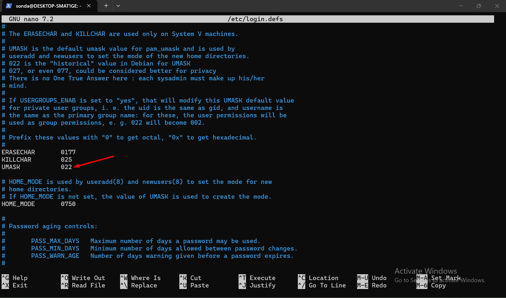

- In many Linux distributions, if a user's username matches their primary group name, the system may automatically adjust the umask to be more permissive for the group (e.g., changing a mask of 027 to 007)

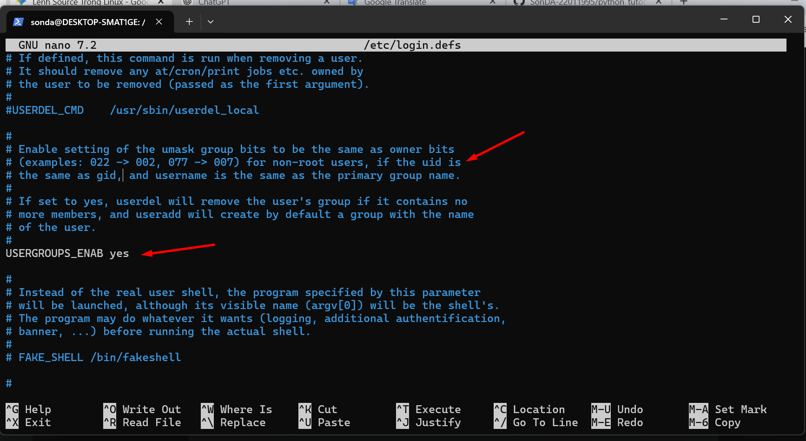

## Sticky bit

- The sticky bit is an extra bit that we can set for all files or directories
- The sticky bit is especially used for the `/tmp` folder

### For files

- Obsolete, no longer used
- It used to indicate that an executable file can remain in memory, to be loaded more quickly on next launch

### For directories

- Without the sticky bit, any user with write and execute permissions on a directory can delete or rename any file within that directory, regardless of who owns the file. This creates a risk where users can maliciously or accidentally remove important files belonging to others
- If the sticky bit is set, only the owner (and root) of a file or the directory owner can rename or delete a file

### How can we set the sticky bit?

- Set sticky bit: `chmod +t [folder]` or in octal notation `chmod 1777 [folder]`
- Unset sticky bit: `chmod 0777 [folder]`

### How it Works

- When the sticky bit is set on a directory:
  - Restricted Deletion: A file inside that directory can only be deleted or renamed by:
    - The owner of the file.
    - The owner of the directory.
    - The root user (who always has full access).
- Collaboration: Users can still create new files and modify their own files as normal, but they cannot interfere with the files of other users.

### Identifying the Sticky Bit

- When you run `ls -ld <directory>`, look at the final character of the permission string
  - `t` (lowercase): The sticky bit is set, and the directory has "others" execute permissions.
  - `T` (uppercase): The sticky bit is set, but "others" do not have execute permissions.
- When you run `stat --format '%a' <directory>,` look at the first character of the output. If it is 1, the sticky bit is active; if it is 0, it is not.

```bash
sudo mkdir /permission
ls -al /permission
# drwxrwxrwx  2 sonda  sonda  4096 Apr 29 12:10 .
chmod 1777 /permission
ls -al /permission
# drwxrwxrwt  2 sonda  sonda  4096 Apr 29 12:10 .
chmod 1776 /permission
ls -al /permission
# drwxrwxrwT  2 sonda  sonda  4096 Apr 29 12:10 .
```

## Set user Id (SUID) and Set group Id (SGID)

- The Set User ID (SUID) and Set Group ID (SGID) bits are advanced file permissions that allow a program to run with the privileges of its owner or its group, respectively, rather than the privileges of the user who is actually executing the file.

### Understanding SUID and SGID

- Normally, when you run a program, it inherits your user permissions. However, some system tasks (like changing your password or mounting a drive) require higher privileges than a standard user has.
- SUID (Set User ID): When a file with the SUID bit set is executed, the process runs with the permissions of the file's owner.
  - Example: The passwd command is owned by root and has the SUID bit. This allows a normal user to change their password (writing to /etc/shadow) even though they do not normally have permission to edit that file.
- SGID (Set Group ID): When a file with the SGID bit set is executed, the process runs with the permissions of the file's group.

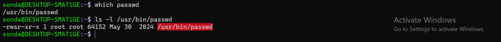

### How to Inspect and Identify

- You can see these bits using the `ls -l` command. They appear in the "owner" or "group" execution positions:
- `s` (lowercase): The bit is set, and the execute (x) permission is also set.
- `S` (uppercase): The bit is set, but the execute (x) permission is not set.

| Permission Bit | Location in `ls -l`     | Meaning              |
|----------------|------------------------|----------------------|
| SUID           | Owner's execute (x)    | Run as file owner    |
| SGID           | Group's execute (x)    | Run as file group    |

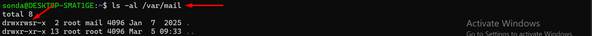


### Managing the Bits

- You can modify these bits using the `chmod` command
  - `chmod u+s <file>` (Sets SUID)
  - `chmod u-s <file>` (Unsets SUID)
  - `chmod g+s <file>` (Sets SGID)
  - `chmod g-s <file>` (Unsets SGID)
-  Or in octal notation
  - `chmod 4xxx <file>` (Sets SUID)
  - `chmod 0xxx <file>` (Unsets SUID)
  - `chmod 2xxx <file>` (Sets SGID)
  - `chmod 0xxx <file>` (Unsets SGID)

### Be careful

- This can be a major security issue if used improperly
- On most systems, the SUID bit is limited to executable binary files
- It is usually not supported for executable scripts (.sh, .py,...)
- If we set it on our own programs, we can easily create major security vulnerabilities. Be extremely careful!

```bash
# bash environment
ls ~
which python3
# /usr/bin/python3
sudo cp /usr/bin/python3 .
ls -l ~
-rwxr-xr-x 1 root root 8020928 Apr 29 16:03 python3
./python3
# python environment
import os
print(os.listdir('/home/vandtt'))
# PermissionError: [Errno 13] Permission denied: '/home/vandtt'
```

```bash
# bash environment
ls ~
which python3
# /usr/bin/python3
sudo cp /usr/bin/python3 .
sudo chmod u+s python3
ls -l ~
# -rwsr-xr-x 1 root root 8020928 Apr 29 16:03 python3
./python3
# python environment
import os
print(os.listdir('/home/vandtt'))
['.profile', '.python_history', '.bash_history', '.bashrc', '.lesshst', '.bash_logout', '.local']
```

## Special permissions

- In Linux, all file access permissions are managed by binary sequences. The special bits (SUID, SGID, and Sticky Bit) are placed in a distinct position preceding the standard rwx permissions.

| Feature     | Bit Position (Binary) | Calculation (2^n) | Octal Value |
|------------|----------------------|-------------------|-------------|
| SUID       | 100                  | 2^2               | 4           |
| SGID       | 010                  | 2^1               | 2           |
| Sticky Bit | 001                  | 2^0               | 1           |

- Example 
  - The setuid permission: **-rwsrwxr-x  (4775)**
  - The setgid permission: **-rwxrwsr-x (2775)**
  - The sticky permission: **drwxrwxr-t (1775)**
  - The setuid and sticky permission: **-rwsrwxr-t  (5775)**
  - The setgid and sticky permission: **-rwxrwsr-t (3775)**
  - The setgid and sticky and setuid permission: **-rwsrwsr-t (7775)**

# Linux Processes

## What are processes?

- At its core, a process is an instance of a running program.

- It can be a visible application (like Firefox) or a background task helping other programs.

- It acts as an **independent execution unit** with its own dedicated resources and not shared, including:

  - CPU Time: Assigned by the operating system.

  - Memory: Private space for computations (not shared with others).

  - System Resources: Open files, network connections, and identifiers.

### Key Process Attributes

- Every process is defined by specific metadata:

  - Process ID (PID): A unique numerical identifier.

  - User: The account owner of the process, which determines its permissions.

  - State: The current status of the process (e.g., Running, Waiting, Stopped, or Zombie).

  - Parent ID (PPID): The identifier of the process that started it.

### Process Hierarchy & Dependencies

- Processes are organized in a **tree structure** (hierarchy).
- Applications often start "child" processes to handle specific tasks (e.g., Firefox starting a "Web Content" process).
- In a GUI (like the System Monitor), this is often viewed through a "Show Dependencies" or "Tree View" setting.
  - Example Chain: `Gnome Shell -> Terminal Server -> Bash -> Ping Command`

## The Role of the Kernel

- The Kernel is the lowest level of the operating system, sitting between application code and hardware. It manages processes by:

  - Allocating and managing resources (CPU/RAM).

  - Deciding whether to grant or deny requests for more memory.

  - Managing "resource hygiene" (e.g., killing background apps to free up space, a common practice in mobile OSs).

## Viewing Processes - `ps` command

### The Basics of `ps`

- By default, running the `ps` (Process Status) command without any arguments provides a snapshot of processes running in your current terminal (TTY)
- If you start a new shell inside your current one (running bash within bash), ps will show both instances and the ps command itself.
- Limitation: It won't show processes running in other tabs, windows, or background system tasks.
- Explain each field in the top (header) row:
  - **PID**: Each process in Linux has a PID value automatically assigned by the kernel when the
process is created. The PID value is a positive integer and is always guaranteed to be unique.
  - **TTY** is short for teletype, more popularly known as a controlling Terminal or device
for interacting with a system. In the context of a Linux process, the TTY attribute denotes the
type of Terminal the process interacts with. In our example, the bash process representing
the Terminal session has pts/0 as its TTY type. PTS or pts stands for pseudo terminal
slave and indicates the input type – a Terminal console – controlling the process. /0 indicates
the ordinal sequence of the related Terminal session. For example, an additional SSH session
would have pts/1, and so on
  -  **TIME**: The TIME field represents the cumulative CPU utilization (or time) spent by the
process (in [DD-]hh:mm:ss format)
  - **CMD**: The CMD field stands for command and indicates the name or full path of the command
(including the arguments) that created the process. For well-known system commands (for
example, bash), CMD displays the command’s name, including its arguments.

```bash
ps

#   PID TTY          TIME CMD
#   5333 pts/0    00:00:00 bash
#   5369 pts/0    00:00:00 ps

/bin/bash
ps

#    PID TTY          TIME CMD
#   5333 pts/0    00:00:00 bash
#   5373 pts/0    00:00:00 bash
#   5379 pts/0    00:00:00 ps

/bin/bash
ps

#    PID TTY          TIME CMD
#   5333 pts/0    00:00:00 bash
#   5373 pts/0    00:00:00 bash
#   5382 pts/0    00:00:00 bash
#   5388 pts/0    00:00:00 ps

exit
ps

#    PID TTY          TIME CMD
#   5333 pts/0    00:00:00 bash
#   5373 pts/0    00:00:00 bash
#   5393 pts/0    00:00:00 ps
```

### Viewing All Processes

- `-e` or `-A`: Displays every process running on the system, regardless of the user or session.

```bash
ps -e

#    PID TTY          TIME CMD
#      1 ?        00:00:02 systemd
#      2 ?        00:00:00 kthreadd
#      3 ?        00:00:00 pool_workqueue_release
```

### Formatting and Detail

- Standard output is often too brief. These flags add the context needed for troubleshooting:

| Flag | Name | Description |
|------|------|-------------|
| `-f` | Full Format | Adds columns for UID (User ID), PID (Process ID), and PPID (Parent Process ID). |
| `-l` | Long Format | Provides even more technical details, such as the Process State. |
| `-ef` | Combined | The most common way to see all processes with full command paths and ownership. |

- Explain each field in the top (header) row:
  - F: Process flags (for example, 0 – none, 1 – forked, and 4 – superuser privileges)
  - S: Process status code (for example, R – running, S – interruptible sleep, and so on)
  - UID: The username or owner of the process (the user ID)
  - PID: The process ID
  - PPID: The process ID of the parent process
  - PRI: The priority of the process (a higher number means lower priority)
  - SZ: The virtual memory usage

```bash
ps -efl

# F S UID          PID    PPID  C PRI  NI ADDR SZ WCHAN  STIME TTY          TIME CMD
# 4 S root           1       0  0  80   0 -  5854 -      14:16 ?        00:00:02 /sbin/init splash
# 1 S root           2       0  0  80   0 -     0 -      14:16 ?        00:00:00 [kthreadd]
# 1 S root           3       2  0  80   0 -     0 -      14:16 ?        00:00:0 [pool_workqueue_release]
```

### Hierarchy and Trees

- Understanding which process spawned another is crucial for system administration

```bash
ps -elf --forest

# F S UID          PID    PPID  C PRI  NI ADDR SZ WCHAN  STIME TTY          TIME CMD
# 0 S sonda       2418    2205  0  80   0 - 185542 poll_s 14:17 ?       00:00:00  \_ /usr/libexec/gnome-session-binary --systemd-service --sess
# 0 S sonda       2459    2418  0  80   0 - 95737 poll_s 14:17 ?        00:00:00  |   \_ /usr/libexec/at-spi-bus-launcher --launch-immediately
# 0 S sonda       2473    2459  0  80   0 -  2373 ep_pol 14:17 ?        00:00:00  |   |   \_ /usr/bin/dbus-daemon --config-file=/usr/share/defa
# 0 S sonda       2610    2418  0  80   0 - 76408 poll_s 14:17 ?        00:00:00  |   \_ /usr/libexec/gsd-disk-utility-notify
# 0 S sonda       2683    2418  0  80   0 - 208752 poll_s 14:17 ?       00:00:00  |   \_ /usr/libexec/evolution-data-server/evolution-alarm-not
```

### Select by PID

```bash
ps -lf -p 194
# F S UID          PID    PPID  C PRI  NI ADDR SZ WCHAN  STIME TTY          TIME CMD
# 4 S syslog       194       1  0  80   0 - 55627 -      17:30 ?        00:00:00 /usr/sbin/rsyslogd -n -iNONE
```

### Filtering and Navigation

- Because the output of ps -ef can be massive, the lecture suggests two main ways to handle the data:

- Filtering with grep: Pipe the output to search for specific terms: `ps -ef | grep firefox`

- Scrolling with less: If you want to browse the entire list manually without it disappearing off the top of your terminal: `ps -ef | less`


### Common and Practical `ps` Commands

| Use Case                                        | Command Syntax                 | Example Command                 | Explanation                                                                                                                                     |
| ----------------------------------------------- | ------------------------------ | ------------------------------- | ----------------------------------------------------------------------------------------------------------------------------------------------- |
| See every running process (Detailed BSD style)  | `ps aux`                       | `ps aux`                        | The classic BSD-style format. Shows processes for all users (`a`, `x`), including detailed resource usage and user information (`u`).           |
| See every running process (Standard Unix style) | `ps -ef`                       | `ps -ef`                        | Lists every process on the system (`-e`) in full-format output (`-f`). Great for viewing the complete command path and arguments.               |
| Filter processes by a specific user             | `ps -u [username]`             | `ps -u root`                    | Displays only the processes owned by the specified user (e.g., `root`, `www-data`, or your own username).                                       |
| Find a process by its exact name                | `ps -C [command_name]`         | `ps -C nginx`                   | Searches for processes with the specified command name. A cleaner alternative to `ps aux \| grep nginx`.                                        |
| Find the top CPU consumers                      | `ps aux --sort=-%cpu`          | `ps aux --sort=-%cpu`           | Sorts processes by CPU usage in descending order, making it easy to identify CPU-intensive applications.                                        |
| Find the top memory consumers                   | `ps aux --sort=-%mem`          | `ps aux --sort=-%mem`           | Sorts processes by memory usage in descending order to quickly locate applications consuming the most RAM.                                      |
| Create a custom output format                   | `ps -eo [columns]`             | `ps -eo pid,user,%cpu,%mem,cmd` | The `-o` option lets you specify exactly which columns to display. This example shows only the PID, user, CPU usage, memory usage, and command. |
| View the process hierarchy (Tree view)          | `ps axjf` or `ps -ef --forest` | `ps axjf`                       | Displays processes in a hierarchical tree, showing parent-child relationships. Useful for tracing spawned or orphaned processes.                |
| Inspect a specific process ID (PID)             | `ps -p [PID] -F`               | `ps -p 1422 -F`                 | Shows detailed information about a specific process. The `-F` option includes additional fields such as the parent PID (PPID).                  |
| View threads inside a process                   | `ps -T -p [PID]`               | `ps -T -p 3045`                 | Lists all threads (lightweight processes) running within the specified process. Useful for debugging multithreaded applications.                |


## Monitoring system activity - `top` command

### Overview

- The top program displays a continuously updating (by default, every three seconds) display of the system processes listed in order of process activity
- The name top comes from the fact that the top program is used to see the “top” processes on the system
- The top display consists of two parts: a system summary at the top of the display, followed by a table of processes sorted by CPU activit
- Alternative Tool:	`htop` (More user-friendly, features interactive sorting/signals, but requires manual installation).
  - Installation on Debian-based distributions:: `sudo apt install htop`

### Using the `top` command

- Syntax: `top [OPTIONS]`

| Flag | Purpose | Example / Behavior |
|------|---------|---------------------|
| `-u [username]` | Filters the process list to only display tasks owned by a specific user. | `top -u nginx` |
| `-d [seconds]` | Adjusts the refresh delay interval (default is `3.0` seconds). Supports sub-second intervals. | `top -d 0.1` (Refreshes 10x per second) |
| `-i` | Hides idle processes; displays only tasks actively utilizing CPU resources. | `top -i` |
| `-c` | Toggles the command column to display the full command line/path instead of just the process name. | `top -c` |
| `-o` | The alternative to interactive mode sorting is invoking the `-o` option parameter of the top command, which specifies the sorting field | `top -o %CPU` |
| `-b` | Starts  top in Batch mode, which could be useful for sending output from top to other programs or to a file | `top -b -o +%MEM \| head -n 17` |

### Interface & Display Management

- **f** (Field Management): Opens the column management screen. 
  - Use **Arrow Keys** to navigate.
  - Press **Space** or **d** to toggle a column's visibility (e.g., enabling Parent Process ID—PPID).
  - Press **s** on a highlighted field to set it as the primary sorting criteria (e.g., sorting by Memory usage instead of %CPU).
  - Press **q** or **Esc** to return to the main monitor.
- **z** (Color Mode): Toggles color mapping on/off.
- **Z** (Color Configuration): Opens the color customization scheme. 
  - Select a target zone (e.g., T for task info, H for column headers), pick a color code using the arrow keys, and press Enter to commit.

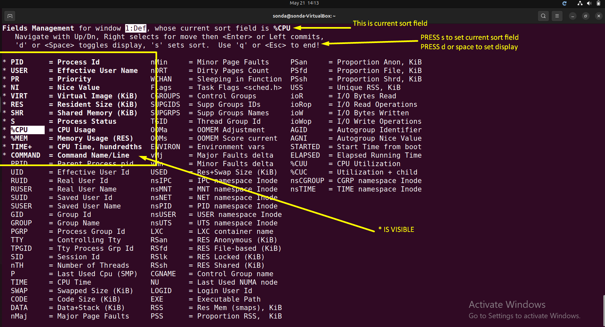

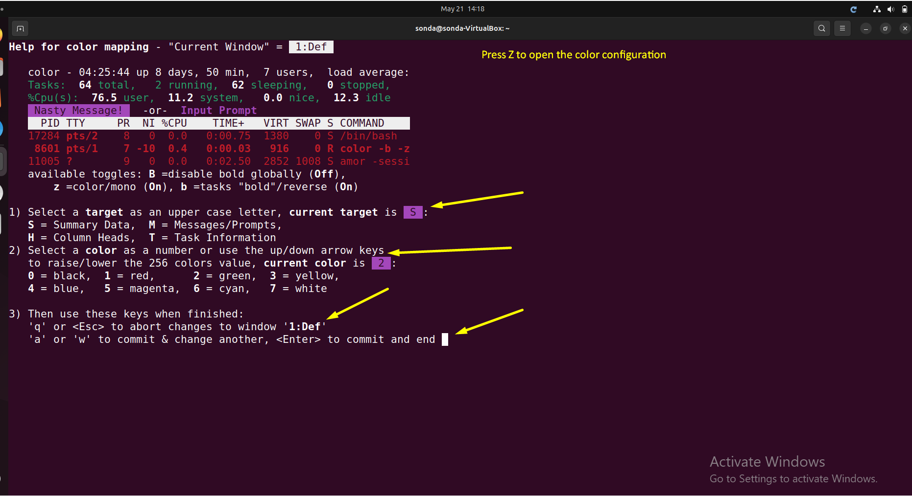

### Process Management

- k (Kill Process): Sends an operating system signal to a targeted process.
  - Prompt asks for the PID (Process ID).
  - Prompt asks for the signal type (defaults to 15 / SIGTERM for a clean exit; use 9 / SIGKILL to force-terminate unresponsive processes, type `kill -l` command to see signal index).

- r (Renice Process): Alters the scheduling priority (niceness) of an active process.
  - Prompt asks for the PID.
  - Prompt asks for the nice value (positive values lower priority, negative values raise priority—requires root/sudo).

### Configuration Persistence

- By default, any modifications made during an interactive session (colors, custom columns, sort order) are lost upon exiting.

- Saving Layouts (Shift + W): Pressing W writes the current configuration to a dotfile in the user's home directory (~/.toprc).

- Privilege Boundary: Configurations are user-dependent. Saving a layout while running sudo top writes to the root user's profile (/root/.toprc). Running top as a standard user afterwards will still load the factory defaults until saved separately.

### `top` information Fields

- Explain each field in the system summary:
  - `top - 14:59:20 up 6:30, 2 users, load average: 0.07, 0.02, 0.00`
    - top: This is the name of the program
    - 14:59:20 This is the current time of day
    - 2 users There are two users logged in
    - Load average refers to the number of processes that are waiting to run; that is, the number of processes that are in a runnable state and are sharing the CPU. Three values are shown, each for a different period of time. The first is the average for the last 60 seconds, the next the previous 5 minutes, and finally the previous 15 minutes. Values less than 1.0 indicate that the machine is not busy
  - `Tasks: 109 total, 1 running, 106 sleeping, 0 stopped, 2 zombie`
    - This summarizes the number of processes and their various process states
  - `Cpu(s): 0.7%us, 1.0%sy, 0.0%ni, 98.3%id, 0.0%wa, 0.0%hi, 0.0%si`
    - 0.7%us 0.7 percent of the CPU is being used for user processes. This means processes outside the kernel.
    - 1.0%sy 1.0 percent of the CPU is being used for system (kernel) processes.
    - 0.0%ni 0.0 percent of the CPU is being used by “nice” (low-priority) processes.
    - 98.3%id 98.3 percent of the CPU is idle
    - 0.0%wa 0.0 percent of the CPU is waiting for I/O
  - `Mem: 319496k total, 314860k used, 4636k free, 19392k buff`
    - This shows how physical RAM is being used.
  - `Swap: 875500k total, 149128k used, 726372k free, 114676k cach`
    - This shows how swap space (virtual memory) is being used.
- Explain each field in the top (header) row:
  - USER: The username or owner of the process
  - PR: The priority of the process (a lower number means higher priority)
  - NI: The nice value of the process (a sort of dynamic/adaptive priority)
  - VIRT: The virtual memory size (in KB) – the total memory used by the process
  - RES: The resident memory size (in KB) – the physical (non-swapped) memory used by the process
  - SHR: The shared memory size (in KB) – a subset of the process memory shared with other processes
  - S: The process’ status (for example, R – running, S – interruptible sleep, I – idle, and so on)
  - %CPU: CPU usage (percentage)
  - %MEM: RES memory usage (percentage)
  - COMMAND: Command name or command line

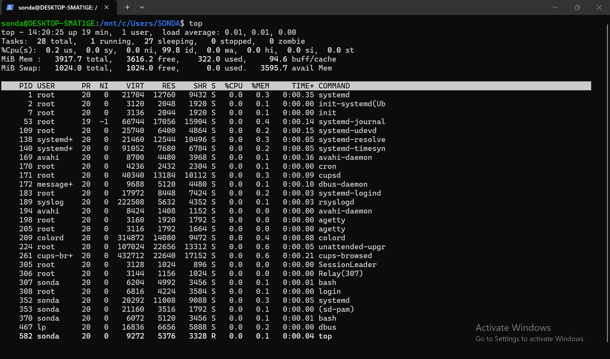


## Monitoring system activity - `htop` command

### Installation across Distributions

- Unlike top, which is universally pre-installed, htop generally requires explicit installation via your distribution's package manager:

- Ubuntu / Debian:

```bash
sudo apt install htop   # or apt-get install htop
```

- CentOS / RHEL / Fedora:

```bash
sudo dnf install htop
```

### Function Key Shortcuts (The Lower Menu Bar)

- The bottom of the htop screen displays an interactive menu driven by the keyboard's Function keys (F1 through F10):

| Key | Action | Functionality |
|---|---|---|
| `F2` | Setup | Opens a comprehensive customization dashboard. You can add metric widgets (like a system clock or CPU temperature), alter color themes, and toggle display variables. |
| `F5` | Tree View | Toggles between a flat process list and an indented parent-child hierarchy tree to track which process launched another. |
| `F7` | Nice - | Decreases the niceness value (raises process scheduling priority). Requires root/sudo privileges. |
| `F8` | Nice + | Increases the niceness value (lowers process scheduling priority, letting it yield to other tasks). |
| `F9` | Kill | Opens a sidebar listing all available Linux kernel signals (e.g., `SIGTERM`, `SIGKILL`). Allows safe signal dispatching without typing PIDs. |
| `F10` | Quit | Gracefully exits the application and saves any UI modifications made during the session to the user's home configuration file. |

## How does multitasking work?

- This lecture provides a foundational look at how operating systems manage multiple tasks on a single CPU through scheduling and context switching.

| Concept / Command    | Description                                                                     | Key Details                                                                                |
| -------------------- | ------------------------------------------------------------------------------- | ------------------------------------------------------------------------------------------ |
| Multitasking         | The illusion of running multiple programs simultaneously on a single CPU core.  | Achieved by switching between processes so rapidly that it appears concurrent to the user. |
| Time Slice         | The CPU allocates a small amount of time (called a time slice or time quantum) to each process. When the time slice expires, the scheduler may switch to another runnable process.| Each process runs for a short period before the scheduler switches to another one |
| Scheduling           | The OS mechanism that decides which program runs and for how long.              | Handled by the **CPU Scheduler**; essential for system stability and responsiveness.           |
| Context Switch       | The process of the CPU stopping one task and starting another.                  |During a context switch, the operating system:
Saves the current process's CPU state (registers, program counter, stack pointer, etc.).
Selects the next process to run.
Restores the saved state of that process.
Continues execution.               |
| `/proc/[PID]/status` | A virtual file providing real-time status information about a specific process. | Accessible via the `cat` or `grep` commands; not stored on the physical disk. `cat /proc/[process ID]/status \| grep ctxt` or `cat /proc/12345/status \| grep ctxt`           |
| `watch`              | A utility used to execute a program periodically, showing output in real-time.  | Example: `watch -n 0.5 grep ctxt /proc/12345/status` refreshes every half-second.                             |

- Viewing context switches in Linux

  - Voluntary Context Switches: These occur when the program "gives up" its turn. Usually, this happens because the program is waiting for an external event, such as reading a file from disk, a network response, or user input.

  - Nonvoluntary Context Switches: These occur when the OS forcibly interrupts a program. This happens because the program's "time slice" has expired, and the scheduler needs to give another process a turn.

```bash
grep ctxt /proc/<PID>/status

# voluntary_ctxt_switches:      45
# nonvoluntary_ctxt_switches:   120
```

## The Priority of a Process

### What is Niceness?

- In Linux, Niceness is a value that tells the kernel how "nice" a process should be to other processes.

- It ranges from -20 to +19.

- **High Niceness (e.g., +19)**: The process is "very nice." it stands back and lets everyone else go first. Result: Low Priority.

- **Low/Negative Niceness (e.g., -20)**: The process is "not nice." It pushes to the front of the line. Result: High Priority.

- **The Default**: New processes typically start with a niceness of 0.

### Setting Priority with `nice` and `renice`

- We need administrative privileges to lower the niceness / increase the priority of a process
- We don't need any privileges to increase the niceness / lower the priority of a process
- Set the niceness for a program - Starting a New Process
  - You use nice when you want to launch a program with a specific priority right out of the gate
  - Syntax: `nice -n [niceness] [program]`
  - Example: 
```bash
nice -n 19 grdit
sudo nice -n -10 gedit
```

- Change the priority of an existing process
  - If a process is already running and hogging your CPU, you don't have to kill it. You can "re-nice" it using its PID (Process ID).
  - Syntax: `renice -n [niceness] [process ID]`

## Getting the process Id for a program - `pgrep`

- The `pgrep` command simplifies this by searching through running processes and returning only the PIDs.
- Syntax: 
  - Standard Usage `pgrep [program]`: This searches by the process name. 
  - Full Name Search `pgrep -f [program]`: The `-f` flag checks the full command line. This is useful for catching all sub-processes associated with an application that might have different internal names
- Example  
  - `pgrep firefox`: this typically only returns the main Firefox process.
- Practical Integration: The true power of `pgrep` comes from its ability to integrate with other commands via Bash Expansion (Command Substitution). This allows you to pass the output of `pgrep` directly into `renice` to change process priorities on the fly

```bash
renice -n 19 $(pgrep firefox)

# How it works: Bash executes the command inside the parentheses first, gets the PIDs, and then "plugs" them into the renice command
# Result: All Firefox processes are immediately set to the lowest priority (niceness 19), effectively moving them to the background.
# A Note on Quotes: When using expansions like $(pgrep ...), do not wrap the expression in double quotes. Using quotes would cause Bash to treat the entire list of PIDs as a single string
```

## Signal

### What are Signals?

- Signals can be sent to processes, and they will interrupt the process flow at a **convenient time**
- It's a mechanism to asynchronously notify a process of an event
- The **Convenient Time** Nuance: While signals feel immediate (usually under 0.1 seconds), they technically interrupt the process during specific kernel events, such as a context switch or a system call (like reading a file).

### The Operating System Role

- Is responsible for delivering the signal to the process
- Maintains a signal queue, so we can send a signal to every process (even to one that is not active right now)

### What kind of messages do signals deliver?

| Signal Name | Common Source | Purpose |
|---|---|---|
| SIGINT | Terminal (`Ctrl+C`) | Interrupts the process (request to stop). |
| SIGHUP | Shell | "Hangup" - sent when a terminal window is closed. |
| SIGTERM | Other processes | A request to terminate gracefully. |
| SIGWINCH | User Interface | Notifies the process that the window size has changed. |
| SIGILL | CPU | Sent when a process tries to execute an illegal instruction. |

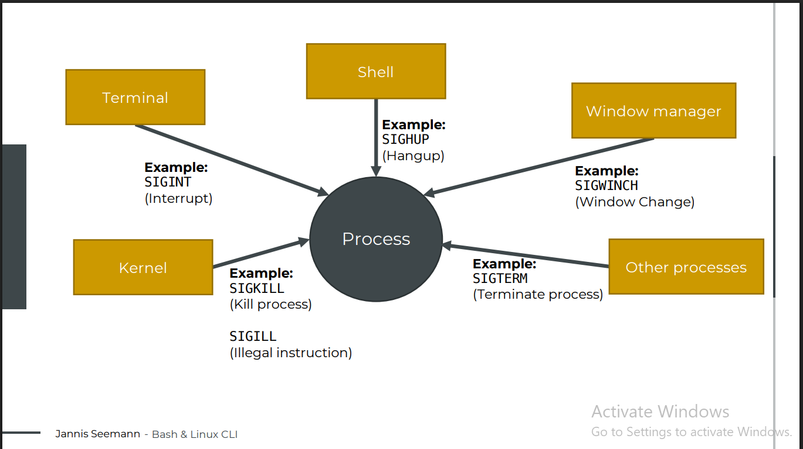

### The signal: SIGINT (Ctrl+C)

- The most common way users interact with signals is by pressing Ctrl+C in a terminal.

- Trigger: When you press Ctrl+C, the terminal driver sends a SIGINT (Signal Interrupt) to the foreground process.

- Default Action: Most programs will stop immediately and return control to the shell.

- Custom Handling: Programs can be written to "catch" or "listen" for this signal.

- Example: When wget receives SIGINT, it doesn't just crash. It catches the signal, closes the network connection, saves the data it has already downloaded, and then exits gracefully.

## The `kill` command

- Despite its intimidating name, the `kill` command doesn’t actually kill programs directly. Instead, its primary job is to send signals to running processes, leaving the final action up to the program or the operating system kernel.

- Key Concepts
  - Signals Beyond the Keyboard: While Ctrl+C sends a SIGINT (Signal Interrupt) to a program from within its own terminal, the kill command allows you to send that exact same signal from a completely different terminal window or tab.

  - The Workflow: To target a process from another terminal, you must first locate its unique Process ID (PID).

  - Dynamic PIDs: Every time a program restarts, it is assigned a brand-new PID.

- Command Syntax
  - Standard Syntax (Recommended): `kill -s <SIGNAL_NAME> <PID>`. 
    - Example: `kill -s SIGINT 1234`
  - Alternative Syntax: `kill -<SIGNAL_NAME> <PID>`

- Pro Tip: Command Expansion: Instead of manually looking up the PID every time it changes, you can combine both steps into a single line using command expansion:

```bash
kill -s SIGINT $(pgrep [program])
```

## More signals we can send to a program

### View all available signals on your system

```bash
kill -l
```

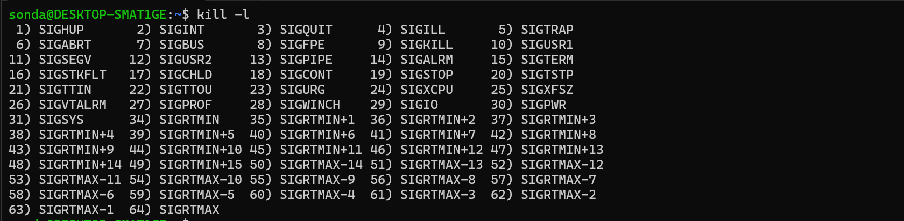

### The signal: SIGTERM

- SIGTERM is the default signal sent by the kill command. It tells a process to terminate, but acts as a polite request rather than a forced eviction
- Syntax

```bash
kill [PID] # Recommended default

kill -s SIGTERM [PID] # Explicit name
kill  SIGTERM [PID] 

kill -s -15 [PID] # Using the signal ID, because SIGTERM has the ID 15 in the kill -l command.
kill -15 [PID]
```

### The signal: SIGKILL

- When a process becomes unresponsive or ignores a SIGTERM, SIGKILL is used to terminate it immediately.
- Behavior: This signal completely bypasses the program and is handled directly by the operating system kernel. The program is not given any warning or time to clean up.
- Risks: Because it shuts down the process instantly, it can cause data loss or leave files and databases in an inconsistent/corrupted state.
- Uncatchable: A process cannot ignore, catch, or block a SIGKILL signal.
- Syntax

```bash
kill -s SIGKILL [PID]
kill -9 [PID]
```

### The signal: SIGHUP (Signal Hangup)

- The SIGHUP signal behaves differently depending on the type of process receiving it:
  
  - Interactive/Terminal Programs: Used to communicate that the controlling terminal has been closed. When a terminal closes, it automatically sends a SIGHUP to its running child processes (e.g., a text editor like gEdit), causing them to terminate.

  - Daemons (Background Processes): Since daemons do not have a controlling terminal, they often repurpose SIGHUP as a command to reload their configuration files without needing a full restart.

  - Handling: This signal can be captured or ignored by programs, though standard tools usually account for it natively.

- Syntax: `kill -s SIGHUP [process ID]`

```bash
# terminal 1
gedit
```

```bash
# terminal 2
kill -s SIGHUB $(pgrep gedit)

# After that, on the terminal 1
# gedit
# Hangup
```

### The signal: SIGSTOP (Signal Stop)

- The SIGSTOP signal pauses a process rather than terminating it.

  - Behavior: It places a process into a paused ("stopped") state, freezing its execution instantly.

  - Crucial Characteristic: It is non-catchable and cannot be ignored. The operating system intercepts and handles it directly, ensuring the process cannot override the command.

  - Demonstration (CMatrix): Sending SIGSTOP to a visual terminal tool like cmatrix freezes the flowing text animations on screen and returns control of the shell back to the user.

- Syntax: `kill -s SIGSTOP [process Id]`

```bash
# Demonstration (CMatrix)
sudo apt update
sudo apt upgrade
sudo instal cmatrix
cmatrix

# open new window
kill -s SIGSTOP $(pgrep cmatrix)
```

### The signal: SIGCONT (Signal Continue)

- The SIGCONT signal resumes a process that was previously paused by SIGSTOP.

  - Behavior: It unfreezes the process, allowing it to pick up exactly where it left off.

  - Handling: Unlike SIGSTOP, SIGCONT can be captured by the program, allowing the software to alter its behavior upon waking up.

- Syntax: `kill -s SIGCONT [process Id]`

```bash
# Following the CMatrix example demonstrated above

kill -s SIGCONT $(pgrep cmatrix)
```

#### Practical Case Study: Network Behavior with wget

- The lecture highlights how SIGSTOP and SIGCONT interact with network connections using the wget file download tool:

- Scenario A: Short Interruption
  - wget is actively downloading a file.

  - A SIGSTOP is sent, freezing the download.

  - A SIGCONT is sent shortly after.

  - Result: Because SIGCONT can be captured, wget notices it was paused and redirects its output to a log file instead of cluttering the terminal. By checking the log with tail -f, the user sees that wget successfully reused the still-open network connection to finish the download.

- Scenario B: Long Interruption

  - wget is actively downloading a file.

  - A SIGSTOP is sent, freezing the download.

  - The process remains paused for an extended period.

  - Result: The remote server times out because it hasn't heard from wget. It forcefully closes the network connection. When SIGCONT is finally sent, wget realizes the connection is dead. Depending on the remote server's capabilities, wget will either attempt to resume the partial download or be forced to restart the entire download from scratch.

### SIGTERM vs. SIGINT

- SIGINT (Ctrl+C): Sent from the terminal to ask a process to stop because the user wants to regain control of the shell.

- SIGTERM: Sent to tell a process to terminate generally, independent of direct user terminal control.

## kill vs. /usr/bin/kill vs. /bin/kill (kill command vs kill program)

### Shell Built-ins vs. System Executables

- In Linux/Unix shells (like Bash), many commands exist in two distinct versions:

  - Shell Built-in: The functionality is compiled directly into the shell itself. No external program is launched.

  - System Executable: An actual binary file located on the hard drive that the operating system runs as a separate process.

- Checking Command Types
  - You can determine how a command is being executed by using the type command:
  - `type kill` => Returns: kill is a shell built-in
  - `type echo` => Returns: echo is a shell built-in
  - `type cut` => Returns: cut is /usr/bin/cut (indicating it is an external program)

### Locating the System Executable

- Even if a command is a shell built-in, an executable file usually still exists in the system directory to remain compliant with the POSIX standard.

- Because type defaults to showing the built-in version, you can locate the physical path of the standalone executable using:

```bash
which kill # in Bash

where kill # in Zsh
```

### Comparing `kill -l` (Built-in) vs. `usr/bin/kill -l` (Executable)

| Feature | Bash Built-in (`kill -l`) | System Executable (`/bin/kill -l`) |
|---|---|---|
| Formatting | Clean layout, lists both signal numbers and full names (e.g., `1) SIGHUP`) | Different layout, often omits the `SIG` prefix (e.g., `HUP` instead of `SIGHUP`) |
| Signal Availability | Includes a comprehensive list of standard and real-time signals | May exclude certain advanced or system-specific signals |

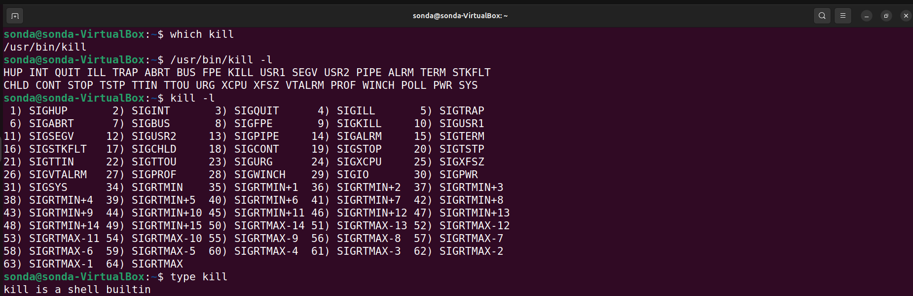

### Cross-Shell Variations

- Because built-ins are written by shell developers, the output of the exact same command can vary drastically if you switch shells:

- Running `kill -l` in **Bash** produces a different visual format than running `kill -l` in **Zsh**.

- Key Takeaway: If you notice a change in command output or behavior when switching systems or terminals, it is likely not a system error; it is simply a reflection of different shell implementations.

## The killall command

### Overview of the killall Command

- The primary advantage of the `killall` command over the standard `kill` command is its ability to target processes by name rather than by Process ID (PID).
- Default Behavior: If no specific signal is specified, `killall` defaults to sending a SIGTERM (terminate) signal.

### Sending Specific Signals

- Just like kill, killall can be used to send custom signals (such as SIGINT, SIGHUP, or SIGSTOP) to a group of processes matching a name. However, the syntax varies depending on your platform.

- Syntax: `killall -s SIGINT [program name]`

## What Happens When a Process Exits?

- When a process finishes executing, the operating system goes through a specific cleanup lifecycle to free up resources and inform the parent process.

- The Standard Exit Process:
  
  - Resource Release: Most of the process's allocated resources (such as RAM chunks and CPU allocations) are instantly freed back to the kernel for other applications to use.

  - Parent Notification (SIGCHLD): The process cannot be immediately deleted from the system because it must preserve its exit status (or exit code) for its parent. The Linux kernel sends a SIGCHLD signal to the parent process to inform it that its child has terminated.

  - Process Reaping: The parent process triggers a system call (wait or waitpid) to read the child's exit status. Once collected, the process is considered "reaped," and the operating system completely erases its entry from the system's process table.

### Understanding Exit Codes - `$?`

- You can access the exit status of the most recently executed foreground process in Bash using the special variable `$?`.

  - 0: Indicates success. The program completed normally without errors (e.g., closing Firefox normally).

  - 1 to 255: Indicates an error. A specific non-zero number usually matches a distinct failure mode (e.g., using cat on a non-existent file returns 1).

```bash
# open terminal
firefox

# close firefox
echo $? # output 0

cat axcdf.txt # axcdf.txt doesn't exits
echo $? # output 1

```

## Orphan Processes

- An orphan process is a child process that continues running after its parent process has already terminated.

- Adoption: To ensure every process has a parent to listen for its exit code, orphans are automatically "adopted" by an initialization process.

- The Adoptive Parent: Historically, this is the main init process (PID 1). However, modern Linux systems using systemd often spin up user-specific systemd processes to manage user interface sessions.

- Demonstration: If you launch Firefox from a terminal using `nohup firefox` (which prevents the terminal from passing its closure signal down to the browser) and close the terminal, Firefox's parent ID changes from the Bash shell's PID to the user-specific systemd process PID.

```bash
nohup firefox

# open the new window and search the parent process id of firefox
ps -elf | grep $(pgrep firefox)

# Result is: 
# The firefox process: 4 S sonda       3534    3515  8  80   0 - 825606 poll_s 11:17 pts/0   00:00:11 /snap/firefox/8306/usr/lib/firefox/firefox
# The parent firefox process id: 0 S sonda       3515    3508  0  80   0 -  4985 do_wai 11:17 pts/0    00:00:00 bash

# closing the terminal
ps -elf | grep $(pgrep firefox)

# Result is: 
# The firefox process: 4 S sonda       3534    2251  8  80   0 - 825606 poll_s 11:17 pts/0   00:00:11 /snap/firefox/8306/usr/lib/firefox/firefox
# The parent firefox process id: 4 S sonda       2251       1  0  80   0 -  5448 -      11:08 ?        00:00:01 /usr/lib/systemd/systemd --user

```

## Zombie Processes

- A **zombie process** is a process that has completed execution but still occupies an active entry in the operating system's process table.

### Why Do Zombies Happen?

- A zombie is created when a child terminates, but its parent process fails to execute the wait system call to read the child's exit status. For a brief millisecond, every finished process is a zombie; it only becomes a problem if it remains stuck in that state permanently.

### The Danger of Zombie Processes

- Resource Usage: Zombies do not consume memory or CPU power.
- Process Table Overflow: Their critical threat is that they permanently consume an entry in the system's process table. Operating systems have a rigid upper limit on total concurrent process IDs (viewable via specific kernel limits, which can be up to ~4 million). An excessive breakout of zombie processes can exhaust available PIDs, preventing the system from launching any new applications.

```bash
# get the maximun number of processes
cat /proc/sys/kernel/pid_max

# 4194304
```

### Identifying and Resolving Zombies

- Identification: In the process utility ps (such as `ps -efl`), zombie processes are explicitly marked under the status column with a `Z`.

```bash
ps -elf | grep "[Z] "
```

- Resolving Zombies
  - Resolution Method 1 (Manual Reaping): You can manually send a SIGCHLD signal to the parent process to remind it to check its children. However, if the parent is frozen or poorly programmed, it will likely continue ignoring the signal.
  - Resolution Method 2 (Killing the Parent): The most effective way to eliminate a zombie process is to kill its parent process. Once the parent dies, the zombie becomes an orphan and is adopted by the init or systemd process. init immediately recognizes the zombie state, reads its exit status, and cleans it out of the process table cleanly.

## Process states

| State | Meaning                                                                               |
|-------|---------------------------------------------------------------------------------------|
| `R`   | Running. This means the process is running or ready to run. |
| `S`   | Sleeping. The process is not running; rather, it is waiting for an event, such as a keystroke or network packet. |
| `D`   | Uninterruptible sleep. The process is waiting for I/O such as a disk drive. |
| `T`   | Stopped. The process has been instructed to stop. |
| `Z`   | A defunct or “zombie” process. This is a child process that has terminated but has not been cleaned up by its parent. |
| `<`   | A high-priority process. It’s possible to grant more importance to a process, giving it more time on the CPU. This property of a process is called niceness. A process with high priority is said to be less nice because it’s taking more of the CPU’s time, which leaves less for everybody else. |
| `N`   | A low-priority process. A process with low priority (a nice process) will get processor time only after other processes with higher priority have been serviced. |
|`s`	| Session leader. This process is the leader of a process session (e.g., a shell like bash or a main system service that started other child processes).|
|`l`	| Multi-threaded. The process has multiple threads running inside it (using CLONE_THREAD, like many modern applications).|
|`+`	| Foreground process group. The process is running in the foreground of its terminal session (it currently has control of your terminal screen/input).|

### Running State - R

- The process is actively executing code on a CPU core.

- Common Misconception: A program being "open" visually on your desktop does not mean it is in the R state from a kernel perspective.

- Behavior: Most modern applications (like Firefox or an idle terminal) spend the vast majority of their time idling. They only spike into the R state for fractions of a millisecond when executing an action—such as calculating a blinking text cursor or rendering a new webpage layout—before instantly returning to a restful state.

### Sleeping / Interruptible Sleep State - S

- This is the default resting state for almost all active programs on your machine.

- Behavior: The process is entirely idle and consuming zero CPU resources, waiting for an outside event or trigger to wake it up (e.g., a keyboard keystroke, a timer expiration, or an incoming network packet).

- Handling: It is fully responsive to system signals. If you send a signal to a sleeping process, it instantly wakes up to process the command.

### Uninterruptible Sleep State - D

- A specialized and protected state typically triggered when a process makes a System Call to communicate directly with hardware via the kernel (most commonly during heavy Input/Output storage or network actions).

- Behavior: The process is frozen while waiting for hardware/driver data to return. During this brief window, it cannot be interrupted by any standard signals (including SIGINT or SIGTERM).

- The Kernel Safety Valve: Normally, this state lasts for mere milliseconds. However, if a buggy hardware driver hangs indefinitely, the process can become permanently stuck in the D state. In this scenario, even a forceful kill -9 (SIGKILL) may fail to remove it instantly, as the kernel itself must first finish processing or breaking the blocked system call.


### Traced / Stopped State (T)

- The process has been completely suspended or paused by user intervention or a developer utility.

- Triggers: You can manually push a process into this state by sending a SIGSTOP signal (or by pausing it through a code debugger like ptrace).

- Demonstration (Ping Utility): Running an active command like ping google.com initially leaves the process toggling primarily between S and R. Sending a SIGSTOP forcefully halts its execution, printing a suspended status to the shell and altering its process table state letter to T.

- Resuming: Sending a SIGCONT (Continue) signal instantly wakes the process up, transitioning it back out of T to pick up execution exactly where it left off.

```bash
ping google.com

# open the new terminal
ps -elf | grep $(pgrep ping)

# 4 S sonda       8532    4498  0  80   0 -  4743 -      17:21 pts/1    00:00:00 ping google.com
# 0 R sonda       8576    8549  0  80   0 -   884 -      17:22 pts/0    00:00:00 grep --color=auto 8532

kill -s SIGSTOP 8532
ps -elf | grep $(pgrep ping)

# 4 T sonda       8532    4498  0  80   0 -  4743 -      17:21 pts/1    00:00:00 ping google.com
```

### Zombie State - Z

- The final phase of a process's lifespan before it is completely erased from existence.

- Behavior: The process has successfully finished executing and all of its RAM and CPU shares have been returned to the system. However, its structural metadata shell remains stuck inside the system's process table until its parent reads its final exit status code.

- Catching a Zombie: Because healthy parent applications read exit codes within fractions of a millisecond, catching a normal process in the Z state manually is almost impossible without automation.

- The Sleeping Parent Exception: If a parent process is temporarily blocked in an Uninterruptible Sleep (D) state, it cannot respond to the kernel's SIGCHLD notification. During this specific window, the deceased child process will safely remain a visible zombie (Z) until the parent wakes up and cleans the process table entry.

# Job control (Navigate Background and foreground operations)

## What is a Job?

- Definition: In Bash, a job is simply a command that is currently being executed.
- A job can consist out of mutiple programs: `cat file.txt | wc`
  - In this case, we have 2 programs that are being executed at the same time: cat and wc
  - Both of those programs are bundled into one job that is being executed

### Job vs. Process

- A single job can consist of multiple programs/processes. 
- For example, when you pipe two commands together (`command1 | command2`), both programs run simultaneously as two separate processes, but they are managed as a single job because they were initiated by one command.

## Foreground Jobs

- These jobs occupy your terminal shell.

- Bash will wait for a foreground job to finish completely before it accepts or executes any new commands.

- You can only run one foreground job at a time per terminal session.

- If a foreground job gets stuck or runs indefinitely (like a standard ping command), you can interrupt and terminate it by pressing **Ctrl + C**.

```bash
ping google.com
```

## Background Jobs

- To run a command without locking up your terminal, you can send it to the background by adding a space and an ampersand (&) to the end of your command.
- Syntax: `[command] &`
- Example:

```bash
ping -c 10 google.com &
```

### Keyboard Inputs

- A critical rule of thumb for shell interaction: **Only foreground jobs can receive keyboard input**.

- No Keyboard Access: As long as a job remains in the background, any text you type to send are completely disconnected from it.

Sending Signals (e.g., Ctrl + C): Pressing Ctrl + C sends a SIGINT (Interrupt) signal. This will only cancel a job if you use `fg` to bring it to the foreground first.

### Key Behaviors of Background Jobs:

- Terminal Control: The shell immediately gives you back control so you can type and execute other commands while the background job runs.

- Job & Process IDs: When you start a background job, Bash prints a line containing the Job ID (in brackets, e.g., [1]) and the Process ID (PID).

- Pipes in Bash: If your background job contains a pipe, Bash will only display the PID of the last process in the pipeline (unlike other shells like zsh, which display all PIDs).

- Terminal Output: By default, a background job will still print its standard output directly to your terminal screen, which can become messy and confusing.

- Status Updates: 
  - Bash does not always alert you the exact millisecond a background job finishes. Instead, it checks the status and prints a Done notification right after you execute your next command in the terminal.

- Best Practices: Redirecting Output: To keep your terminal clean, it is highly recommended to redirect the output of a background job to a file:

```bash
ping -c 10 google.com > ping.txt &
```

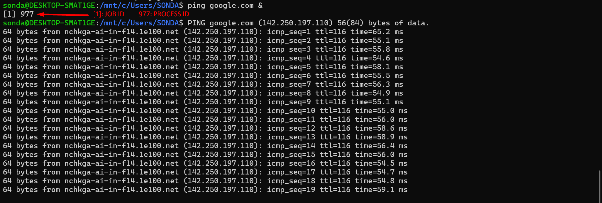

## Job management in Bash

### Listing Background Jobs

- The `jobs` Command: When running multiple tasks simultaneously in the background, typing jobs in the terminal provides a complete status overview.

- The `jobs` command only displays background tasks that were started within that specific Terminal window (or shell session). If you open a new Terminal, even as the same user, running jobs will show nothing

- **Tracking Status**: It displays the sequential Job ID (e.g., [1], [2]) along with the current state (Running or Done) and the exact command being executed.

- **The Plus** (`+`) **Symbol**: In the jobs output, the most recently modified or interacted-with job is marked with a `+` symbol, designating it as the current default job.

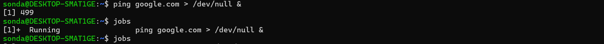

```bash
ping google.com >/dev/null &
# [1] 901
ping google.com >/dev/null &
# [2] 902
jobs
# [1]-  Running                 ping google.com > /dev/null &
# [2]+  Running                 ping google.com > /dev/null &
```

### Bringing Jobs to the Foreground

- If you need to check on a background task or take control of it, you can pull it back to the foreground using the fg (foreground) command.
- Once a job is brought back to the foreground, it behaves as if you typed it without the `&` ampersand—occupying the shell and pausing terminal input until it finishes or is canceled.
- The `fg` command only pulls background tasks that were started within that specific Terminal window (or shell session). If you open a new Terminal, even as the same user, running fg will do nothing

- Usage Syntax:  `fg [%job-ID]`
  - `fg`: Brings the current default job (marked with the `+` sign) to the foreground.
  - `fg %1` or `fg 1`: Directly targets and brings a specific job to the foreground by referencing its Job ID.

```bash
ping google.com >/dev/null &
# [1] 901
ping google.com >/dev/null &
# [2] 902
jobs
# [1]-  Running                 ping google.com > /dev/null &
# [2]+  Running                 ping google.com > /dev/null &

fg 1 # or fg %1
```

### Send a job to the background or Suspending a Foreground Job

- If a job is currently running in the foreground and occupying your terminal, you can temporarily pause it and regain control of your shell.

  - The Suspend Shortcut: Pressing **Ctrl + Z** will suspend the active **foreground job**.

  - Under the Hood (**SIGTSTP**): This keyboard shortcut sends a **SIGTSTP (Signal Terminal Stop)** to the program. Think of it as a polite request asking the program to pause execution and hand control back to the terminal. (Unlike **SIGSTOP**, a program can technically choose to ignore **SIGTSTP**, though most obey it).

  - The "Stopped" State: When you run the `jobs` command after suspending a process, its status will be listed as Stopped. This means it is paused in memory—not terminated or dead.

```bash
ping google.com >/dev/null
# [1] 1773
jobs
# [1]+  Running                 ping google.com > /dev/null &

# Press Ctrl + Z
# or in another terminal, run the command below
# kill -s SIGTSTP 1773
jobs
# [1]+  Stopped                 ping google.com > /dev/null
```

### Resuming a Suspended Job

- Once a job is stopped, you have two choices for how to wake it up and resume its execution
- Signal Notification (**SIGCONT**): Whenever you resume a job (using either `fg` or `bg`), Bash sends a **SIGCONT** (Signal Continue) to the process. This lets the program know it has been awoken, allowing it to perform necessary tasks like reconnecting to a server or refreshing its state.
- The `fg` and `bg` command only pulls background tasks that were started within that specific Terminal window (or shell session). If you open a new Terminal, even as the same user, running `fg` or `bg` will do nothing

### Resume in the Background - `bg`

- To make the paused job start running again without locking up your terminal, use the `bg` command:

- Syntax: `bg %<job_id>` (e.g., `bg %1`)

- Behavior: The job's status changes from Stopped to Running, but it stays in the background so you can keep typing other commands.

### Resume in the Foreground - `fg`

- To bring the paused job right back to the front of your terminal, use the fg command:

- Syntax: `fg %<job_id>` (e.g., `fg %1`)

- Behavior: The job wakes up, takes over your terminal screen again, and will continue running until it finishes or you press **Ctrl + Z/Ctrl + C** again.

### How can we kill a job (Terminating Jobs)?- `kill`

- Just like you can terminate a system process using its Process ID (PID), you can use the built-in kill command to terminate a Bash job using its Job ID.

- Default Behavior (**SIGTERM**): Running `kill %<job_id>` sends a **SIGTERM** (Signal 15 / Terminate) to the job. This politely asks the program to clean up and shut itself down.

- Forced Termination (**SIGKILL**): If a job is frozen and refuses to close, you can force-kill it by specifying the absolute kill signal: 

```bash
kill -9 %2`
```

- The `kill %<job_id>` command only pulls background tasks that were started within that specific Terminal window (or shell session). If you open a new Terminal, even as the same user, running `kill %<job_id>` will do nothing

```bash
kill -s SIGINT %1
# -bash: kill: %1: no such job
```

#### The Critical Role of the Percentage Sign (%)

- The most important takeaway for syntax is the % prefix. Bash needs to know whether you are referring to a system-wide Process ID or a shell-specific Job ID.

| Command Syntax | What Bash Looks For | Result if Incorrect |
|----------|-----------------------------|-----------------------------------------------------------|
| `kill 2` | A system process with PID 2 | No such process (usually fails because PID 2 is a protected system process or doesn't exist). |
| `kill %2` | Bash Job ID `[2]` | Successfully terminates the background/stopped job running in your current shell. |

#### Bash Built-in kill vs. System kill

- Jobs are strictly a shell feature managed internally by Bash, not by the global operating system. Because of this, you must rely on Bash's internal tools to manage them.

- The Bash Built-in: When you type just kill, Bash uses its own built-in command, which perfectly understands the % job syntax.

- The OS Binary (/bin/kill or /usr/bin/kill): If you accidentally call the external operating system executable by providing a path, it will fail. The global OS binary completely lacks the code to read Bash's internal job table and will throw a syntax error.

- Rule of Thumb: Always use the plain kill command without any absolute paths when trying to terminate job IDs.

### Stop jobs with output

#### The Problem: The Background Output Dilemma

- Up to this point, you had two extreme choices when handling background jobs:

  - Let it print: Leave output unredirected, which results in text cluttering your screen while you try to type other commands.

  - Discard it entirely: Redirect the output to **`/dev/null` or a file**, meaning you completely lose the ability to see what the program is doing in real-time.

#### The Solution: The `stty` tostop Feature

- The `stty` (Set Teletype) utility allows you to modify terminal line settings. By using its tostop option, you can achieve a middle ground: allowing a background job to run seamlessly until it attempts to write to the terminal, at which point it pauses automatically
- Enabling the Feature: `stty tostop`
- Disabling the Feature: `stty -tostop`

```bash
stty tostop
ping google.com &
# [1] 2089

jobs
# [1]+  Stopped                 ping google.com

bg %1; jobs
# [1]+ ping google.com &
# [1]+  Running                 ping google.com &

jobs
# [1]+  Stopped                 ping google.com

stty -tostop
bg %1
# [1]+ ping google.com &
#  PING google.com (142.250.198.142) 56(84) bytes of data.
# 64 bytes from nchkgb-aj-in-f14.1e100.net (142.250.198.142): icmp_seq=1 ttl=116 time=60.0 ms
# 64 bytes from nchkgb-aj-in-f14.1e100.net (142.250.198.142): icmp_seq=2 ttl=116 time=59.8 ms
# 64 bytes from nchkgb-aj-in-f14.1e100.net (142.250.198.142): icmp_seq=3 ttl=116 time=61.5 ms
# 64 bytes from nchkgb-aj-in-f14.1e100.net (142.250.198.142): icmp_seq=4 ttl=116 time=56.0 ms
```

## Waiting for background jobs - `wait`

### The Purpose of the `wait` Command

- When you run multiple time-consuming processes in the background (such as concurrent file downloads or long-running scripts), you often need a way to pause your terminal workflow until those tasks finish. 
- The `wait` command serves as a synchronization checkpoint. It runs in the foreground and forces Bash to hold off on executing subsequent commands until the specified background tasks complete.

### `wait` Command Syntax and Variations

- The `wait` command is highly versatile and can be used in several ways depending on what you want to track:

| Command      | Behavior |
|---------------|-----------|
| `wait`        | Suspends the shell and waits for all currently active background jobs to finish. |
| `wait %1`     | Waits for a specific Job ID (e.g., job `[1]`) to complete. |
| `wait 28453`  | Waits for a specific system Process ID (PID) to complete. |
| `wait -n`     | Waits for any single background job to finish. As soon as the first one completes, the wait ends. |

### How to use `wait` command: Chaining Commands with Semicolons

- To effectively utilize `wait`, you can chain multiple commands together on a single line using a semicolon (;). Bash executes these sequential commands from left to right:

```bash
ping -c 5 google.com > /dev/null &   # Background Job 1
ping -c 5 bing.com > /dev/null &     # Background Job 2
wait ; echo "All pings finished!"    # Wait for both, then print message
```

- Alerting yourself when long background tasks finish by using the system Bell (bel) escape sequence: `tput bel`
- Executing `tput bel` will either play a subtle alert sound, flash your terminal window, or do nothing at all if the feature is disabled or unsupported

```bash
# Start multiple parallel background tasks
ping -c 5 google.com > /dev/null & 
ping -c 5 google.com > /dev/null &

# Wait for them to finish, trigger an audio/visual cue, and print a status update
wait ; tput bel ; echo "Downloads complete!"
```

## Keep a program running - `nohup`

### The Problem: The **SIGHUP** Signal

- When you close a terminal window or log out of a remote server session, the operating system automatically sends a **SIGHUP** (Signal Hang Up) to all processes managed by that terminal shell. 
- By default, receiving a **SIGHUP** forces those processes to terminate immediately—meaning long downloads or automation scripts will fail if your session disconnects

### The Solution: The `nohup` Command

- The `nohup` (No Hang Up) utility interceptively runs a command and blocks it from receiving the SIGHUP signal.

### Core Behaviors of `nohup`

- **Persistent Execution**: It allows a program to keep executing safely even if you close your terminal or log out completely.

- **Automatic Output Redirection**: Because a closed terminal can no longer display output, nohup automatically redirects standard output (stdout) and standard error (stderr).
  - It attempts to write this to a file named nohup.out in your current directory.
  - If the current directory is not writable, it falls back to creating nohup.out inside your home directory (~).

### The Anatomy of the Ultimate Background Command

#### No Ampersand: `nohup ping google.com`

- What happens:
  - nohup disconnects the ping program from the SIGHUP signal. Ping is still a foreground process
  - ping will remain running, even after the terminal has been closed
- The Catch: 
  - Your terminal is completely locked up. 
  - You cannot type any other commands. 
  - While it will survive if you close the window, you are forced to wait or close the terminal to do other work. You can still kill it using **Ctrl + C** because keyboard interrupts (SIGINT) are not blocked.

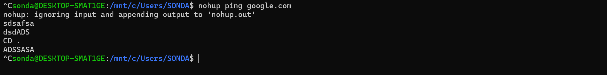

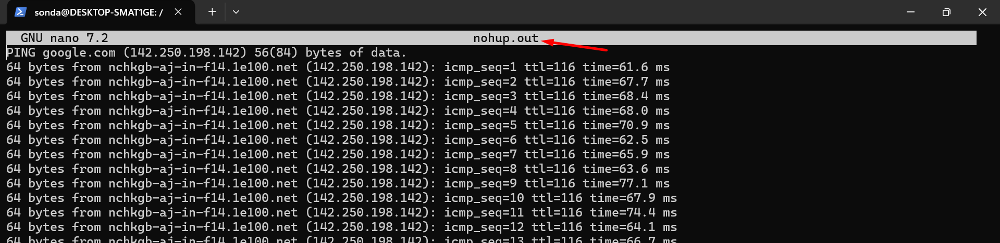

#### Ampersand Only: `ping google.com &`

- What happens: The command runs in the background.

- The Catch: 
  - Your terminal is instantly freed up for other work, and keyboard interrupts (Ctrl + C) won't impact it. 
  - However, because it is still tethered to the active terminal, it will die immediately the moment you close the window or log out due to the SIGHUP signal.

#### The Combined Approach: `nohup ping google.com &`

- What happens:
  -  nohup disconnects the program from the **SIGHUP** signal, thus it will keep running if we close our terminal
  - It's a background process, so it will run in the background of our current terminal 

### Under the Hood: Process Parenting and Orphan Adoption

- A fascinating mechanical change occurs within the operating system when a nohup background process outlives its terminal:

  - While the terminal is open: The parent of your background task is the active Bash shell (bash).

  - When the terminal closes: The bash process dies. This leaves your running command as an "orphan."

  - The Adoption: To maintain stability, the operating system automatically re-parents the orphan process by shifting its Parent Process ID (PPID) to PID 1 (managed by systemd/init on Linux, or launchd on macOS).

- More detail in: [Orphan Processes](#orphan-processes)

# Linux Software Management

- In Linux, applications come bundled into **repositories**. A **repository** is a centrally managed location that consists of software packages maintained by developers
- Each Linux distribution comes with several official repositories, but on top of those, you can add some new ones
  - Ubuntu uses deb packages, as it is based on Debian
  - Fedora (or Rocky Linux and AlmaLinux) uses rpm packages, as it is based on RHEL

## What is Package Management?

- Package management is the standardized process of installing, updating, configuring, and removing software on an operating system.

- Instead of searching the internet for installers, downloading them, and manually placing files in system directories, a package manager automates the entire lifecycle of software distribution through a centralized, streamlined interface.

## Why Package Management is Crucial

- Linux operating systems rely heavily on shared, system-wide software libraries. A robust package manager provides several critical benefits:

  - Dependency Resolution: If a program requires a specific library to run, the package manager automatically detects, downloads, and installs all necessary prerequisite software.

  - System Stability & Compatibility: It ensures that all installed software versions are thoroughly tested and compatible with one another, preventing system breakages.

  - Security Tracking: It makes keeping an entire operating system secure straightforward by allowing you to update every single piece of installed software with just a couple of commands.

## The DEB package’s anatomy

### The Ubuntu & Debian Relationship

- Shared DNA: Because Ubuntu is a derivative of Debian, they both share the exact same underlying package format (.deb).

- The "Usually" Rule: While you can technically force a package explicitly built for Debian onto an Ubuntu system (and vice versa), doing so is risky. It can cause future update friction or break system upgrade pathways. Stick to packages explicitly designated for your specific distribution.

- Universal Tools: Mastering package management on Ubuntu means you simultaneously master it for Debian. Both utilize identical terminal utilities, such as apt, apt-get, and dpkg.

- For Ubuntu, we can find the repository here: https://packages.ubuntu.com/

### dpkg: Debian Package Manager

#### What is dpkg?

- **Definition**: 
  - dpkg stands for Debian Package Manager. 
  - It is the low-level tool used to install software packages in Debian-based Linux distributions, including Ubuntu.
  - And we can install them through dpkg: `dpkg -i package.deb`. A .deb file is a compressed archive (ar file format) with all the files needed for the program, and its installation on the system

- **Scope**: It handles the installation and removal of individual .deb files directly, but it does not automatically resolve or manage dependencies.

#### Manual Installation

- Before downloading a package manually, you must verify your system's architecture and Ubuntu version to ensure compatibility.
  - Alternatively, check the Settings => About window in the GUI

```bash
# Check Ubuntu Version & Codename:
lsb_release -a

# No LSB modules are available.
# Distributor ID:	Ubuntu
# Description:	Ubuntu 24.04.4 LTS
# Release:	24.04
# Codename:	noble
```

- Navigate to the official repository at packages.ubuntu.com
- Search for the package (e.g., neofetch) matching **your distribution's codename**

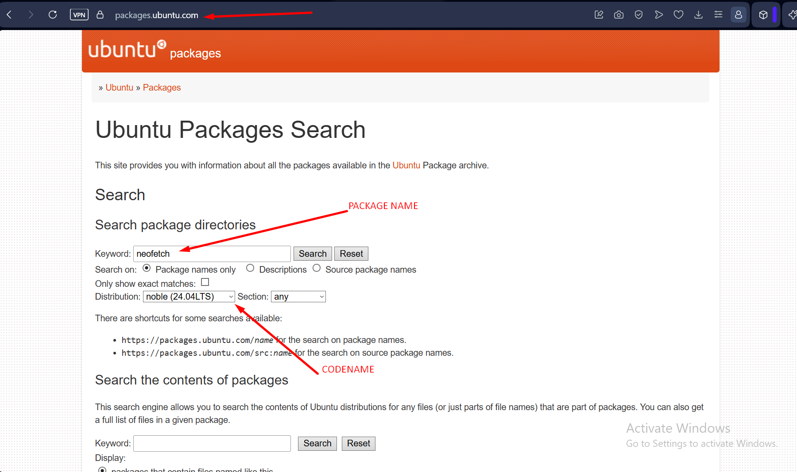

- Select an appropriate download mirror and save the .deb archive.
  - Understand Processor Architecture:
    - all: Independent of architecture (e.g., Python or Bash scripts like neofetch).
    - amd64: Standard 64-bit architecture for Intel and AMD processors.
    - arm64: Used for modern Apple Silicon Macs (in VMs) or Raspberry Pi devices

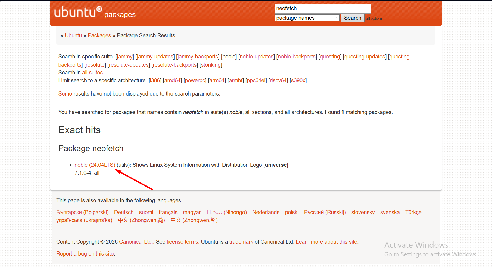
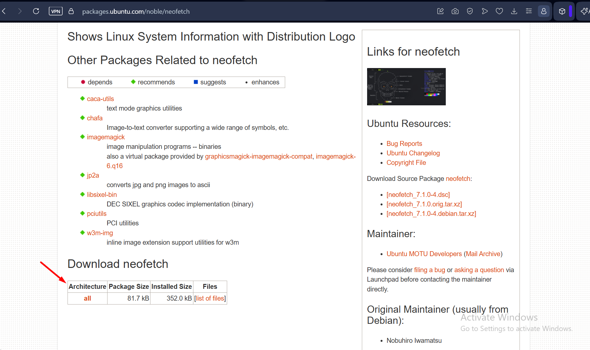

- Navigate to the Downloads folder

```bash
cd ~/Downloads
ls
# neofetch_7.1.0-4_all.deb
```

- Install via dpkg: run dpkg with administrative privileges (sudo)

```bash
sudo dpkg -i neofetch_7.1.0-4_all.deb
```

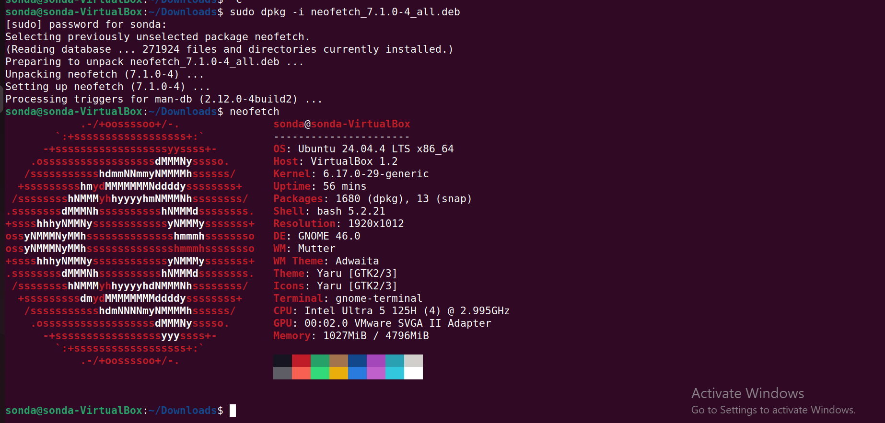

- Remove/Uninstall via dpkg: To remove the package, you only need the package name, not the original .deb file

```bash
sudo dpkg -r neofetch
```

### Managing sofware packages: `apt` / `apt-get`

#### dpkg vs. apt / apt-get

- While dpkg is a low-level tool that only installs individual software packages without resolving dependencies, higher-level tools like apt and apt-get build on top of it to manage dependencies automatically.

- apt-get: Has a stable, rigid API. It is the preferred choice for writing automation and shell scripts.

- apt: A newer, streamlined rewrite designed for human interaction in the terminal. Its parameters can adapt over time, making it less ideal for strict scripts.

- Note: Both systems are fully compatible, share the same underlying configuration directories, and track manually requested packages versus automatic dependencies

#### A package source / repository in apt

- `apt-get` / `apt` needs to know which packages are available, and where it can download them from
- We thus need to connect to central repositories, which provide our packages
- Those central repositories are stored in the following files:
  - Repositories from the system: `/etc/apt/sources.list`
  - Additional (third party) repositories: `/etc/apt/sources.list.d/*` (`*`: Added as individual files inside the folder `/etc/apt/sources.list.d`)

#### Updating the Package List

- Once we have our repositories, we need to update the "package definitions"
- This means, that we fetch the latest list of available packages from the repositories

- Command: `sudo apt update` or `sudo apt-get update`

- Purpose: This does not install new software. It only refreshes the list of available packages and their versions.

- Note: This requires sudo (root privileges) because it accesses protected system files.

#### Managing Packages (Search/Install/Remove)

- The lecture demonstrates how to search or add or take away specific tools:

- To search for a specific package: `sudo apt search <package_name>`

- Install: `sudo apt install <package_name>` or  `sudo apt-get install <package_name>` 
  - e.g., cowsay `sudo apt install cowsay`

- Install from a `.deb` file: `sudo apt install ./[.deb file]` or `sudo apt-get install ./[.deb file]`
  - Remember to always put `./` in front of the `.deb` file name.

- Suggested/Recommended Packages
  - By default, Ubuntu configures APT to pull in recommended packages alongside the core application. These are not strictly required for the software to run, but they unlock enhanced features.
  - Example: neofetch recommends imagemagick. While neofetch runs fine in pure text mode without it, imagemagick is required if you want to display an actual image file instead of the default ASCII distribution logo.
- Skipping Recommendations
  - If you want to keep your system minimal and install only the core application and its hard dependencies, use the --no-install-recommends flag: `sudo apt install --no-install-recommends neofetch`

- Removes the installed packages and all their dependencies installed by the apt install command: 

```bash
sudo apt remove <package_name>
```

- The latter will uninstall the packages, just like apt remove, but also deletes any configuration files
created by the applications


```bash
sudo apt purge <package_name>

sudo apt remove --purge [packagename]
```

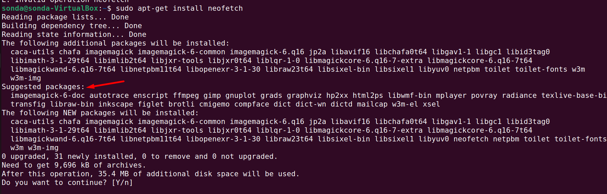

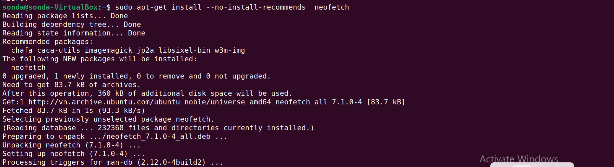

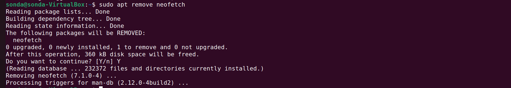


#### Managing upgrades (Upgrading Software)

- Once the list is updated, you can move to the actual upgrade process.
- We want to keep our system up to date. We thus want to install available updates on our system
- Command
  - Standard Upgrade: `sudo apt upgrade` or `sudo apt-get upgrade --with-new-pkgs`
    - This will install all available and possible updates - and even install additional dependencies (if they become necessary)
    - It will never remove any packages from our system, even if they're no longer needed
    - Safety Rule: This command never removes any packages from the system, making it inherently less risky.

  - Full Upgrade: `sudo apt full-upgrade` or `sudo apt-get dist-upgrade`
    - Performs a "large" upgrade. 
    - It can install new packages or remove existing ones if they conflict with the upgrade. 
    - It is more thorough but carries a slightly higher risk of changing system behavior.
    - Example: If Package A updates and now requires Package C, but Package C conflicts with an old Package B, a full upgrade will actively uninstall Package B to let the update pass. It can even downgrade packages if the repository deems a version unstable
    - Risk Level: Much higher. Because it has the authority to delete packages to resolve conflicts, it has a higher probability of breaking things

- Kernel Updates: If the system upgrades the kernel (the core of the OS), a reboot is usually required.

##### `apt` vs. `apt-get`

- The instructor notes that while apt and apt-get are often used interchangeably, there is a subtle difference:

- `apt upgrade` will install new dependencies if needed.

- `apt-get upgrade` generally will not install new dependencies; it only updates what is already there.

#### Auto-removing packages

- Why Unused Packages Are Left Behind?
  - full-upgrade / dist-upgrade only uninstalls dependencies, if they're exclusive and need to be  uninstalled
  - All other dependencies will remain installed, even if they're no longer needed
- To uninstall those, we need to execute the following command
  - `sudo apt autoremove` or `sudo apt-get autoremove`
  - How it Works: APT scans the system for packages that were originally installed automatically (as a dependency for something else) but are no longer required by any currently installed program.
- Best Practices Summary
  - Frequency: You should run sudo apt autoremove every now and then, particularly right after running larger system updates or upgrades.
  - Cleanup: Deletes packages that were installed as dependencies but are no longer needed by any current software. This is a common troubleshooting step for resolving upgrade conflicts.
  - Safeguard: This command will only target dependencies. It will not automatically delete software packages that you intentionally and manually installed yourself.

### How does the sources.list work?

#### What is sources.list?

- When you run `sudo apt update`, the system reads specific configuration files to know where to check for software updates.

  - The Main File: Located at `/etc/apt/sources.list`

  - The Directory: Located at `/etc/apt/sources.list.d/` (used for adding modular, third-party repository files individually).

  - Under the hood, these files simply point to an online directory structure (accessible via HTTP, HTTPS, or FTP) hosting package indexes that APT fetches

#### Anatomy of a Repository Line

- Component 1: Type
  - deb: This repository contains binary packages. These are pre-compiled software packages that APT can download, unpack, and install immediately
  - deb-src: This repository contains source packages. This is used if you intend to compile the software yourself. In production systems, these lines are typically commented out (#) to save bandwidth and index size

- Component 2: URL / URIs
  - The address of the repository. The web address pointing to the mirror server
  - Security Note: Because package indexes are cryptographically signed by the upstream maintainers, mirrors cannot maliciously alter packages without breaking the signature, making mirrors safe to use.
  
- Component 3: Distribution / Suite
  - The ubuntu version, we want to download the packages for
  - On Ubuntu, this uses code names (e.g., jammy for Ubuntu 22.04 LTS, noble for Ubuntu 24.04 LTS).
  - On Debian, you might see stages like stable, testing, or unstable.
  - Variations: You will also see suffixes added to the codename, such as:
    - jammy-updates: For major bug fixes released after the initial distribution release.
    - jammy-backports: Provides newer versions of specific software brought back to older operating system releases.
    - noble-security: This designates this as the repository for critical security patches for this version.

- Component 4: Component Domains
  - These tags define the licensing and support structures of the software you want to allow on your system. Canonical splits these into four domains:

| Domain      | Type of Software                                              | Supported By                 |
|-------------|---------------------------------------------------------------|------------------------------|
| `main`      | Officially supported, Open Source                             | Canonical                    |
| `restricted`| Officially supported, Closed Source / Proprietary (e.g., drivers) | Canonical                |
| `universe`  | Community-maintained, Open Source                             | Community / Third-Party      |
| `multiverse`| Non-free / Proprietary, potentially legally restricted        | Community / Third-Party      |

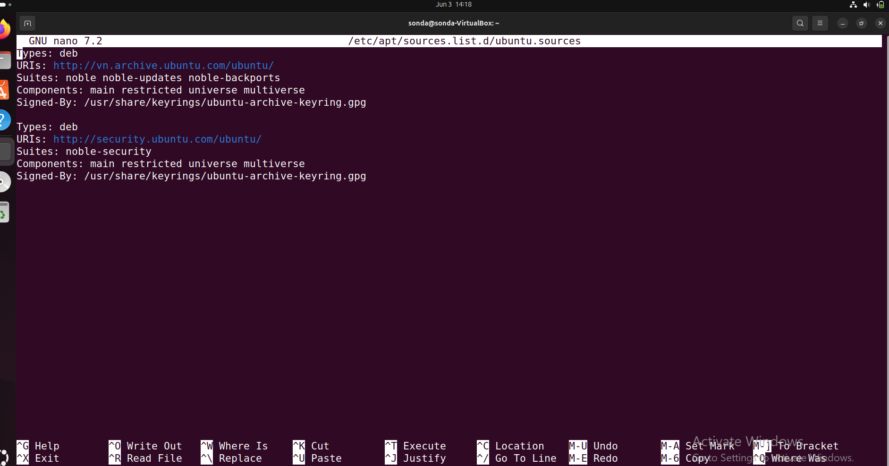

- Component 5: Signed-By 
  - Shows the path to the keyring that is used to verify the repository’s authenticity.

### Custom repositories

#### How Custom Repositories

- We can add additional repositories to our apt sources
  - Centralized Configuration: Both `apt` and `apt-get` share the same configuration files.
- If we were to do this manual
  - We create a new file in `/etc/apt/sources.list.d`
  - Usually: We need to add the GPG key to our system for this repository
    - The Role of GPG Keys: A GPG key acts as a digital signature
    - Developers sign their packages with a **private key**
    - Users download the corresponding public key to verify that the software genuinely comes from that trusted developer and has not been tampered with

#### The Practical Example: Installing Wine

- Wine is a compatibility layer used to run Windows software on Linux
- Install wine: `sudo apt install wine`
- I want to to launch the sample Windows game Blobby Volley on Ubuntu machine. So I downloaded the zip file, not the installer file, and I unzip that here on my machine

```bash
wine /home/sonda/Downloads/blobby2-win32-1.1.1/blobby-1.1.1/blobby.exe 
# wine: could not load kernel32.dll, status c0000135
```

- The Problem with Default Packages: The native Ubuntu repository version of Wine was older (version 6.0.3), which failed to launch the sample Windows game Blobby Volley, throwing a runtime error.

```bash
wine --version
# wine-9.0 (Ubuntu 9.0~repack-4build3)
```

- The Solution: Upgrading to the latest stable version (version 8.0.1) available directly via the official WineHQ third-party repository.

```bash
# Download and add the repository key
sudo mkdir -pm755 /etc/apt/keyrings
wget -O - https://dl.winehq.org/wine-builds/winehq.key | sudo gpg --dearmor -o /etc/apt/keyrings/winehq-archive.key -

# Check distribution name to add the repository
# Look for the line with either UBUNTU_CODENAME or VERSION_CODENAME
cat /etc/os-release

# PRETTY_NAME="Ubuntu 24.04.4 LTS"
# NAME="Ubuntu"
# VERSION_ID="24.04"
# VERSION="24.04.4 LTS (Noble Numbat)"
# VERSION_CODENAME=noble
# ID=ubuntu
# ID_LIKE=debian
# HOME_URL="https://www.ubuntu.com/"
# SUPPORT_URL="https://help.ubuntu.com/"
# BUG_REPORT_URL="https://bugs.launchpad.net/ubuntu/"
# PRIVACY_POLICY_URL="https://www.ubuntu.com/legal/terms-and-policies/privacy-policy"
# UBUNTU_CODENAME=noble
# LOGO=ubuntu-logo

# add the repository that corresponds to noble distribution

# Enable the 32-bit repository:
sudo dpkg --add-architecture i386

# Add the sources file:
sudo wget -NP /etc/apt/sources.list.d/ https://dl.winehq.org/wine-builds/ubuntu/dists/noble/winehq-noble.sources

# Uninstall wine if installed wine before
sudo apt remove wine

# Update the package information
sudo apt update

# Install Wine Stable branch
sudo apt install --install-recommends winehq-stable

WINEPREFIX=~/.wine32 WINEARCH=win32 winecfg
cd /home/sonda/Downloads/blobby2-win32-1.1.1/blobby-1.1.1
WINEPREFIX=~/.wine32 wine blobby.exe
```

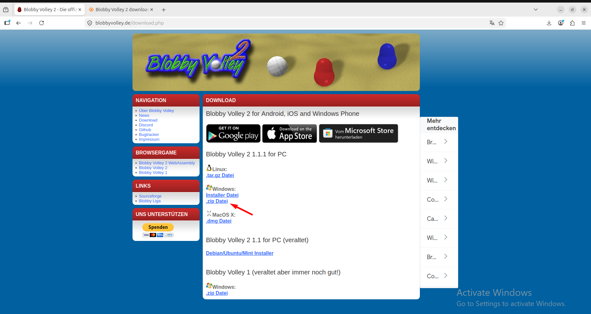

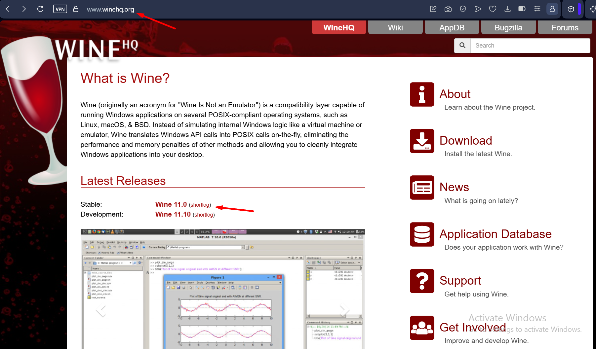

### Third party packages: Personal Package Archive

- Definition: PPA stands for Personal Package Archive. It is a concept created by Canonical (the company behind Ubuntu)
- This will usually work only on Ubuntu, not on Debian systems
-  It's a website where users can easily provide repositories for others: `https://launchpad.net/ubuntu/+ppas`
-  For example, for the latest php version, we could just add a ppa

```bash
# Check Default Version: Running on a Ubuntu 22.04 system shows PHP
apt show php 

# Choose the php version you want from the https://launchpad.net/ubuntu/+ppas
# Finding PPA to your system

sudo add-apt-repository ppa:ondrej/php
sudo apt update
```

- To remove a ppa

```bash
sudo add-apt-repository --remove ppa:ondrej/php
sudo apt remove php
sudo apt autoremove
```

- The Trust Trade-off: Companies and administrators must weigh the benefits of getting the latest software/security patches against the risk of losing complete control over what is installed on their machines.

- Evaluating Maintainers: Because PPAs are hosted by individuals rather than official teams, you must verify the maintainer's track record.
  - Example: The popular ppa:ondrej/php repo is maintained by Ondřej Surý. While it is not an official Ubuntu repository, checking his Launchpad profile reveals he has been a trusted community member since 2005.

- Malicious Code Risks: A PPA has the power to overwrite system packages (like upgrading bash or coreutils to a malicious version) during a system upgrade. While Canonical/Launchpad monitors and takes down malicious PPAs, there is always a window of vulnerability before a threat is detected.

### Verifying installation: `debsums`

#### What is the Tool?

- It is an official tool available in Debian and Ubuntu repositories used to verify the integrity of installed packages. It works by comparing the MD5 checksums of the files currently on your computer against the original checksums provided by the Debian package when it was first created.
- Important:
  - md5 is considered insecure
  - A malicious actor might be able to generate an executable, that does something different, but still yields the same checksum
  - Still, it's enough for a 99%+ exact overview

#### Installation and Core Commands

- `debsums` is not always installed by default, but it can be installed easily using the Advanced Package Tool (APT)

```bash
sudo apt install debsums
```

-  We can verify all packages that contain an md5 sum with the command debsums:

```bash
debsums [package / .deb file]
```

```bash
sudo debsums -a -s apache2 apache2-data apache2-bin
```

- Key Parameters:

  - `debsums -a`: Checks all files, including configuration files (e.g., those located in the /etc directory). By default, configuration files are skipped because users frequently modify them intentionally.

  - `debsums -s` (Silent Mode): Suppresses successful matches and only outputs errors or changed files.

  - `debsums -l`: Lists packages that do not currently have an MD5 checksum list attached.

  - Note: `debsums` installs a background trigger. Once installed, any new software you download will automatically generate checksums. However, for older packages that lack them, you might need to reinstall them to generate a baseline

- `debsums` only checks files that were explicitly installed by a Debian package. It does not monitor the whole filesystem for new, unauthorized files.


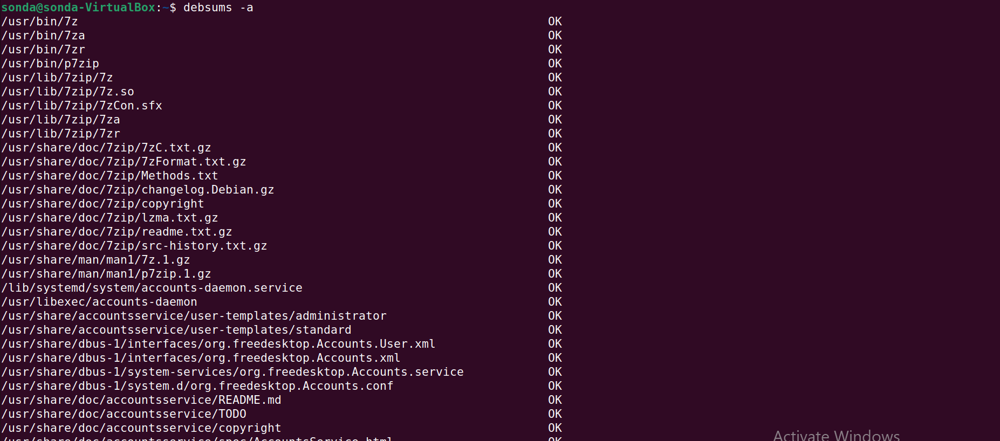

### Dependency management

#### How APT Manages Dependencies

- Dependency management ensures that when you install a piece of software, all the other software libraries it needs to function are also installed and compatible.
- APT is designed to resolve most version constraints automatically. For example:
  - Package A (Bash) requires libc6 version 2.35.
  - Package B requires libc6 version >= 2.36.
  - APT's Solution: It will automatically upgrade libc6 to version 2.36. Because Bash is compatible with version 2.36, both packages will work smoothly without breaking the system

#### Show dependencies

-  We can show the dependencies of packages with the following commands:

```bash
sudo apt show bash
sudo apt-cache show bash
```

- Understanding the Metadata Fields

| Field         | Severity Level | What It Means                                                                                                                    | Example from Text         |
|---------------|----------------|----------------------------------------------------------------------------------------------------------------------------------|---------------------------|
| Pre-Depends   | Critical       | Must be completely installed, configured, and have its installation scripts fully executed before the target package is even unpacked. | Core system utilities such as libc6    |
| Depends       | High           | Critical requirements. These must be on the system for the application to function, though their installation scripts can run concurrently with the target package. | base-files                     |
| Recommends    | Medium         | Strongly recommended. Technically, the package can run without it, but it is included in 99.9% of standard installations because it provides essential everyday features. | bash-completion           |
| Suggests      | Low            | Optional. Enhances functionality but is completely reasonable to omit to save space.                                             | Documentation / Man pages such as bash-doc|
| Conflicts     | Blocker        | Packages that cannot co-exist on the system at the same time. Installing one will remove the other.                             | Outdated software         |

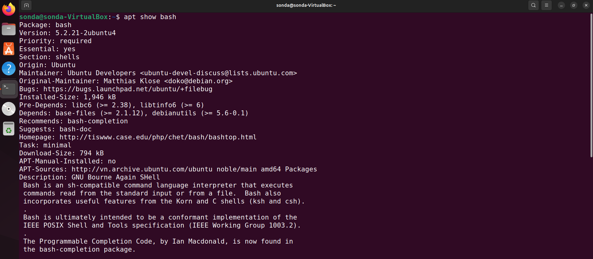

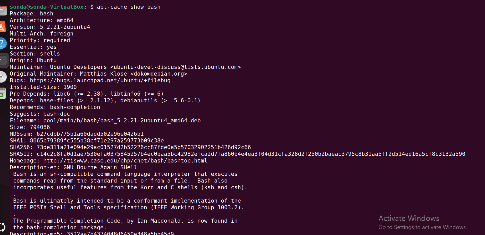

#### Conflict resolution

##### What is a Dependency Conflict?

- The Problem: If Package A strictly requires an older version of a library (e.g., libc6 <= 2.35) and Package B requires a newer version (e.g., libc6 >= 2.36), APT cannot satisfy both constraints simultaneously.

- The Impact: When a dependency conflict occurs, APT locks down and refuses to install or upgrade any software (even completely unrelated packages like a Python data science library) until the baseline conflict is resolved.

##### Resolution

- Fix Broken Dependencies (The 75%+ Solution): `sudo apt install -f` 
  - `-f` stands for **"--fix-broken"**
  - How it works: `apt` will analyze the current package state, identify inconsistencies, and solve them by installing, upgrading or removing packages
  - It will not randomly delete the primary packages you are trying to use. Instead, it will safely upgrade conflicting files to their proper repository versions or remove orphaned, unneeded dependencies to restore structural integrity
  - In 75%+ of the cases, this should resolve the problem (for packages from the default repositories)

- We run an update / upgrade of our system: 
  - This works especially well before we try to install additional software

```bash
sudo apt update
sudo apt full-upgrade # or sudo apt-get dist-upgrade
```

- If update / upgrade of our system this doesn't work: 
  - Let's automatically uninstall all packages that are no longer needed
  - This also sometimes solves the problem

```bash
sudo apt autoremove #or sudo apt-get autoremove
```

##### Best Practices to Avoid Dependency Conflict

- Avoid third-party repositories (if possible)
  - Stick to Default Repositories: Rely almost exclusively on the official OS sources found in /etc/apt/sources.list. Avoid adding unchecked third-party repositories, which often lag behind on critical ecosystem updates.
- Avoid installing software with .deb files (if possible)
  - Avoid Manual .deb Installs: Do not download random .deb files from the internet. Doing so bypasses APT's intelligent safety checks and risks forcing manual flags like dpkg --force-all, which destabilizes system paths
- Regularly install all normal software updates (always)
- Before upgrading to a new Ubuntu version:
  - Plan some extra time for dependency issues
  - Wait a month or two after release of new Ubuntu version (especially when using third-party repositories)
  - Create a complete backup for your system
- Use LTS (=Long Term Support) versions of Ubuntu for servers - less upgrades, less problems
- Consider using tools like docker to containerize your application

### Reconfiguring packages

- When you install certain Linux packages using APT, they often execute background configuration scripts or ask you interactive setup questions. 
- This is necessary for tasks like setting up a main bootloader, creating specific system users/groups for web servers, or choosing a default graphical login manager
- If you ever need to rerun these setup scripts to modify your system configurations later, you can use the following command

```bash
sudo dpkg-reconfigure <package_name>
```

#### Practical Example: Managing Locales

- What is a locale?
  - It defines how numbers and dates should be displayed
  - A lot of programing languages rely on the operating system to provide this functionality
  - For example, if we want to have a website (for example programmed in PHP), and we want to use the build-in functions to format dates
  - The corresponding locale must be generated
- The Problem: 
  - By default, a system might only have its primary language locale active (e.g., English). If you change the system environment variable (LC_ALL) to a different language, like German (de_DE.UTF-8), the system will ignore it or throw an error if that locale hasn't been generated yet.

```bash
locale -a

# C
# C.utf8
# POSIX

LC_ALL=vi_VN.UTF-8 date +%A
# Tuesday
```

- The Solution: Running sudo dpkg-reconfigure locales opens an interactive terminal menu where you can scroll through, select new locales using the Spacebar, and confirm using the Enter keys.

```bash
sudo dpkg-reconfigure locales

# select new locales using the Spacebar, and confirm using the Enter keys

locale -a

# C
# C.utf8
# POSIX
# vi_VN
# vi_VN.utf8

LC_ALL=vi_VN.UTF-8 date +%A
# Thứ ba
```

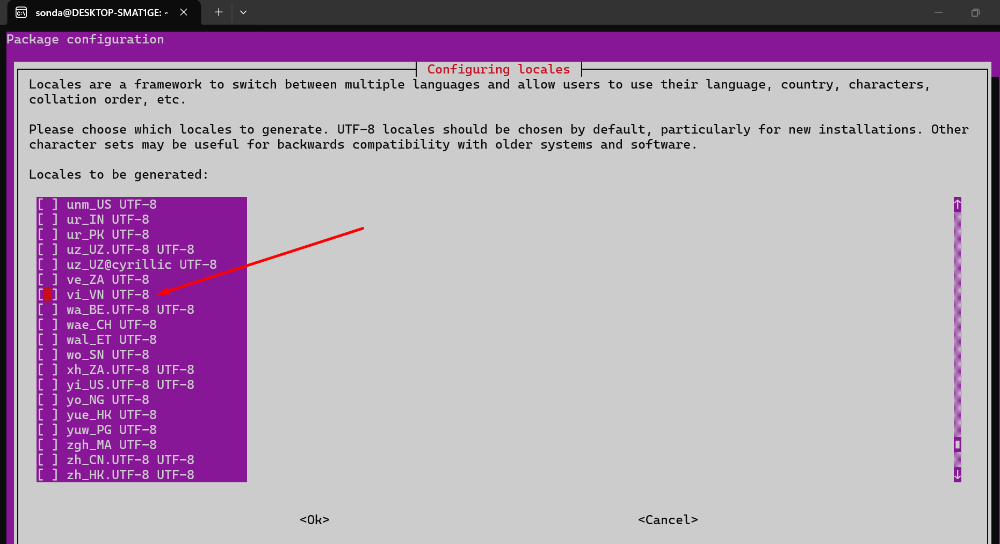

- The Result: Once dpkg finishes generating the new locale scripts, any application (like a PHP website or the Bash date command) will immediately be able to format outputs correctly for that specific region once restarted.

### Package management with snap

#### The Problem with APT (Traditional Package Management)

- Dependency Conflicts: Traditional package managers like APT can be delicate. If one dependency fails or has a version mismatch, APT can fail to install or update the software.

- Global Installation: All dependencies are installed globally. This means multiple applications are forced to share the same version of a library, which can lead to system-wide instability if an update breaks compatibility.

#### What is SNAP?

- Snap is an alternative package format designed to solve dependency issues and improve application compatibility across different Linux distributions.

- Key Advantages:

  - Bundled Dependencies: Snaps package the application together with almost all its required libraries and dependencies.

  - Isolation: Because dependencies are bundled inside the application package, they are not installed globally. Different applications can run completely different versions of the same library without conflict.

  - Automatic Background Updates: A background system service ensures that Snap packages update automatically. Otherwise we can trigger it: `snap refresh`

  - Distro Independent: Since they do not rely on specific system-level host libraries, Snaps can run seamlessly across various Linux distributions.

#### The Trade-off

- Disk Space: Because apps don't share libraries, you might have the same dependency installed multiple times on your disk, resulting in larger download sizes and more storage usage. However, modern systems prioritize the enhanced stability and reliability over saving a small amount of disk space.

#### How to Find and Install Snaps

- Snap is a centralized repository for complete applications:
  - People can publish their applications to that repository
  - If we install a snap application, we should make sure that we trust the authors!
  - We can have a look at the available packages here: https://snapcraft.io/
  - We can install an application: `snap install <package_name>`

## The RPM packages anatomy

### Manual Package Management via rpm

#### What is an RPM Package?

- Definition: An RPM file is an archive containing all the binaries, configuration files, and metadata required to install a specific piece of software.

- Dependencies: Software often relies on other programs to run. While a single RPM contains its own files, it does not embed its dependencies; those must be provided by separate RPM files.

#### Official CentOS Stream Repositories

- When manually browsing official mirrors (such as **https://mirror.stream.centos.org** for CentOS Stream 9), the system architecture is split into specific streams:

  - BaseOS: Contains the core, essential functionality of the operating system.

  - AppStream: Contains the application-level software and tools that run on top of the core OS.

  - Repo Data (repodata/): A directory containing metadata files. Package managers download these files to understand what software is available and to keep the system up to date.

#### The Core Limitation: Dependency Hell

- Manually managing software directly via rpm has a major drawback: it cannot automatically resolve dependencies.

- If you attempt to install an RPM package that requires a library you do not have, the `rpm -i` command will simply fail and output an error. You would then be forced to hunt down, download, and install those dependency RPMs manually.

- Looking Ahead: To solve this limitation, Linux administrators use DNF, an abstraction layer built on top of RPM. DNF automatically communicates with online repositories, calculates required dependencies, and installs them seamlessly. DNF will be covered in the next lecture.

#### Manual Installation

- Before downloading a package manually, you must verify your system's architecture and Ubuntu version to ensure compatibility

```bash
cat /etc/centos-release
```

- Navigate to the official mirrors **https://mirror.stream.centos.org** and download zsh-5.9-15.el10.x86_64.rpm package

- To inspect an uninstalled .rpm file archive, use the rpm command with specific query flags `rpm -qpl zsh-version.rpm`

```bash
cd ~/Downloads
rpm -qpl zsh-5.9-15.el10.x86_64.rpm

# -q : Query the package.
# -p : Target a package file (used for local, uninstalled RPMs).
# -l : List all files contained within the package that will be installed onto the system.
```

- Installing an RPM File: `sudo rpm -i zsh-5.9-15.el10.x86_64.rpm`
- Uninstalling an RPM Package: `sudo rpm -e zsh`

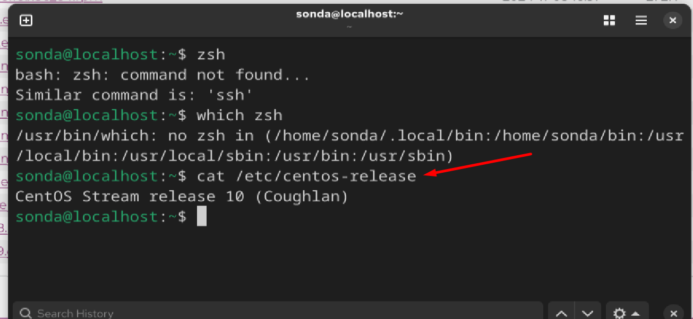

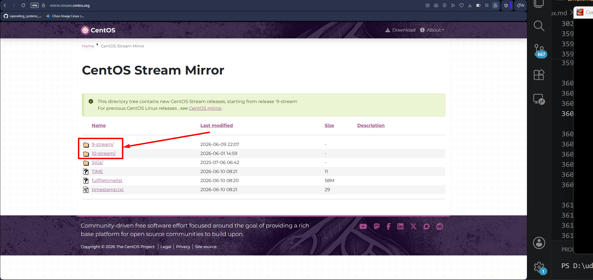

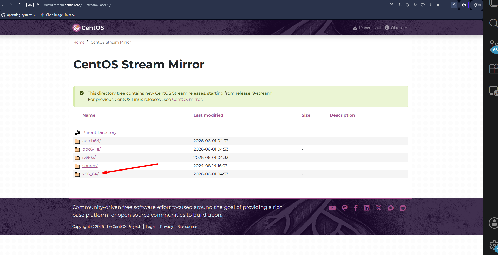

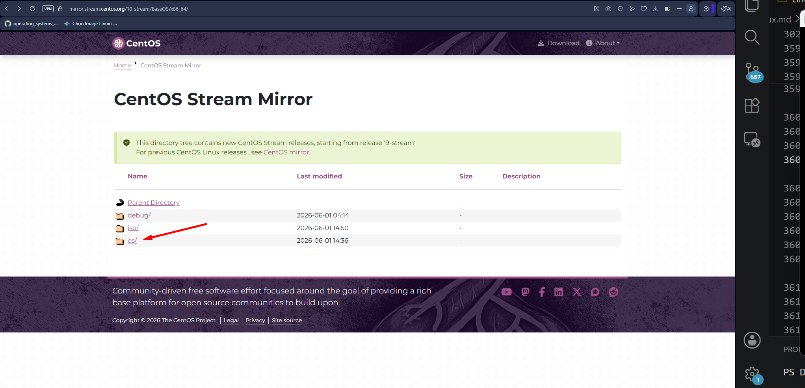

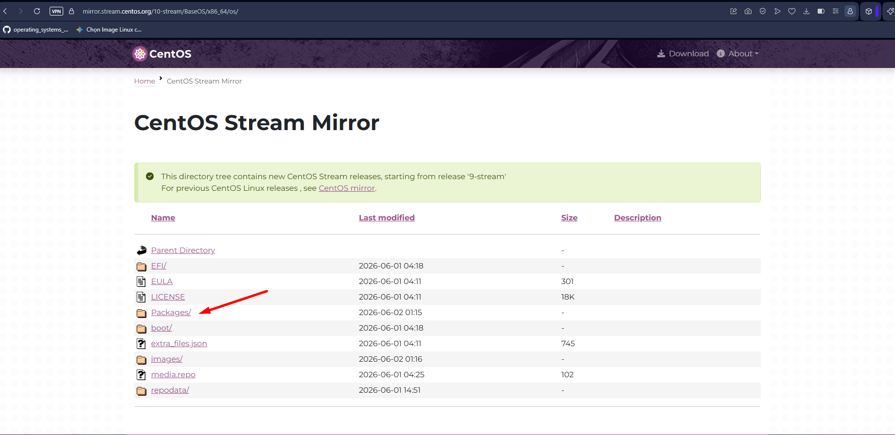

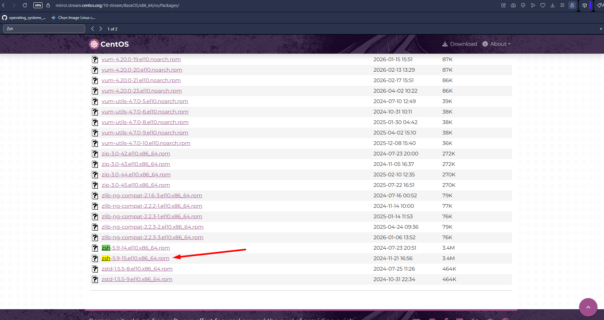

### Managing sofware packages: dnf

#### Understanding Package Management & Formats

- RPM Packages: CentOS uses the RPM package format. However, just because a package is an .rpm file does not mean it is compatible with your system. Avoid installing RPMs explicitly built for other distributions (like Fedora or openSUSE) to prevent system issues.

- DNF vs. YUM: DNF (Dandified YUM) is the modern, faster, and more streamlined package manager that replaced the older YUM.

- Command Compatibility: In the terminal, running yum and dnf yields identical results because both commands are symlinks pointing to the same underlying dnf-3 executable.

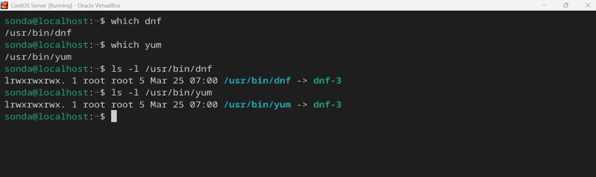

#### Setting Up Repositories

- If a package cannot be found in command `sudo dnf search <package_name>`, it is usually because the required software repositories are not enabled.
-  To expand the available software catalog, you need to enable the CRB (Code Ready Builder) repository and install the EPEL (Extra Packages for Enterprise Linux) release package using the following steps:

```bash
sudo dnf config-manager --set-enabled crb

sudo dnf install epel-release

sudo dnf update # to refresh the package database
```

- CRB stands for Code Ready Builder. It is an official package repository provided by Red Hat, but it is disabled by default upon a fresh installation of the operating system
- EPEL (Extra Packages for Enterprise Linux) is a community-maintained repository created by the Fedora Project that provides additional high-quality software packages for Enterprise Linux distributions

#### Searching for Package

- Syntax: `sudo dnf search <package_name>`

```bash
sudo dnf search links
```

#### Updating the System

- In CentOS, keeping the system current is straightforward because the package manager automatically handles list refreshes.

- Commands: `sudo dnf upgrade` or `sudo dnf update`.

- Key Difference from Ubuntu: Unlike `apt`, you do not need a separate "update" command to refresh package lists; DNF does this automatically before upgrading.

- Rebooting: If the kernel is updated, a system restart is strongly recommended to apply the changes.

#### Managing Software (Install/Remove)

- Install: `sudo dnf install <package_name>`

- Remove: `sudo dnf remove <package_name>`

- Legacy Support: The older command `yum` still works as an alias for `dnf` for those familiar with older versions of CentOS.

# The System Boot Process and systemd

## What is Boot?

- Boot (or booting) is the process by which a computer starts from a powered-off state until the operating system is fully loaded into memory and ready for use.
- The boot process typically consists of the following steps:
  - Power on the computer.
  - The BIOS or UEFI performs a hardware check (POST – Power-On Self-Test).
  - The BIOS/UEFI locates a bootable device (such as a hard drive, SSD, or USB drive).
  - The bootloader is loaded.
  - The bootloader loads the operating system kernel.
  - The kernel initializes the operating system and required services.
  - The login screen or desktop is displayed.
- In short, booting is the entire startup sequence that takes a computer from power-on to a fully operational operating system.

## The Bootloader

### What is a Bootloader?

- A bootloader is a small program responsible for loading the operating system into memory and transferring control to the kernel.

- It acts as a bridge between the system firmware (BIOS/UEFI) and the operating system.

- Common bootloaders on Linux include:

  - GRUB (GNU GRand Unified Bootloader)
  - systemd-boot

- On Windows, the standard bootloader is: Windows Boot Manager

- In short, the bootloader is responsible for locating and loading the operating system kernel, allowing the operating system to start running.

### Configuring GRUB2

- Depending on your distribution and system configuration (e.g., whether you are dual-booting), the GRUB menu might be hidden by default to speed up boot times. To change this behavior, you must modify the configuration
- Step-by-Step Configuration to open GRUB menu
  - Edit the source file: Open `/etc/default/grub` using a text editor with root privileges (e.g., `sudo nano /etc/default/grub`)
  - Modify variables: To make the menu visible, comment out or remove hidden timeout styles **GRUB_TIMEOUT_STYLE=hidden** and set **GRUB_TIMEOUT=5** (giving you 5 seconds to press a key at boot)
  - Regenerate the main file: This step differs strictly by distribution. Command to Apply Changes
    - Ubuntu / Debian: `sudo update-grub` (A wrapper script specific to Debian-based systems)
    - CentOS / RHEL:	`sudo grub2-mkconfig -o /boot/grub2/grub.cfg` (Invokes the core tool directly)
- The Golden Rule of GRUB Configuration
  - Never edit the main configuration file (`/boot/grub/grub.cfg` or `/boot/grub2/grub.cfg`) directly. It is automatically overwritten every time the system updates a kernel. Instead, always edit the source file and regenerate the configuration

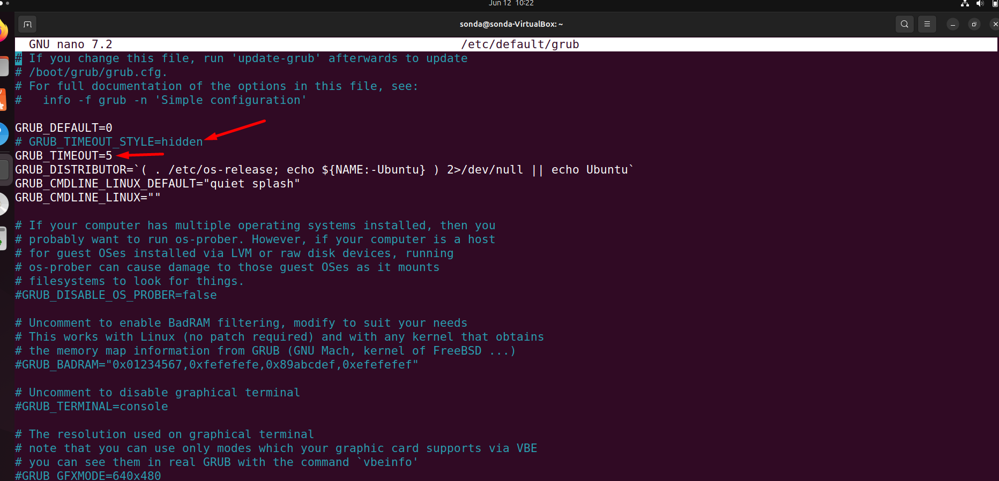

#### Additional variables

-  The `GRUB_CMDLINE_LINUX_DEFAULT` option in the `/etc/default/grub` file is used to add extra command-line parameters to the kernel for the default boot entry. 
   -  This allows users to pass additional arguments to the kernel during the boot process, such as specifying kernel parameters or enabling certain features


### GRUB Features and System Recovery

- When the GRUB menu is enabled, it grants access to critical recovery utilities:

  - Older Kernels: If a recent system or driver update breaks your current environment, you can use the GRUB menu to boot into a previously working kernel version.

  - Recovery Mode: Booting into recovery mode can grant direct root shell access without requiring a password. This is incredibly helpful for fixing broken configurations or resetting lost passwords.

#### Security Trade-offs: Accessibility vs. Hardening

- Because the recovery mode provides unauthenticated root access, an accessible bootloader poses a physical security risk.

- The Risk: Anyone with physical access to the machine (or virtual access to the hypervisor) can reboot the computer, enter GRUB, and completely hijack the system via the root shell.

- The Fix (System Hardening): To lock down a production environment, you should:

  - Hide the GRUB menu and disable boot keystrokes.

  - Password-protect the GRUB bootloader itself.

  - Lock down the motherboard BIOS/UEFI firmware with a password and disable booting from external media (like USB drives).

- The Catch: Hardening your system makes emergency troubleshooting significantly more difficult if a kernel update ever fails, creating a direct trade-off between security and convenience.

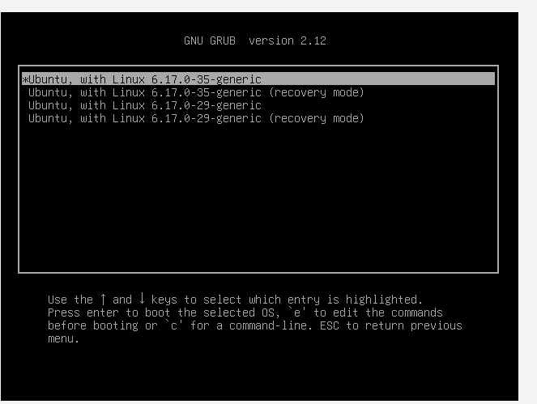

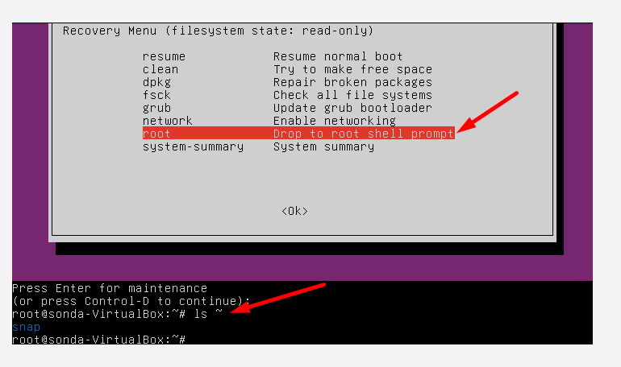

## The Kernel

### What is the Linux Kernel?

- The kernel is the core part of the operating system. It acts as a Hardware Abstraction Layer (HAL), meaning it hides the complex, varying details of physical hardware so that software developers can write applications that run smoothly on any machine.

- Key Functions of the Kernel
  - Process Management: Schedules which programs get CPU power or memory, and handles Inter-Process Communication (IPC) so programs can talk to each other.

  - Memory Management: Allocates and deallocates physical RAM sticks and virtual memory (swap space on an SSD/HDD) to programs when they open and close.

  - File System Management: Built-in drivers allow the kernel to handle file systems like Ext4 or XFS, translating software "open/read/write" commands into physical drive operations.

  - Networking Stack: Implements fundamental network protocols (like TCP/IP and Ethernet) and manages firewall rules.

  - Hardware abstraction layer (HAL): Enables applications to communicate with various devices

### Kernel Modules

- The core Linux kernel file (often found in the `/boot` directory as vmlinuz) is surprisingly lightweight—frequently only around 15MB in size. To avoid being massive, it relies on Kernel Modules.

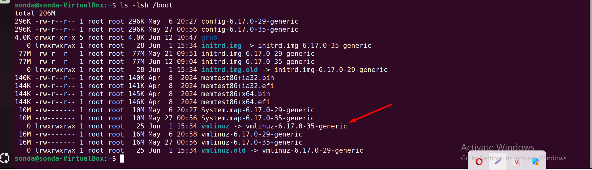

#### What are kernel modules?

- On-Demand Loading: Modules are pieces of code that can be dynamically loaded into or unloaded from the kernel at runtime without needing to reboot the computer.

- Proprietary Drivers: Because the Linux kernel is open-source, companies can pack proprietary, closed-source drivers (like Nvidia graphics drivers, specific Wi-Fi chip drivers, or advanced file systems like ZFS) into kernel modules to optimize performance legally.

- Inspection: You can see which kernel modules are currently active on your machine by running the command: 

```bash
sudo lsmod
```

#### Guarding Updates: Locking the Kernel Version

- While major package managers (like APT or DNF) handle standard system upgrades seamlessly, custom or third-party kernel modules can break if the core kernel updates to a version they don't support yet.

- If you are a system administrator running specialized hardware or hypervisor tools (like VirtualBox Guest Additions or GPU passthrough), you may want to "lock" or "hold" your working kernel version to prevent automated updates from breaking your system.

##### How to Lock the Kernel on Ubuntu (APT)

- Lock: `sudo apt-mark hold <package_name>`
- Unlock: `sudo apt-mark unhold <package_name>`

##### How to Lock the Kernel on CentOS / RHEL (DNF)

- CentOS uses a dedicated plugin to lock package versions. You must install the plugin before running the lock command

```bash
# 1. Install the version-lock plugin
sudo dnf install dnf-command(versionlock)

# 2. Lock the kernel package
sudo dnf versionlock <package_name>
```

- To unlock

```bash
sudo dnf versionlock delete <package_name>
```

#### How do we communicate with the hardware?

- User Space (User Mode): Where user applications (like Firefox, Systemd, or the graphical interface) run. Software here has restricted permissions and cannot directly tamper with the hardware.

- Kernel Space (Kernel Mode): Where the core kernel resides with absolute control over the CPU, memory, and hardware.

- System Calls (Syscalls)
  - When an application in User Space wants to do something hardware-related (e.g., saving a file), it executes a System Call (such as open, read, write, or close). The CPU momentarily switches into Kernel Mode, the kernel securely performs the action on the physical hardware, and control is handed back to the application in user mode

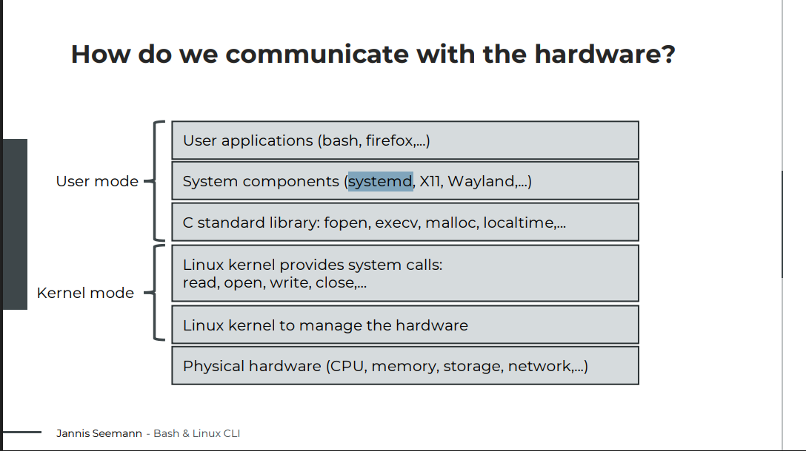

## The systemd

### What is systemd?

- Once the bootloader hands control to the kernel and the kernel initializes the computer's hardware, it needs to start the actual software environment. The kernel does this by launching the very first process on the system, which always receives Process ID 1 (PID 1). On almost all modern Linux distributions, this process is systemd.

  - Operating System Manager: systemd sits right above the kernel in user space. It does not talk to the hardware directly; instead, it uses the kernel to manage the rest of the operating system.

  - The Master Parent Process: Every single background service, login screen, graphical interface, or application that runs on your computer is ultimately started and managed by systemd.

### The Historical "init" Link

```bash
ps 1

# PID TTY      STAT   TIME COMMAND
  # 1 ?        Ss     0:01 /sbin/init splash

ls -l /sbin/init

# lrwxrwxrwx 1 root root 22 Jun  5 22:36 /sbin/init -> ../lib/systemd/systemd
```

- This is kept strictly for historical compatibility. Before **systemd** existed, Linux systems used an older initialization software system called SysV init. To prevent breaking legacy scripts and software that expect an init file to exist at boot, modern Linux distributions create a symbolic link (symlink) from `/sbin/init` pointing directly to the actual systemd executable.

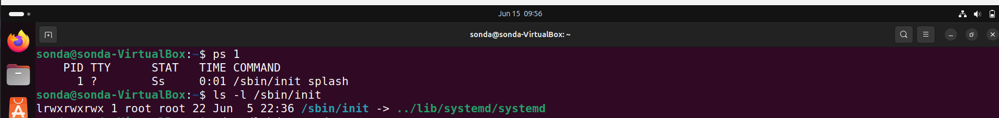

### `systemd` is an extensive set of tools

- `systemd` is not just a single program
- It is an entire ecosystem of built-in system utilities designed to handle different background tasks cleanly
- While the core systemd process (PID 1) orchestrates the boot process and manages services, you will find many specialized systemd processes running in the background, such as:

  - `systemd-timesyncd`: Automatically synchronizes your local system clock with network time servers.
  - `systemd-logind`: Manages user logins, sessions, and seat access.
  - `systemd-resolved`: Handles network name resolution (DNS tracking) for applications.

#### Practical Automation Problems systemd Solves

- To truly understand systemd, it helps to look at the common, real-world administration problems it solves. Instead of just running individual applications manually, systemd allows you to configure automated background actions:

  - Persistent Web Servers: Ensuring a web server launches automatically every single time the machine boots up, and automatically restarts if it crashes.

  - Custom Boot Commands: Triggering custom startup scripts, like writing a specific timestamp into a system log file immediately upon boot.

  - Recurring Background Tasks: Running maintenance tasks (like transcoding user-uploaded videos or cleaning up temporary databases) every few minutes or hours perfectly in the background—even if no users are actively logged into the server. (Note: This functionally replaces older utility tools 
  like cron).

## General structure - `systemd`

### System mode

- systemd manages the boot process and starts all services required for this (in parallel)
- It reads in configuration files (unit files), builds the dependency graph, and then executes all commands necessary to get to the result

### User Mode

- The same as system mode, but for user services (after the user logins)
- We will focus on system mode in this course

### System Mode vs. User Mode

- System Mode (Core Focus): systemd manages the entire boot process, handles executable dependencies (building a dependency graph), and starts required system services in the correct order to reach the final state (e.g., a graphical user interface).

- User Mode: Runs in parallel for individual users upon login to manage specific user-level background tasks and services.

### Basic Building Blocks: Units & Services

- Unit: The most basic building block in systemd. Units declare dependencies on each other. Common types include `service`, `target`, and `timer` (others include `mount` and `socket`).

- Service: A special type of unit (identified by the `.service` file extension) that represents an executable process or script. Services can be started, stopped, restarted, reloaded, enabled, or disabled.

| Unit Type (Extension) | Function | Real-world Example |
|------------------------|----------|--------------------|
| `.service` | Manages background daemons, services, or programs. | `nginx.service`, `sshd.service` |
| `.socket` | Encapsulates network, IPC, or POSIX sockets for socket-based activation. | `docker.socket`, `cups.socket` |
| `.device` | Represents a hardware device exposed by the kernel (via `udev`). | `dev-sda1.device` |
| `.mount` | Manages file system mount points (similar to `/etc/fstab`). | `mnt-data.mount` |
| `.automount` | Configures automatic, on-demand file system mounting upon access. | `proc-sys-fs-binfmt_misc.automount` |
| `.swap` | Manages memory swap space partitions or files. | `dev-sdb2.swap` |
| `.target` | Groups other units or defines boot synchronization points (like runlevels). | `multi-user.target`, `graphical.target` |
| `.path` | Monitors a file/directory and triggers a service when changes occur. | `systemd-networkd.path` |
| `.timer` | Manages time-based activation for scheduling tasks (alternative to `cron`). | `certbot.timer`, `logrotate.timer` |
| `.slice` | Manages resource allocation (CPU, RAM, I/O) via the `cgroups` hierarchy. | `browser.slice`, `system.slice` |
| `.scope` | Manages resource limits for externally created processes. | `session-1.scope` |

### The format of a unit file

#### The Unit Section

- Purposes
  - Applies to all unit types (services, targets, timers, etc.) to define context and behaviors during the boot sequence
  - A general configuration for the unit

- `Description`: Brief explanation, helps users understand the purpose of the service
- `Documentation`: Links to relevant documentation
- `Requires`: Ensures other units are activated before the current unit. If the required unit fails to start, the current unit will not start
- `Wants`: Similar to Requires, but the current unit will start even if the wanted unit fails. Useful for optional dependencies
- `After`: Ensures the current unit starts after specified units. Helps to define the order of unit activation
- `Before`: Ensures the current unit starts before specified units. Also helps to define the order of unit activation
- `AllowIsolate`: When you run `systemctl isolate <your-target>`, systemd looks at the target unit file. If `AllowIsolate=yes` is set, systemd will:
  - Start your target unit and all of its required dependencies.
  - Immediately stop any currently running services or targets that are not dependencies of your new target.
- `Conflicts`: Directive is how you establish a relationship of mutual exclusion between two or more unit. If Unit A has `Conflicts=Unit B`, it tells systemd: "These two units cannot run at the same time. If one starts, the other must stop.
  - If Unit B is already running and you manually start Unit A, systemd will automatically stop Unit B first before it spins up Unit A.
  - If Unit A is already running and you manually start Unit B, systemd will stop Unit A to let Unit B run.
  - If you try to start both at the exact same time (for example, during system boot), systemd will look at its dependency graph. If there is a tie, the transaction will usually fail, or systemd will pick the one that is explicitly required by another starting target.

#### The Service Section

- Purposes
  - If this unit is a service (`.service` file), we should write all the configuration for the service into this section ( how should this service be started, how should it be stopped, how should it be executed, etc)

- `Type`: Defines the process type and startup behavior.
  - `Type=simple`: 
    - **The default type for service in systemd** 
    - This is the simplest and most common type
    - The moment systemd successfully executes the command specified in `ExecStart=`, it immediately considers the service Active and healthy. It does not wait for the application to actually finish loading its internal components
    - **How it behaves**: Systemd forks the process -> Immediately sets status to active -> Proceeds to start the next services
    - **Best for**: Modern applications that run continuously in the foreground and don't automatically background themselves.
  - `Type=forking`
    - This is the traditional behavior used by older, legacy Unix/Linux daemons. When systemd runs the command, the original process spins up a child process (forks), moves the child to the background, and then the original parent process exits with code 0
    - **How it behaves**: Systemd runs the command -> Waits for the parent process to exit -> Tracks the child process using a PID file and marks the service active.
    - **Best for**: Classic software that automatically "daemonizes" (shuts down its initial command and runs in the background).
      - **Daemonize** is the act of turning a regular program or script into a daemon (a background service in the operating system that has no user interface and is not attached to any terminal screen)
  - `Type=oneshot`
    - This is meant for tasks that do a specific job and then exit completely, rather than running continuously in the background
    - **How it behaves**: Systemd runs the command -> Blocks all subsequent services -> Waits for the process to finish entirely. If it exits with status 0, systemd treats it as a success and moves on.
    - **Best for**: Administrative scripts, applying firewall rules at boot, running clean-ups, or triggering backups.
    - **Pro-Tip**: Often paired with `RemainAfterExit=yes`. This ensures that even after the script finishes and exits, systemd still shows its state as active (exited) instead of inactive, letting other services know that this prerequisite task was successfully completed.
  - `Type=exec`
    - This is a stricter variant of simple. Systemd forks the process but waits until the main service binary has actually started executing (after completing the initial fork and memory allocation) before marking it active.
    - **How it behaves**: Systemd forks the process -> Waits for the binary execution to begin -> Sets status to active. If your command fails instantly due to a typo, missing file, or wrong permissions, systemd will catch it and mark it as failed immediately (unlike simple, which might blindly mark it active first).
    - **Best for**: Standard long-running services where you want quick, basic validation that the command actually executed properly.
  - `Type=notify`
    - This is the most precise and modern mechanism. It behaves similarly to simple, but systemd keeps the service in an activating state. Your application must actively send a specific notification signal back to systemd (`sd_notify("READY=1")`) once it is 100% loaded and ready to accept traffic.- **How it behaves**: Systemd runs the command -> Keeps status as activating -> Waits for the application's code to say "I'm ready" -> Flips status to active.
    - **Best for**: Heavy, complex services that take a long time to boot up (like loading huge data chunks into memory), where dependent services must wait until this service is completely ready.

- `ExecStart`: Command to start the service. Can include arguments and options. But it's not a full bash command!
- `ExecStop`: Command to stop the service (optional)
- `Restart`: Defines when the service should be automatically restarted
  - Important Companion Directives:
    - `RestartSec=5s` tells systemd to wait 5 seconds before attempting to boot the service back up.
    - `StartLimitBurst=5` and `StartLimitIntervalSec=10s` Meaning: "If this service crashes more than 5 times within a 10-second window, stop trying and leave it dead."

| Option | When does it trigger a restart? | Best Used For |
|--------|----------------------------------|---------------|
| `no` (Default) | Never. If it stops, it stays stopped. | One-time scripts (`Type=oneshot`) or manual tasks. |
| `on-success` | Only if the service exits cleanly with an exit code of `0`, or via a clean kill signal. | Tasks that should run to completion, but restart if they finish successfully. |
| `on-failure` | If the service exits with a non-zero code, is terminated by an uncaught signal, or times out. | Most common for production apps. Restarts on crashes but stays dead if you manually stop it. |
| `on-abnormal` | If the service is killed by a signal (like a crash/segmentation fault) or times out. | Apps that might have intentional non-zero exit codes that shouldn't trigger restarts. |
| `on-abort` | Only if the service is killed by an uncaught cleanup signal or an internal abort signal. | Debugging specific crashing behavior. |
| `always` | For any reason the process stops (clean exit, crash, killed by user, etc.). | Absolute critical daemons that must never be offline, no matter what. |

- `User`: User under which the service should be run
- `Environment`: Defines environment variables for the service

- `StandardOutput` and `StandardError` directives control where your application's console logs go.
  - By default, any standard messages `stdout` or error messages `stderr` printed by your application are automatically captured by systemd and routed to the central system logger `journald`. However, you can use these directives to customize exactly where logs are redirected.
  - Both `StandardOutput=` and `StandardError=` accept the exact same destination parameters. Here are the most common values used in production

| Value | Description | Typical Use Case |
|-------|-------------|------------------|
| `journal` (Default) | Routes logs directly to the systemd journal. You can read them using `journalctl`. | Standard production applications. |
| `null` | Completely drops the output (equivalent to redirecting it to `/dev/null`). | Disabling noisy debug logs. |
| `file:/path/to/file` | Writes the output directly to the specified log file on disk. | Legacy applications or simple file-based logging. |
| `append:/path/to/file` | Appends the output to the specified log file without overwriting existing content. | Standard text log files. |
| `syslog` | Sends logs to a traditional syslog daemon, such as `rsyslog` or `syslog-ng`. | Multi-server log aggregation. |
| `inherit` | **(Only for `StandardError`.)** Uses the same destination configured for `StandardOutput`. | Merging `stdout` and `stderr` into the same output destination. |

- `Slice=`: When you add `Slice=something.slice` to a `[Service]` section, you are telling systemd:
"Place this service inside the `something.slice` container for resource accounting and control."
  - If you don't specify a Slice= value in a service unit, systemd automatically places it in a default slice:
    - `system.slice`: The default home for all system services (like SSH, Docker, or Nginx).
    - `user.slice`: The default home for user sessions and user-run processes.

#### The Install Section

- `WantedBy`: Here, we specify, how the unit should be installed
  - Specifies the target(s) that should include this unit as a dependency
  - Common targets: `multi-user.target`, `graphical.target`, e.g `WantedBy=multi-user.target`
  - Enables the unit to be started automatically at boot when `systemctl enable` is used

#### The Timer Section

- The most important rule when working with systemd timers is this: A timer unit never executes a script or binary directly.

- Instead, systemd timers use a "twin-unit" system. To schedule a job, you must always declare two separate files with identical names but different extensions inside `/etc/systemd/system/`:

  - The `.service` file: Defines what to run (the script, the user, the execution context).

  - The `.timer` file: Defines when to run it (the schedule, the frequency)

```text
┌──────────────────────┐
│ backup-script.timer  │
└──────────────────────┘
            │
            │ Triggers when the scheduled time arrives
            ▼
┌──────────────────────┐
│ backup-script.service│
└──────────────────────┘
            │
            ▼
ExecStart=/usr/bin/backup.sh
```
##### Monotonic Timers (Relative Time)

- These timers are bound to a specific, volatile system event (like booting up or the service itself stopping). If the system goes to sleep, these timers pause by default.

- `Unit=`: directive in a systemd `.timer` file specifies exactly which unit (usually a `.service`) should be triggered when the timer goes of
  - **Default behavior**: If you don't write `Unit=`, systemd automatically looks for a `.service` file with the exact same name as the `.timer` file
  - Example: `Unit=cleanup-logs.service`

- `OnBootSec=`:Triggers the service a specific amount of time after the machine finishes booting up.
  - Example: `OnBootSec=15min` (Runs the service exactly 15 minutes after the system boots.)

- `OnStartupSec=`: Triggers the service after the systemd manager itself starts up. This is usually very close to `OnBootSec`, but it marks when the initialization manager finishes loading.
  - Example: `OnStartupSec=5min`

- `OnActiveSec=`: Triggers the service relative to when the `.timer` file itself was activated/started.
  - Example: `OnActiveSec=30s` Wait 30 seconds after the timer starts, then run once

- `OnUnitActiveSec=`: Triggers the service relative to when the service was last activated (started). This is perfect for creating a recurring loop (e.g., run every X hours).
  - Example: `OnUnitActiveSec=1h` Triggers the service every 1 hour after the last time the service was activated

- `OnUnitInactiveSec=`: Triggers the service relative to when the service last deactivated (finished running). This ensures a fixed cool-down period between executions, regardless of how long the job took to run.
  - Example: `OnUnitInactiveSec=20min`

| Suffix | Time Unit | Example |
|--------|-----------|---------|
| `us` or `µs` | Microseconds | `OnBootSec=500us` |
| `ms` | Milliseconds | `OnActiveSec=250ms` |
| `s`, `sec`, `second`, `seconds` | Seconds | `OnBootSec=30` or `OnBootSec=30s` |
| `m`, `min`, `minute`, `minutes` | Minutes | `OnBootSec=5m` |
| `h`, `hr`, `hour`, `hours` | Hours | `OnUnitActiveSec=2h` |
| `d`, `day`, `days` | Days | `OnUnitActiveSec=1d` |
| `w`, `week`, `weeks` | Weeks | `OnUnitActiveSec=1w` |

##### Realtime Timers (Calendar Time)

- These timers use absolute wall-clock time, defined by the `OnCalendar=` option. They are highly flexible and follow the format: `DayOfWeek Year-Month-Day Hour:Minute:Second`.

- `OnCalendar=`: Triggers a service at a specific calendar date and time. You can use asterisks (*) as wildcards for recurring intervals.
  - Examples:
    - `OnCalendar=*-*-* 04:00:00` Runs every single day at 4:00 AM
    - `OnCalendar=Mon,Tue 12:00:00` Runs only on Mondays and Tuesdays at 12:00 PM
    - `OnCalendar=hourly` A built-in shorthand that runs at the top of every hour, e.g., 1:00, 2:00... (*-*-* *:00:00)
    - `OnCalendar=weekly` A shorthand that runs every Sunday at midnight (Mon *-*-* 00:00:00)
    - `OnCalendar=daily` Triggers once a day at midnight (*-*-* 00:00:00)
    - `OnCalendar=minutely` Every minute, on the 00th second (*-*-* *:*:00)
    - `OnCalendar=monthly` First day of every month at midnight (*-*-01 00:00:00)
    - `OnCalendar=*-*-* *:00,15,30,45:30` runs every year, month, day, and hour, exactly at the 0, 15, 30, and 45-minute marks, at the 30th second

##### Important Helper Options

- `Persistent=`: Only applies to `OnCalendar= timers`. If set to true, systemd checks if the timer missed a run while the machine was powered off. If it did, it triggers the service immediately upon boot.
  - Example: Persistent=true

- `AccuracySec=` Specifies the time window within which the timer is allowed to elapse. Systemd bunches timers together to save CPU wakeups and power. The default is 1min.
  - Example: `AccuracySec=1s` Forces the timer to be highly precise, down to the second

##### Helpful systemd Utilities

- `systemd-analyze timestamp now`: Displays the current system date and time in the exact format systemd expects.

- `systemd-analyze calendar 'string'`: Validates and normalizes your calendar string, showing you exactly when the timer will trigger next. Use single quotes to prevent Bash shell expansion.


```bash
systemd-analyze timestamp now

#   Original form: now
# Normalized form: Mon 2026-07-13 00:48:03 +07
#        (in UTC): Sun 2026-07-12 17:48:03 UTC
#    UNIX seconds: @1783878483.605091
#        From now: 38us ago

systemd-analyze calendar 'monthly'

#   Original form: monthly
# Normalized form: *-*-01 00:00:00
#     Next elapse: Sat 2026-08-01 00:00:00 +07
#        (in UTC): Fri 2026-07-31 17:00:00 UTC
#        From now: 2 weeks 4 days left

systemd-analyze calendar '*-*-* *:5,10,15,20:*'

#   Original form: *-*-* *:5,10,15,20:*
# Normalized form: *-*-* *:05,10,15,20:*
#     Next elapse: Mon 2026-07-13 01:05:00 +07
#        (in UTC): Sun 2026-07-12 18:05:00 UTC
#        From now: 15min left

```

```ini
[Unit]
Description=Run Database Cleanup Script Periodically
Documentation=https://wiki.internal.net/ops/db

[Timer]
# Run every day at 3:15 AM
OnCalendar=*-*-* 03:15:00

# Catch-up mechanism if the server was powered down when it should have run
Persistent=true

# Prevent all cron jobs from running at the exact same split-second (random delay)
RandomizedDelaySec=5m

[Install]
WantedBy=timers.target
```

#### The Service Slice

- Slices manage how much of the system's total resources that binary (or group of binaries) can consume. 
- Slices leverage the Linux Kernel's **cgroups** (**Control Groups**) capability to create hierarchical resource containers.

##### Key Attributes in systemd Slices

- When configuring a `.slice` file, the resource limits are defined under the `[Slice]` section. Here are the most important and frequently used attributes you need to know

| Attribute | Description | Example |
|-----------|-------------|---------|
| `CPUQuota=` | Assigns a maximum percentage of CPU time across all CPU cores. The value can exceed `100%` on multi-core systems (e.g., `200%` = two full CPU cores). | `CPUQuota=50%` |
| `MemoryHigh=` | Sets a soft memory limit. When exceeded, processes are heavily throttled and forced to reclaim memory, but they are **not** terminated. | `MemoryHigh=1.5G` |
| `MemoryMax=` | Sets a hard memory limit. If exceeded, the Linux Out-Of-Memory (OOM) killer immediately terminates the offending processes. | `MemoryMax=2G` |
| `TasksMax=` | Limits the maximum number of concurrent tasks (processes/threads) that can exist within the slice. Helps prevent fork bombs. | `TasksMax=500` |
| `IOWeight=` | Configures the relative I/O scheduling weight (`1–10000`). Slices with higher weights receive higher disk I/O priority when the storage device is under heavy load. | `IOWeight=100` |

### Systemd manages "Units"

- systemd searches for unit files across multiple paths, ordered by priority:

| Path | Purpose | Behavior |
|------|---------|----------|
| `/lib/systemd/system` (or `/usr/lib/systemd/system`) |  System configuration | This is the "default" place for configuration from the maintainer (=authors of our Linux distribution / packages). Do not modify directly. The idea is that we can just upgrade that folder without that anything breaks|
| `/run/systemd/system` | Runtime config | Non-persistent; dynamically generated and lost on reboot. |
| `/etc/systemd/system` | System Administrator config | Used for custom units or overrides. Files here take precedence over other locations. |

## What is a systemd Target?

- A target is a logical grouping of various systemd units (services, sockets, devices, etc.) that represent a specific system state or goal. 
- Instead of starting individual services one by one, systemd uses targets to bring the system to a defined operational milestone.
- Key Examples of Targets:
  - `graphical.target`: Boots the system into a full graphical user interface (GUI) environment.
  - `multi-user.target`: Boots the system into a non-graphical, multi-user command-line interface (CLI) with networking active.
  - `shutdown.target`: Handles the orderly stopping of services to turn off the computer.

### View current default target

- To get the (current) default target

```bash
systemctl get-default

# graphical.target
```

- Prints the source files of get-default

```bash
systemctl cat graphical.target
```

```ini
# /usr/lib/systemd/system/graphical.target
#  SPDX-License-Identifier: LGPL-2.1-or-later
#
#  This file is part of systemd.
#
#  systemd is free software; you can redistribute it and/or modify it
#  under the terms of the GNU Lesser General Public License as published by
#  the Free Software Foundation; either version 2.1 of the License, or
#  (at your option) any later version.

[Unit]
Description=Graphical Interface
Documentation=man:systemd.special(7)
Requires=multi-user.target
Wants=display-manager.service
Conflicts=rescue.service rescue.target
After=multi-user.target rescue.service rescue.target display-manager.service
AllowIsolate=yes
```

### Change default target

- To switch target, without rebooting

```bash
sudo systemctl isolate <target-name>
```

- To change the current default target

```bash
sudo systemctl set-default <target-name>
```

### Listing Available Targets

- To see all the targets configuration files present on your system (active or inactive)

```bash
systemctl list-units --type=target --all
```

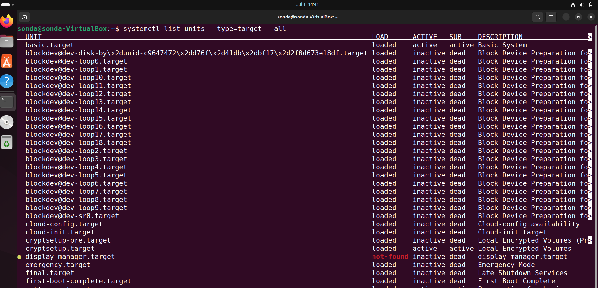

## How do we manage a unit? - `systemd`

### A list of all directories from which unit files - `systemd-analyze unit-paths`

- `systemd-analyze --system unit-paths`: Displays all the paths systemd searches for unit files.
  - `--user`: retrieve the list for the user manager instance. Lists paths specific to your individual user account (e.g., `~/.config/systemd/user/`)
  - `--global`: The global configuration of user manager instances. Lists paths (like `/etc/systemd/user/`) that apply to every user on the system when they log in, but are managed by the administrator
  - `--system` (Default): The system-wide manager instance. Lists paths where system-wide services (like nginx, docker, or hardware management daemons) are loaded. These require `root/sudo` privileges to modify.

### Prints the source files of one or more units

- `systemctl cat <unit_file_name>`: The preferred way to view a unit file. Unlike standard cat, this combines all applied configuration fragments and overrides from different folders to show the actual running configuration.

### List units

```bash 
systemctl list-units
```

### How can we edit a unit

#### Edit a unit manually

```text
+----------------------------------------------+
| /lib/systemd/system/apache2.service          |
| (Package Default)                            |
+----------------------------------------------+
                    |
                    | Copy to override
                    v
+----------------------------------------------+
| /etc/systemd/system/apache2.service          |
| (Your Custom File)                           |
+----------------------------------------------+
                    |
                    | Run: systemctl daemon-reload
                    v
+----------------------------------------------+
| systemd Runtime Memory                       |
+----------------------------------------------+
                    |
                    | Run: systemctl disable
                    |      systemctl enable
                    v
+----------------------------------------------+
| /etc/systemd/system/graphical.target.wants/  |
| (Actual Boot Symlink)                        |
+----------------------------------------------+
```

- Step 1: We can copy the unit file from `/lib/systemd/system` to `/etc/systemd/system`. This will then take precedence over the original file in `/lib/systemd/system`

```bash
sudo cp /lib/systemd/system/apache2.service /etc/systemd/system/apache2.service

# modify a unit file
sudo nano /etc/systemd/system/apache2.service
```

- Step 2: After this, we need to inform systemd about those changes

```bash
sudo systemctl daemon-reload
```

- Step 3: [Optional] Disable/Enable unit

  - When you change options under `[Unit]` or `[Service]` (like ExecStart or Restart), systemd reads those directly into memory on a daemon-reload.

  - However, systemd never automatically scans your files to re-create boot symlinks. The `[Install]` section is essentially a blueprint that is only looked at when you explicitly run:

  - `systemctl disable`: Deletes the old symlink (e.g., inside `multi-user.target.wants/`).

  - `systemctl enable`: Reads the new blueprint line (`WantedBy=graphical.target`) and creates a brand-new symlink inside `graphical.target.wants/`.

```bash
sudo sytemctl disable apache2.service
sudo sytemctl enable apache2.service
```

- Step 4: Remove a custom configuration unit file

```bash
sudo rm /etc/systemd/system/apache2.service
sudo systemctl daemon-reload
```

- A Quick Warning on the Manual Method:
  - If a package update brings a security patch or a new critical parameter to the original file in `/lib/systemd/system/`, your copied file in `/etc/systemd/system/` will completely mask it. You miss out on those updates entirely until you manually diff and merge them.

#### Edit a unit using built-in commands

- Step 1: This allows us to easily edit the configuration. We can only override this with the changes that we did. We don't need to copy'n'paste the whole configuration
  - Internally, a new folder will be created: `/etc/systemd/system/apache2.service.d/override.conf`. From this folder, override files will be loaded, that can change certain parts of the initial configuration

```bash
sudo systemctl edit apache2.service
```

- Step 2: [Optional] Disable/Enable unit
  - Similar to Step 3 in Edit a Unit Manually: [Edit a unit manually](#edit-a-unit-manually)

- Why this rules for Package Updates
  - Next month, if an apt upgrade updates Apache and changes the security parameters or core `ExecStart` options in `/lib/systemd/system/apache2.service`, your system receives those updates automatically. Your small `override.conf` just gently layer sits on top, changing only the boot target. No merge conflicts, no broken states.

- The Secret of the Empty Assignment
  - Because `/etc/systemd/system/apache2.service.d/override.conf` files are extensions, systemd treats many directives (like `WantedBy`, `ExecStart`, or `Environment`) as lists. If you just append a new value, systemd simply adds it to the list.
  - By passing an empty value right before your new value, you effectively tell systemd: "Clear the existing list, reset it to zero, and start fresh with what I write next."

- Here is exactly how systemd evaluated your changes internally. Without the Empty Reset (`WantedBy=graphical.target`)

```ini
[Install]
# 1. Reads original file:
WantedBy=multi-user.target
# 2. Reads your override (appends to list):
WantedBy=graphical.target
# RESULT: Service hooks into BOTH targets!
```

- With the Empty Reset (`WantedBy=` followed by `WantedBy=graphical.target`)

```ini
[Install]
# 1. Reads original file:
WantedBy=multi-user.target
# 2. Reads your override line 1 (clears the list):
WantedBy=
# 3. Reads your override line 2 (starts a new list):
WantedBy=graphical.target
# RESULT: Clean override. Only hooks into graphical.target!
```

- If you ever do want to completely replace a unit file using the native tool (instead of creating a drop-in), you can pass the `--full` flag:
  - This copies the entire original file into `/etc/systemd/system/apache2.service` for you to edit completely, saving you the manual `cp` and automatically handling the `systemctl daemon-reload` when you save and exit

```bash
sudo systemctl edit --full apache2.service
```

- Force-creates a brand new unit file from scratch. Used when the service file does not exist yet

```bash
sudo systemctl edit --force --full new-service.service
```

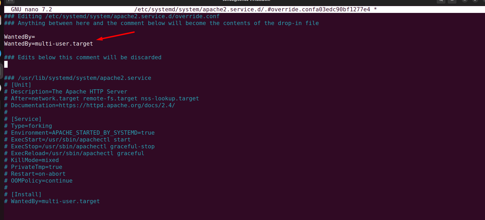

### Get the status of a unit 

```bash
systemctl status [unit]
```

- Alternatively, we can check the status of the unit with the following command

```bash
sudo systemctl is-active [unit]
```

### Change the status of a unit 

```bash
sudo systemctl {start, stop, restart, reload} [unit]
```

- start: starts a unit
- stop: stops a unit
  - Stopping a service using `sudo systemctl stop apache2` only affects the current runtime session.
    - If the host machine is rebooted, Apache2 will automatically spin back up. This persistent behavior occurs because the package manager configures the service to trigger during specific system boot sequences by default.
    -  Managing this boot behavior requires configuring systemd Targets (boot modes), which dictates how to permanently enable or disable services across system power cycles.
- restart: restarts a unit
- reload: asks the unit to reload its configuration (important: this is not the systemd configuration of this unit)

### How to enable / disable a unit

- Enabling a unit configures its boot-time behavior, while starting/stopping affects its active running state in memory.

#### The Hook: How Units Bind to systemd targets

- When a package like Apache (apache2) is installed, it is often configured to start automatically on boot. 
- This link between an individual service and a target state is defined within the unit file's configuration sections.
- `WantedBy=multi-user.target`: Dictates which system target triggers this unit. In this case, entering the standard command-line multi-user state (`multi-user.target`) will pull the Apache web server up with it.

```bash
# view apache unit file
systemctl cat apache2.service
```

```ini
# /usr/lib/systemd/system/apache2.service
[Unit]
Description=The Apache HTTP Server
After=network.target remote-fs.target nss-lookup.target
Documentation=https://httpd.apache.org/docs/2.4/

[Service]
Type=forking
Environment=APACHE_STARTED_BY_SYSTEMD=true
ExecStart=/usr/sbin/apachectl start
ExecStop=/usr/sbin/apachectl graceful-stop
ExecReload=/usr/sbin/apachectl graceful
KillMode=mixed
PrivateTmp=true
Restart=on-abort
OOMPolicy=continue

[Install]
WantedBy=multi-user.target
```

#### Enabling a unit

- Enable one or more units or unit instances
- To ensure a service starts on future boots and turns on immediately right now, use the `--now` flag:
- Depending on whether `--system` (default), `--user`, `--runtime`, or `--global` is specified, this enables the unit for the system, for the calling user only, for only this boot of the system, or for all future logins of all users. Note that in the last case, no systemd daemon configuration is reloaded.

```bash
sudo systemctl enable --now [unit]
```

##### Behind the Scenes: The Symlink Machinery

- Systemd coordinates targets through a system of symbolic links (symlinks) inside the `/etc/systemd/system/` configuration tree.

- When a command like `systemctl enable apache2` is run, systemd does not rewrite script files. Instead, it creates a pointer link:

    - The Location: `/etc/systemd/system/[systemd target].wants/` Eg: `/etc/systemd/system/multi-user.target.wants/`
    - The Link: A symlink inside that folder points directly back to the master unit configuration file (found in `/lib/systemd/system/apache2.service`).

- On system boot, systemd simply looks into the `.wants` folder of the target it is trying to reach and starts every service it finds linked there. Running `systemctl disable [unit]` cleanly unlinks and removes that file pointer.

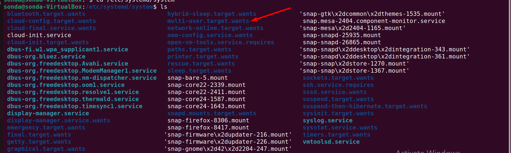

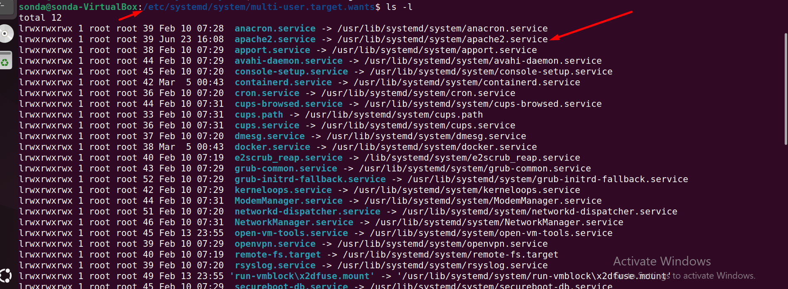

#### Disabling a unit

- Disabling a service only prevents it from starting on the next boot—it does not stop a currently active process. To completely turn off a service, perform both actions:
- Step 1: Stop the running service - Immediate effect. This kills the active process and terminates the current running state in system memory

```bash
sudo systemctl stop [unit]
sudo systemctl stop apache2.service
```

- Step 2: Disable the service - Persistent effect. This breaks the boot-time connection to the target, ensuring the service remains inactive when the system restarts.

```bash
sudo systemctl disable [unit]
sudo systemctl disable apache2.service
```

### Show all active timers

```bash
systemctl list-timers
```

- If a timer is stopped or disabled, it won't show up in the default list. To see absolutely everything (Show All Timers including Inactive Ones)

```bash
systemctl list-timers --all
```

### Editing and Restarting Timers

- Edit the timer: Open the configuration file using `systemctl edit --full my_network_log.timer` and replace the trigger logic with your `OnCalendar=`.

- Apply changes: Simply editing the file does not automatically reload or recalculate an already active timer. You must explicitly restart it: `systemctl restart my_network_log.timer`

- Verify: Use `systemctl list-timers` to check the remaining time until the next scheduled execution

### Example

```bash
sudo systemctl stop  apache2.service

sudo systemctl start  apache2.service

systemctl status apache2.service

sudo systemctl enable --now apache2.service

sudo systemctl disable apache2.service
```

### Inspecting `systemctl status` Metadata

- When executing `systemctl status apache2`, `systemd` provides comprehensive telemetry:

  - Active State: Displays a green indicator if the service is running (active (running)), or white/grey if it is stopped (inactive (dead)).

  - Cgroup (Control Group): Shows the hierarchical tree of all subprocesses spawned by the main daemon. If the service is stopped, systemd uses this cgroup to guarantee that all rogue subprocesses are safely tracked and terminated together.

  - Logs: Displays the most recent stdout/stderr log outputs generated during the service's startup initialization phase.

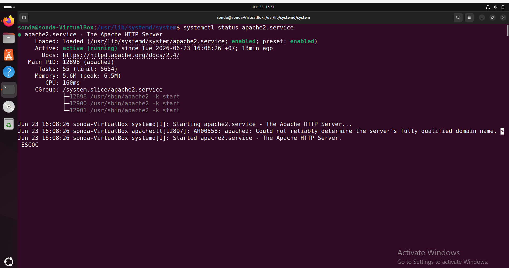

### Key Takeaway

- For standard service units, you can completely drop the suffix extension
  - If you are interacting with other systemd unit types (such as `.timer`, `.mount`, or `.socket`), you must explicitly append the extension.
  
```bash
# These two commands are functionally identical:
systemctl status apache2.service
systemctl status apache2
```

### Command Reference Table

| Command | Description | Notes / Best Practices |
|----------|-------------|------------------------|
| `systemctl list-units` | Lists all currently active or loaded units. | Generates a long output; use arrow keys to navigate. |
| `systemctl list-units \| grep apache2` | Filters the unit list specifically for Apache. | Used to quickly identify the exact unit name (`apache2.service`). |
| `sudo systemctl edit --full apache2` |	Opens the original service unit file for direct modification.	| Requires `sudo`. Unlike default edit (which creates a "drop-in" override file), `--full` copies the whole unit file to `/etc/systemd/system/` for editing. Systemd will automatically issue a daemon-reload after you save and exit |
| `sudo systemctl edit --force --full new-service.service` |	Force-creates a brand new unit file from scratch.	| Requires `sudo`. Used when the service file does not exist yet. It opens a blank file at `/etc/systemd/system/new-service.service` for you to define a completely new systemd service.|
| `sudo systemctl daemon-reload` |	Reloads the systemd manager configuration | Requires `sudo`. It forces systemd to rerun its generators and reload all unit files (like custom `.service` files under `/etc/systemd/system/`). Run this whenever you create or modify a service file before trying to start or enable it|
| `systemctl status apache2` | Displays the current runtime state, uptime, PID, Control Group (cgroup), and recent log entries. | The `.service` extension can be omitted for standard service units. Press `q` to exit the status view. |
| `sudo systemctl start apache2` | Starts a stopped service unit. | Requires `sudo` privileges. |
| `sudo systemctl stop apache2` | Stops a running service unit. | Requires `sudo` privileges. Halts the main process and all related subprocesses. |
| `sudo systemctl restart apache2` | Stops and then immediately starts the service. | Drops active connections during the reset. |
| `sudo systemctl reload apache2` | Instructs the service to hot-reload its internal configuration files. | Does not reload the systemd unit configuration file itself; it asks the application (e.g., Apache) to update gracefully without dropping active connections. |
|`sudo systemctl enable apache2` |	Configures the service to start automatically at system boot.|	Requires sudo. It creates symbolic links (symlinks) from systemd's autostart directories to the service file. Note: This does not start the service immediately; combine with `--now` if you want both, e.g: `sudo systemctl enable --now apache2` |
|`sudo systemctl disable apache2` |	Prevents the service from starting automatically at system boot.|	Requires `sudo`. It removes the symlinks created by the enable command. Note: This does not stop a currently running service; it only affects the next boot.|
|`systemctl list-timers` |	show all active timers managed by systemd |	If a timer is stopped or disabled, it won't show up in the default list. To see absolutely everything `systemctl list-timers --all`|

## Project: Let's launch our own program on boot!

### The goal in this lecture
- You will get an overview about how a service on systemd works
- You will be able to use the code from this lecture as a base for your own services

### Create own unit file

#### Step 1: Create my-network-log.service

```bash
sudo systemctl edit --fore --full my-network-log.service

# or 
# sudo nano /etc/systemd/system/my-network-log.service
```

- my-network-log.service file
```ini
[Unit]
Description=My Network Diagnostic Boot Logger
Requires=network-online.target
After=network-online.target

[Service]
Type=oneshot
# StandardOutput=append:/network-log/ping.txt is not work in REHL but it work on Ubuntu
StandardOutput=append:/var/log/ping.txt
ExecStart=/usr/bin/date "+%%T"
ExecStart=/usr/bin/ping -c 4 google.com

[Install]
WantedBy=multi-user.target
```

##### The SElinux Gotcha (CentOS vs. Ubuntu)

- When your service originally threw a "Permission Denied" error on CentOS, it wasn't a Unix file permission (chmod) issue—it was SELinux (Security-Enhanced Linux).

- Every file and directory in an SELinux system has a mandatory security label context. By creating a custom `/network-log` folder, systemd was blocked because that directory lacked the correct policy label. Moving your logs to `/var/log/` worked instantly because that directory is explicitly labeled by the kernel to allow system daemons to write text files there.

##### `Requires=` vs. `After=`

- Attempt 1: `Requires=network.target`
  - The Error: Network is unreachable
  - What happened: `network.target` simply means the network stack manager (like NetworkManager) has started loading its software. The actual network adapters hadn't finished negotiating DHCP or bringing up the hardware link before your ping executed.

- Attempt 2: `Requires=network-online.target`
  - The Error: Temporary failure in name resolution
  - What happened: This told systemd, "Don't run this unless the network is supposed to be up." However, systemd starts jobs in parallel by default. Because you didn't define an ordering constraint, systemd fired up network-online.target and my-network-log.service at exactly the same microsecond. The ping ran while DNS resolution was still setting itself up.

- Attempt 3: Adding `After=network-online.target`
  - Result: ✓ Success (Ping response recorded)
  - What happened: This forced systemd to serialize the tasks. It halted your script, waited for network-online.target to successfully complete its checks (meaning an IP address was assigned and routing tables were stable), and only then executed your pings.

##### Command line

- **Purpose**: This section describes command line parsing and variable and specifier substitutions for `ExecStart=`, `ExecStartPre=`, `ExecStartPost=`, `ExecReload=`, `ExecStop=`, `ExecStopPost=`, and `ExecCondition=` options

- Core Execution Rules
  - No Native Shell Features: systemd is not a shell. It does not natively support pipes (`|`), redirects (`>`, `>>`), wildcards (`*`), running things in the background (`&`), or joining commands with `&&`. If you type `ExecStart=echo hello > /dev/null &`, systemd will literally pass `>/dev/null` and `&` as raw text arguments to the `echo` command.

  - Multiple `ExecStart=` Lines: You can specify `ExecStart=` multiple times in a single file to run multiple commands in order. However, if you do this, you must set `Type=oneshot` in your `[Service]` section.

  - Executable Paths: Historically, systemd required absolute paths (like `/usr/bin/echo`). The documentation confirms that modern systemd allows you to just use the binary name (like `echo`) if it resides in standard system directories (`/usr/bin/`, `/usr/local/bin/`, etc.). systemd will resolve the full path automatically.

- Systemd Placeholder Rule Reminder
  - Notice the `%%T` in the date command line. Because systemd treats `%` as a special prefix for its own system variables (like `%u` for user), escaping it as a double-percent `%%` ensures that the raw string `+%T` passes cleanly into the actual binary

#### Step 2: Enable a unit and reboot system

```bash
touch /var/log/ping.txt

systemctl enable my-network-log.service

sudo reboot

cat /var/log/ping.txt
```

## Project: Schedule tasks for our own program

- Use the same a my-network-log.service file on [Project: Let's launch our own program on boot!](#project-lets-launch-our-own-program-on-boot)

### Step 1: Disable my-network-log.service

```bash
sudo systemctl disable my-network-log.service
```

### Step 2: Create and enable a timer unit file

```bash
sudo systemctl edit --full --force my-network-log.timer
```

- my-network-log.timer file

```ini
[Unit]
Description=Run the network logging service on boot

[Timer]
OnActiveSec=1min
Unit=my-network-log.service

[Install]
WantedBy=timers.target
```

```bash
sudo systemctl enable my-network-log.service

sudo reboot
```

## systemd and logging: journald

### Introduction

- Part of the systemd suite, manages system logs, replaces traditional syslog
- It's meant for system events rather than heavy application access logs, and the power of its filtering capabilities (by boot, unit, date ranges, etc)

### Key features

- Binary format for efficient storage
- Centralized logging solution
- Automatic log rotation and retention
- Indexing and querying capabilities
- Also logs messages that happened during boot

### How Systemd Logging Flows

- Before `systemd-journald` even starts during the boot process, the Linux kernel stores early boot messages in a temporary ring buffer. 
- Once the journal daemon initializes, it pulls those messages in so nothing is lost

```text
┌──────────────────────────────┐
│ Early Boot: Kernel Messages  │
└──────────────┬───────────────┘
               │
               ▼
┌──────────────────────────────┐
│ Temporary Buffer             │
└──────────────┬───────────────┘
               │
               ▼
      ┌──────────────────────────────┐
      │      systemd-journald        │
      └───────┬───────────────┬──────┘
              ▲               │
              │               ▼
┌──────────────────────────┐  ┌──────────────────────────────┐
│ System Services / Units  │  │ Compressed Binary Storage    │
└──────────────────────────┘  └──────────────┬───────────────┘
                                             │
┌──────────────────────────┐                 ▼
│ Custom Apps              │      ┌──────────────────────────┐
│ (systemd-cat)            ├─────►│ journalctl               │
└──────────────────────────┘      │ (Structured Human        │
                                  │  Reading)                │
                                  └──────────────────────────┘
```

### Generating Custom Logs with `systemd-cat`

- As you demonstrated, if you are writing a custom shell script or have an application that doesn't natively speak to systemd, you can easily pipe stdout into the central journal using `systemd-cat`
- By default, piping directly makes the log appear under the **unknown** identifier. Using the `-t` (or `--identifier`) flag gives it a clean, searchable name

```bash
echo "Application backup completed successfully." | systemd-cat -t backup_script
```

- If you ever need to view just those specific logs later, you simply run:

```bash
journalctl -t backup_script
```

### The `journalctl` Command Reference

- Because journal files are stored in a binary format for efficiency, you rely on `journalctl` to parse and filter them. Here are the core flags you highlighted

| Command / Flag        | Purpose                                                                                          | Example                                                |
| --------------------- | ------------------------------------------------------------------------------------------------ | ------------------------------------------------------ |
| `journalctl`          | Opens the complete system journal. By default, the output is displayed through the `less` pager. | `journalctl`                                           |
| `-b`                  | Displays logs from the current boot only.                                                        | `journalctl -b`                                        |
| `--list-boots`        | Lists all recorded system boot sessions with their indexes and boot IDs.                         | `journalctl --list-boots`                              |
| `-b [ID/Index]`       | Displays logs from a specific previous boot session by index or boot ID.                         | `journalctl -b -3`                                     |
| `-u [Unit]`           | Filters logs for a specific `systemd` service or unit.                                           | `journalctl -u apache2`                                |
| `--since` / `--until` | Limits the output to a specified date and/or time range.                                         | `journalctl --since "2026-04-18" --until "2026-04-21"` |
| `-r`                  | Displays logs in reverse chronological order (newest first).                                     | `journalctl -r`                                        |
| `-f`                  | Follows the journal in real time, displaying new log entries as they are written.                | `journalctl -f -u my_service`                          |
| `-t [Identifier]`     | Filters logs by a specific syslog identifier (tag).                                              | `journalctl -t my_custom_app`                          |
| `journalctl -p [level]` | Filter logs by priority/severity level (e.g.,  `"emerg" (0), "alert" (1),"crit" (2), "err" (3), "warning" (4), "notice" (5), "info" (6), "debug" (7)`) |	`journalctl -p err -b` (Shows only error logs from the current boot) |
| `journalctl -n [lines]`	| Show a specific number of the most recent log entries. | `journalctl -n 50` (Shows the last 50 log lines) |
| `journalctl _PID=[pid]`	| View logs tied to a specific Process ID. | `journalctl _PID=1234` |
| `journalctl --disk-usage` |	Check the current disk space consumption of all journal files.| `journalctl --disk-usage` |
| `journalctl --vacuum-size= / --vacuum-time=`	| Clean up old logs by forcing the journal to shrink to a size or time limit.	| `journalctl --vacuum-time=7d` (Deletes logs older than 7 days) |

## What is a cgroup?

### Core Concepts & Overview

- Control groups (cgroups) are a feature of the Linux kernel
- It organizes processes hierarchically
- And allows us to more evenly distribute system resources
- Systemd heavily relies on cgroups to manage processes

### Key Advantages

- **Hierarchical Inheritance:** 
  - A cgroup can contain multiple processes and nested sub-cgroups. 
  - If we start a sub-process, it will automatically be in the same cgroup as the parent
- **Collective Management:**
  - For complex applications that scale out with subprocesses (e.g., an Apache web server spinning up multiple PHP workers, or a Firefox browser launching isolated rendering processes), cgroups ensure that resource controls apply to the entire group rather than a single process ID (PID).

### Core Features of Cgroups

- **Resource Limiting**
  - We can configure a cgroup to not exceed a specific memory limit
  - We can define how much % of CPU resources this cgroup may occupy
  - Example: Capping a group at a maximum of 100 MB of RAM or a fixed percentage of total CPU cycles
- **Resource Prioritization/Scheduling**
  - Distributing CPU scheduling shares evenly or preferentially between distinct groups of processes when the host system is under high load.
- **Resource Accounting & Measurement**
  - Monitoring the real-time resource consumption (CPU utilization, memory footprints, and I/O throughput) of entire application stacks or individual user sessions.
- **Process Control**
  - Freezing or checkpointing all bundled processes simultaneously within a single group configuration step

### Structural Concepts inside cgroup 

- Command: `systemctl status`

- `/`: The root cgroup representing the entire operating system.

- `system.slice`: The default container space holding system infrastructure daemons and background services managed by systemd.

- `user.slice`: The container space holding interactive user sessions.
  - Nested inside, you will find user IDs (e.g., `user-1000.slice`), which track all processes initiated by that specific user account (such as terminal terminals, desktop environments, and user-level shells).

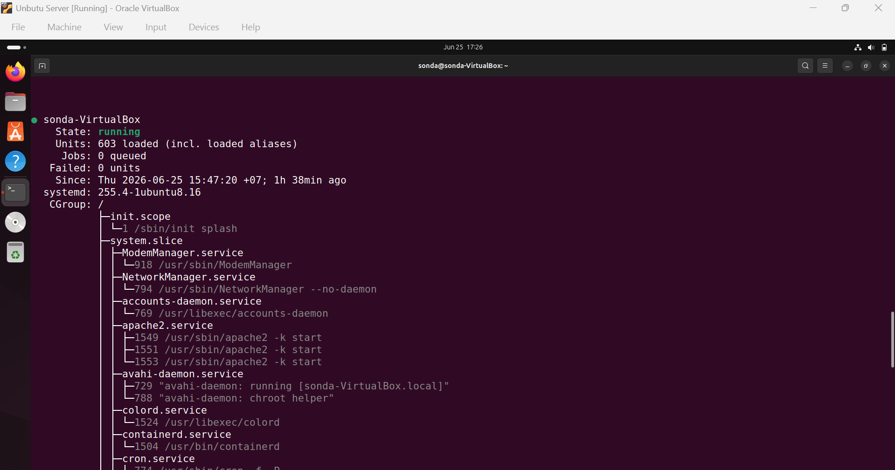

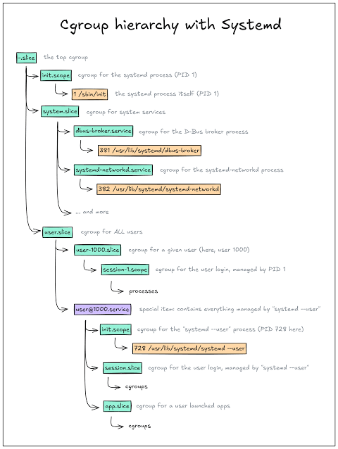

### Command Reference Table

| Command / Flags | Description | Notes |
|----------------|-------------|-------|
| `systemctl status` | Running the base command without specifying a unit prints the entire host system's real-time process tree structured by its active nested cgroups. | Use the arrow keys to scroll through long lists; press `q` to exit. |
| `systemd-cgtop` | Displays a real-time, top-like view of active cgroups sorted by resource consumption (Tasks, CPU%, Memory, Input/Output). | Press `q` to exit the live monitoring screen. |
| `systemd-cgtop --depth=5` | Adjusts the tracking depth parameter to print deeply nested subsystems. | By default, `systemd-cgtop` only lists the first 3 levels of cgroups. Adjusting `--depth` reveals isolated sub-components (e.g., individual terminal TTY sessions). |

## Cgroup example: Limit Firefox to 100MB RAM

### Configuration Paths

- System-wide Slices (Root): `/etc/systemd/system/`

- User-level Slices (Non-root): `~/.config/systemd/user/`
  - By defining a slice at the user level, you can manage application sandboxing entirely within your home environment.

### Step-by-Step Configuration Guide

#### Step 1: Create the Nested User Directories

- If the systemd user directory structure does not yet exist in your home directory, create it using the `-p` (parents) flag:

```bash
mkdir -p ~/.config/systemd/user
```

#### Step 2: Define the Slice Unit File

- Create a new slice file named browser.slice using a text editor:

```bash
nano ~/.config/systemd/user/browser.slice
```

```ini
[Slice]
MemoryHigh=100M
```

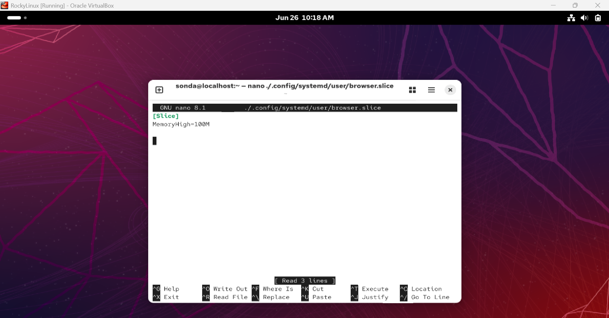

#### Step 3: Reload the User Daemon

- Whenever you create or modify a user unit file, you must force systemd to parse the new configurations:

```bash
systemctl --user daemon-reload
```

#### Step 4: Launching Applications within a Slice

- To execute a process inside a designated slice, use the `systemd-run` command paired with the `--user` flag:

```bash
# find the the Firefox executable path
which firefox

# /usr/bin/firefox

# launch Firefox
systemd-run --user --slice=browser.slice /usr/bin/firefox
```

#### Step 5: Troubleshooting Package Wrappers: Native vs. Snap

- Running a command like `systemd-run --user --slice=browser.slice /usr/bin/firefox` will fail to restrict resource footprints on Ubuntu

- Why it Fails with Snap
  - In this case Firefox is installed through snap
  - `usr/bin/firefox` under Snap is not a binary program (is not a Firefox executable). It is an intermediate shell script launcher that redirects to a symlink at `/snap/bin/firefox`
  - `/snap/bin/firefox` is a symbolic link to `/usr/bin/snap`. When we call `/snap/bin/firefox` in the background, it will call `/usr/bin/snap`. `/usr/bin/snap` is the actual file that is being executed 
  
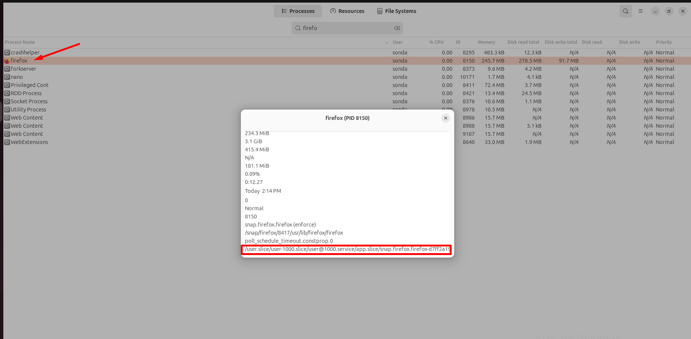

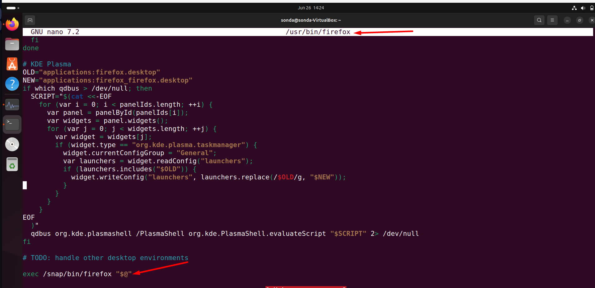

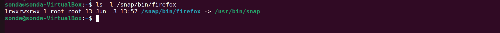

#### How to Find and Target the Real Binary

- Find the actual runtime binary location while Firefox is open

```bash
ps -ef | grep firefox

# /snap/firefox/current/usr/lib/firefox/firefox
```

- Execute the direct path within the slice

```bash
systemd-run --user --slice=browser.slice /snap/firefox/current/usr/lib/firefox/firefox
```

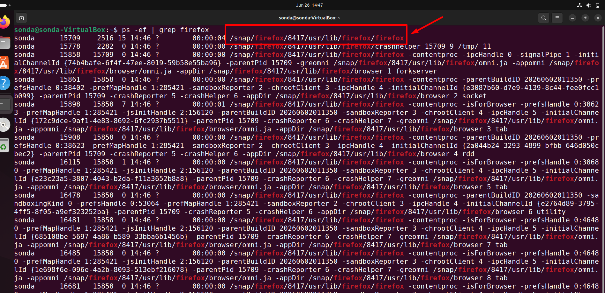

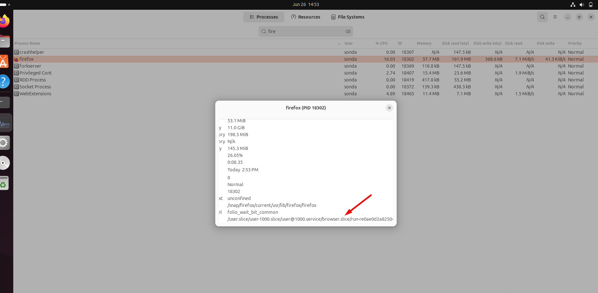

# Mounts and Volumes

## Storage device

### What is a Storage Device?

- Storage Device is a hardware component that is used to store, retrieve, and manage digital data.
- It allows a computer or other electronic device to save information permanently or temporarily so that it can be accessed when needed

### What is it used for?

- Store the operating system (e.g., Windows, Linux)
- Save applications and software
- Keep user files, such as documents, images, videos, and music
- Store databases and business data
- Back up important information to prevent data loss
- Transfer files between computers and other devices

### Common Types of Storage Devices

| Storage Device                     | Description                                             | Typical Use                                 |
| ---------------------------------- | ------------------------------------------------------- | ------------------------------------------- |
| **Hard Disk Drive (HDD)**          | Magnetic storage with large capacity and lower cost     | General data storage                        |
| **Solid-State Drive (SSD)**        | Flash-based storage with high speed and no moving parts | Operating systems, applications, gaming     |
| **USB Flash Drive**                | Portable flash storage                                  | File transfer and backups                   |
| **Memory Card (SD/microSD)**       | Small removable storage                                 | Cameras, smartphones, Raspberry Pi          |
| **Optical Disc (CD/DVD/Blu-ray)**  | Laser-readable storage media                            | Software distribution, media, archives      |
| **External Hard Drive / SSD**      | Portable external storage device                        | Backup and additional storage               |
| **Network Attached Storage (NAS)** | Storage connected to a network                          | Shared files, backups, media servers        |
| **Cloud Storage**                  | Data stored on remote servers over the Internet         | File synchronization, backup, collaboration |

## Storage Size Units (KB vs KiB, MB vs MiB, GB vs GiB)

### Bit and Byte

- The smallest unit of storage is a bit: **1 bit = 0 or 1**
- Eight bits form one byte: **1 Byte (B) = 8 bits**

### Decimal Units (Base 10)

- These units are based on powers of 1000.
- They are easier for humans to understand.
- These are commonly used by:
  - Hard drive manufacturers
  - SSD manufacturers
  - USB manufacturers

| Unit | Name     |                        Bytes |
| ---- | -------- | ---------------------------: |
| KB   | Kilobyte |                      1,000 B |
| MB   | Megabyte |         1,000² = 1,000,000 B |
| GB   | Gigabyte |     1,000³ = 1,000,000,000 B |
| TB   | Terabyte | 1,000⁴ = 1,000,000,000,000 B |

### Binary Units (Base 2)

- Computers naturally work in powers of 2, so binary units use 1024.
- These units are commonly used by:
  - Linux
  - Memory (RAM)
  - Operating systems
  - Some disk utilities

| Unit | Name     |                        Bytes |
| ---- | -------- | ---------------------------: |
| KiB  | Kibibyte |                      1,024 B |
| MiB  | Mebibyte |         1,024² = 1,048,576 B |
| GiB  | Gibibyte |     1,024³ = 1,073,741,824 B |
| TiB  | Tebibyte | 1,024⁴ = 1,099,511,627,776 B |

### Difference Between Decimal and Binary Units

| Decimal | Binary | Difference |
| ------- | ------ | ---------: |
| KB      | KiB    |      ~2.4% |
| MB      | MiB    |      ~4.9% |
| GB      | GiB    |      ~7.4% |
| TB      | TiB    |       ~10% |

#### Example

- Suppose a manufacturer sells: **500 GB**
  - They mean: **500 × 1,000³ bytes**
- Your operating system may display: **≈465 GiB**
- Nothing is missing. The operating system is simply using GiB, while the manufacturer advertises GB.

### Historical Confusion

- Historically, many operating systems did not distinguish between **GB** and **GiB**.
- They often displayed **1 GB** when they actually meant **1 GiB**. This made storage sizes confusing
- Examples:
  - Older versions of macOS (before Snow Leopard)
  - Windows (for drives and some storage displays)
  - RAM specifications
  - CPU cache
  - Some applications

- Depending on the context, "GB" may actually mean GiB.

| Command  | Default Unit                | `--si` Option                                               | Notes                                                 |
| -------- | --------------------------- | ----------------------------------------------------------- | ----------------------------------------------------- |
| `du` or `du -h`     | **KiB (1,024 B)**           | `du --si` → **kB (1,000 B)**                                | Calculates disk usage using 1 KiB blocks by default.  |
| `df` or `df -h`    | **KiB (1,024 B)**           | `df --si` → **kB (1,000 B)**                                | Displays filesystem space in 1 KiB blocks by default. |
| `ls -l`  | Bytes                       | N/A                                                         | Displays the exact file size in bytes.                |
| `ls -lh` | Human-readable (1024-based) | `ls -l --si` or `ls -lh --si` → **kB, MB, GB (1000-based)** | Human-readable output uses binary units by default.   |
| `free` or `free -h`   | **KiB**                     | `free --si` → **kB, MB, GB (1,000-based)**                  | Displays memory usage in KiB by default.              |
| `stat`   | Bytes                       | N/A                                                         | Displays the exact file size in bytes.                |


## How data is stored

- A storage device contains a large sequence of bits stored in consecutive order.
- Before an operating system can use the disk efficiently, it must define how the disk is organized.
- This is done using a **partition table**

## Partition Table

- A partition table divides a physical storage device into multiple logical sections called partitions.
- Each partition acts like an independent storage area.
- Example: A computer running both Windows and Linux (dual boot)
  - Partition 1 → Windows
  - Partition 2 → Linux
- Each operating system stores its own files inside its own partition. Even if a disk contains only one partition, it still requires a partition table.

### Viewing Partitions with GParted

- Installation GParted

```bash
# Ubuntu
sudo apt install gparted

# CentOS
sudo yum install gparted
```

#### Ubuntu Partition Layout

```
/dev/sda
├── /dev/sda1 - The boot partition contains files needed during system startup, including parts of 
| the bootloader 
│   
└── /dev/sda2 - The second partition stores the Linux operating system.
```

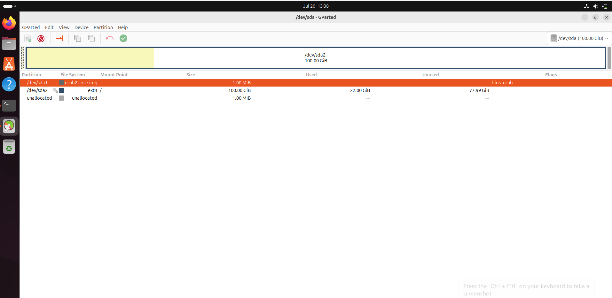


## Partitioning Schemes

### What are Partitioning Schemes?

- A partitioning scheme is a method or standard used to organize and divide a storage device into one or more logical partitions. 
- It defines how partition information is stored and how the operating system locates and manages partitions on a disk

### What is partitioning scheme used for?

- Divide a storage device into multiple logical partitions
- Organize data and operating systems efficiently
- Enable the operating system to locate and access partitions
- Support booting an operating system
- Improve compatibility with different hardware and firmware (BIOS or UEFI)
- Manage disk space more effectively

### Common Partitioning Schemes

- **MBR (Master Boot Record)** 
  - Supports disks up to 2 TB and a maximum of four primary partitions. Commonly used with BIOS systems.
- **GPT (GUID Partition Table)**
  - Supports very large disks and up to 128 partitions. Designed for modern UEFI-based systems.

## Filesystems


# Introducing the Linux shell

## What is a shell?

- Linux has its roots in the Unix operating system, and one of its main strengths is the **command-line interface**. In the old days, this was called the **shell**
- The shell is a program that has two streams: an input stream and an output stream. The input is a
  command given by the user, and the output is the result of that command, or an interpretation of it.
- In other words, the shell is the primary interface between the user and the machine
- The main shell in major Linux distributions is called **Bash**, which is an acronym for Bourne Again
  Shell, named after Steve Bourne, the original creator of the shell in UNIX
- Alongside Bash, there are other shells available in Linux, such as **ksh**, **tcsh**, and **zsh**

- One shell can be assigned to each user. Users on the same system can use different shells. One way
  to check the default shell is by accessing the command

```bash
cat /etc/passwd | grep <<user>>

# <<user>> is user account in linux system
```

- An easier way to see the current shell is by running the following command

```bash
echo $0
```

## Identifying Commands

### Shell command types - `type`

- **Internal commands** are built inside the shell
- **External commands** are installed separately
- For example, you can check what type of command `cd` (change directory) is

```bash
type cd
# cd is a shell builtin
```

### Display an Executable’s Location - `which`

- To determine the exact location of a given executable, the which command is used

```bash
which ls

# /bin/ls
```

## Explaining the command structure

- In a nutshell, Unix and Linux commands have the following form:
  - The command’s name
  - The command’s options
  - The command’s arguments

```bash
command [-option(s)] [argument(s)]
```

## Consulting the manual

- Almost all commands in Linux have a `--help` option. You can use this for quick reference.

```bash
 <<commnad_name>> --help

# commnad_name is name of command
```

- The `man` command is the standard way to read comprehensive, built-in manuals for almost any program. Syntax `man [command]`

## Wildcards (File name expansion - Globbing)

- Globbing is the process where Bash rewrites or expands a command before it is executed. It uses wildcard characters to search for files that match a specific pattern.
  - The Power of Bash: Instead of moving 100 files manually, a single command with a wildcard can handle them all instantly.

  - Pre-execution: The shell expands the pattern into a list of filenames before the actual command (like mv or cp) ever sees it

- Important Distinctions
  - Not Regular Expressions: While they look similar, Globbing and Regular Expressions (Regex) use different syntax and rules. They are not the same thing.
  - Command Agnostic: Globbing is a feature of the shell, not the specific command. You can use it with `ls`, `mv`, `cp`, `echo`, and more.

### The Asterisk (`*`) Wildcard

- The most common wildcard is the asterisk, which matches **zero or more characters**

- Example: `mv *.jpeg images/`
  - Bash finds every file ending in `.jpeg` and replaces the `*.jpeg` part with the actual list of filenames.

- Versatility: It can be used anywhere in a string. For example, `echo *` will expand to every non-hidden file and folder in the current directory.

- Key Rules and Behaviors
  - Hidden Files: By default, the `*` wildcard does not match hidden files (those starting with a dot).
  - Failed Matches: `*` In Bash: If no files match the pattern, Bash treats the pattern as a literal string (e.g., it looks for a file actually named `*.jpeg`)
  - Quoting: To disable globbing, wrap the pattern in quotes (e.g., `'*.jpeg'`). This is useful if you actually have a file with a `*` in its name and don't want the shell to expand it.

### The Single Character Wildcard (?)

- Unlike the asterisk (which matches any number of characters), the question mark matches exactly one character.

- Use Case: If you have files like `IMG_1.jpg` and `IMG_A.jpg`, using `IMG_?.jpg` will find both.

- Example from lecture: `IMG_?6677.*` matches files where only one character varies between the prefix and the numbers.

### Square Brackets ([]) and Ranges

- Square brackets allow you to define a set or a range of characters for a single position in the filename.

- Numeric Ranges: `[0-9]` matches any single digit.

- Alphabetic Ranges: `[a-z]` matches any single lowercase letter.

- Manual Sets: `[abc]` matches exactly one character, but only if it is an 'a', 'b', or 'c'.

- Important Note: In standard globbing, if you want to match three digits, you must repeat the brackets three times (e.g., `[0-9][0-9][0-9]`). There is no "repeat" multiplier in basic globbing.

### The Globstar (`**`)

- The double asterisk is a powerful feature for recursive searching. It matches zero or more directories (including the slashes `/`) to find files in nested subfolders.

- Syntax: `**/*.jpg` searches the current folder and all subfolders for JPEG files.

- Requirements: `*` Supported in Bash 4.0 or higher.

- Often needs to be enabled manually with the command: `shopt -s globstar`.

- Pro Tip: The instructor recommends using the `**` followed by a slash to ensure you are looking into folders rather than just matching a folder name itself.

### Wildcards

| Wildcard        | Meaning                                                   | Example                               |
| :-------------- | :-------------------------------------------------------- | :------------------------------------ |
| `*`             | Matches **any** number of characters (including zero)     | `ls *.py` (All Python files)          |
| `?`             | Matches any **single** character                          | `ls file?.txt` (file1.txt, fileA.txt) |
| `[characters]`  | Matches any character that is a **member of the set**     | `ls [abc].txt` (file a, b, or c)      |
| `[!characters]` | Matches any character that is **NOT** a member of the set | `ls [!0-9].txt` (Non-numeric start)   |
| `[[:class:]]`   | Matches any character in a **predefined class**           | `ls [[:upper:]]*` (Uppercase files)   |

### Commonly Used Character Classes

- You need to remember that `[:upper:]` must be enclosed in another pair of square brackets `[]` to become a conditional expression.

| Character Class | Meaning                     | Matches                             |
| :-------------- | :-------------------------- | :---------------------------------- |
| `[[:alnum:]]`   | **Alphanumeric** characters | Any letter or digit (a-z, A-Z, 0-9) |
| `[[:alpha:]]`   | **Alphabetic** characters   | Any letter (a-z, A-Z)               |
| `[[:digit:]]`   | **Numerals**                | Any digit (0-9)                     |
| `[[:lower:]]`   | **Lowercase** letters       | Any small letter (a-z)              |
| `[[:upper:]]`   | **Uppercase** letters       | Any capital letter (A-Z)            |

- Example

```bash
# Find all files that start with a capital letter:
# Tìm tất cả các file bắt đầu bằng chữ cái viết hoa:
ls [[:upper:]]*

# Find files whose names end with at least one digit:
# Tìm các file có tên kết thúc bằng ít nhất một chữ số:
ls *[[:digit:]]

# Delete files whose names consist only of letters and numbers.
# Xóa các file có tên chỉ gồm các ký tự chữ và số
rm [[:alnum:]]*
```

### Pattern Examples

| Pattern                  | Matches                                                | Meaning                                                                 |
| :----------------------- | :----------------------------------------------------- | :---------------------------------------------------------------------- |
| `*`                      | All files                                              | Khớp với tất cả các file trong thư mục hiện tại.                        |
| `g*`                     | Any file beginning with **g**                          | Các file bắt đầu bằng chữ `g` (vd: `gmail`, `get_data.py`).             |
| `b*.txt`                 | Any file beginning with **b** and ending with **.txt** | File bắt đầu bằng `b`, sau đó là gì cũng được, kết thúc là `.txt`.      |
| `Data???`                | **Data** followed by exactly **3 characters**          | Khớp với `Data123`, `DataOld`, nhưng không khớp với `DataNewer`.        |
| `[abc]*`                 | Beginning with **a, b, or c**                          | Các file bắt đầu bằng một trong ba chữ cái `a`, `b`, hoặc `c`.          |
| `BACKUP.[0-9][0-9][0-9]` | **BACKUP.** followed by **3 numerals**                 | Khớp với các file backup có số thứ tự (vd: `BACKUP.001`, `BACKUP.999`). |
| `[[:upper:]]*`           | Beginning with an **uppercase letter**                 | Tất cả các file bắt đầu bằng chữ cái viết hoa.                          |
| `[![:digit:]]*`          | **Not** beginning with a **numeral**                   | Tất cả các file không bắt đầu bằng con số.                              |
| `*[[:lower:]123]`        | Ending with **lowercase** or **1, 2, 3**               | File kết thúc bằng một chữ cái thường hoặc một trong các số 1, 2, 3.    |

## Pitfalls of Globbing

### The Problem: File Names as Commands

- When you use a wildcard like `*`, Bash expands it into a list of every file in the directory before the command is executed. If a file in that directory happens to be named `-rf`, Bash will treat that filename as a command flag rather than a target file.
  - The Scenario: You have a file literally named `-rf`.

  - The Command: You run `rm *`.

  - The Result: Bash expands `*` to include `-rf`. The command effectively becomes `rm -rf [other files]`.

  - The Danger: This triggers a recursive, forced deletion. It will delete directories and subdirectories without asking for permission, potentially leading to permanent data loss.

- The Solution: Using `./*`
  - To prevent Bash from misinterpreting filenames as parameters, the lecture suggests a simple "best practice" adjustment to your syntax:
  - Instead of using `rm *`, use `rm ./*`
  - Why this works:
    - Explicit Pathing: By adding `./`, you are explicitly telling the shell that the expansion refers to a path in the current directory.
    - Neutralizing Flags: A file expanded as `./-rf` is seen by the system as a file path. Because it starts with a dot rather than a dash, the rm command will not interpret it as the "recursive/force" flag. It will simply try (and likely fail) to delete a file by name, leaving your directories safe.

## Standard streams: stdin, stdout, stderr

- The Three Standard Streams

| Stream Name     | File Descriptor | Purpose                                                             |
| --------------- | --------------- | ------------------------------------------------------------------- |
| Standard Input  | stdin (0)       | Data flowing into the program (usually from your keyboard).         |
| Standard Output | stdout (1)      | Normal data flowing out of the program (success messages, results). |
| Standard Error  | stderr (2)      | Error messages flowing out of the program (failure alerts).         |

### Redirecting Standard Output

- In Bash, you can redirect the output of a command away from the terminal and into a file using specific operators:

- The Overwrite Operator (`>`):
  - Usage: `command > file.txt`
  - Behavior: It takes the output of the command and writes it to the specified file. If the file doesn't exist, it creates it. If it does exist, it wipes the previous content and replaces it with the new output.

- The Append Operator (`>>`):
  - Usage: `command >> file.txt`

  - Behavior: Instead of overwriting, this adds the new output to the end of the existing file. This is ideal for logs or building a history of command results.

- You noticed a curious behavior: when a command fails (like trying to get the size of a non-existent file), the error message still prints to the screen instead of going into your file. Why this happens:
  - Bash uses different "channels" (file descriptors) for different types of output:
    - **Standard Output** (stdout): This is for successful program data. It is represented by the number 1.
    - **Standard Error** (stderr): This is specifically for error messages. It is represented by the number 2.
  - When you use `>` or `>>`, you are—by default—only redirecting stdout (1). The error messages on stderr (2) remain linked to your terminal screen.

### Why Redirection Sometimes "Fails"

- When you use the `>` or `>>` operators without a number, Bash assumes you are talking about **Stream 1 (stdout)**.Example `du -h output.txt`
  - The Success Case: When `du -h` finds your file, it sends the size to **Stream 1**. Your redirection captures it and puts it in the file.

  - The Error Case: When `du` can't find a file, it sends the "No such file" message to **Stream 2** (stderr).

  - The Result: Because your redirection was only listening to **Stream 1**, **Stream 2** remains "unplugged" and defaults to its original destination: your screen.

## Redirect Standard Error

### Why Redirect Standard Error?

- There are two primary reasons to redirect stderr:
  - To Silence Noise: If a program produces irrelevant error messages, you can redirect them to a "null" location so they don't clutter your terminal or interfere with scripts.

  - To Log for Later: If you run a high-output program (like a daily automated task), you might want to discard the successful output but save the errors into a file to review them later.

### Redirection Syntax

- Redirecting stdout (Stream 1):
  - Short version: `command > file.txt`

  - Verbose version: `command 1> file.txt`

- Redirecting stderr (Stream 2):
  - Captures errors only: `command 2> error.txt`

  - Appends errors to the file instead of overwriting `command 2>> error.txt`

- Combined Redirection:
  - Sends successes to one file and errors to another: `command > output.txt 2> error.txt`

  - Verbose version: `command 1> output.txt 2> error.txt`

## Redirect stderr to stdout

### Why Redirect stderr to stdout?

- Unified Logging: It allows you to store both normal program output and error messages in a single file without having to list the filename multiple times in your command.

- Piping: Standard Linux pipes (`|`) only pass **stdout** to the next command. If you want to filter or process error messages using a tool like grep, you must first redirect **stderr** into the **stdout** stream.

### The Syntax

```bash
command > out.txt 2>&1
```

- `> out.txt`: Redirects stdout to the file.

- `2>&1`: Redirects stderr to the same destination as stdout.

### Redirection is Sequential

- When you run a command, the shell doesn't look at all the redirections as one single instruction. Instead, it processes them **step-by-step** from left to right before the command even starts

#### Case 1: The Successful Redirect (`> file 2>&1`)

- In this scenario, the shell follows these steps:

- `> out.txt`: The shell sees this first. it points stdout (1) to the file **out.txt**.

- `2>&1`: Next, the shell sees this. It says "make stderr (2) point to wherever stdout (1) is pointing right now." Since stdout is already pointing to the file, stderr follows it there.

- Result: Both streams end up in the file

#### Case 2: The Failed Redirect (`2>&1 > out.txt`)

- When you swap the order, the logic breaks because of the timing:

- `2>&1`: The shell sees this first. At this exact moment, stdout (1) is still pointing to the terminal. So, the shell points stderr (2) to the terminal.

- `> out.txt`: Now the shell sees this. It moves stdout (1) to the file.

- The Conflict: You moved stdout, but you didn't move stderr! Stderr is still "stuck" pointing to the terminal because that's where stdout was when the mapping was made.

- Result: Errors hit your screen, while normal output goes to the file.

#### Summary

| Command               | Result  | Why                                                                |
| --------------------- | ------- | ------------------------------------------------------------------ |
| `command > file 2>&1` | Success | `1` (stdout) is redirected to file first; `2` (stderr) follows it. |
| `command 2>&1 > file` | Partial | `2` goes to terminal (old stdout); then `1` is redirected to file. |

## Disposing of Unwanted Output

- Sometimes “silence is golden” and we don’t want output from a command; we just want to throw it away. This applies particularly to error and status messages. The system provides a way to do this by redirecting output to a special file called `/dev/null`. This file is a system device often referred to as a bit bucket, which accepts input and does nothing with it. To suppress error messages from a command, we do this

```bash
ls -l /bin/usr 2> /dev/null

# Don't print error messages (stderr 2) to the terminal
```

## What about stdin

- By default, **stdin** is connected to your keyboard. When you run a command like `wc -l` (word count) or `cat` without specifying a file, the program doesn't finish; it waits for you to type.
  - Interactive Input: You type your data directly into the terminal.

  - Ending Input: To tell the program you are finished typing, you use **Ctrl + D**. This sends an "End of File" (EOF) signal, prompting the program to process what you wrote and exit.

## The Stdin Redirector (`<`)

- Just as we use `>` to push output into a file, we use `<` to pull data from a file and "pour" it into a command's input stream.

- Syntax: `command < file.txt`

- How it works: The shell opens the file and feeds its content into the command as if you were typing it manually.

## Chaining Concepts

- The true power of **stdin** is revealed when you combine it with **stdout** redirection. You can create a "pipeline" of data flow:

- Example: `cat < input.txt > output.txt`
  - The shell reads **input.txt**.

  - It feeds that text into `cat` via **stdin**.

  - cat outputs that text to **stdout**.

  - The shell redirects that **stdout** into **output.txt.**

## Pipes - Data processing through command chaining

### What is a Pipe?

- A pipe takes the **stdout** (Standard Output) of the command on its left and feeds it into the **stdin** (Standard Input) of the command on its right.

- Syntax: `command1 | command2 | command3`

- Visual: Think of it as a literal pipe where data flows from one "tank" (program) to the next

### Practical Examples:

- Counting Files `ls | wc -l`
  - `ls` lists the files.

  - The pipe (`|`) sends that list to `wc -l`.

  - `wc -l` counts the lines, effectively telling you how many files are in the folder.

- Filtering Errors `du file1 file2 2>&1 >/dev/null | wc -l`
  - You can redirect stderr to stdout (`2>&1`), then redirect the "original" stdout to `/dev/null`.
  - By piping the result to `wc -l`, you can count exactly how many errors occurred without seeing the successful output.

## Environment variables

### The Nature of Environment Variables

- OS-Level Feature: Environment variables exist at the operating system level, allowing them to work seamlessly across different programs and programming languages (Python, PHP, etc.).
- Process Inheritance: When a program is launched, the OS creates a copy of the current environment variables for that new process. Changes made within the program (e.g., in a Python script) do not affect the parent shell

```bash
# In bash shell

export CITY='SONDA VO DOI'
```

```bash
# In python code
import os

print(os.environ['CITY'])
# SONDA VO DOI

os.environ['CITY'] = '123'
print(os.environ['CITY'])
# 123
```

```bash
# in bash shell

echo "${CITY}"
# SONDA VO DOI'
```

- Temporary Variables: You can set a variable for a single command execution by prefixing the command with the variable assignment: `LOG_LEVEL=debug python3 app.py`. This changes the variable only for that specific run, leaving the shell environment untouched.

### Definition and Conventions

- **Purpose**: Environment variables store configuration settings that influence the behavior of the shell and the programs running within it.

- **Source**: Unlike "Bash variables" (which are local to the shell), environment variables are provided by the operating system.

- **Naming**: By convention, they are written in UPPERCASE to distinguish them from standard Bash variables.

### Viewing Variables

- To list all currently active environment variables, use the `env` or `printenv` command.

```bash
env

# SHELL=/bin/bash
# WSL_DISTRO_NAME=Ubuntu
# WT_SESSION=b4eaa57e-17d7-48a1-a4a8-9d38e174a2db
# NAME=DESKTOP-SMAT1GE
# PWD=/mnt/d/udemy/Mastering Linux The Comprehensive Guide
# LOGNAME=sonda
# HOME=/home/sonda
# LANG=C.UTF-8
```

- The `set` command will show both the shell and environment variables. The `set` builtin in bash

```bash
set
```

### Accessing Variables

- The most reliable syntax is: `echo "${VARIABLE_NAME}"`

- The Dollar Sign `$`: Tells Bash you are accessing a variable rather than printing literal text.

- Curly Braces `{ }`: These explicitly define where the variable name starts and ends. This prevents Bash from getting confused if you add text immediately after the variable (e.g., `${PATH}text` works, whereas `$PATHtext` would make Bash look for a non-existent variable named `PATHtext`).

- Double Quotes `" "`: These prevent "Shell Expansion." Without quotes, if a variable contains special characters (like `*`), Bash might try to rewrite or execute those characters before displaying the value. Quotes ensure you see the actual, raw value.

### `SHELL` variable

- `SHELL` stores the path to your default login shell—the one your operating system starts by default when you open a new terminal session

```bash
echo "${SHELL}"
# /bin/bash
```

- How to Change the Default Shell
  - Check Valid Shells: View the `cat /etc/shells` file to see the list of approved paths for shells on your system
  - Execute Change: Use the command `chsh -s /path/to/shell`
  - Apply Changes: You may need to restart your terminal or log out and back in for the change to take effect.

```bash
# Check Valid Shells
cat /etc/shells

# /etc/shells: valid login shells
# /bin/sh
# /usr/bin/sh
# /bin/bash
# /usr/bin/bash
# /bin/rbash
# /usr/bin/rbash
# /usr/bin/dash
# /usr/bin/tmux

# Execute Change
chsh -s /bin/bash
```

### `HOME` The Home Directory

- Purpose: Stores the absolute path to the current user's home directory.
- You can use `cd "${HOME}"` to jump user's home directory

#### Why Relying on $HOME is Often Safer

- While `~` is great for quick typing in a terminal, using the explicit variable `$HOME` is generally preferred in scripts and automation for three main reasons:

- Quotes Break the Tilde
  - The shell is very strict about where a tilde sits. If you wrap it in double quotes, it loses its power.
  - `ls "~/Desktop"` → Fails. The shell looks for a literal folder named `~`.
  - `ls "$HOME/Desktop"` → Succeeds. The variable expands inside the quotes.
- Pro-tip: Always quote your paths to handle spaces in folder names. Since you should be quoting anyway, `$HOME` is the natural choice.

### `PWD` & `OLDPWD` (The Path Tracking)

- `PWD` (Print Working Directory): Stores the path of your current directory.

- Note: While the command `pwd` and the variable `PWD` yield the same information, the command is a program that prints the data, while the variable is the data itself.

- `OLDPWD`: Stores the path of the previous directory you were in before your last cd command.

```bash
echo "${PWD}" - "${OLDPWD}"
```

- You can use `cd "${OLDPWD}"` to jump back to your previous location

### `USER` The Unix Username

- Purpose: Stores the current user's technical Unix username.
- Important Distinction: This variable refers to the Unix username (usually lowercase, no spaces), not the User Label (the "friendly" display name seen in OS settings)

```bash
echo "${USER}"
```

### `PS1` variable

- The `PS1` (Prompt String 1) variable defines the primary prompt displayed in your terminal before every command you type. While you can set it to a simple string, its real power lies in its escape sequences.


- Common Placeholders

| Sequence    | Description                                                                          |
| ----------- | ------------------------------------------------------------------------------------ |
| `\u`        | The username of the current user                                                     |
| `\h` / `\H` | The hostname (`\h` for short lowercase name, `\H` for full domain name)              |
| `\w` / `\W` | The current working directory (`\w` for full path, `\W` for just the current folder) |
| `\t` / `\@` | The time (`\t` for 24-hour HH:MM:SS, `\@` for 12-hour AM/PM format)                  |
| `\$`        | Displays `$` for normal users and `#` for the root user                              |

- Setting a Standard Prompt: `PS1="\u@\h:\w\$ "`
  - This gives you the "Who, Where, and What" of your current session at a single glance, saving you from running commands like `whoami` or `pwd` constantly

### Creating and Deleting Environment Variables

- Persistence: Changes made directly in the terminal are temporary and disappear when the session ends. Permanent changes require editing shell configuration files (like `.bashrc` or `.zshrc`)

#### Creating Variables - `export`

- To create a new environment variable, use the export command followed by the name and value.

- Syntax: `export VARIABLE_NAME='value'`

- Best Practice: Always use UPPERCASE for environment variables (e.g., CITY instead of city) to follow standard Unix conventions and avoid confusion.

- Quoting : Use single quotes `'` around the value to prevent Bash from performing "shell expansions" or misinterpreting special characters before the value is saved.

```bash
export CITY='new york'
```

- Crucial Note on Whitespace: In Bash, you cannot have spaces around the equals sign.
  - `export CITY='Paris'` is correct.
  - `export CITY = 'Paris`' will fail because Bash treats the first word as a command and the rest as arguments.

#### Modifying Variables

- Once a variable has been exported, you can overwrite its value without using the `export` command again.
- Syntax: `VARIABLE_NAME='New Value'`
- Crucial Note on Whitespace: In Bash, you cannot have spaces around the equals sign.
  - `CITY='Paris'` is correct.
  - `CITY = 'Paris'` will fail because Bash treats the first word as a command and the rest as arguments.

#### Deleting Variables - `unset`

- If you need to remove a variable from your environment (for cleanup or troubleshooting), use the `unset` command.

- Syntax: `unset VARIABLE_NAME`

- This effectively deletes the variable so it no longer appears when you run the `env` command.

### `PATH` environment variable

#### What is the `PATH` Variable?

- The `PATH` variable is a colon-separated list of directories that the shell searches through whenever you type a command. It is the mechanism that allows you to run programs (like `cat`, `ls`, or `grep`) from any location in the terminal without typing their full file path.

#### How It Works

- Sequential Search: When you execute a command, the shell searches the directories listed in `PATH` from left to right.

- The First Match Wins: The shell stops searching as soon as it finds an executable file with the matching name.

- Manual vs. Automatic:
  - Automatic: Typing `cat test.txt` relies on the shell finding `cat` within the `PATH` (e.g., in `/usr/bin/`).
  - Manual: You can bypass the PATH entirely by providing the absolute path to the executable (e.g., `/bin/cat test.txt`).

#### Modiffy `PATH` variable

- Why Modify the PATH? The `PATH` variable tells the shell which directories to search for executable files. We modify it to:
  - Simplify execution: Run custom scripts or downloaded binaries from any location without typing the full file path.
  - Organize software: Keep self-installed tools (like those from Homebrew on macOS or Anaconda for Python) in centralized, non-system directories.
  - Manage versions: Ensure the correct version of a program (e.g., a specific Python environment) is prioritized over the system default.
  - Persistence: Changes made directly in the terminal are temporary and disappear when the session ends. Permanent changes require editing shell configuration files (like `.bashrc` or `.zshrc`)
- Syntax: `PATH="${PATH}:<new_path>"`
  - Order Matters: Generally, keep system directories at the beginning and user-specific directories at the end, unless you specifically intend to override a system tool.
  - Efficiency: Avoid unnecessary duplication and keep the list of directories lean to maintain search performance.
  - Caution: Be careful when modifying PATH, as incorrect settings can prevent the system from finding essential commands, leading to "command not found" errors.
- Verification: You can use the `which` command (e.g., `which cat`) to see exactly which directory a specific program is being run from.

### Creating custom executable file

- Modify `PATH` variable

```bash
PATH="${PATH}:$(pwd)
```

- Creating an executable, it is best practice to omit the extension (e.g `.py` extension)

```bash
# This allows you to run it as a natural command (just hello_world)
# rather than a script (hello_world.py)
touch hello_world
```

- Inside the hello_world

```bash
#!/usr/bin/env python3

print('Hello the python world')
```

- Execution

```
hello_world

# Hello the python world
```

#### The Shebang - `#!`

- Since the shell doesn't know by default that a text file contains Python code, you must include a Shebang as the very first line of the file
- Syntax: `#!<path_to_interpreter> [parameter]`
  - Python script `#!/usr/bin/python3` or the better way `#!/usr/bin/env python3`
- How it works: This line tells the operating system to use the `env` utility to find the `python3` interpreter and use it to execute the rest of the file.
- Why use `env`? Using `/usr/bin/env python3` is more flexible than hardcoding a path like `/usr/bin/python3`, as it finds the version of Python currently active in your environment (important for tools like Anaconda or virtual environments).

### Storing custom shell configurations

- The Four Shell Modes
  - Interactive Login Shell
  - Interactive Non-Login Shell
  - Non-Interactive Non-Login Shell
  - Non-Interactive Login Shell

#### Interactive Login Shell

- What it is: When you log in directly (e.g., via SSH or a TTY terminal using Ctrl+Alt+F1).

- Behavior: It loads system-wide configs first, then looks for the first available file among `~/.bash_profile`, `~/.bash_login`, or `~/.profile`.


#### Interactive Non-Login Shell:

- What it is: Opening a standard terminal window inside a GUI (like Ubuntu's desktop) or typing bash inside an existing shell.

- Behavior: It primarily loads the `~/.bashrc` file.
- How to custom shell configurations

```bash
nano ~/.bashrc

# Scroll to the bottom of the .bashrc file
# Add your environment variable at the end:
export CITY='SONDA VO DOI'
```

#### Non-Interactive Non-Login Shell

- What it is: When a shell script is executed.

- Behavior: It doesn't load the standard startup files unless a specific environment variable `BASH_ENV` is set.

#### Non-Interactive Login Shell

- What it is: Very rare; used for specific remote command executions.

## Alias

### What is an Alias?

- An alias is a user-defined shortcut for a command. For example, instead of typing a long path or a complex command every time, you can define a short keyword to do the work for you.

- Syntax: `alias name='<command>'`

- Example: `alias gohome='cd ~'` allows you to simply type gohome to return to your home directory.

- Note on Quotes: Using quotes (e.g., `'cd ~'`) prevents Bash from expanding special characters (like the tilde) immediately, ensuring the command is interpreted correctly every time the alias is run.

### Viewing Alias

- To see them, enter the alias command without arguments

```bash
alias
```

### Managing Aliases

- View all aliases: Simply type `alias` to see a list of all shortcuts currently active in your session.

- Remove an alias: Use the command `unalias <name>`.

- Scope: By default, an alias is temporary. It only exists in the current terminal session. If you start a "sub-shell" (typing bash inside your terminal) or restart your computer, the alias will disappear.

### Making Aliases Permanent

- To ensure your shortcuts are available every time you open a terminal, you must add them to your shell's startup file:
  - Open your `~/.bashrc` file by `nano ~/.bashrc`.
  - Add the alias definition line to the bottom of file.
  - Save and exit. The next time you start a shell, the alias will be loaded automatically.

## Configure the Bash shell

### `shopt` vs `set`: Why both?

- The instructor clarifies the distinction between these two mechanisms:
  - `set` command: Used for options inherited from the original **shell** (sh). These are maintained for compatibility across different shell environments.
  - `shopt` command: Used for options that are specific to **Bash**. These features were developed later and are not part of the standard POSIX shell definition.

### `set` Command

- The `set` command uses a somewhat counter-intuitive syntax for toggling features
- Enable a feature: Use a minus sign `set -[letter]`
- Disable a feature: Use a plus sign `set +[letter]`
- More detail: https://www.gnu.org/software/bash/manual/html_node/The-Set-Builtin.html

#### Key Feature: X-Trace

- Syntax: `set -x`
- Purpose: It prints every command the shell executes internally to the terminal before running it.
- Use Case: Debugging complex commands, aliases, and expansions.
- Example:

```bash
set -x
# Running ls might reveal it is actually executing ls --color=auto.
ls
# ls --color=auto

# it shows how the shell translates shorthand like ~/Desktop into the full absolute path (e.g., /home/user/Desktop).
cd ~/Desktop
#  /home/user/Desktop
```

### `shopt` command

- Enable an option: Use `-s` (set) followed by the option name `shopt -s [option]`
- Disable an option: Use `-u` (unset) followed by the option name `shopt -u [option]`

#### Practical Examples

- `autocd` Allows you to change directories by simply typing the folder path without the `cd` command
- `cdspell` Automatically corrects minor spelling errors (typos) in directory names when using the cd command

## Command substitution

- What is Command Substitution?
  - Command substitution tells Bash to: Run a specific command. Capture its output (the text it prints). Place that text exactly where the substitution was written.

- Syntax: Use a dollar sign followed by parentheses: `command "<text> $(command)"`
  - You should almost always wrap your command substitution in double quotes `" "`
  - Without quotes: Bash might try to "help" you by splitting your output into separate words or interpreting special characters, which often ruins the formatting.
  - With quotes: Bash treats the entire output of the substituted command as a single block of text, preserving its structure.

- Example:

```bash
echo -e "Directory Listing:\n$(ls)"
echo "My path is $(pwd)"
echo "Home size: $(du -sh ~)"
echo "There are $(ls | wc -l) files here."
echo 'The size of my house directory is: '"$(du -sh ~)"
echo 'There'"'"'re '"$(ls | wc -l)"' files in the current directory'
```

## Style terminal line use `tput` and `infocmp` command

## Shel expansions

- **Shell Expansion** is a process where **Bash** "rewrites" or parses your command before it is actually executed.

### Filename expansion or Pathname Expansion

- More detail in [Wildcards (File name expansion - Globbing)](#wildcards-file-name-expansion---globbing)

### Tilde expansion - `~`

- The character `~` (tilde) acts as a pointer to your home directory
  - **The Mechanism**: By default, the shell replaces `~` with the value stored in the `HOME` environment variable.
  - **Variable Dependency**: If you change the value of the `HOME` variable (e.g., `HOME='/'`), the `~` character will then expand to that new path instead.
  - Current Working Directory `~+`: Using `~+` expands to the value of $PWD (your current working directory). This is a quick way to reference where you are currently located in the file system.

```bash
echo ~
echo ~+
```

### Variable expansion - `$`

- More detail in [Viewing Variables](#viewing-variables)

| Priority                   | Syntax          | Why use it? (Pros)                                                                                                                            | Risks (Cons)                                                                                                            |
| -------------------------- | --------------- | --------------------------------------------------------------------------------------------------------------------------------------------- | ----------------------------------------------------------------------------------------------------------------------- |
| 1. Highest (Best Practice) | `"${VARIABLE}"` | Maximum Safety. Combines curly braces and double quotes. Prevents Word Splitting, File Expansion (globbing), and ambiguity when joining text. | None (slightly more typing).                                                                                            |
| 2. High                    | `"$VARIABLE"`   | Prevents Word Splitting. Ensures the variable content is treated as a single string even if it contains spaces or special characters.         | Can be ambiguous if you want to append text directly to the variable name (e.g., `"$HOMEpath"`).                        |
| 3. Medium                  | `${VARIABLE}`   | Defines Boundaries. Clearly tells Bash where the variable name ends. Essential for appending text (e.g., `${NAME}ing`).                       | Vulnerable to Word Splitting and Globbing if the variable value contains spaces or `*`.                                 |
| 4. Lowest                  | `$VARIABLE`     | Simple & Quick. Only safe if you are 100% sure the variable contains no spaces and you don't need to join it with other text.                 | High Risk. Can cause scripts to crash or delete the wrong files if the variable contains spaces or wildcard characters. |

### Shell Parameter Expansion

- How to manipulate strings directly during expansion using the `${}` syntax

| Feature        | Syntax                   | Description                                          | Example                                                |
| -------------- | ------------------------ | ---------------------------------------------------- | ------------------------------------------------------ |
| String Length  | `${#VAR}`                | Returns the length of the string (number of bytes).  | `echo "${#HOME}"`                                      |
| Substring      | `${VAR:offset:length}`   | Extracts a portion of the string starting at offset. | `export VAR="hello" → echo "${VAR:1:3}" → "ell"`       |
| Replacement    | `${VAR/search/replace}`  | Replaces the first occurrence of a pattern.          | `export VAR="hello" → echo "${VAR/l/LL}" → "heLLo"`    |
| Global Replace | `${VAR//search/replace}` | Replaces all occurrences of a pattern.               | `export VAR="hello" → echo "${VAR//l/LL}" → "heLLLLo"` |

### Arithmetic Expansion

- The shell allows arithmetic to be performed by expansion. This allows us to use the shell prompt as a calculator
- Syntax: `$((expression))`

| Operator | Description                                         |
| -------- | --------------------------------------------------- |
| +        | Addition                                            |
| -        | Subtraction                                         |
| \*       | Multiplication                                      |
| /        | Division (integer arithmetic, result is an integer) |
| %        | Modulo (remainder)                                  |
| \*\*     | Exponentiation                                      |

```bash
echo $((2 + 2))
# 4

echo $(($((5**2)) * 3))
# 75
```

### Word Splitting

#### What is Word Splitting?

- Word splitting is the process where Bash divides a command line into separate segments or "words."
  - The first word is treated as the command (the program to execute).
  - The subsequent words are treated as individual arguments or parameters passed to that program.

```bash
touch a.txt b.txt
# is split into three words, telling the touch program to create two distinct files
```

- If you have multiple spaces or tabs between words, Bash treats the entire sequence as a single delimiter.

```bash
touch  file1.txt      file2.txt

# still only creates two files, because the extra spaces are collapsed during the splitting process
```

#### The Role of IFS

- The splitting happens based on the Internal Field Separator (IFS) variable. By default, Bash looks for three specific characters to determine where one word ends and the next begins:
  - Space -> Hex: 20
  - Tab -> Hex: 09
  - Newline -> Hex: 0a

```bash
echo "${IFS}" | hexdump

# 0000000 0920 0a0a
# 0000004
```

#### Disabling Splitting with Quotes - `' '`

- To prevent Bash from splitting a string that contains spaces, you must use quoting. This is essential when dealing with file names or data that contain spaces.
- Both single (`'`) and double (`"`) quotes disable word splitting, though they behave differently regarding other expansions (which is a deeper topic for later)

```bash
# Without Quotes

touch a file.txt

# creates two files: a and file.txt.
```

```bash
# With Quotes

touch 'a file.txt'

# creates exactly one file named a file.txt
```

### No Quotes vs Single Quotes `''` vs Double Quotes `""`

- No quotes: All available shell expansions are being applied
- Single quotes - `''`: All expansions are disabled, word splitting is disabled
- Double quotes:
  - Disables most expansions, such as tilde expansion `~`, filename expansion `*`, word splitting,...
  - However certain expansions are still enabled: Variable and Arithmetic expansion and substitution command are still working

- The Three Levels of Quoting

| Quoting Style       | Variable Expansion ($) | File Expansion (\*) | Word Splitting | Use Case                                                                         |
| ------------------- | ---------------------- | ------------------- | -------------- | -------------------------------------------------------------------------------- |
| No Quotes           | Yes                    | Yes                 | Yes            | Use when you want Bash to fully process everything (risky with spaces).          |
| Double Quotes `""`  | Yes                    | No                  | No             | Use to keep variables intact while preventing files from being globbed or split. |
| Single Quotes `' '` | No                     | No                  | No             | Use for "literal" text where you want Bash to ignore everything inside.          |

- To visualize the difference, imagine we have a variable `DIR="/home/user/my docs"` and a file named `report.txt`.

| Command Style                      | Behavior ("The Shield")                                                                  | Resulting Action                                                                                                                                                                                                                                 |
| ---------------------------------- | ---------------------------------------------------------------------------------------- | ------------------------------------------------------------------------------------------------------------------------------------------------------------------------------------------------------------------------------------------------ |
| No Quotes `cat $DIR/*.txt`         | No Shield. Everything is fair game.                                                      | 1. `$DIR` expands to `/home/user/my docs`.<br>2. Word Splitting breaks that into two paths because of the space.<br>3. `*.txt` expands to `report.txt`.<br>**Result:** `cat` tries to find `/home/user/my`, `docs`, and `report.txt` separately. |
| Double Quotes `cat "${DIR}/*.txt"` | Partial Shield. Protects against word splitting and globbing, but allows `$` expansions. | 1. `$DIR` expands to `/home/user/my docs`.<br>2. No Word Splitting happens.<br>3. No Globbing happens; `*.txt` stays literal.<br>**Result:** `cat` looks for one literal file named `/home/user/my docs/*.txt` (and fails).                      |
| Single Quotes `cat '$DIR/*.txt'`   | Full Shield. Everything inside is literal. No exceptions.                                | 1. No expansion, no splitting, no globbing.<br>**Result:** `cat` looks for a file literally named `$DIR/*.txt`.                                                                                                                                  |

### Shell expensions: Be careful!

- The process: Bash follows a strict order
  - First, the command is being expanded
  - Then, word splitting is applied
  - Quotes are being removed
  - Command is being executed

#### The Danger of "Accidental" Commands

- Example 1: Let's say we got a folder and the filename of the first file was echo

```
bash_caution/
├── echo # first file in bash_caution folder
├── f.txt
└── g.txt
```

```bash
ls .
# echo  f.txt  g.txt
*
# f.txt g.txt
```

#### Filenames as Flags (The "Minus" Problem)

- Example 2 : If you want to create a file which is literally named -al

```bash
touch -al

# touch: invalid option -- 'l'
# Try 'touch --help' for more information.

# solution
touch ./-al
```

- Example 3 : If you have a file literally named -al, running `ls *` expands to `ls -al`

```
bash_caution/
├── -al
├── echo
├── f.txt
└── g.txt
```

```bash
# problem
ls *

# -rwxrwxrwx 1 sonda sonda 0 Apr  3 16:28 echo
# -rwxrwxrwx 1 sonda sonda 0 Apr  3 16:29 f.txt
# -rwxrwxrwx 1 sonda sonda 0 Apr  3 16:29 g.txt

# solution

ls ./*

# ./-al  ./echo  ./f.txt  ./g.txt
```

More detail: [The Problem: File Names as Commands](#the-problem-file-names-as-commands)

#### The "Golden Rule" of Variables

- You must always wrap your variables in double quotes: `"$VAR"`.

```
# If a folder name contains a space (e.g a folder)
a folder/
├──
```

```bash
touch $PWD/a.txt

# touch: cannot touch 'Guide/bash_caution/a': No such file or directory
# touch: cannot touch 'folder/file.txt': No such file or directory

# the command above fails because PWD have a white space

echo "${PWD}"
# /mnt/d/udemy/Mastering Linux The Comprehensive Guide/bash_caution/a folder
# Bash will perform word splitting after expanding the variable. This turns one path into two separate arguments, leading to "No such file or directory" errors.

# the solution

touch "$PWD/file.txt"
# With Quotes: "$PWD/file.txt" ensures the entire path is treated as a single word, even if the path contains spaces.
```

#### Best practice

- Try to refer to filenames in the same directory as `./file.txt`
- And, for the quotes: Always use the quoting style that is as restrictive as possible
  - Prefer single quotes: `'hello world'`
  - If this is not possible, use double quotes:
    - `echo "hello ${USER}"`
    - `echo 'hello '"${USER}"`
- Use no quoting only if there's no ambiguity, or you want all expansions to be applied:
  - Example for no ambiguity:
    - `ls -al` (would be annoying: 'ls' '-al')
    - Here we want all expansions: `echo ./*.txt`

### Escaping

#### Handling Whitespace

- The default action of a space in Bash is word splitting (separating arguments). To treat a filename with spaces as a single argument, you have two choices:

- Backslash Escaping: Placing a `\` before the space (e.g., `A\ folder/`).
- Quoting: Wrapping the entire path in double quotes (e.g., `"A folder/"` or `'A folder/'`).

#### Printing Quotes

- If you want to print a literal double quote (`"`), you cannot simply type `echo "`. Bash will think you are starting a "quoting area" and wait for you to close it. Instead, you can:

- Escape it: `echo \"`

- Nest it: Place the double quote inside single quotes: `echo '"'`.
- Nest it: Place the single quote inside double quotes: `echo "'"`.

#### The "Single Quote" Exception

- Escaping is also a feature that "rewrites" `/` expands our command as well
- The single quotes `'` disable all "rewrites" `/` expansions
- Thus, also the backslash is disabled
- Problem

```bash
# this one does not print out a single single quote
echo '\''
```

- Solution

```bash
echo '123'"'"'456'
echo '123'\''456'

# Close the current single-quoted area: '
# Insert the single quote using a backslash: \' (outside of any quotes) or double quotes: "'"
# Re-open a new single-quoted area: '
```

#### The Conflict: Shell vs. Command (Escaped parentheses `()`)

- By default, the Bash shell treats parentheses as a signal to start a Subshell. This means any command inside `()` will run in a separate process environment
- Bash interpretation: `(command)` -> Run in subshell.
- Your intent: You want to pass the parentheses to the `find` command so it can group logic.
- If you don't use `\`, Bash will try to execute the contents of the parentheses itself, leading to a syntax error.
- How it works in find: 

```bash 
find . \( -name "*.py" -o -name "*.sh" \)
```

- Alternatives to Escaping: 

```bash
sudo find / -type f '(' -name "*.c" -o -name "*.sh" ')' > findfile
```

### Brace expansion

- Brace expansion is a powerful feature in Bash 4 used to generate arbitrary strings or sequences. It allows users to streamline repetitive tasks, such as creating multiple files or listing specific extensions, by wrapping comma-separated strings or ranges in curly braces `{}`

- String Lists: You can provide a comma-separated list within braces to generate specific variations of a string

```bash
echo data.{csv,txt}

# data.csv data.txt
```

- Sequence Generation: Brace expansion can automatically generate a range of characters or numbers using the `..` syntax

```bash
echo {a..z}.txt

# a.txt b.txt c.txt ... z.txt
```

- Syntax Rules and Limitations
  - No Spaces: There must be no unquoted spaces inside the braces.
  - No Quotes: The braces themselves must not be inside single or double quotes

```bash
echo "{a,b}" # incorrect
# {a,b}

echo "data".{csv,txt}
# data.csv data.txt
```

### Command substitution

- More detail [Command substitution](#command-substitution)

### Process Substitution

- Process substitution is a powerful feature that allows you to treat the output (or input) of a command as if it were a temporary file
- This is especially useful for commands that expect file arguments rather than standard input (pipes)

#### Output-to-Input Substitution

- Syntax: `<(command)`
- This is the most common form. Bash executes command, saves the output to a temporary named pipe (or a file in `/dev/fd/`), and replaces the expression with the path to that "file.

```bash
echo <(true)

# /dev/fd/63
```

- The Problem: Some tools, like diff, require two files to compare. Normally, you would have to save command outputs to disk first

```bash
ls folder1 > f1.txt
ls folder2 > f2.txt
diff f1.txt f2.txt
```

- The Solution:
  - Use process substitution to do it in one line without creating manual garbage files:
  - Bash automatically creates the temporary path (e.g., /dev/fd/63) and cleans it up immediately after the command finishes.

```bash
diff <(ls folder1) <(ls folder2)
```

- Another example

```bash
wc -l < <(ls)

# `<`: redirection input
# `<(ls)`: process substitution
```

#### Input-from-Output Substitution

- Syntax: `>(command)`
- This syntax is used when you want to send the output of a process to another command that acts as a destination, treating that command like a file you are writing into

```
echo "test" > >(cat)

# `>`: redirection output
# `>(cat)`: another command that acts as a destination
```

- Asynchronous Behavior: Because the command inside the parentheses runs in a subshell, it may finish slightly after the main command. This is why you might see your terminal prompt ($) appear before the output of the subshell is printed

## Choosing the Right Tool: Pipe vs. Substitutions

### Use Pipe `|`

- When: The next command is designed to read from Standard Input (STDIN) (e.g., grep, awk, sed, cat, sort).

- Pro Tip: This is the most standard and efficient method in Linux because it streams data directly between processes without creating temporary files.

### Use Process Substitution `<(command)`

- When: The next command requires a physical file path as an argument, or when you need to compare the outputs of two commands simultaneously.

- Example: `diff <(ls folder1) <(ls folder2)`

- Why: You cannot use a pipe here because diff requires two separate files to perform a comparison. Process Substitution "tricks" the command into thinking the output is a file.

### Use Command Substitution `$()`

- When: You want to save the output into a variable or embed the result directly into another command as a text string.

- Example: `echo "The number of files is: $(ls | wc -l)"`

- Why: This evaluates the command inside the parentheses first and then replaces the `$()` block with the resulting text.

| Feature   | Pipe (`                                                | `)                                                              | Process Substitution (`<( )`) |
| --------- | ------------------------------------------------------ | --------------------------------------------------------------- | ----------------------------- |
| Usage     | Passes stdout of one command to stdin of another.      | Passes a file path to a command.                                |
| Limit     | Only connects one command to the next.                 | Can provide multiple inputs to a single command (e.g., `diff`). |
| Variables | Sometimes runs in a subshell, making variables tricky. | Allows more complex redirection in scripts.                     |

# Bash Shell

## Shell autocompletion

- To make use of shell autocompletion, start typing a file or directory name and **press Tab**
- The shell will progressively narrow your choices, displaying possible matches below the line you’re typing on

## How to execute several commands

- The semicolon allows you to chain commands together so they run sequentially (one after the other).

- Syntax: `command1 ; command2 ; command3`

- Execution: The shell runs command1, waits for it to finish, then runs command2, and so on.

- Trailing Semicolon: You can put a semicolon at the very end of the line, but it is optional and usually omitted.

-Example: `echo -n "Hello " ; echo "World"`

## Ending a Terminal Session

- We can end a terminal session by closing the terminal emulator window, by entering the `exit` command at the shell prompt, or by pressing **ctrl-D**

```bash
exit
```

## Searching History

- At any time, we can view the contents of the command history list by doing the following:

```bash
history | less
```

- By default, bash stores the last 500 commands we have entered, though most modern distributions set this value to 1,000.

## Other

### The `echo` command

- The primary purpose of echo is to output text to the terminal.
- **Quotes**: In Bash, single quotes are used to wrap strings
- Working with Options
  - `-n` (No newline): By default, echo adds a line break at the end. Using `-n` prevents this, causing the terminal prompt to appear immediately after the output.

  - `-e` (Enable backslash escapes): This allows the command to interpret special characters like `\n` as an actual line break within the string.

  - Combining Options: You can use options separately (e.g., `-n -e`) or combine them into a single block (e.g., `-ne` or `-en`). The order usually does not matter for most Unix commands

```
echo -e 'This is my car\nThis is my car'

# This is my car
# This is my car

echo -en "Danh sách mua sắm:\n\t* Táo\n\t* Chuối\n"

# Danh sách mua sắm:
#     * Táo
#     * Chuối
```

| Escape Sequence | Meaning                                                                 |
|----------------|-------------------------------------------------------------------------|
| `\a`           | Bell (an alert that causes the computer to beep)                        |
| `\b`           | Backspace                                                               |
| `\n`           | Newline; on Unix-like systems, this produces a line feed                |
| `\r`           | Carriage return                                                         |
| `\t`           | Tab                                                                     |


### The `date` command

- Beyond just showing the current time, it is vital for calculating time differences, time zone conversions, and especially for dynamic file naming (like log and backup files) in Bash scripting.
- Syntax: `date [OPTION]... [+FORMAT]`

#### Common Format Placeholders

- Crucial Note: When customizing the output format, you must start the format string with a plus sign `+`

| Format | Description | Example Output |
|--------|-------------|----------------|
| `%Y` | Year (4 digits) | `2026` |
| `%m` | Month (01–12) | `07` |
| `%d` | Day of the month (01–31) | `08` |
| `%H` | Hour (00–23) | `17` |
| `%M` | Minute (00–59) | `22` |
| `%S` | Second (00–60) | `48` |
| `%A` | Full weekday name | `Wednesday` |
| `%s` | Unix timestamp (seconds since 1970-01-01) | `1783506168` |

#### Adding/Subtracting Time from a Specific Date 

- Units: sec, second, min, minute, hour, day, week, month, year, fortnight (2 weeks).
- Time directions: ago, next, last or alternative way is `+` and `-`

| Use Case | Command Syntax | Example Command | Expected Output |
|----------|----------------|-----------------|-----------------|
| Add days to Date A | `date -d "YYYY-MM-DD +X days"` | `date -d "2026-05-10 +7 days"` | `Sun May 17 00:00:00 2026` |
| Subtract days from Date A | `date -d "YYYY-MM-DD -X days"` | `date -d "2026-05-10 -7 days"` | `Sun May 3 00:00:00 2026` |
| Add months to Date A | `date -d "YYYY-MM-DD +X months"` | `date -d "2026-05-10 +2 months"` | `Fri Jul 10 00:00:00 2026` |
| Complex date arithmetic | `date -d "YYYY-MM-DD +X weeks -Y days"` | `date -d "2026-05-10 +2 weeks -3 days"` | `Thu May 21 00:00:00 2026` |
| Date A including time | `date -d "YYYY-MM-DD HH:MM:SS +X days"` | `date -d "2026-05-10 14:30:00 +7 days"` | `Sun May 17 14:30:00 2026` |

#### Practical Problems & Solutions

- Problem 1: Standardizing Date/Time Formats (YYYY-MM-DD)

```bash
# Print just the date
date +"%Y-%m-%d"
# Output: 2026-07-08

# Print date with full time
date +"%Y-%m-%d %H:%M:%S"
# Output: 2026-07-08 17:22:48
```

- Problem 2: Time Travel (Past / Future Calculations)

```bash
date -d "2026-07-07 +1 days" +"%Y-%m-%d"

# Get yesterday's date
date -d "yesterday"

# Get next week's date
date -d "next week"

# Calculate exactly 2 months and 3 days ago
date -d "2 months ago 3 days ago"

# Format tomorrow's date directly
date -d "tomorrow" +"%Y-%m-%d"
```

- Problem 3: Finding the Weekday of a Specific Historical Date
  - If you want to know what day of the week a historical event occurred, pass that date (format `YYYY-MM-DD`) into the `-d` flag and request %A.

```bash
date -d "1945-09-02" +"%A"
# Output: Sunday
```

- Problem 4: Working with Unix Timestamps

```bash
# Get the current Unix timestamp
date +%s

# Convert a specific timestamp back to human-readable format (use the @ prefix)
date -d @1783506168 +"%Y-%m-%d %H:%M:%S"
```

## Basic file operations

### The `pwd` command

- `pwd` (Print Working Directory): Use this command to display the full path of your current location.

```bash
pwd
# home/sonda
```

### The `cd` command

- The `cd` command is used to move between folders. You can navigate using different types of paths:

- Linux/Unix Structure: There are no drive letters (like C:). Everything starts from the root folder (`/`).

- Home Directory: Represented by the tilde (`~`)` symbol, this is your user-specific folder (e.g., /home/username or /Users/username on macOS)

- Navigation Methods

| Command                | Result                                                                        |
| :--------------------- | :---------------------------------------------------------------------------- |
| **`pwd`**              | **Print Working Directory**: Displays the full path of the current directory. |
| **`cd [folder]`**      | Moves into a subfolder of your current directory (e.g., `cd Desktop`).        |
| **`cd /`**             | Moves to the **Root** directory (the base of the entire system).              |
| **`cd ..`**            | Moves up one level to the **Parent** directory.                               |
| **`cd ../..`**         | Moves up two levels.                                                          |
| **`cd ~`** or **`cd`** | Returns you instantly to your **Home** directory.                             |
| **`cd -`**             | Moves back to the previous directory you were in.                             |

- Pro-Tips for Efficiency
  - Tab Autocomplete: Type the first few letters of a folder name and press Tab. The shell will automatically complete the name for you, saving time and preventing typos.

- Example absolute path

```bash
[me@linuxbox usr]$ pwd
/# usr

[me@linuxbox usr]$ cd /usr/bin
[me@linuxbox bin]$ pwd
# /usr/bin
```

- Example relative path

```bash
[me@linuxbox usr]$ pwd
/# usr

[me@linuxbox usr]$ cd ./bin
[me@linuxbox bin]$ pwd
# /usr/bin
```


### Listing files - The `ls` Command

- The `ls` command shows the contents of your current working directory.
- Context: By default, it operates on your Present Working Directory (PWD), but it can be pointed at any path.
- Syntax: `ls [option] [file path]`

- Command Options (Flags)

| Command                | Description                                                         |
| :--------------------- | :------------------------------------------------------------------ |
| **`ls`**               | List files/folders in the current directory.                        |
| **`ls -a`**            | List **all** files (including hidden files starting with `.`).      |
| **`ls -t`**            | The -t option sorts files by their modification time,  showing the newest first|
| **`ls -r`**            | **Reverse** the sorting order.                                      |
| **`ls -rt`**           | Sort by time in reverse (useful to see newest files at the bottom). |
| **`ls [path]`**        | List contents of a **specific folder** (e.g., `ls /etc`).           |
| **`ls --color=never`** | Disable colorized output.                                           |
| **`ls -l`**            | Display results in long format (metadata)                                     |
| **`ls -h`**            | the -h option shows the size of the file in a human-readable format, with the size in kilobytes or megabytes rather than bytes.|
| **`ls -R`**            |The -R option shows the contents of the current or specified directory in recursive mode.|
| **`ls –S`**            |The -S option sorts the files by their size, with the largest file first.|
| **`ls -l --time-style=TIME_STYLE`**|The TIME_STYLE argument can be full-iso, long-iso, iso, locale|
| **`ls -F`**            |Display file type|
| **`ls -d`**            |list directories themselves, not their contents|

- Directory Arguments
  - You can provide a specific path as an argument to see what is inside a different folder without leaving your current location.

```bash
# will list everything in the root directory while you stay in your home folder

ls ~
```

- Combined Flags: `ls -la` is a very common shortcut to see all files in a detailed list format.

```bash
ls -la

# drwxr-xr-x  2 user user  4096 Mar 10 10:00 Desktop
# -rw-r--r--  1 user user   220 Mar 10 09:00 .bashrc
```

- Display full time (ISO format)
```bash
ls -l --time-style=full-iso
# -rw-rw-r-- 1 sonda sonda 0 2026-05-03 17:35:30.000000000 +0700 sonda.txt
```

- Display file type: `/` Directory, `*` Executable, `|` Named pipe, `=` Socket, `@` Symbolic link
```bash
ls -F /etc/
```

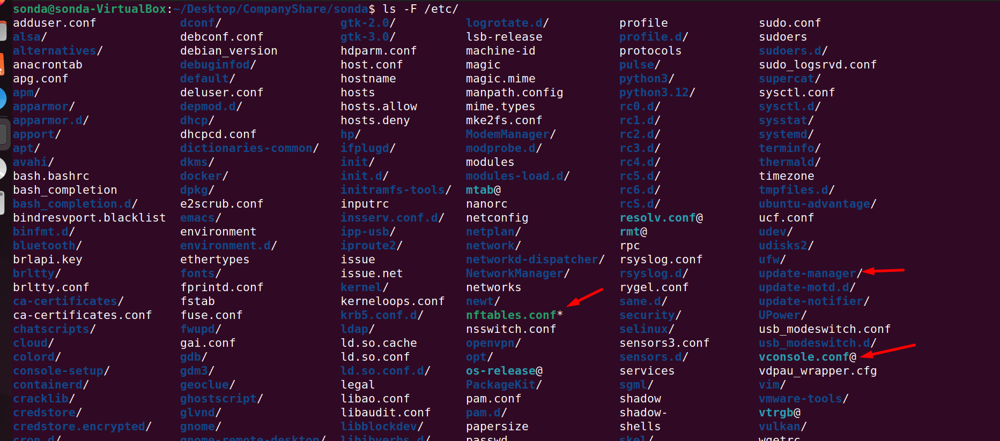


- Linux `ls -l` Output Breakdown

| Component                   | Example        | Description                                                                                                                                                                                                |
| :-------------------------- | :------------- | :--------------------------------------------------------------------------------------------------------------------------------------------------------------------------------------------------------- |
| **File Type & Permissions** | `drwxr-xr-x`   | The first character indicates the type (`d` for directory, `-` for regular file). The next 9 characters represent permissions for **Owner**, **Group**, and **Others** ($r$=read, $w$=write, $x$=execute). |
| **Hard Links**              | `2`            | The number of hard links pointing to the file or directory.                                                                                                                                                |
| **Owner**                   | `user`         | The username of the account that owns the file.                                                                                                                                                            |
| **Group**                   | `user`         | The name of the group that has specific permissions for this file.                                                                                                                                         |
| **Size**                    | `4096`         | The file size in bytes. (Tip: Use `ls -lh` to see this in "human-readable" format like KB or MB).                                                                                                          |
| **Timestamp**               | `Mar 10 10:00` | The date and time the file was last modified.                                                                                                                                                              |
| **Name**                    | `Desktop`      | The actual name of the file or directory.                                                                                                                                                                  |
- Pro Tip: Instead of using `cd` to check if a move worked, use `ls [folder_name]` to peek into a directory without leaving your current one.

### Create files - The `touch` command

- While commonly used to create new files, its primary technical purpose is different.

- Primary Use: To create an empty file (or multiple files) quickly.

- Example:

```bash
# creates two empty files simultaneously.
touch file1 file2
```

- Technical Function: It modifies the timestamp of a file.
  - If the file does not exist, touch creates it.

  - If the file already exists, touch updates its "last modified" timestamp to the current time without changing the file's content.

- Change Only the Access Time The `-a` or `--time=atime` option causes touch to change the access time alone, not the modification time.
- Change Only the Modification Time The `-m` or `--time=mtime` option causes touch to change the modification time alone, not the access time.
- Do Not Create File If you don’t want touch to create any files that don’t already exist, pass it the `-c` or `--no-create` option.
- Set the Time as Specified The `-t timestamp` option sets the time to the value specified by timestamp. This value is given in the form `-t [[CC]YY]MMDDhhmm[.ss]`
  - MM is the month
  - DD is the day
  - hh is the hour (on a 24-hour clock), 
  - mm is the minute 
  - [CC]YY is the year (such as 2012 or 12, which are equivalent)
  - ss is the second

```bash
touch -t 202605031735.30 sonda.txt
```

### Creating directories - The `mkdir` Command

- This command stands for "make directory."

- Purpose: To create a new folder (directory).

- Example:

```bash
# creates a folder named "ready" in the current location.
mkdir ready
```

- If you want to create more directories and sub-directories at once, you will need to use the `-p` option (p from the parent)
```bash
mkdir -p sonda/reports/months
```

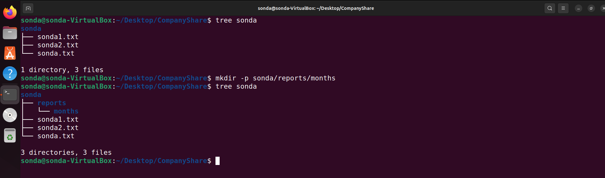

- Distinguishing Files vs. Folders: `*` In a standard terminal, they might look identical in plain text.
  - Colors: You can use `ls --color` to visually differentiate them (folders are typically blue, while files are white/grey). Most modern terminals support this by default.

### Moving and renaming files - The `mv` Command

- The `mv` command is versatile because it handles both moving and renaming in a single utility.

- Moving a File: To move a file into a folder, use `mv [filename] [destination_folder]`.

- Example:

```bash
mv ann.txt ready/
```

- Renaming a File: To rename a file, "move" it to a new name in the same location.

- Example:

```bash
mv max.txt maximilian.txt
```

- Move and Rename at Once: You can change both the location and the name simultaneously.

Example:

```bash
mv maximilian.txt ready/max.txt
```

### Copying and moving files - The `cp` Command

- The cp command creates duplicates of files or directories.

- Copying a File: Use `cp [source] [destination]`.

- Example:

```bash
cp laura.txt laura_backup.txt
cp laura.txt ./ready # cp laura.txt ready
```

- Copying to a Folder: You can copy a file into a different directory while optionally giving it a new name.

- Example:

```bash
cp laura.txt ready/lauren.txt
```

- Copying Directories (-R): By default, cp cannot copy folders. To copy a folder and all its contents, you must use the recursive flag: -R.

- Example:

```bash
cp -R ready ready_backup
```

- `cp -a`: The `-a` option copies an entire directory hierarchy in recursive mode by preserving
all the attributes and links
- `cp -r`: This option is similar to `-a`, but it does not preserve attributes, only symbolic links

| Use Case               | Recommended Command | Why?                                                                 |
|------------------------|--------------------|----------------------------------------------------------------------|
| Simple Copying         | cp -r              | Best for everyday tasks where you just need the files and don't care about original timestamps or permissions. |
| System Administration  | cp -a              | Essential for backups. It preserves the exact state of the directory, including hidden attributes. |
| Moving to Production   | cp -a              | Ensures that execution permissions and ownership remain intact so the application runs correctly. |
| Cross-Platform Scripts | cp -R              | More reliable for scripts that need to run on different Unix-like systems (Solaris, BSD, Linux) due to POSIX standards. |
| Copying Symlink        | cp -a              | Prevents the command from following links and copying the actual large data; it just copies the "shortcut" itself. |

### Deleting files - The `rm` Command

- The `rm` command is the standard way to delete files, but it comes with a major warning.

- Deleting Files: Use `rm [option] filename` or list multiple files to delete them at once.

- Example:

```bash
rm ann.txt eva.txt
```

- ⚠️ The Danger Zone: Unlike clicking "Delete" in a graphic interface, `rm` does not send files to a Trash or Bin. They are permanently deleted immediately.

- Deleting Directories (-r): To delete a folder and everything inside it, you must use the recursive flag -r (or -R).

- Example:

```bash
rm -r ready_backup/
```

- `rm -i`: This option enables interactive mode by asking you for acceptance before deleting

```bash
rm -i output.txt

# rm: remove regular file 'output.txt'?
```

- `rm -f` : The `-f` option deletes the file by force, without any interaction from the user

### Deleting directories - The `rmdir` Command

- Because rm -r is so powerful and risky, rmdir serves as a "safety first" alternative.

- Usage: `rmdir [folder_name]`

- The Safety Catch: This command only works if the directory is completely empty. If there is even one file inside, Bash will block the command and give you an error.

- Hidden Files: A folder might look empty in your file explorer but still fail to delete via rmdir. This is often due to hidden files (files starting with a dot, like .DS_Store or .thumbs.db). To see these, use ls -a.

- You must delete the hidden files first before rmdir will work.

### Read file Command (`cat`,`head`, `tail`)

#### The `cat` Command

- The most basic way to view a file is cat (concatenate). It prints the entire content of a file directly into the terminal.

- Usage: `cat filename.txt`

- Pro Tip: You can use globbing (e.g., `cat *.txt`) to output multiple files at once.

- The "Binary" Warning: Avoid using `cat` on binary files (like JPEGs). This outputs gibberish and can send "special commands" to your terminal that may break its behavior, requiring a restart.

#### `head` and `tail` Commands


| Command | Function | Default | Customization / Common Pipelines | Example |
|---------|----------|---------|----------------------------------|---------|
| `head` | Displays the beginning of a file. | First 10 lines | `head -n [number] file.txt` | `head -n 20 file.txt` |
| `tail` | Displays the end of a file. | Last 10 lines | `tail -n [number] file.txt` | `tail -n 20 file.txt` |
| `tail -f` | Monitors a file in real time (essential for live server logs). | Continuous | Press <kbd>Ctrl</kbd> + <kbd>C</kbd> to stop monitoring. | `tail -f /var/log/nginx/access.log` |
| `head \| tail` | Extracts specific lines from the middle of a file (e.g., lines 11–20). | N/A | Pipe `head` into `tail` to isolate a line range. | `head -n 20 file.txt \| tail -n 10` |
| `tail -n +[num]` | Skips the first **N - 1** lines and displays the rest of the file. | N/A | Starts output from the specified line number. | `tail -n +11 file.txt` *(Displays from line 11 to the end.)* |
| `tail -f \| grep` | Filters live log streams by specific keywords in real time. | N/A | Useful for monitoring only matching log entries. | `tail -f app.log \| grep "ERROR"` |
| `tail -f \| awk` / `cut` | Monitors live logs while extracting only specific columns or fields. | N/A | Use `awk` for column-based parsing or `cut` for delimiter-based extraction. | `tail -f access.log \| awk '{print $7}'` *(Streams only the 7th column, such as request URLs in Nginx logs.)* |

#### The `less` command

- The `less` command is a powerful tool for viewing large files (like books or log files) in the terminal without loading the entire file into memory at once, which avoids the performance issues common with the `cat `command.

- Key Navigation and Features
  - Basic Movement: Use the arrow keys to scroll line-by-line.
  - Paging: Press **F** to move forward a full page and **B** to move backward a full page.
  - Jumping to Content: You can navigate to a specific part of the file by typing a percentage (e.g., **50p**) to jump to the middle of the document.
  - Status Information: Pressing the equals sign `=` displays information about your current position in the file.
  - Line Numbers: Typing `-N` (uppercase) and pressing Enter toggles the display of row numbers for better orientation.

- Searching and Exiting
  - Use `/` followed by a keyword for a forward search (from your current position down).
  - Use `?` followed by a keyword for a backward search (from your current position up).

- Quitting: Simply press the `Q` key to exit the program and return to the command promp

#### The Word Count Program (`wc` command)

- The `wc` command provides information about the internal structure of a file. By default, running wc filename.txt outputs three values: line count, word count, and byte count.

- Key Flags:
  - `-l`: Counts only the lines (the most common use case).

  - `-w`: Counts only the words.

  - `-c`: Counts the bytes. (Note: Historically "c" stood for "character" when 1 character equaled 1 byte, a naming convention that remains today.)

- Example: `wc filename.txt`

#### Disk Usage (`du` command)

- The `du` command tells you how much space a file or directory actually occupies on your storage.

- Behavior and Summaries:
  - Running `du` by itself shows the size of every item in the current directory - Example: `du`.
  - `du filename.txt` shows the size of a specific file.
  - `-s`: Provides a total summary of a directory rather than listing every subfolder.
  - To avoid confusion over block sizes, use the `-h` flag. 
    - This forces the output into a "Human Readable" format (e.g., 168K, 10M, 2G)

## Commands for file properties

### The `stat` command

- The stat command gives you more information about the name, size, number of blocks, type of file, inode, number of links, permissions, UID and GID, and atime, mtime, and ctime


## Commands for locating files

### The `which` command

- This command locates an executable file (program or command) in the shell’s search path

```bash
which python3
# /usr/bin/python3
```

- `which` works only for executable programs, not builtins or aliases that are substitutes for actual executable programs. When we try to use which on a shell builtin—for example, cd—we either get no response or get an error message

```bash
which cd
# no response
```

### The `find` Command

- The `find` program searches **a given directory (and its subdirectories)** for files based on a variety of attributes
- Unlike basic bash globbing (using wildcards like `*`), find allows for highly specific search queries based on file attributes
- The basic syntax requires the command followed by the starting path: `find [path]`
  - Performance Note: Searching large directories (like the root directory) can take a long time. You can terminate a hanging or long-running process by pressing **Ctrl + C**.


#### Operators

- For example, what if we needed to determine whether all the files and subdirectories in a directory had secure permissions? We would look for all the files with permissions that are not 0600 and the directories with permissions that are not 0700. Fortunately, find provides a way to combine tests using logical operators to create more complex logical relationships. To express the aforementioned test, we could do this

```bash
find ~ \( -type f -not -perm 0600 \) -or \( -type d -not -perm 0700 \)
```

- Explain example above

| Component         | Description                                                                                                                      |
| ----------------- | -------------------------------------------------------------------------------------------------------------------------------- |
| `find ~`          | Starts the search from the current user's Home directory.                                                                        |
| `\( ... \)`       | Escaped parentheses used to group conditions together (similar to mathematical grouping) so that the logic is applied correctly. |
| `-type f`         | Filters the search to include only regular files.                                                                                |
| `-not -perm 0600` | Finds files that **do NOT** have `0600` permissions (Owner: Read/Write; Group/Others: None).                                     |
| `-or`             | Logical OR operator: returns results if either the file condition group **OR** the directory condition group is met.             |
| `-type d`         | Filters the search to include only directories.                                                                                  |
| `-not -perm 0700` | Finds directories that **do NOT** have `0700` permissions (Owner: Full Access; Group/Others: None).                              |

- Logical Operators

| Operator | Description                                                                                                                                                                                                                                                                       |
| -------- | --------------------------------------------------------------------------------------------------------------------------------------------------------------------------------------------------------------------------------------------------------------------------------- |
| `-and`   | Match if the tests on both sides of the operator are true. When no operator is specified, `-and` is implied by default. This can be shortened to `-a `                                                                                                                            |
| `-or`    | Match if a test on either side of the operator is true. This can be shortened to `-o`                                                                                                                                                                                             |
| `-not`   | Match if the test following the operator is false. This can be abbreviated with an exclamation point `!`                                                                                                                                                                          |
| `( )`    | Group tests and operators together to form larger expressions. This controls the precedence of logical evaluations. By default, `find` evaluates expressions from left to right. Parentheses often need to be escaped (`\(` `\)`) because they have special meaning to the shell. |

- Let’s say that we have two expressions separated by a logical operator.In all cases, expr1 will always be performed; however, the operator will determine whether expr2 is performed

```bash
expr1 -operator expr2
```

| Result of `expr1` | Operator | `expr2` is...    |
| ----------------- | -------- | ---------------- |
| True              | `-and`   | Always performed |
| False             | `-and`   | Never performed  |
| True              | `-or`    | Never performed  |
| False             | `-or`    | Always performed |

- When no operator is specified, `-and` is implied by default
```bash
# -type f and -not -perm 0600 to -type f -not -perm 0600
# -type d and -not -perm 0700 to -type d -not -perm 0700

find ~ \( -type f -not -perm 0600 \) -or \( -type d -not -perm 0700 \)
```

#### Predefined Actions

- Having a list of results from our `find` command is useful, but what we really want to do is act on the items on the list. Fortunately, find allows actions to be performed based on the search results.

| Action  | Description                                                                                                                   | Example Command                          |
| ------- | ----------------------------------------------------------------------------------------------------------------------------- | ---------------------------------------- |
| -delete | Delete the currently matching file.                                                                                           | `find . -name "*.tmp" -delete`           |
| -ls     | Perform the equivalent of `ls -dils` on the matching file. Output is sent to standard output.                                 | `find . -type f -ls`                     |
| -print  | Output the full pathname of the matching file to standard output. This is the default action if no other action is specified. | `find . -name "*.txt" -print`            |
| -quit   | Quit immediately once a match has been made.                                                                                  | `find / -name "config.php" -print -quit` |

#### User-Defined Actions

- In addition to the predefined actions, we can also invoke arbitrary commands. The traditional way of doing this is with the `-exec` action
- Syntax: `find filepath -exec command '{}' ';'` or `find filepath -exec command \{\} \;`
  - `{}` is a symbolic representation of the current pathnames of the search results
  - The semicolon is a required delimiter indicating the end of the command
  - Again, because the brace and semicolon characters have special meaning to the shell, they must be quoted or escaped

```bash
find ~ -type f -name "123.*"
# /home/sonda/Desktop/CompanyShare/123.txt

find ~ -type f -name "123.*" -exec cp '{}' '{}'.copy ';'
# or find ~ -type f -name "123.*" -exec cp \{\} \{\}.copy \;
# {} is /home/sonda/Desktop/CompanyShare/123.txt
```

- Improving Efficiency: When the -exec action is used, it launches a new instance of the specified command each time a matching file is found. There are times when we might prefer to combine all of the search results and launch a single instance of the command. For example, rather than executing the commands like this:

```bash
ls -l file1
ls -l file2
```

- We may prefer to execute them this way:

```bash
ls -l file1 file2
```

- This causes the command to be executed only one time rather than multiple times. There are two ways we can do this: the traditional way, using the external command `xargs`, and the alternate way, using a new feature in `find` itself. We’ll talk about the alternate way first
- By changing the trailing semicolon character to a plus sign, we activate the capability of find to combine the results of the search into an argument list for a single execution of the desired command. Returning to our example, this will execute ls each time a matching file is found

```bash
find ~ -type f -name 'foo*' -exec ls -l '{}' ';'
```

- By changing the command to the following:
```bash
find ~ -type f -name 'foo*' -exec ls -l '{}' +
```

#### xargs

- The xargs command performs an interesting function. It accepts input from standard input and converts it into an argument list for a specified command. With our example, we would use it like this:

```bash
find ~ -type f -name 'foo*' -print | xargs ls -l

find ~ -type f -name 'foo*' -print | xargs cp -t /path/to/destination/
```

#### Find file types

- Syntax: `find filepath  -type file_type_option`

| File Type | Description                   | Example Command     |
| --------- | ----------------------------- | ------------------- |
| b         | Block special device file     | `find /dev -type b` |
| c         | Character special device file | `find /dev -type c` |
| d         | Directory                     | `find . -type d`    |
| f         | Regular file                  | `find . -type f`    |
| l         | Symbolic link                 | `find . -type l`    |

```bash
find ./Desktop/CompanyShare/ -type d

# ./Desktop/CompanyShare/
# ./Desktop/CompanyShare/Purchasing
# ./Desktop/CompanyShare/Purchasing/01 - January
# ./Desktop/CompanyShare/Purchasing/03 - March
# ./Desktop/CompanyShare/Purchasing/02 - February
# ./Desktop/CompanyShare/Sales
# ./Desktop/CompanyShare/Sales/01 - January
# ./Desktop/CompanyShare/Sales/03 - March
# ./Desktop/CompanyShare/Sales/02 - February
# ./Desktop/CompanyShare/sonda
# ./Desktop/CompanyShare/sonda/reports
# ./Desktop/CompanyShare/sonda/reports/months
```

- Find all the empty files and empty directories:

```bash
sudo find / -type f -empty
sudo find / -type d -empty
```

#### Search by filename

```bash
find ~ -type f -name "*.JPG" -size +1M
```

- In this example
  - We add the `-name` test followed by the wildcard pattern - For morde detail: [Wildcards (File name expansion - Globbing)](#wildcards-file-name-expansion---globbing)
  - Notice how we enclose it in quotes to prevent pathname expansion by the shell
  - We add the `-size` test followed by the string `+1M`. The leading plus `+` sign indicates that we are looking for files larger than the specified number. A leading minus `-` sign would change the meaning of the string to be smaller than the specified number. Using no sign means **“match the value exactly”**. The trailing letter `M` indicates that the unit of measurement is megabytes

- Find, inside the root directory, all the files that have the e100 string in the name and print them to the standard output:

```bash
sudo find / -name e100 -print
```

- Find, inside the root directory, all the files that have the file string in their name and are of type file, and print the results to the standard output:

```bash
sudo find / -name file -type f -print
```
- Find all the files that have the print string in their name, by looking only inside the `/opt`, `/usr`, and `/var` directories:

```bash
sudo find /opt /usr /var -name print -type f -print
```

- Find all the files in the root directory that have the .conf extension: 

```bash
sudo find / type f -name "*.conf"
```

- Find all the files in the root directory that have the file string in their name and no extension:

```bash
sudo find / -type f -name "file*.*"
```

- Find, in the root directory, all the files with the following extensions: .c, .sh, and .py, and
add the list to a file named findfile
```bash
sudo find / -type f \( -name "*.c" -o -name "*.sh" -o -name "*.py" \) > findfile
```

- Find, in the root directory, all the files with the .c extension, sort them, and add them to a file:
```bash
sudo find / -type f -name "*.c" -print | sort > findfile2
```

#### Find Permission Mode

- `-perm mode`: File's permission bits are exactly mode (octal or symbolic).  Since an exact match is required, if you  want  to  use  this form  for  symbolic  modes,  you may have to specify a rather complex mode string.  
  - Octal mode: `0777`
  - Symbolic mode: `o` other,`u` user,`g` group,`a` other + user + group
  - For example -perm g=w will only match files which have mode 0020 (that is, ones for which group write permission is the only permission set).  
  - It is more  likely that  you  will want to use the `/` or `-` forms, for example -perm -g=w, which matches any file with group write permission.
- `-perm -mode`: All of the permission bits mode are set for the file. It can have more permissions, but it cannot have less. Symbolic modes are accepted this form, and this  is  usually the way in which  you would want to use them. 
- `-perm /mode`: Any of the permission bits mode are set for the file. 
- `-perm +mode`: Any of the specified permission bits are set. This is no longer supported (and has been deprecated since 2005).  Use `-perm /mode` instead.

| File Name             | Actual Permissions | Matches `-perm -220` `(_w_-_w_-___)` (AND)                        | Matches `-perm /220 (_w_-_w_-___)` (OR)                         |
| --------------------- | ------------------ | ------------------------------------------------- | ------------------------------------------------- |
| `file_all.txt`        | `777 (rwx-rwx-rwx)`              | ✓ (Both user and group write permissions are set) | ✓ (Both user and group write permissions are set) |
| `file_user_group.txt` | `220 (_w_-_w_-___)`              | ✓ (Both user and group write permissions are set) | ✓ (Both user and group write permissions are set) |
| `file_user_only.txt`  | `200 (_w_-___-___)`              | ✗ (Missing group write permission)                | ✓ (User write permission is sufficient)           |
| `file_read_only.txt`  | `444 (r__-r__-r__)`              | ✗ (No write permissions)                          | ✗ (No write permissions)                          |


- Find all the files in the root directory, with the permission set to 0664:
```bash
sudo find / -type f -perm 0664
```
- Find all the files in the root directory that are read-only (have read-only permission) for their owner:
```bash
sudo find / -type f -perm /u=r
```
- Find all the files in the root directory that are executable:
```bash
sudo find / -type f -perm /a=x
```

#### Search by Group 
- The `-gid` GID expression searches for fi les whose group ID (GID) is set to GID. 
- The `-group` name option locates fi les whose group name is name. The former can be handy if the GID has been orphaned and has no name, but the latter is generally easier
to use.

```bash
find ~/Desktop/ -group 'sonda'
```

#### Search by User ID 

- The -uid UID expression searches for fi les owned by the user whose user ID (UID) is UID. 
- The -user name option searches for fi les owned by name. Searching
by UID is useful if the UID has been orphaned and has no name, but searching by username is generally easier.

#### Find Size Units

  | Character | Unit                                       | Example             |
  | --------- | ------------------------------------------ | ------------------- |
  | b         | 512-byte blocks (default if no unit given) | `find . -size 10b`  |
  | c         | Bytes                                      | `find . -size 100c` |
  | w         | 2-byte words                               | `find . -size 50w`  |
  | k         | Kilobytes (1,024 bytes)                    | `find . -size 10k`  |
  | M         | Megabytes (1,048,576 bytes)                | `find . -size 5M`   |
  | G         | Gigabytes (1,073,741,824 bytes)            | `find . -size 1G`   |


- `find ~ -type f -name "*.JPG" -size +1M | wc -l`
  - `+1M`: The leading plus sign indicates that we are looking for files larger than the specified number
  - `-1M`: A leading minus sign would change the meaning of the string to be smaller than the specified number

- Find all the files that are 5 MB in size:

```bash
sudo find / -type f -size 5M
```

- Find all the files that have a size between 5 and 10 MB:

```bash
sudo find / -type f -size +5M -size -10M
```

#### Search by modified or accessed or created time

- Find all the files inside the root directory that were modified two days ago:

```bash
sudo find / -type f -mtime 2
```

- Find all the files that have been modified in the last two to five days:

```bash
sudo find / -type f -mtime +2 -mtime -5
```

- Find all the files that have been modified in the last 10 minutes:

```bash
sudo find / -type f -mmin -10
```

- Find all the files in the root directory that have been accessed in the last two days:

```bash
sudo find / -type f -atime 2
```

- Find all the files that have been accessed in the last 10 minutes:

```bash
sudo find / -type f -amin -10
```


#### Find Tests

- Note that in cases where a numeric argument is required, the same `+` and `-` notation discussed previously can be applied

| Test           | Description                                                                                                                                                         | Example Command                |
| -------------- | ------------------------------------------------------------------------------------------------------------------------------------------------------------------- | ------------------------------ |
| -cmin n        | Match files or directories whose content or attributes were last modified exactly n minutes ago. Use `-n` for less than n minutes and `+n` for more than n minutes. | `find . -cmin -10`             |
| -cnewer file   | Match files or directories whose contents or attributes were modified more recently than the specified file.                                                        | `find . -cnewer reference.txt` |
| -ctime n       | Match files or directories whose contents or attributes were last modified `n*24` hours ago.                                                                        | `find . -ctime 2`              |
| -empty         | Match empty files and directories.                                                                                                                                  | `find . -empty`                |
| -group name    | Match files or directories belonging to group `name` (group name or numeric GID).                                                                                   | `find . -group developers`     |
| -iname pattern | Same as `-name` but case-insensitive.                                                                                                                               | `find . -iname "*.txt"`        |
| -inum n        | Match files with inode number `n`. Useful for finding hard links.                                                                                                   | `find / -inum 12345`           |
| -mmin n        | Match files or directories whose contents were last modified `n` minutes ago.                                                                                       | `find . -mmin -30`             |
| -mtime n       | Match files or directories whose contents were last modified `n*24` hours ago.                                                                                      | `find . -mtime -1`             |
| -name pattern  | Match files and directories with the specified wildcard pattern.                                                                                                    | `find . -name "*.log"`         |
| -newer file    | Match files and directories modified more recently than the specified file.                                                                                         | `find . -newer backup.log`     |
| -nouser        | Match files and directories that do not belong to a valid user.                                                                                                     | `find / -nouser`               |
| -nogroup       | Match files and directories that do not belong to a valid group.                                                                                                    | `find / -nogroup`              |
| -perm mode     | Match files or directories whose permissions match the specified mode (octal or symbolic).                                                                          | `find . -perm 644`             |
| -samefile name | Match files that share the same inode number as `name`.                                                                                                             | `find . -samefile file.txt`    |
| -size n        | Match files of size `n`.                                                                                                                                            | `find . -size 100M`            |
| -type c        | Match files of type `c`.                                                                                                                                            | `find . -type f`               |
| -user name     | Match files or directories belonging to `user`.                                                                                                                     | `find /home -user john`        |
| -writable | Matches files or directories that are writable by the current user. | `find . -type f -writable` |

### How to edit files

- There's no build-in text editor for bash
- We have to install additional software for that
- 4 quite popular options are:
  - pico / nano: A simple editor for text files in bash
  - vi / vim: A more advanced text editor
- The install process depends on the system you're using
  - Mac `brew install nano`
  - Ubuntu `apt-get install -y nano`

## Pipelines

### The `tee` command

- The `tee` command reads **standard input-stdin 0** and copies it to both **standard output-stdout 1** (allowing the data to continue down the pipeline) and to one or more files

- Syntax
  - Basic usage: `command | tee output.txt`
  - Appending: `command | tee -a output.txt` (The `-a` flag prevents overwriting the file).

- How it looks in a chain `echo "Hello" | tee hello.txt | wc -c`
  - `echo` sends "Hello" to the pipe.

  - `tee` catches "Hello", writes it into hello.txt, and then passes "Hello" out to the next pipe.

  - `wc -c` receives "Hello" and counts the characters.

- Practical Use Case: Logging and Debugging: `ping google.com 2>&1 | tee network_log.txt`
  - `ping` command to troubleshoot internet issues
  - Why `2>&1` ? As we learned earlier, errors (stderr) usually bypass pipes. By redirecting stderr to stdout first, tee can "see" the error messages.
  - The Result: You can watch the ping results in real-time to see when your connection drops, but you also create a `network_log.txt` file that you can send to your ISP as proof of the failure

- Why is it called "tee"?
  - The name comes from a T-junction used in plumbing. Just like a pipe shaped like a "T" splits water into two directions, the tee command splits your data stream into two directions: the file and the terminal.

### The `grep` Command

- `grep` is a powerful program used to find text patterns within files

- Key Usage & Parameters:
  - Basic Syntax: grep -F "pattern" filename

  - The `-F` Flag (Fixed Strings): By default, grep uses "Regular Expressions" (complex search patterns). Using -F tells grep to treat the pattern as a plain, literal string, making it simpler to use for beginners.

  - Standard Input (stdin): Like sort and `uniq`, `grep` is frequently used in pipes: `command | grep "pattern"`

- Why Avoid Binary Data? While grep can technically scan any file (including images or archives), the lecture strongly advises against using it on binary files for three reasons:
  - False Positives: You might accidentally match a random byte sequence that isn't actually the text you're looking for.

  - Performance: `grep` is optimized for text; scanning large binary files can be extremely slow.

  - Terminal Corruption: Binary files contain non-printable characters. If grep finds a match and tries to print it, those characters can "break" your terminal, causing it to display gibberish or change settings unexpectedly

- Practical Examples
  - Filtering File Lists: `ls | grep -F "file"`. Only filenames containing the word "file" will be displayed

## Text Processing

### The `sort` command

- The sort program sorts the contents of standard input, or one or more files specified on the command line, and sends the results to standard output
- By default, it sorts lines in alphabetical order and prints the result to the screen (stdout) without modifying the original file
- Syntax: `sort [option] [file_path_1] [file_path_2] [file_path_3]` or `sort [option] [stdin(0)]`
- Key Parameters:
  - `-r` (Reverse): Sorts the data in descending order (Z to A).

  - `-n` (Numerical): Sorts based on numerical value rather than just the first digit (e.g., ensuring "10" comes after "2").

  - `-k` (Column/Key): Sorts by a specific column (e.g., -k 2 to sort by last names). Syntax: `-k field1[,field2]`
  
  - `-t` (field separator): Define the field-separator character. By default fields are separated by spaces or tabs. Syntax: `-t char`

  - `-c` (Check): Checks if a file is already sorted.

  - `-u` (Unique): Sorts the file and removes duplicates in a single step.

  - `b` (Ignore leading blanks): By default, sorting is performed on the entire line, starting with the first character in the line. This option causes sort to ignore leading spaces in lines and calculates sorting based on the first non-whitespace character on the line.

  - `-o` (output) Send sorted output to file rather than standard output. Syntax: `-o file`

#### Practical Use Case - Standard:
 
```bash
sort users.txt
```

#### Practical Use Case - Using Pipes: 

```bash
cat users.txt | sort
```
  
- We pipe the results into `head` to limit the results to the first 10 lines. We can produce a numerically sorted list to show the 10 largest consumers of space this way 

```bash
du -s /usr/share/* | sort -nr | head
```

#### Practical Use Case - Check a file is already sorted

```bash
sort -c data.txt
# sort: data.txt:3: disorder: b
```

#### Practical Use Case - Sorts the file and removes duplicates in a single step

```bash
cat data.txt

# a
# f
# b
# c
# e
# f
# g
# h
# t
# a
# e
# c

sort -u data.txt

# a
# b
# c
# e
# f
# g
# h
# t
```

#### Practical Use Case - Sorts by a specific column

- **William Shotts** By default, `sort` sees this line as having two fields. The first field contains these characters: "William". The second field contains these characters: "Shotts". This means that whitespace characters (spaces and tabs) are used as delimiters between fields

```bash
du -s /usr/share/* | sort -nr | head

# 509940 /usr/share/locale-langpack
# 242660 /usr/share/doc
# 197560 /usr/share/fonts
# 179144 /usr/share/gnome
# 146764 /usr/share/myspell
# 144304 /usr/share/gimp
# 135880 /usr/share/dict
# 76508 /usr/share/icons
# 68072 /usr/share/apps
# 62844 /usr/share/foomatic
```

```bash
ls -l /usr/bin | sort -nrk 5 | head

# -rwxr-xr-x 1 root root 8234216 2016-04-07 17:42 inkscape
# -rwxr-xr-x 1 root root 8222692 2016-04-07 17:42 inkview
# -rwxr-xr-x 1 root root 3746508 2016-03-07 23:45 gimp-2.4
# -rwxr-xr-x 1 root root 3654020 2016-08-26 16:16 quanta
# -rwxr-xr-x 1 root root 2928760 2016-09-10 14:31 gdbtui
# -rwxr-xr-x 1 root root 2928756 2016-09-10 14:31 gdb
# -rwxr-xr-x 1 root root 2602236 2016-10-10 12:56 net
# -rwxr-xr-x 1 root root 2304684 2016-10-10 12:56 rpcclient
# -rwxr-xr-x 1 root root 2241832 2016-04-04 05:56 aptitude
# -rwxr-xr-x 1 root root 2202476 2016-10-10 12:56 smbcacls
```

#### Multiple sort keys

- distros.txt file

```
Distribution   Version   Release Date
SUSE           10.2      12/07/2006
Fedora         10        11/25/2008
SUSE           11.0      06/19/2008
Ubuntu         8.04      04/24/2008
Fedora         8         11/08/2007
SUSE           10.3      10/04/2007
Ubuntu         6.10      10/26/2006
Fedora         7         05/31/2007
Ubuntu         7.10      10/18/2007
Ubuntu         7.04      04/19/2007
SUSE           10.1      05/11/2006
Fedora         6         10/24/2006
Fedora         9         05/13/2008
Ubuntu         6.06      06/01/2006
Ubuntu         8.10      10/30/2008
Fedora         5         03/20/2006
```

- We want to perform an alphabetic sort on the first field and then a numeric sort on the second field. `sort` allows multiple instances of the `-k` option so that multiple sort keys can be specified
- Here is the syntax for our multikey sort `sort --key=1,1 --key=2n distros.txt`
  - The first key `--key=1,1`, we specified 1,1, which means “start at field 1 and end at field 1
  - The second key `--key=2n`, which means field 2 is the sort key and that the sort should be numeric
- An option letter may be included at the end of a key specifier to indicate the type of sort to
  be performed. These option letters are the same as the global options for the `sort` command
  - b (ignore leading blanks)
  - n (numeric sort)
  - r (reverse sort)

#### Offsets in `--key` or `-k`

- Syntax: `-k KEYDEF` or `--key KEYDEF`
- KEYDEF  is  `F[.C][OPTS][,F[.C][OPTS]]`  for  start  and  stop position, where F is a field number and C a character position in the field; both are origin 1, and the stop position defaults to the line's end.  If neither -t nor -b is in effect,  characters  in  a field  are  counted from the beginning of the preceding whitespace.  OPTS is one or more single-letter ordering options [bdfgiMhnRrV], which override global ordering options for that key.  If no key is given, use the entire line as the key.   Use  `--debug`  to diagnose incorrect key usage.


- The key option allows specification of **offsets** within fields, so we can define keys within fields
  - By specifying `-k 3.7`, we instruct sort to use a sort key that begins at the seventh character within the third field, which corresponds to the start of the year
  - Likewise, we specify `-k 3.1` and `-k 3.4` to isolate the month and day portions of the date

```bash
sort -k 3.7nbr -k 3.1nbr -k 3.4nbr distros.txt` 
# or 
sort --key 3.7nbr -k 3.1nbr --key 3.4nbr distros.txt
# or recommended command line
sort -t ' ' -k 3.7,3.10nbr -k 3.1,3.2nbr -k 3.4,3.5nbr distros.txt
```

#### Some files don’t use tabs and spaces as field delimiters

```
head /etc/passwd

# root:x:0:0:root:/root:/bin/bash
# daemon:x:1:1:daemon:/usr/sbin:/bin/sh
# bin:x:2:2:bin:/bin:/bin/sh
# sys:x:3:3:sys:/dev:/bin/sh
# sync:x:4:65534:sync:/bin:/bin/sync
# games:x:5:60:games:/usr/games:/bin/sh
# man:x:6:12:man:/var/cache/man:/bin/sh
# lp:x:7:7:lp:/var/spool/lpd:/bin/sh
# mail:x:8:8:mail:/var/mail:/bin/sh
# news:x:9:9:news:/var/spool/news:/bin/sh
```

- So how would we `sort` this file using a key field? `sort` provides the `-t` option to define the
  field separator character ` sort -t ':' -k 7 /etc/passwd | head`. By specifying the colon character as the field separator, we can sort on the seventh field

### The `uniq` command

- The `uniq` command is used to filter out or identify repeated lines in a dataset.

- **Important Limitation**: `uniq` only detects duplicate lines that are adjacent (directly below one another). Because of this, data must almost always be passed through the `sort` command before being piped into `uniq`.

- Common Use Cases:
  - **Removing Duplicates**: sort file.txt | uniq

  - **Finding Only Duplicates**: Using the `-d` flag (e.g., `sort file.txt | uniq -d`) will print only the lines that appeared more than once.

- The Efficient Method: `sort -u users.txt`. This uses the built-in unique flag within the sort command to handle both tasks at once

### The `tr` command

- The `tr` command is used for character-level replacements within a pipe. It does not look for whole words, but rather maps individual characters from one set to another.
- Basic Replacement: You can replace specific characters (e.g., changing 'B' to 'D').

```bash
echo 'bash' | tr 'b' 'd'

# dash
```

- Multiple Characters: If you provide multiple characters, `tr` maps them positionally (e.g., the 1st character of set A is replaced by the 1st of set B).

```bash
echo 'sonda vo doi' | tr 'sonda' 'haopt'

# haopt va pai
```

- Unequal Ranges: If the replacement set is smaller than the search set, tr typically uses the last character of the replacement set for all remaining matches.

```bash
echo 'sonda vo doi' | tr 'a-z' '1-2'

# 22221 22 222

echo 'sonda ban that vo doi' | tr 'a-z' '1-9.'

# ...41 21. .81. .. 4.9
# Because
# 1 2 3 4 5 6 7 8 9 .
# a b c d e f j h i j k ...
# so the characters outside the range a-i are replaced by .
```

- Character Ranges: You can use ranges like `a-z` and `A-Z`. This is a feature of the `tr` program itself, not the shell, and is commonly used to **convert text to uppercase**

```bash
echo 'awesome' | tr 'a-z' 'A-Z'

# AWESOME
```

- Deleting Characters: Using the -d flag allows you to remove specific characters, such as deleting all spaces in a string.

```bash
echo 'sonda vo doi' | tr -d ' '

# sondavodoi

echo 'sonda vo doi' | tr -d 's'

# onda vo doi
```

### The `rev` Command (Reverse Command)

- The `rev` command is a straightforward tool used to reverse the order of characters in a string.

```bash
echo 'sonda vo doi' | rev

# iod ov adnos
```

### The `cut` command

- The `cut` command, a powerful tool for extracting specific sections of data from files or standard input
- If the text contains Unicode characters (UTF-8), do not use `cut`. `cut`good for ASCII, `awk/perl` good for Unicode

#### Cutting by Bytes (-b)

- This mode extracts data based on exact byte positions.

- Usage: `cut -b 1-10` retrieves the first 10 bytes.

- System Differences: The instructor demonstrates that commands like uptime vary by operating system (e.g., Linux vs. macOS), often adding leading spaces. You must account for these variations when defining byte ranges.

#### Cutting by Characters (-c)

- While similar to byte-cutting, this mode is essential for multi-byte characters (like German umlauts ö or Emojis).

- The Difference: An Emoji might take up 3–4 bytes. If you use `-b` to cut in the middle of those bytes, the terminal will display a broken or "replacement" character. Using `-c` ensures you extract the full character regardless of its byte size.

- Ranges: You can specify a single character (`-c 2`), a range (`-c 1-5`), or everything from a point onward (`-c 2-`).

#### Cutting by Fields (-f)

- This is described as the most powerful mode, allowing you to extract data based on columns or "fields."

- Delimiters (`-d`): By default, cut expects **Tab** characters as separators. To use a different separator (like a space), you must define the delimiter using `-d`.

- Field Selection: You can pick specific columns, such as `-f 1` for the first field or `-f 1,3` for the first and third.

- The "Empty Field" Trap: If your data has consecutive delimiters (e.g., two spaces in a row), cut treats the space between them as an empty field. This requires careful counting to reach the correct data.

```bash
uptime
#   16:28:12 up  2:01,  1 user,  load average: 0.00, 0.00, 0.00
# The output above has one space at the beginning of the line.

uptime | cut -d " " -f 2
# 16:29:35
```

### The `sed` command

- The name `sed` is short for stream editor. It performs text editing on a stream of text, either a set of specified files or standard input
- A crucial takeaway is that sed is not identical across all systems:
  - macOS (OS X): Uses the **FreeBSD implementation**.
  - Linux: Typically uses **GNU sed**.
  - The Impact: While basic substitutions usually work the same way, complex scripts may behave differently depending on the operating system. It is best practice to test your sed commands on the specific platforms where they will run.

#### s (substitute) command.

- Syntax: `sed 's/search_pattern/replacement/flags'`
- Delimiters: While the forward slash (/) is the standard delimiter, you can technically use other characters as long as they are consistent throughout the command.
- The `g` (Global) Flag: By default, sed only replaces the first occurrence in a line. Adding the `g` flag ensures all occurrences are replaced.
- `sed` supports Regular Expressions (regex) for its search patterns
- Example:

```bash
echo 'hello world' | sed 's/world/bash/g'
# hello bash
```


