- [Introducing the Linux operating system](#introducing-the-linux-operating-system)
  - [Core Concepts: OS, Kernel, and Unix](#core-concepts-os-kernel-and-unix)
  - [The "Linux" Identity: GNU + Linux](#the-linux-identity-gnu--linux)
  - [Why Linux Matters](#why-linux-matters)
- [Linux Distributions](#linux-distributions)
  - [What is a Linux Distribution](#what-is-a-linux-distribution)
  - [Common Linux distributions](#common-linux-distributions)
- [The Linux filesystem](#the-linux-filesystem)
  - [What is a File?](#what-is-a-file)
  - [How Data is Stored: The Inode System](#how-data-is-stored-the-inode-system)
  - [The Unix Philosophy: "Everything is a File"](#the-unix-philosophy-everything-is-a-file)
    - [Identifying File Types in the Terminal](#identifying-file-types-in-the-terminal)
  - [Understanding file paths](#understanding-file-paths)
    - [Absolute Paths](#absolute-paths)
    - [Relative Paths](#relative-paths)
  - [Symbolic Links](#symbolic-links)
    - [Working with Symlinks via CLI](#working-with-symlinks-via-cli)
    - [Why use Symbolic Links:](#why-use-symbolic-links)
  - [Hard Links](#hard-links)
    - [What is hardlink?](#what-is-hardlink)
    - [How it Works](#how-it-works)
    - [Working with hard link via CLI](#working-with-hard-link-via-cli)
      - [Creating a Hard Link](#creating-a-hard-link)
      - [Identify a Symlink and View Destination](#identify-a-symlink-and-view-destination)
      - [Copy files with a hard link](#copy-files-with-a-hard-link)
      - [Deleting](#deleting)
        - [How to Completely Delete Data (Find all Hard Links).](#how-to-completely-delete-data-find-all-hard-links)
  - [Hard Links vs. Symbolic Links](#hard-links-vs-symbolic-links)
  - [Inode](#inode)
    - [What is an Inode?](#what-is-an-inode)
    - [Monitoring Inodes](#monitoring-inodes)
    - [Identify physical disk partitions or boundaries of a file](#identify-physical-disk-partitions-or-boundaries-of-a-file)
    - [The Problem: Reaching the Limit](#the-problem-reaching-the-limit)
    - [Solutions to Inode Exhaustion](#solutions-to-inode-exhaustion)
  - [The difference between Buffered and Unbuffered I/O](#the-difference-between-buffered-and-unbuffered-io)
    - [What is an I/O Device?](#what-is-an-io-device)
    - [Unbuffered I/O](#unbuffered-io)
    - [Buffered I/O](#buffered-io)
  - [How devices are handled within a Unix-based system](#how-devices-are-handled-within-a-unix-based-system)
    - [What is a Device?](#what-is-a-device)
    - [Main Types of Devices](#main-types-of-devices)
    - [Practical Interaction](#practical-interaction)
  - [Example pseudo devices](#example-pseudo-devices)
    - [The "Black Hole": `/dev/null`](#the-black-hole-devnull)
    - [Random Data Generators](#random-data-generators)
      - [`/dev/random` (The High-Security Version)](#devrandom-the-high-security-version)
      - [`/dev/urandom` (The Faster Version)](#devurandom-the-faster-version)
    - [Standard Streams: `stdin`, `stdout`, and `stderr`](#standard-streams-stdin-stdout-and-stderr)
  - [`/proc` directory](#proc-directory)
    - [`/proc/cpuinfo`](#proccpuinfo)
    - [`/proc/meminfo`](#procmeminfo)
    - [`/proc/version`](#procversion)
    - [`/proc/uptime`](#procuptime)
    - [`/proc/loadavg`](#procloadavg)
  - [File system hierachy](#file-system-hierachy)
  - [Important Facts About Filenames](#important-facts-about-filenames)
  - [Exploring the Linux filesystem from the command line](#exploring-the-linux-filesystem-from-the-command-line)
- [Managing Users and Groups](#managing-users-and-groups)
  - [Managing users](#managing-users)
    - [Linux has different kind of users](#linux-has-different-kind-of-users)
    - [Groups](#groups)
    - [On Linux, user information is stored in various files](#on-linux-user-information-is-stored-in-various-files)
      - [Basic account info - `/etc/passwd`](#basic-account-info---etcpasswd)
      - [Encrypted passwords and aging info - `/etc/shadow`](#encrypted-passwords-and-aging-info---etcshadow)
      - [List of groups and their members - `/etc/group`](#list-of-groups-and-their-members---etcgroup)
  - [Understanding sudo](#understanding-sudo)
    - [Elevating privileges: `sudo`](#elevating-privileges-sudo)
- [Linux Software Management](#linux-software-management)
  - [The DEB package’s anatomy](#the-deb-packages-anatomy)
    - [Updating the Package List](#updating-the-package-list)
    - [Upgrading Software](#upgrading-software)
    - [Managing Packages (Install/Remove)](#managing-packages-installremove)
    - [`apt` vs. `apt-get`](#apt-vs-apt-get)
  - [The RPM packages anatomy](#the-rpm-packages-anatomy)
    - [Updating the System](#updating-the-system)
    - [Managing Software (Install/Remove)](#managing-software-installremove)
  - [Enabling Additional Repositories](#enabling-additional-repositories)
- [Introducing the Linux shell](#introducing-the-linux-shell)
  - [What is a shell?](#what-is-a-shell)
  - [Identifying Commands](#identifying-commands)
    - [Shell command types - `type`](#shell-command-types---type)
    - [Display an Executable’s Location - `which`](#display-an-executables-location---which)
  - [Explaining the command structure](#explaining-the-command-structure)
  - [Consulting the manual](#consulting-the-manual)
  - [Wildcards (File name expansion - Globbing)](#wildcards-file-name-expansion---globbing)
    - [The Asterisk (`*`) Wildcard](#the-asterisk--wildcard)
    - [The Single Character Wildcard (?)](#the-single-character-wildcard-)
    - [Square Brackets (\[\]) and Ranges](#square-brackets--and-ranges)
    - [The Globstar (`**`)](#the-globstar-)
    - [Wildcards](#wildcards)
    - [Commonly Used Character Classes](#commonly-used-character-classes)
    - [Pattern Examples](#pattern-examples)
  - [Pitfalls of Globbing](#pitfalls-of-globbing)
    - [The Problem: File Names as Commands](#the-problem-file-names-as-commands)
  - [Standard streams: stdin, stdout, stderr](#standard-streams-stdin-stdout-stderr)
    - [Redirecting Standard Output](#redirecting-standard-output)
    - [Why Redirection Sometimes "Fails"](#why-redirection-sometimes-fails)
  - [Redirect Standard Error](#redirect-standard-error)
    - [Why Redirect Standard Error?](#why-redirect-standard-error)
    - [Redirection Syntax](#redirection-syntax)
  - [Redirect stderr to stdout](#redirect-stderr-to-stdout)
    - [Why Redirect stderr to stdout?](#why-redirect-stderr-to-stdout)
    - [The Syntax](#the-syntax)
    - [Redirection is Sequential](#redirection-is-sequential)
      - [Case 1: The Successful Redirect (`> file 2>&1`)](#case-1-the-successful-redirect--file-21)
      - [Case 2: The Failed Redirect (`2>&1 > out.txt`)](#case-2-the-failed-redirect-21--outtxt)
      - [Summary](#summary)
  - [Disposing of Unwanted Output](#disposing-of-unwanted-output)
  - [What about stdin](#what-about-stdin)
  - [The Stdin Redirector (`<`)](#the-stdin-redirector-)
  - [Chaining Concepts](#chaining-concepts)
  - [Pipes - Data processing through command chaining](#pipes---data-processing-through-command-chaining)
    - [What is a Pipe?](#what-is-a-pipe)
    - [Practical Examples:](#practical-examples)
  - [Environment variables](#environment-variables)
    - [The Nature of Environment Variables](#the-nature-of-environment-variables)
    - [Definition and Conventions](#definition-and-conventions)
    - [Viewing Variables](#viewing-variables)
    - [Accessing Variables](#accessing-variables)
    - [`SHELL` variable](#shell-variable)
    - [`HOME` The Home Directory](#home-the-home-directory)
      - [Why Relying on $HOME is Often Safer](#why-relying-on-home-is-often-safer)
    - [`PWD` \& `OLDPWD` (The Path Tracking)](#pwd--oldpwd-the-path-tracking)
    - [`USER` The Unix Username](#user-the-unix-username)
    - [`PS1` variable](#ps1-variable)
    - [Creating and Deleting Environment Variables](#creating-and-deleting-environment-variables)
      - [Creating Variables - `export`](#creating-variables---export)
      - [Modifying Variables](#modifying-variables)
      - [Deleting Variables - `unset`](#deleting-variables---unset)
    - [`PATH` environment variable](#path-environment-variable)
      - [What is the `PATH` Variable?](#what-is-the-path-variable)
      - [How It Works](#how-it-works-1)
      - [Modiffy `PATH` variable](#modiffy-path-variable)
    - [Creating custom executable file](#creating-custom-executable-file)
      - [The Shebang - `#!`](#the-shebang---)
    - [Storing custom shell configurations](#storing-custom-shell-configurations)
      - [Interactive Login Shell](#interactive-login-shell)
      - [Interactive Non-Login Shell:](#interactive-non-login-shell)
      - [Non-Interactive Non-Login Shell](#non-interactive-non-login-shell)
      - [Non-Interactive Login Shell](#non-interactive-login-shell)
  - [Alias](#alias)
    - [What is an Alias?](#what-is-an-alias)
    - [Viewing Alias](#viewing-alias)
    - [Managing Aliases](#managing-aliases)
    - [Making Aliases Permanent](#making-aliases-permanent)
  - [Configure the Bash shell](#configure-the-bash-shell)
    - [`shopt` vs `set`: Why both?](#shopt-vs-set-why-both)
    - [`set` Command](#set-command)
      - [Key Feature: X-Trace](#key-feature-x-trace)
    - [`shopt` command](#shopt-command)
      - [Practical Examples](#practical-examples-1)
  - [Command substitution](#command-substitution)
  - [Style terminal line use `tput` and `infocmp` command](#style-terminal-line-use-tput-and-infocmp-command)
  - [Shel expansions](#shel-expansions)
    - [Filename expansion or Pathname Expansion](#filename-expansion-or-pathname-expansion)
    - [Tilde expansion - `~`](#tilde-expansion---)
    - [Variable expansion - `$`](#variable-expansion---)
    - [Shell Parameter Expansion](#shell-parameter-expansion)
    - [Arithmetic Expansion](#arithmetic-expansion)
    - [Word Splitting](#word-splitting)
      - [What is Word Splitting?](#what-is-word-splitting)
      - [The Role of IFS](#the-role-of-ifs)
      - [Disabling Splitting with Quotes - `' '`](#disabling-splitting-with-quotes----)
    - [No Quotes vs Single Quotes `''` vs Double Quotes `""`](#no-quotes-vs-single-quotes--vs-double-quotes-)
    - [Shell expensions: Be careful!](#shell-expensions-be-careful)
      - [The Danger of "Accidental" Commands](#the-danger-of-accidental-commands)
      - [Filenames as Flags (The "Minus" Problem)](#filenames-as-flags-the-minus-problem)
      - [The "Golden Rule" of Variables](#the-golden-rule-of-variables)
      - [Best practice](#best-practice)
    - [Escaping](#escaping)
      - [Handling Whitespace](#handling-whitespace)
      - [Printing Quotes](#printing-quotes)
      - [The "Single Quote" Exception](#the-single-quote-exception)
    - [Brace expansion](#brace-expansion)
    - [Command substitution](#command-substitution-1)
    - [Process Substitution](#process-substitution)
      - [Output-to-Input Substitution](#output-to-input-substitution)
      - [Input-from-Output Substitution](#input-from-output-substitution)
  - [Choosing the Right Tool: Pipe vs. Substitutions](#choosing-the-right-tool-pipe-vs-substitutions)
    - [Use Pipe `|`](#use-pipe-)
    - [Use Process Substitution `<(command)`](#use-process-substitution-command)
    - [Use Command Substitution `$()`](#use-command-substitution-)
- [Bash Shell](#bash-shell)
  - [Shell autocompletion](#shell-autocompletion)
  - [How to execute several commands](#how-to-execute-several-commands)
  - [The `echo` command](#the-echo-command)
  - [The `pwd` command](#the-pwd-command)
  - [The `cd` command](#the-cd-command)
  - [The `ls` Command](#the-ls-command)
  - [The `stat` command](#the-stat-command)
  - [Basic file operations](#basic-file-operations)
    - [The `touch` command](#the-touch-command)
    - [The `mkdir` Command](#the-mkdir-command)
    - [The `mv` Command](#the-mv-command)
    - [The `cp` Command](#the-cp-command)
    - [The `rm` Command](#the-rm-command)
    - [The `rmdir` Command](#the-rmdir-command)
    - [Read file Command (`cat`,`head`, `tail`)](#read-file-command-cathead-tail)
      - [The `cat` Command](#the-cat-command)
      - [`head` and `tail` Commands](#head-and-tail-commands)
      - [The `less` command](#the-less-command)
      - [The Word Count Program (`wc` command)](#the-word-count-program-wc-command)
      - [Disk Usage (`du` command)](#disk-usage-du-command)
      - [How to edit files](#how-to-edit-files)
  - [Pipelines](#pipelines)
    - [The `tee` command](#the-tee-command)
    - [The `grep` Command](#the-grep-command)
  - [Text Processing](#text-processing)
    - [The `sort` command](#the-sort-command)
      - [Multiple sort keys](#multiple-sort-keys)
      - [Offsets in `--key`](#offsets-in---key)
      - [Some files don’t use tabs and spaces as field delimiters](#some-files-dont-use-tabs-and-spaces-as-field-delimiters)
    - [The `uniq` command](#the-uniq-command)
    - [The `tr` command](#the-tr-command)
    - [The `rev` Command (Reverse Command)](#the-rev-command-reverse-command)
    - [The `cut` command](#the-cut-command)
      - [Cutting by Bytes (-b)](#cutting-by-bytes--b)
      - [Cutting by Characters (-c)](#cutting-by-characters--c)
      - [Cutting by Fields (-f)](#cutting-by-fields--f)
    - [The `sed` command](#the-sed-command)
      - [s (substitute) command.](#s-substitute-command)
  - [The `find` Command](#the-find-command)
    - [Find file types](#find-file-types)
    - [Search by file size and filename](#search-by-file-size-and-filename)
    - [Find Tests](#find-tests)
    - [Predefined Actions](#predefined-actions)
    - [Operators](#operators)

# Introducing the Linux operating system

## Core Concepts: OS, Kernel, and Unix

- Operating System (OS): The system software that manages hardware and provides services (like UI and networking) for programs.

- Kernel: The "heart" of the OS. It is the specific layer responsible for managing the processor, memory, and hardware devices.

- Unix: A powerful, multi-user, and multitasking OS that serves as the architectural foundation for most modern systems (including macOS/iOS).

## The "Linux" Identity: GNU + Linux

**The term "Linux" as we use it today is actually a combination of two distinct projects:**

- The GNU Project (1983): Created by Richard Stallman with the goal of building a completely free and open-source Unix-like OS. It provided the utilities and tools (shell, compilers, etc.) but lacked a working kernel for a long time.

- The Linux Kernel (1991): Created by Linus Torvalds to manage hardware. It was released under the GPL (General Public License), ensuring the source code remains free and modifiable.

- Technical Distinction: Technically, what we use is GNU/Linux. The Linux kernel handles the hardware, while the GNU tools provide the user environment. In common language, we simply call the entire package "Linux."

## Why Linux Matters

- Versatility: It runs everything from massive data centers and cloud servers to Android smartphones and IoT devices.

- Unix-like: It replicates the power of the original proprietary Unix systems but remains open-source and free to modify.

- Multi-user/Multitasking: It inherently supports different permission levels and running multiple apps simultaneously, making it highly secure and efficient.

# Linux Distributions

## What is a Linux Distribution

- A Linux distribution (or "distro") is an operating system built on top of the GNU/Linux core (the Kernel plus GNU software).
  - **Customization**: Each distro adds specific software and default configurations to cater to different user groups.

  - **Software Overlap**: While many tools (like web servers) are available across all distros, the way they are configured or managed may vary slightly.

  - **Cost**: Most are free under open-source licenses, though some enterprise versions require a paid license for support and access.

## Common Linux distributions

- Fedora, CentOS Stream, Rocky Linux and RHEL
- Debian
- Ubuntu
- Linux Mint
- openSUSE

# The Linux filesystem

## What is a File?

- A file is defined as a container for storing and managing data, identified by a unique name and path. Every file possesses specific attributes (metadata), including:
  - Size: The amount of data stored in the file
  - Permissions: Who can read, write, or execute the file
  - Ownership: Which user and group owns the file
  - Timestamps: When the file was created, last accessed, or modified

## How Data is Stored: The Inode System

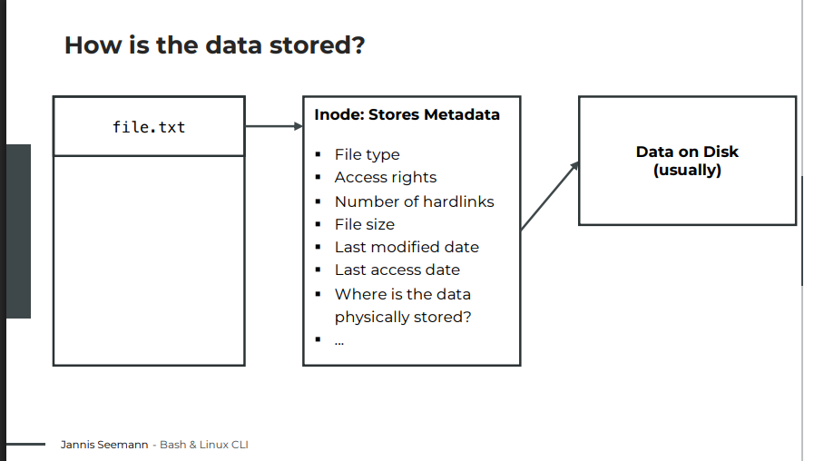

- On most Linux file systems (like ext4), files are managed through a structure called an Inode:
  - Filename: The name we see (e.g., file.txt) points to an Inode.

  - Inode: This stores all metadata (permissions, size, etc.) and the physical location of the data on the disk, but not the filename itself.

  - Data Blocks: The actual content stored on the disk. For a folder, the "data" is simply a list of the files and Inodes it contains.

- Note: While older spinning hard drives (HDD - Hard Disk Drive) required "defragmentation" to keep data blocks together for speed, modern SSDs handle split data blocks efficiently without performance loss.

## The Unix Philosophy: "Everything is a File"

- In Unix, almost everything—including hardware—is represented as a file. There are several types:
  - Ordinary Files: Standard text or binary data.

  - Directories: Folders (which are technically special files containing a list of other files).

  - Links: Symbolic links (shortcuts).

  - Special Files: Hardware devices (character/block devices) , named pipes, and sockets for process communication.

### Identifying File Types in the Terminal

- To see file details, use the command `ls -l`. The first character of the output indicates the file type:
  - `-` : Ordinary file
  - `d` : Directory
  - `l` : Symbolic link
  - `c` : Character devices
  - `b` : block devices
  - `p` : pipes
  - `s` : Sockets
- Hidden Files: Any file or folder starting with a dot (e.g., `.bashrc`) is hidden by default. To view them, use the `ls -la` command.

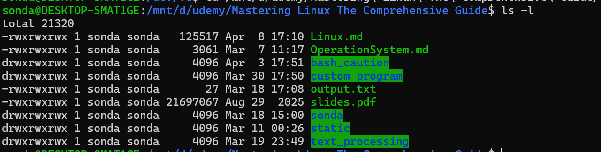

## Understanding file paths

### Absolute Paths

- Absolute paths define the complete address of a file or folder starting from the root of the system.
  - **Starting Point**: They always start with a forward slash (/), representing the root directory.

  - **Consistency**: They work from anywhere in the system, regardless of your current working directory.

  - **Special Shortcut**: The tilde (`~`) is also treated as an absolute path because the shell (Bash) automatically expands it to the full path of your home directory (e.g., /home/username) before running the command.

Examples:

- `/home/giannis/Desktop`
- `~/Desktop`
- `/etc/network`

### Relative Paths

- Relative paths define a location relative to your Current Working Directory (PWD).
  - Starting Point: They do not start with a slash. They start with a folder name or a special dot notation.

  - Dependency: Their success depends entirely on where you are currently "standing" in the terminal.

- Common Notations:
  - `Desktop/` or `./Desktop/`: Look for a folder named "Desktop" inside the current folder.

  - `../`: Move one level up to the parent directory.

  - `../Documents`: Move one level up, then look for a folder named "Documents".

## Symbolic Links

- A symbolic link (Symlink or Softlink) is a special type of file that serves as a reference or a "shortcut" to another file or directory. Unlike Windows shortcuts, which are often just files recognized by the graphical interface, Unix symlinks are resolved at the system level, making them transparent to most applications.
- Key Characteristics
  - Path Reference: It stores the text of the destination path (target).
  - Runtime Resolution: The system resolves the link every time you access it. If the target is moved or deleted, the link becomes "broken."
  - Transparency: To the system and most applications, a symlink to a folder behaves exactly like a real folder.

### Working with Symlinks via CLI

- Create a Symlink: `ln -s [target_path] [symlink_name]`
  - The `target_path` and `symlink_name` should be absolute paths.You shouldn't use a dot `.` in the file path.
- Identify a Symlink and View Destination: `ls -l` (Look for `l `as the first character in the permissions string)
- Deleting a symbolic link (symlink) is straightforward and safe. Deleting the link only removes the "shortcut" and does not affect the original file or folder it points to
  - `rm symlink_name`: This is the most common method. Treat the symlink as if it were a regular file.
  - `unlink symlink_name`: This is a dedicated tool for removing links. It can only remove one link at a time and cannot delete actual directories.

### Why use Symbolic Links:

- Suppose we install version 2.6 of “foo,” which has the filename “foo-2.6,” and then create a symbolic link
  simply called “foo” that points to “foo-2.6.” This means that when a program opens the file “foo,” it is actually opening the file “foo-2.6.” Now everybody is happy. The programs that rely on “foo” can find it, and we can still see what actual version is installed. When it is time to upgrade to “foo-2.7,” we just add the file to our system, delete the symbolic link “foo,” and create a new one that points to the new version. Not only does this solve the problem of the version upgrade, it also allows us to keep both versions on our machine. Imagine that “foo-2.7” has a bug (damn those developers!), and we need to revert to the old version. Again, we just delete the symbolic link pointing to the new version and create a new symbolic link pointing to the old version

```bash
ln -s /mnt/d/udemy/Mastering\ Linux\ The\ Comprehensive\ Guide/ ~/udemy_linux
```

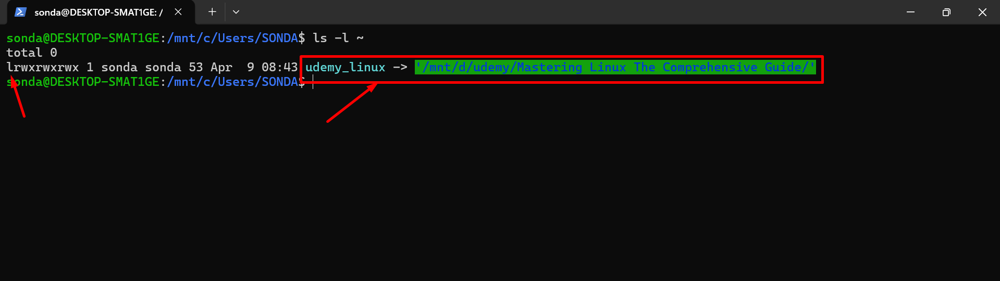

## Hard Links

### What is hardlink?

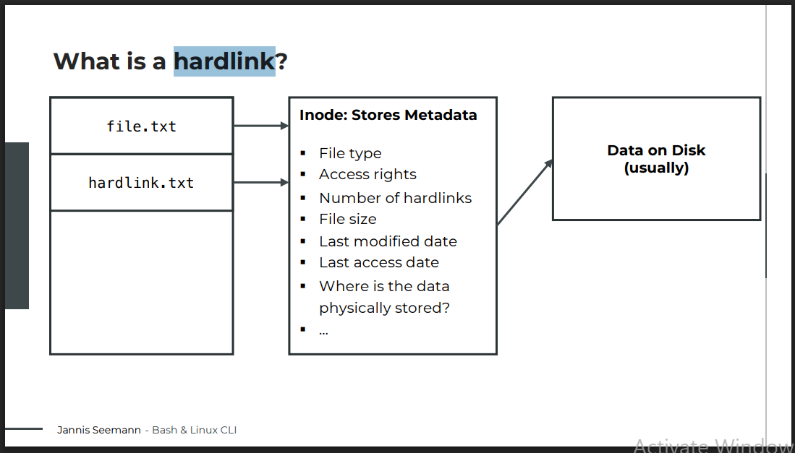

- A hard link is essentially an additional name for an existing file. Unlike a symbolic link (shortcut) which points to a path, a hard link points directly to the inode—the data structure on the disk that stores everything about a file except its name and the actual data content.

### How it Works

- **When you create a file**, you are creating its first hard link. The file system uses an inode to store the file's metadata (permissions, type, size) and the pointers to where the actual data lives on the disk

- **Shared Identity**: Multiple hard links point to the same inode. This means they share the same permissions, owner, and data. If you change the content of one, the other reflects that change immediately because they are the same data.

- **Reference Counting**: The inode keeps track of how many hard links point to it. The second column in the `ls -l` output, after the permission information.

- **Deletion Logic**: If you delete a hard link, the data remains on the disk as long as at least one other hard link still exists. The data is only deleted when the hard link count reaches zero.

### Working with hard link via CLI

#### Creating a Hard Link

- Use the `ln` command without any flags

```bash
ln target_file link_name
```

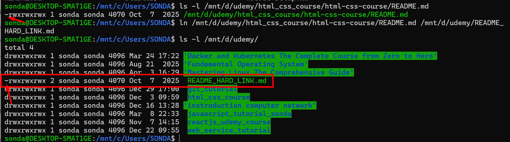

- No Directories: You cannot create hard links for directories to prevent infinite loops in the file system structure

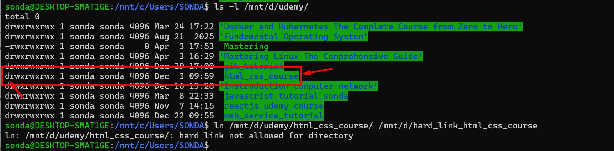

- Same File System Only: Hard links cannot cross physical partitions or disk boundaries because inode numbers are only unique within a specific file system

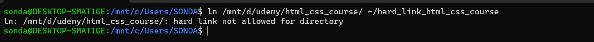

```
PHYSICAL DISK (SSD 512GB)         |       LOGICAL TREE (Linux)
======================================== | ========================================
                                         |
 [ /dev/nvme0n1 ]                        |            [ Root Directory ]
 +------------------------------------+  |                   /
 | Partition 1 (200GB)                |--|--[Mount]-->     /
 | (File System A)                    |  |                 /etc, /bin, /var
 | Inodes: 1 to 500,000               |  |
 +------------------------------------+  |
 |          DISK BOUNDARY             |  | <--- CANNOT CROSS WITH HARD LINK
 +------------------------------------+  |
 | Partition 2 (312GB)                |--|--[Mount]-->     /home
 | (File System B)                    |  |                   └── /sonda
 | Inodes: 1 to 800,000               |  |
 +------------------------------------+  |
```

#### Identify a Symlink and View Destination

```bash
ls -l
```

- Appearance: To the user and most applications, a hard link looks like a regular, independent file

#### Copy files with a hard link

- You can "copy" a directory structure using hard links for the files to save space:

```bash
cp -al source_folder destination_folder
```

- `-a`: Archive mode (preserves attributes and recurses).

- `-l`: Create hard links instead of copying the actual data.

- Result: A new folder structure is created, but the files inside point to the original data blocks.

#### Deleting

- Basic Deletion
  - What happens? The system reduces the link count of the inode by 1.
  - Is the data deleted? Only if the link count reaches zero. If another name (the original file or another hard link) still points to that data, the data remains on the disk.

```bash
rm link_name
# OR
unlink link_name
```

##### How to Completely Delete Data (Find all Hard Links).

- If your goal is to wipe the data entirely, you must find and delete every file name associated with that specific Inode.

- Step 1: Identify the Inode number

```bash
ls -i filename
# Output example: 1234567 filename (1234567 is the Inode)
```

- Step 2: Find all filenames sharing that Inode

```bash
find /path/to/search -inum 1234567
```

-Step 3: Delete them all

```bash
find /path/to/search -inum 1234567 -delete
```

## Hard Links vs. Symbolic Links

| Feature              | Hard Link             | Symbolic Link (Symlink)     |
| -------------------- | --------------------- | --------------------------- |
| Points to            | Inode (Physical Data) | File Path (String)          |
| Cross File Systems   | No                    | Yes                         |
| Link to Directories  | No                    | Yes                         |
| If original is moved | Link still works      | Link breaks (Dangling link) |

## Inode

### What is an Inode?

- An **inode** (index node) is a data structure on a file system that stores information about a file or directory (such as ownership, permissions, and location on the disk), but not the actual content or the filename itself.
  - The Process: A directory entry points to an inode. The inode points to the data blocks on the disk.
  - The Limitation: Inodes are stored in a centralized table that is created when the file system is first formatted. This space is fixed; you cannot simply "expand" it like a regular folder without risk.

### Monitoring Inodes

- You can check your current inode usage using the df (disk free) command with specific flags:

```bash
df -ih
```

- `-i`: Displays inode information instead of block usage.

- `-h`: "Human-readable" format (showing numbers in thousands/millions).

- The output shows the total inodes available, how many are used, and the percentage of usage. Even if your disk is only 10% full of data, you could be at 100% inode usage if you have millions of tiny files.

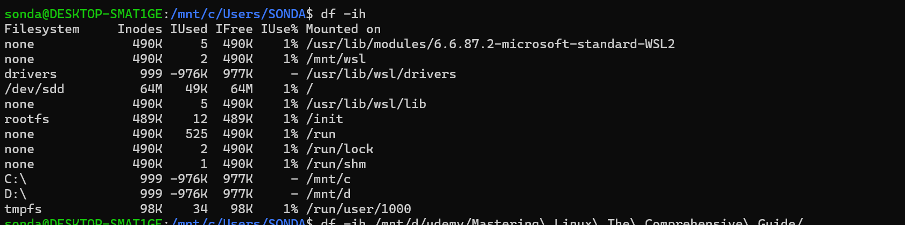

### Identify physical disk partitions or boundaries of a file

```bash
df -ih <target_path>
```

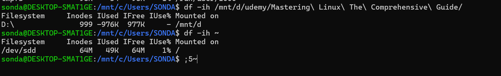

### The Problem: Reaching the Limit

- If you run out of inodes, the system cannot create new files, even if there are gigabytes of free space. This can cause:
  - Applications to crash or fail to start.
  - System-wide instability or OS crashes.
  - Specific issues with environments like JavaScript/Node.js, which often install hundreds of thousands of small dependency files (e.g., node_modules).

### Solutions to Inode Exhaustion

- If you hit the limit, you have several strategies to fix it:
  - Delete Unnecessary Files: Clear out old logs, temporary files, or cache.

  - Archive Files (The "Tar" Method): Move many small files into a single .tar archive. A .tar file contains many files but consumes only one inode on the host file system.

  - Mount Additional Drives: Add a new physical or virtual drive and "mount" it to a specific folder to provide a fresh pool of inodes.

  - Reformat the File System: Recreate the file system with a higher inode density (usually done on a new drive to avoid data loss).

## The difference between Buffered and Unbuffered I/O

### What is an I/O Device?

- An I/O device is any hardware or interface that generates input or receives output.
  - Storage: Hard drives or SSDs.
  - Peripherals: Keyboards, mice, and sensors.
  - Connectivity: Network connections (often treated as files in systems like Linux).

### Unbuffered I/O

- In unbuffered I/O, data is handled directly between the device and the program. Every single piece of data (even a single byte) is processed immediately as it arrives or is sent.

- Advantages:
  - Real-time: Provides immediate access to data with no delays.

  - Precision: Gives the application total control over timing.

  - Use Cases:
    - Mouse Movements: You need the cursor to move instantly; waiting for a buffer to fill would cause lag. Try this command `sudo cat /dev/input/mice` to see how unbuffered I/O work
    - Keyboard Input: Capturing keystrokes in real-time.
    - Sensors: Reading critical, immediate environmental data.

### Buffered I/O

- Buffered I/O uses a temporary storage area (a buffer) to hold data before it is sent to its final destination. Instead of many small, individual transfers, data is collected and moved in larger "chunks."

- Advantages:
  - Efficiency: Reduces the number of system calls or physical operations (like disk spins), which are "expensive" in terms of processing power.
  - Performance: Significantly faster for large-scale data transfers.
  - Integrity: Easier to perform error checks on a 1KB block of data than on individual bytes.

- Use Cases:
  - Reading/Writing Files: It is much faster to read a block of a file into memory than to access the disk for every single character.
  - Network Transfers: Sending large packets of data at once rather than bit by bit.

| Feature       | Unbuffered I/O                         | Buffered I/O                           |
| ------------- | -------------------------------------- | -------------------------------------- |
| Data Handling | Direct / Immediate                     | Accumulated in temporary storage       |
| Speed         | Slower for large tasks (more overhead) | Faster for large tasks (less overhead) |
| Latency       | Extremely low (Real-time)              | Higher (Waiting for buffer to fill)    |
| Best For      | Mice, keyboards, real-time sensors     | Hard drives, file transfers, streaming |

## How devices are handled within a Unix-based system

- The core philosophy is that **"everything is a file," or more accurately, "everything is a stream of bytes."**

### What is a Device?

- A device refers to a physical or virtual entity that can be accessed through a file-like interface
- Devices in Unix serve as the interface between the operating system and various hardware or virtual components
- They allow applications and users to interact with these components by reading from and writing to their
  corresponding device files

### Main Types of Devices

- The lecture distinguishes between two primary categories based on how data is accessed:

| Type             | Indicator (`ls -l`) | Data Handling                                                                | Example                           |
| ---------------- | ------------------- | ---------------------------------------------------------------------------- | --------------------------------- |
| Character Device | c                   | Unbuffered: Accesses data byte-by-byte (or character-by-character) directly. | Keyboards, Virtual Terminals      |
| Block Device     | b                   | Buffered: Groups bytes into blocks (e.g., 512 bytes) to improve performance. | Hard drives (HDD/SSD), USB drives |

- Pseudo-Devices: Not all devices represent physical hardware. Pseudo-devices (or virtual devices) provide specific system features.
  - Example: A partition like `/dev/sda1` is a pseudo-device because it represents a logical section of a physical disk (`/dev/sda`)

### Practical Interaction

- The `/dev` Directory: This is where the operating system stores all device files

```bash
cd /dev
ls -l
```

- Modern terminal windows are pseudo-devices. If you find the device path for one terminal (using the `tty` command). You can send text to it from a completely different terminal window by redirecting output
- The `tty` command in Linux displays the name of the terminal device linked to your standard input. In simple terms, it shows which terminal session you're currently using

```bash
# open terminal 1
tty
# /dev/pts/0
```

```bash
# open terminal 2
tty
# /dev/pts/2

# send text to terminal 1
echo 'SONDA vo doi' >/dev/pts/0
```

## Example pseudo devices

### The "Black Hole": `/dev/null`

- This is arguably the most used pseudo device. It is a data sink.

- Writing to it: Any data sent here is immediately discarded (deleted).

- Reading from it: It always returns an "End of File" (EOF) marker, essentially acting as an empty file.

- Use Case: Use it to silence a chatty program by redirecting its output: `command > /dev/null`.

```bash
ping google.com >/dev/null 2>/mnt/d/error.txt
```

### Random Data Generators

- Linux provides two main ways to get random numbers directly from the kernel. These rely on Entropy, which is randomness collected from "noise" like keyboard timings, mouse movements, or hardware sensors.

#### `/dev/random` (The High-Security Version)

- Behavior: It only provides data as long as there is enough "noise" (entropy) available. If the system runs out of entropy, the file blocks (stops outputting) until more noise is generated.

- Best for: Cryptographic keys or high-security operations where "true" randomness is required.

```bash
cat /dev/random >~/random.tx
```

#### `/dev/urandom` (The Faster Version)

- Behavior: It stands for "unlimited random." It reuses entropy. If it runs out of environmental noise, it uses a formula to keep generating "pseudo-random" data. It never blocks.

- Best for: Most general-purpose scripts or generating random files for testing

### Standard Streams: `stdin`, `stdout`, and `stderr`

- Every time you run a command, it automatically opens these three "files" located in `/dev/`

| Device Path | Purpose                                                         |
| ----------- | --------------------------------------------------------------- |
| /dev/stdin  | Where the program reads its input (usually the keyboard).       |
| /dev/stdout | Where the program sends its normal data (usually the terminal). |
| /dev/stderr | Where the program sends error messages.                         |

- Why this matters: When you type `echo 'Hello'`, the text isn't just "appearing"; the program is literally writing that string to the file `/dev/stdout`. When you use a redirect (`>`), you are simply telling the shell to swap `/dev/stdout` for a different file (like `echo 'Hello' > hello.txt` ).

## `/proc` directory

- The files in `/proc` are "virtual," meaning they are generated on the fly by the kernel to provide real-time data

### `/proc/cpuinfo`

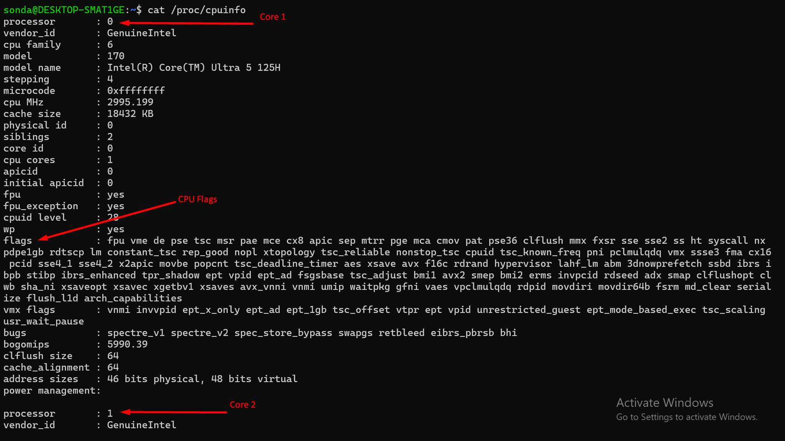

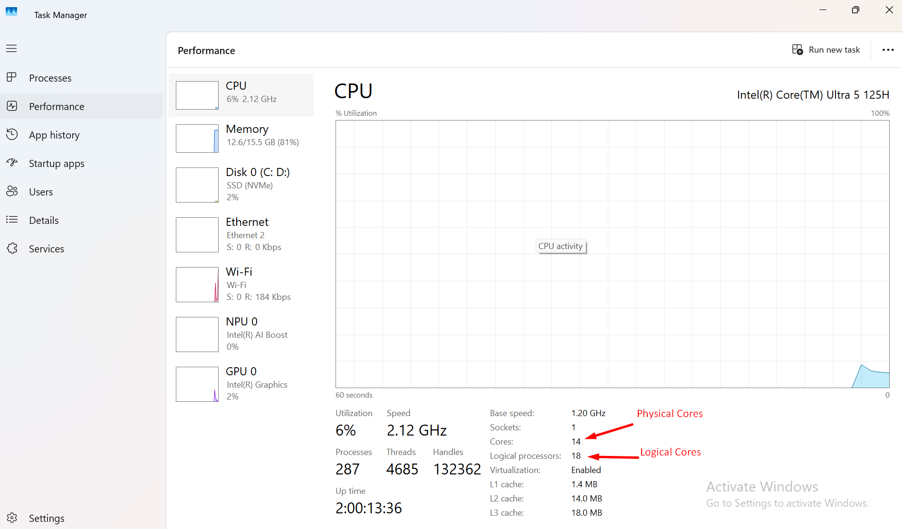

- Logical vs. Physical Cores: It lists how the operating system sees the cores. Due to Hyperthreading, one physical core may appear as two logical cores
- CPU Flags: These indicate specific instruction sets (like matrix multiplication) that can significantly boost performance for tasks like video transcoding or data processing.

### `/proc/meminfo`

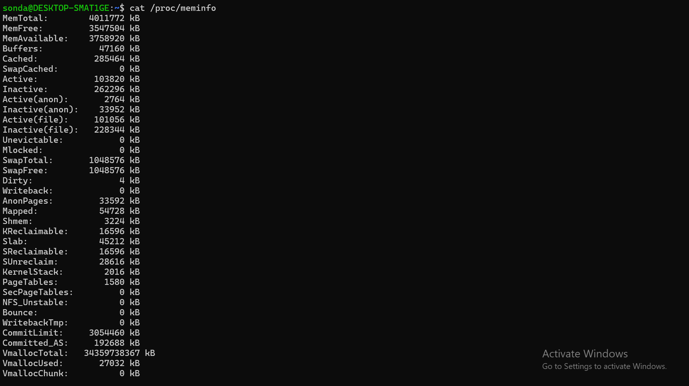

- Provides a breakdown of system memory (RAM). It shows total, free, and available memory, allowing users to verify if they are receiving the RAM promised by a provider

### `/proc/version`

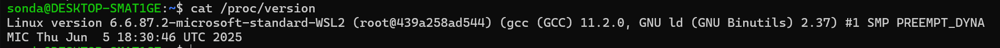

- Displays the Linux kernel version, the specific distribution, and the version of the compiler (GCC) used to build the kernel

### `/proc/uptime`

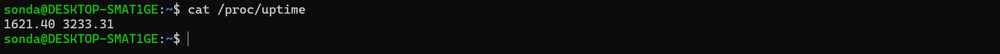

- Shows two numbers in seconds: how long the system has been running and how much total time the cores have spent idling

### `/proc/loadavg`

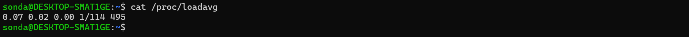

- Monitors system load over the last 1, 5, and 15 minutes (number of currently running processes /number of threads) and shows the number of currently running processes and the last Process ID (PID) created.

## File system hierachy

- Linux uses a hierarchical filesystem structure. It is similar to an upside-down tree, with the root (`/`) at the base of the filesystem. From that point, all the branches (directories) spread throughout the filesystem.
- `/`: Root directory. The root for all other directories.
- `/bin`: Essential command binaries. The place where binary programs are stored.
  - Many modern distributions (like Ubuntu) are merging `/bin` into `/usr/bin`
  - In these cases, `/bin` is no longer a physical folder but a symbolic link (symlink) pointing to `/usr/bin` to simplify the structure
- `/boot`: Static files of the boot loader. The place where the kernel bootloader, and initramfs are stored
- `/dev`: Device files. Nodes to the device equipment, a kernel device list.
  - Examples: `/dev/sda` (a hard drive), `/dev/tty` (terminal devices), or `/dev/null` (a virtual "black hole" for data)
- `/etc`: Host-specific system configuration. Essential config files for the system, boot time loading scripts, crontab, fstab device storage tables, passwd user accounts file.
  - These are typically plain text files that can be edited to change system behavior.
- `/home`: user Home directory. The place where the user’s files are stored.
  - Structure: Each user has their own subfolder (e.g., /home/username).
  - Permissions: For security, users typically cannot access each other's home folders.
  - Content: Contains personal documents, downloads, and user-specific configuration files.
- `/lib`: Essential shared libraries and kernel modules. Shared libraries are similar to Dynamic Link Library (DLL) files in Windows.
  - Contains library files that supports the binaries located under `/bin` and `/sbin`
  - Depending on the system, we might also have additional lib folders for additional architectures. Example Example: `/lib32`, `/lib64`
  - Similar to `/bin`, these are increasingly becoming symbolic links to `/usr/lib` in modern distributions.
- `/media`: Mount point for removable media. For external devices and USB external media.
- `/mnt`: Mount point for mounting a filesystem temporarily. Used for legacy systems.
- `/opt`: Add-on application software packages. The place where optional software is installed.
- `/proc`: Virtual filesystem managed by the kernel. a special directory structure that contains files essential for the system.
- `/run`: Run-time data
  - Files here will be removed / emptied during boot, or will be discarded on shutdown
- `/sbin`: Essential system binaries. Vital programs for the system’s operation.
- `/srv`: Data for services provided by this system.
- `/sys`: Information about devices, drivers and kernel features
- `/tmp`: Temporary files.
  - Contains temporary files created by system and users
  - These files are typically deleted on reboot
  - To prevent apps from snooping on each other, modern Linux uses "private" temporary folders (often via systemd). While an app thinks it’s writing to `/tmp`, it is actually writing to a isolated sub-folde
- `/usr`: Despite the name, it doesn’t hold "user files" (those are in /home). Instead, it holds shareable, read-only system resources. In theory, if you lost this folder, your personal data would be safe, but the OS wouldn't function until you reinstalled the software packages.
- `/usr/bin` – system-executable files
- `/usr/lib` – shared libraries from `/usr/bin`
- `/usr/local` – source compiled programs not included in the distribution
- `/usr/sbin` – specific system administration programs
- `/usr/share` – data shared by the programs in /usr/bin such as config files, icons, wallpapers or sound files
- `/usr/share/doc` – documentation for the system-wide files
- `/var`: Variable data. Only data that is modifiable by the user is stored here, such as databases, printing spool files, user mail, and others. Backup Priority: This is arguably the most important folder to back up because it contains your unique data (databases, emails, web content).
  - `/var/log` – contains log files that register system activity
  - `/var/www` - Website files (for servers like Apache or Nginx).
  - `/var/lib` - Databases (like MySQL or PostgreSQL).

## Important Facts About Filenames

- On Linux systems, files are named in a manner similar to that of other systems such as Windows, but there are some important differences.
- Filenames that begin with a period character are hidden (Example `.index.html`). This only means that ls will not list them unless you say `ls -a`. When your account was created, several hidden files were placed in your home directory to configure things for your account. In Chapter 11 we will take a closer look at some of these files to see how you can customize your environment. In addition, some applications place their configuration and settings files in your home directory as hidden files.
- Filenames and commands in Linux, like Unix, are case sensitive. The filenames `File1` and `file1` refer to different files.
- Though Linux supports long filenames that may contain embedded spaces and punctuation characters, limit the punctuation characters in the names of files you create to period, dash, and underscore. Most important, do not
  embed spaces in filenames. If you want to represent spaces between words in a filename, use underscore characters. You will thank yourself later.
- Linux has no concept of a “file extension” like some other operating systems. You may name files any way you like. The contents or purpose of a file is determined by other means. Although Unix-like operating systems don’t use file extensions to determine the contents/purpose of files, many application programs do.

## Exploring the Linux filesystem from the command line

- Feel free to explore the filesystem yourself by using the tree command. In Fedora Linux, it is already
  installed, but if you use Ubuntu, you will have to install it by using the following command

```bash
sudo apt install tree
```

- You can use the ls command to list the contents of directories, but tree offers different graphics. The following image shows you the differences between the outputs


- In our example, the command will go down one level, starting from the root directory, represented by the forward slash as an argument

```bash
tree -L 1
```

# Managing Users and Groups

## Managing users

- In this context, a user is anyone using a computer or a system resource. In its simplest form, a Linux
  user or user account is identified by a name and a unique identifier, known as a UID.

### Linux has different kind of users

- Linux categorizes users based on their role and level of access to the system:
  - **System Accounts/ Service users**:
    - These are used to run background tasks and services (like web servers or databases). Notably, they usually do not have a home directory.
    - Accounts like `sshd`, `www-data`, or `mysql`. They aren't meant for humans to log into; they exist so that if a web server is hacked, the attacker is "trapped" within that service user's limited permissions

  - **Regular Users**:
    - These are standard accounts created for people.
    - They have a dedicated home directory for personal files.
    - They are restricted from accessing other users' files or performing administrative tasks by default.
    - Limited privileges
    - We can allow regular users to temporarily get root access through `sudo` command

  - **Superuser/Root** :
    - This is the most powerful account on the system. Highest privileges
    - It has unrestricted access to every file and setting.
    - It can add/remove users, install software, and modify system configurations.
    - It has the user ID: 0
    - There can only be one root user on the system

### Groups

- All users have a primary group
- And can be assigned to zero to unlimited additional groups

### On Linux, user information is stored in various files

#### Basic account info - `/etc/passwd`

- Contains basic user account information
- Username, user ID (UID) , group ID (GID), user description (fullname), home directory and default shell
- Readable by all users
- The Shell (`/bin/bash` vs `/usr/sbin/nologin`): In `/etc/passwd`, the last field defines what happens when a user logs in. For service users, it is set to `nologin` or `false` to prevent anyone from getting a command prompt through that account.
- Linux internals actually care about the number (UID). If you see a file owned by 1001 instead of a name, it means the user was deleted, but the UID remains on the file

```bash
cat /etc/passwd

# sonda:x:1000:1000:,,,:/home/sonda:/bin/bash
# sonda - user
# 1000 - User Id
# 1000 - Group ID
# /home/sonda - Home directory
# /bin/bash - Default shell should be launched when user login
```

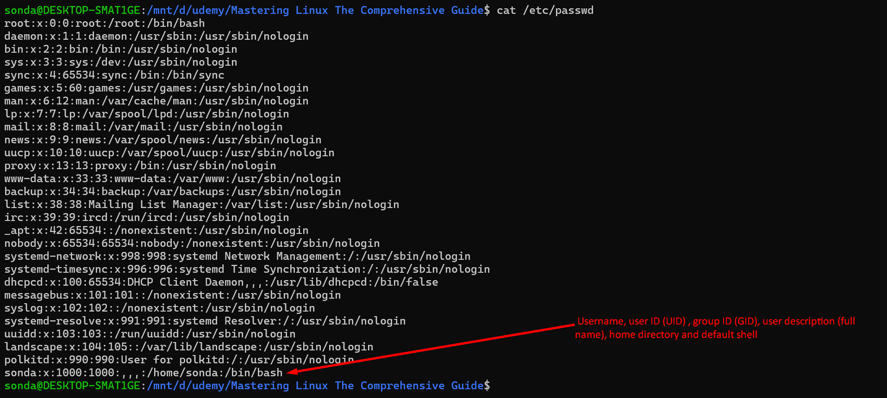

#### Encrypted passwords and aging info - `/etc/shadow`

- Stores encrypted user passwords and password aging information
- Also stores additional information, such as the date of the last password change, expiry dates,...
- Readable only by the root users (or users with root privileges)

```bash
sudo cat /etc/shadow
```

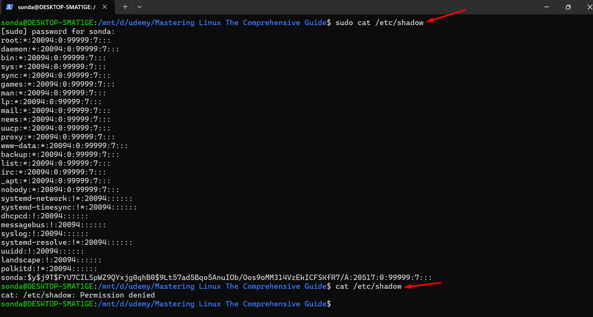

#### List of groups and their members - `/etc/group`

- Contains information about the groups, and their members
- Readable by all users

```bash
cat /etc/group

# sonda:x:1000:
# This is the primary group of sonda user
# docker:x:1001:sonda
# docker - group name
# sonda: The user is a member of the Docker group
```

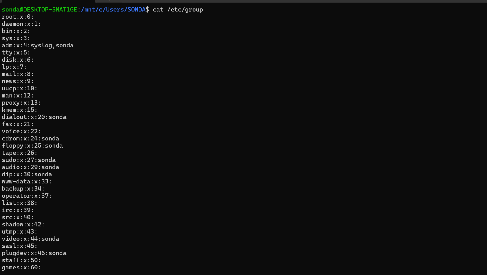

## Understanding sudo

### Elevating privileges: `sudo`

- The root user is the default superuser account in Linux, and it has the ability to do anything on a
  system. Ideally, acting as root on a system should generally be avoided due to safety and security
  reasons.
- With `sudo`, Linux provides a mechanism for promoting a regular user account to superuser
  privilege.
  - **Temporary Elevation**: It doesn't turn you into the root user permanently; it only elevates the specific command you are running.

  - **Authentication**: When using sudo, the system asks for your user password, not the root password.

  - **Configuration**: Not all users can use sudo. During installation (Ubuntu/CentOS), a user must be designated as an "administrator" or added to the "sudoers" list to have this ability.

- Syntax `sudo command [-option(s)] [argument(s)]`

```bash
ls /root
# ls: cannot open directory '/root': Permission denied

sudo ls /root
# snap
```

- Built-in command can't run with sudo command

```bash
sudo cd vandtt
# sudo: "cd" is a shell built-in command, it cannot be run directly.
```

- The "Nuclear" Warning: Risk of High Privileges
  - The most critical takeaway is that sudo removes the system's "safety rails." To demonstrate, the instructor runs a destructive command: `sudo rm -rf /etc`

  - The Result: This command deletes the /etc folder, which contains essential system configuration files.

  - The Aftermath: Upon rebooting, the system fails to load, showing multiple "Failed" messages.

  - Lesson: Always **double-check** commands before using sudo. In a real-world environment (not a Virtual Machine), this would result in catastrophic data loss and system failure.

# Linux Software Management

- In Linux, applications come bundled into **repositories**. A **repository** is a centrally managed location that consists of software packages maintained by developers
- Each Linux distribution comes with several official repositories, but on top of those, you can add some new ones
  - Ubuntu uses deb packages, as it is based on Debian
  - Fedora (or Rocky Linux and AlmaLinux) uses rpm packages, as it is based on RHEL

## The DEB package’s anatomy

### Updating the Package List

- Before installing or upgrading software, you must synchronize your local database with the online repositories.

- Command: `sudo apt update`

- Purpose: This does not install new software. It only refreshes the list of available packages and their versions.

- Note: This requires sudo (root privileges) because it accesses protected system files.

### Upgrading Software

- Once the list is updated, you can move to the actual upgrade process.
- Command
  - `sudo apt upgrade`: Performs a "small" upgrade. It updates existing packages and, in the apt version, will install new dependencies if required.

  - `sudo apt full-upgrade` (or dist-upgrade): Performs a "large" upgrade. It can install new packages or remove existing ones if they conflict with the upgrade. It is more thorough but carries a slightly higher risk of changing system behavior.

- Kernel Updates: If the system upgrades the kernel (the core of the OS), a reboot is usually required.

### Managing Packages (Install/Remove)

- The lecture demonstrates how to add or take away specific tools:

- Install: `sudo apt install <package_name>` (e.g., cowsay `sudo apt install cowsay`).

- Remove: `sudo apt remove <package_name>`.

- Cleanup: `sudo apt autoremove` deletes packages that were installed as dependencies but are no longer needed by any current software. This is a common troubleshooting step for resolving upgrade conflicts.

### `apt` vs. `apt-get`

- The instructor notes that while apt and apt-get are often used interchangeably, there is a subtle difference:

- `apt upgrade` will install new dependencies if needed.

- `apt-get upgrade` generally will not install new dependencies; it only updates what is already there.

## The RPM packages anatomy

### Updating the System

- In CentOS, keeping the system current is straightforward because the package manager automatically handles list refreshes.

- Commands: `sudo dnf upgrade` or `sudo dnf update`.

- Key Difference from Ubuntu: Unlike `apt`, you do not need a separate "update" command to refresh package lists; DNF does this automatically before upgrading.

- Rebooting: If the kernel is updated, a system restart is strongly recommended to apply the changes.

### Managing Software (Install/Remove)

- Install: `sudo dnf install <package_name>`

- Remove: `sudo dnf remove <package_name>`

- Legacy Support: The older command `yum` still works as an alias for `dnf` for those familiar with older versions of CentOS.

## Enabling Additional Repositories

- Additional repositories are third-party or non-standard software sources added to a Linux system to install specific applications not available in default repositories
- Example on CentOS
  - Install EPEL: `sudo dnf install epel-release` (This adds new "servers" or sources for software).

  - Enable CodeReady Builder (CRB): Many EPEL packages require the CRB power tools. This is enabled via `sudo crb enable`.

  - Refresh: Run `sudo dnf update` again to sync the newly added lists.

  - Security: You may be asked to confirm GPG keys (digital signatures) during installation to ensure the software is authentic.

# Introducing the Linux shell

## What is a shell?

- Linux has its roots in the Unix operating system, and one of its main strengths is the **command-line interface**. In the old days, this was called the **shell**
- The shell is a program that has two streams: an input stream and an output stream. The input is a
  command given by the user, and the output is the result of that command, or an interpretation of it.
- In other words, the shell is the primary interface between the user and the machine
- The main shell in major Linux distributions is called **Bash**, which is an acronym for Bourne Again
  Shell, named after Steve Bourne, the original creator of the shell in UNIX
- Alongside Bash, there are other shells available in Linux, such as **ksh**, **tcsh**, and **zsh**

- One shell can be assigned to each user. Users on the same system can use different shells. One way
  to check the default shell is by accessing the command

```bash
cat /etc/passwd | grep <<user>>

# <<user>> is user account in linux system
```

- An easier way to see the current shell is by running the following command

```bash
echo $0
```

## Identifying Commands

### Shell command types - `type`

- **Internal commands** are built inside the shell
- **External commands** are installed separately
- For example, you can check what type of command `cd` (change directory) is

```bash
type cd
# cd is a shell builtin
```

### Display an Executable’s Location - `which`

- To determine the exact location of a given executable, the which command is used

```bash
which ls

# /bin/ls
```

## Explaining the command structure

- In a nutshell, Unix and Linux commands have the following form:
  - The command’s name
  - The command’s options
  - The command’s arguments

```bash
command [-option(s)] [argument(s)]
```

## Consulting the manual

- Almost all commands in Linux have a `--help` option. You can use this for quick reference.

```bash
 <<commnad_name>> --help

# commnad_name is name of command
```

- The `man` command is the standard way to read comprehensive, built-in manuals for almost any program. Syntax `man [command]`

## Wildcards (File name expansion - Globbing)

- Globbing is the process where Bash rewrites or expands a command before it is executed. It uses wildcard characters to search for files that match a specific pattern.
  - The Power of Bash: Instead of moving 100 files manually, a single command with a wildcard can handle them all instantly.

  - Pre-execution: The shell expands the pattern into a list of filenames before the actual command (like mv or cp) ever sees it

- Important Distinctions
  - Not Regular Expressions: While they look similar, Globbing and Regular Expressions (Regex) use different syntax and rules. They are not the same thing.
  - Command Agnostic: Globbing is a feature of the shell, not the specific command. You can use it with `ls`, `mv`, `cp`, `echo`, and more.

### The Asterisk (`*`) Wildcard

- The most common wildcard is the asterisk, which matches **zero or more characters**

- Example: `mv *.jpeg images/`
  - Bash finds every file ending in `.jpeg` and replaces the `*.jpeg` part with the actual list of filenames.

- Versatility: It can be used anywhere in a string. For example, `echo *` will expand to every non-hidden file and folder in the current directory.

- Key Rules and Behaviors
  - Hidden Files: By default, the `*` wildcard does not match hidden files (those starting with a dot).
  - Failed Matches: `*` In Bash: If no files match the pattern, Bash treats the pattern as a literal string (e.g., it looks for a file actually named `*.jpeg`)
  - Quoting: To disable globbing, wrap the pattern in quotes (e.g., `'*.jpeg'`). This is useful if you actually have a file with a `*` in its name and don't want the shell to expand it.

### The Single Character Wildcard (?)

- Unlike the asterisk (which matches any number of characters), the question mark matches exactly one character.

- Use Case: If you have files like `IMG_1.jpg` and `IMG_A.jpg`, using `IMG_?.jpg` will find both.

- Example from lecture: `IMG_?6677.*` matches files where only one character varies between the prefix and the numbers.

### Square Brackets ([]) and Ranges

- Square brackets allow you to define a set or a range of characters for a single position in the filename.

- Numeric Ranges: `[0-9]` matches any single digit.

- Alphabetic Ranges: `[a-z]` matches any single lowercase letter.

- Manual Sets: `[abc]` matches exactly one character, but only if it is an 'a', 'b', or 'c'.

- Important Note: In standard globbing, if you want to match three digits, you must repeat the brackets three times (e.g., `[0-9][0-9][0-9]`). There is no "repeat" multiplier in basic globbing.

### The Globstar (`**`)

- The double asterisk is a powerful feature for recursive searching. It matches zero or more directories (including the slashes `/`) to find files in nested subfolders.

- Syntax: `**/*.jpg` searches the current folder and all subfolders for JPEG files.

- Requirements: `*` Supported in Bash 4.0 or higher.

- Often needs to be enabled manually with the command: `shopt -s globstar`.

- Pro Tip: The instructor recommends using the `**` followed by a slash to ensure you are looking into folders rather than just matching a folder name itself.

### Wildcards

| Wildcard        | Meaning                                                   | Example                               |
| :-------------- | :-------------------------------------------------------- | :------------------------------------ |
| `*`             | Matches **any** number of characters (including zero)     | `ls *.py` (All Python files)          |
| `?`             | Matches any **single** character                          | `ls file?.txt` (file1.txt, fileA.txt) |
| `[characters]`  | Matches any character that is a **member of the set**     | `ls [abc].txt` (file a, b, or c)      |
| `[!characters]` | Matches any character that is **NOT** a member of the set | `ls [!0-9].txt` (Non-numeric start)   |
| `[[:class:]]`   | Matches any character in a **predefined class**           | `ls [[:upper:]]*` (Uppercase files)   |

### Commonly Used Character Classes

- You need to remember that `[:upper:]` must be enclosed in another pair of square brackets `[]` to become a conditional expression.

| Character Class | Meaning                     | Matches                             |
| :-------------- | :-------------------------- | :---------------------------------- |
| `[[:alnum:]]`   | **Alphanumeric** characters | Any letter or digit (a-z, A-Z, 0-9) |
| `[[:alpha:]]`   | **Alphabetic** characters   | Any letter (a-z, A-Z)               |
| `[[:digit:]]`   | **Numerals**                | Any digit (0-9)                     |
| `[[:lower:]]`   | **Lowercase** letters       | Any small letter (a-z)              |
| `[[:upper:]]`   | **Uppercase** letters       | Any capital letter (A-Z)            |

- Example

```bash
# Find all files that start with a capital letter:
# Tìm tất cả các file bắt đầu bằng chữ cái viết hoa:
ls [[:upper:]]*

# Find files whose names end with at least one digit:
# Tìm các file có tên kết thúc bằng ít nhất một chữ số:
ls *[[:digit:]]

# Delete files whose names consist only of letters and numbers.
# Xóa các file có tên chỉ gồm các ký tự chữ và số
rm [[:alnum:]]*
```

### Pattern Examples

| Pattern                  | Matches                                                | Meaning                                                                 |
| :----------------------- | :----------------------------------------------------- | :---------------------------------------------------------------------- |
| `*`                      | All files                                              | Khớp với tất cả các file trong thư mục hiện tại.                        |
| `g*`                     | Any file beginning with **g**                          | Các file bắt đầu bằng chữ `g` (vd: `gmail`, `get_data.py`).             |
| `b*.txt`                 | Any file beginning with **b** and ending with **.txt** | File bắt đầu bằng `b`, sau đó là gì cũng được, kết thúc là `.txt`.      |
| `Data???`                | **Data** followed by exactly **3 characters**          | Khớp với `Data123`, `DataOld`, nhưng không khớp với `DataNewer`.        |
| `[abc]*`                 | Beginning with **a, b, or c**                          | Các file bắt đầu bằng một trong ba chữ cái `a`, `b`, hoặc `c`.          |
| `BACKUP.[0-9][0-9][0-9]` | **BACKUP.** followed by **3 numerals**                 | Khớp với các file backup có số thứ tự (vd: `BACKUP.001`, `BACKUP.999`). |
| `[[:upper:]]*`           | Beginning with an **uppercase letter**                 | Tất cả các file bắt đầu bằng chữ cái viết hoa.                          |
| `[![:digit:]]*`          | **Not** beginning with a **numeral**                   | Tất cả các file không bắt đầu bằng con số.                              |
| `*[[:lower:]123]`        | Ending with **lowercase** or **1, 2, 3**               | File kết thúc bằng một chữ cái thường hoặc một trong các số 1, 2, 3.    |

## Pitfalls of Globbing

### The Problem: File Names as Commands

- When you use a wildcard like `*`, Bash expands it into a list of every file in the directory before the command is executed. If a file in that directory happens to be named `-rf`, Bash will treat that filename as a command flag rather than a target file.
  - The Scenario: You have a file literally named `-rf`.

  - The Command: You run `rm *`.

  - The Result: Bash expands `*` to include `-rf`. The command effectively becomes `rm -rf [other files]`.

  - The Danger: This triggers a recursive, forced deletion. It will delete directories and subdirectories without asking for permission, potentially leading to permanent data loss.

- The Solution: Using `./*`
  - To prevent Bash from misinterpreting filenames as parameters, the lecture suggests a simple "best practice" adjustment to your syntax:
  - Instead of using `rm *`, use `rm ./*`
  - Why this works:
    - Explicit Pathing: By adding `./`, you are explicitly telling the shell that the expansion refers to a path in the current directory.
    - Neutralizing Flags: A file expanded as `./-rf` is seen by the system as a file path. Because it starts with a dot rather than a dash, the rm command will not interpret it as the "recursive/force" flag. It will simply try (and likely fail) to delete a file by name, leaving your directories safe.

## Standard streams: stdin, stdout, stderr

- The Three Standard Streams

| Stream Name     | File Descriptor | Purpose                                                             |
| --------------- | --------------- | ------------------------------------------------------------------- |
| Standard Input  | stdin (0)       | Data flowing into the program (usually from your keyboard).         |
| Standard Output | stdout (1)      | Normal data flowing out of the program (success messages, results). |
| Standard Error  | stderr (2)      | Error messages flowing out of the program (failure alerts).         |

### Redirecting Standard Output

- In Bash, you can redirect the output of a command away from the terminal and into a file using specific operators:

- The Overwrite Operator (`>`):
  - Usage: `command > file.txt`
  - Behavior: It takes the output of the command and writes it to the specified file. If the file doesn't exist, it creates it. If it does exist, it wipes the previous content and replaces it with the new output.

- The Append Operator (`>>`):
  - Usage: `command >> file.txt`

  - Behavior: Instead of overwriting, this adds the new output to the end of the existing file. This is ideal for logs or building a history of command results.

- You noticed a curious behavior: when a command fails (like trying to get the size of a non-existent file), the error message still prints to the screen instead of going into your file. Why this happens:
  - Bash uses different "channels" (file descriptors) for different types of output:
    - **Standard Output** (stdout): This is for successful program data. It is represented by the number 1.
    - **Standard Error** (stderr): This is specifically for error messages. It is represented by the number 2.
  - When you use `>` or `>>`, you are—by default—only redirecting stdout (1). The error messages on stderr (2) remain linked to your terminal screen.

### Why Redirection Sometimes "Fails"

- When you use the `>` or `>>` operators without a number, Bash assumes you are talking about **Stream 1 (stdout)**.Example `du -h output.txt`
  - The Success Case: When `du -h` finds your file, it sends the size to **Stream 1**. Your redirection captures it and puts it in the file.

  - The Error Case: When `du` can't find a file, it sends the "No such file" message to **Stream 2** (stderr).

  - The Result: Because your redirection was only listening to **Stream 1**, **Stream 2** remains "unplugged" and defaults to its original destination: your screen.

## Redirect Standard Error

### Why Redirect Standard Error?

- There are two primary reasons to redirect stderr:
  - To Silence Noise: If a program produces irrelevant error messages, you can redirect them to a "null" location so they don't clutter your terminal or interfere with scripts.

  - To Log for Later: If you run a high-output program (like a daily automated task), you might want to discard the successful output but save the errors into a file to review them later.

### Redirection Syntax

- Redirecting stdout (Stream 1):
  - Short version: `command > file.txt`

  - Verbose version: `command 1> file.txt`

- Redirecting stderr (Stream 2):
  - Captures errors only: `command 2> error.txt`

  - Appends errors to the file instead of overwriting `command 2>> error.txt`

- Combined Redirection:
  - Sends successes to one file and errors to another: `command > output.txt 2> error.txt`

  - Verbose version: `command 1> output.txt 2> error.txt`

## Redirect stderr to stdout

### Why Redirect stderr to stdout?

- Unified Logging: It allows you to store both normal program output and error messages in a single file without having to list the filename multiple times in your command.

- Piping: Standard Linux pipes (`|`) only pass **stdout** to the next command. If you want to filter or process error messages using a tool like grep, you must first redirect **stderr** into the **stdout** stream.

### The Syntax

```bash
command > out.txt 2>&1
```

- `> out.txt`: Redirects stdout to the file.

- `2>&1`: Redirects stderr to the same destination as stdout.

### Redirection is Sequential

- When you run a command, the shell doesn't look at all the redirections as one single instruction. Instead, it processes them **step-by-step** from left to right before the command even starts

#### Case 1: The Successful Redirect (`> file 2>&1`)

- In this scenario, the shell follows these steps:

- `> out.txt`: The shell sees this first. it points stdout (1) to the file **out.txt**.

- `2>&1`: Next, the shell sees this. It says "make stderr (2) point to wherever stdout (1) is pointing right now." Since stdout is already pointing to the file, stderr follows it there.

- Result: Both streams end up in the file

#### Case 2: The Failed Redirect (`2>&1 > out.txt`)

- When you swap the order, the logic breaks because of the timing:

- `2>&1`: The shell sees this first. At this exact moment, stdout (1) is still pointing to the terminal. So, the shell points stderr (2) to the terminal.

- `> out.txt`: Now the shell sees this. It moves stdout (1) to the file.

- The Conflict: You moved stdout, but you didn't move stderr! Stderr is still "stuck" pointing to the terminal because that's where stdout was when the mapping was made.

- Result: Errors hit your screen, while normal output goes to the file.

#### Summary

| Command               | Result  | Why                                                                |
| --------------------- | ------- | ------------------------------------------------------------------ |
| `command > file 2>&1` | Success | `1` (stdout) is redirected to file first; `2` (stderr) follows it. |
| `command 2>&1 > file` | Partial | `2` goes to terminal (old stdout); then `1` is redirected to file. |

## Disposing of Unwanted Output

- Sometimes “silence is golden” and we don’t want output from a command; we just want to throw it away. This applies particularly to error and status messages. The system provides a way to do this by redirecting output to a special file called `/dev/null`. This file is a system device often referred to as a bit bucket, which accepts input and does nothing with it. To suppress error messages from a command, we do this

```bash
ls -l /bin/usr 2> /dev/null

# Don't print error messages (stderr 2) to the terminal
```

## What about stdin

- By default, **stdin** is connected to your keyboard. When you run a command like `wc -l` (word count) or `cat` without specifying a file, the program doesn't finish; it waits for you to type.
  - Interactive Input: You type your data directly into the terminal.

  - Ending Input: To tell the program you are finished typing, you use **Ctrl + D**. This sends an "End of File" (EOF) signal, prompting the program to process what you wrote and exit.

## The Stdin Redirector (`<`)

- Just as we use `>` to push output into a file, we use `<` to pull data from a file and "pour" it into a command's input stream.

- Syntax: `command < file.txt`

- How it works: The shell opens the file and feeds its content into the command as if you were typing it manually.

## Chaining Concepts

- The true power of **stdin** is revealed when you combine it with **stdout** redirection. You can create a "pipeline" of data flow:

- Example: `cat < input.txt > output.txt`
  - The shell reads **input.txt**.

  - It feeds that text into `cat` via **stdin**.

  - cat outputs that text to **stdout**.

  - The shell redirects that **stdout** into **output.txt.**

## Pipes - Data processing through command chaining

### What is a Pipe?

- A pipe takes the **stdout** (Standard Output) of the command on its left and feeds it into the **stdin** (Standard Input) of the command on its right.

- Syntax: `command1 | command2 | command3`

- Visual: Think of it as a literal pipe where data flows from one "tank" (program) to the next

### Practical Examples:

- Counting Files `ls | wc -l`
  - `ls` lists the files.

  - The pipe (`|`) sends that list to `wc -l`.

  - `wc -l` counts the lines, effectively telling you how many files are in the folder.

- Filtering Errors `du file1 file2 2>&1 >/dev/null | wc -l`
  - You can redirect stderr to stdout (`2>&1`), then redirect the "original" stdout to `/dev/null`.
  - By piping the result to `wc -l`, you can count exactly how many errors occurred without seeing the successful output.

## Environment variables

### The Nature of Environment Variables

- OS-Level Feature: Environment variables exist at the operating system level, allowing them to work seamlessly across different programs and programming languages (Python, PHP, etc.).
- Process Inheritance: When a program is launched, the OS creates a copy of the current environment variables for that new process. Changes made within the program (e.g., in a Python script) do not affect the parent shell

```bash
# In bash shell

export CITY='SONDA VO DOI'
```

```bash
# In python code
import os

print(os.environ['CITY'])
# SONDA VO DOI

os.environ['CITY'] = '123'
print(os.environ['CITY'])
# 123
```

```bash
# in bash shell

echo "${CITY}"
# SONDA VO DOI'
```

- Temporary Variables: You can set a variable for a single command execution by prefixing the command with the variable assignment: `LOG_LEVEL=debug python3 app.py`. This changes the variable only for that specific run, leaving the shell environment untouched.

### Definition and Conventions

- **Purpose**: Environment variables store configuration settings that influence the behavior of the shell and the programs running within it.

- **Source**: Unlike "Bash variables" (which are local to the shell), environment variables are provided by the operating system.

- **Naming**: By convention, they are written in UPPERCASE to distinguish them from standard Bash variables.

### Viewing Variables

- To list all currently active environment variables, use the `env` or `printenv` command.

```bash
env

# SHELL=/bin/bash
# WSL_DISTRO_NAME=Ubuntu
# WT_SESSION=b4eaa57e-17d7-48a1-a4a8-9d38e174a2db
# NAME=DESKTOP-SMAT1GE
# PWD=/mnt/d/udemy/Mastering Linux The Comprehensive Guide
# LOGNAME=sonda
# HOME=/home/sonda
# LANG=C.UTF-8
```

- The `set` command will show both the shell and environment variables. The `set` builtin in bash

```bash
set
```

### Accessing Variables

- The most reliable syntax is: `echo "${VARIABLE_NAME}"`

- The Dollar Sign `$`: Tells Bash you are accessing a variable rather than printing literal text.

- Curly Braces `{ }`: These explicitly define where the variable name starts and ends. This prevents Bash from getting confused if you add text immediately after the variable (e.g., `${PATH}text` works, whereas `$PATHtext` would make Bash look for a non-existent variable named `PATHtext`).

- Double Quotes `" "`: These prevent "Shell Expansion." Without quotes, if a variable contains special characters (like `*`), Bash might try to rewrite or execute those characters before displaying the value. Quotes ensure you see the actual, raw value.

### `SHELL` variable

- `SHELL` stores the path to your default login shell—the one your operating system starts by default when you open a new terminal session

```bash
echo "${SHELL}"
# /bin/bash
```

- How to Change the Default Shell
  - Check Valid Shells: View the `cat /etc/shells` file to see the list of approved paths for shells on your system
  - Execute Change: Use the command `chsh -s /path/to/shell`
  - Apply Changes: You may need to restart your terminal or log out and back in for the change to take effect.

```bash
# Check Valid Shells
cat /etc/shells

# /etc/shells: valid login shells
# /bin/sh
# /usr/bin/sh
# /bin/bash
# /usr/bin/bash
# /bin/rbash
# /usr/bin/rbash
# /usr/bin/dash
# /usr/bin/tmux

# Execute Change
chsh -s /bin/bash
```

### `HOME` The Home Directory

- Purpose: Stores the absolute path to the current user's home directory.
- You can use `cd "${HOME}"` to jump user's home directory

#### Why Relying on $HOME is Often Safer

- While `~` is great for quick typing in a terminal, using the explicit variable `$HOME` is generally preferred in scripts and automation for three main reasons:

- Quotes Break the Tilde
  - The shell is very strict about where a tilde sits. If you wrap it in double quotes, it loses its power.
  - `ls "~/Desktop"` → Fails. The shell looks for a literal folder named `~`.
  - `ls "$HOME/Desktop"` → Succeeds. The variable expands inside the quotes.
- Pro-tip: Always quote your paths to handle spaces in folder names. Since you should be quoting anyway, `$HOME` is the natural choice.

### `PWD` & `OLDPWD` (The Path Tracking)

- `PWD` (Print Working Directory): Stores the path of your current directory.

- Note: While the command `pwd` and the variable `PWD` yield the same information, the command is a program that prints the data, while the variable is the data itself.

- `OLDPWD`: Stores the path of the previous directory you were in before your last cd command.

```bash
echo "${PWD}" - "${OLDPWD}"
```

- You can use `cd "${OLDPWD}"` to jump back to your previous location

### `USER` The Unix Username

- Purpose: Stores the current user's technical Unix username.
- Important Distinction: This variable refers to the Unix username (usually lowercase, no spaces), not the User Label (the "friendly" display name seen in OS settings)

```bash
echo "${USER}"
```

### `PS1` variable

- The `PS1` (Prompt String 1) variable defines the primary prompt displayed in your terminal before every command you type. While you can set it to a simple string, its real power lies in its escape sequences.

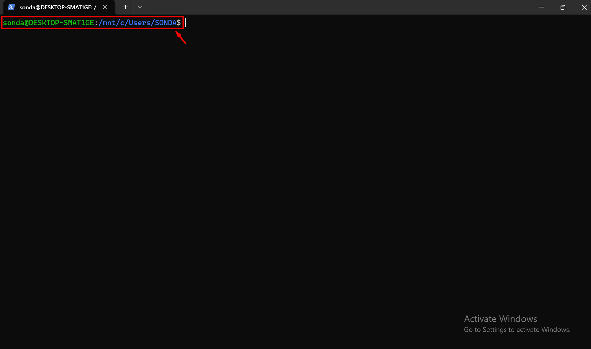

- Common Placeholders

| Sequence    | Description                                                                          |
| ----------- | ------------------------------------------------------------------------------------ |
| `\u`        | The username of the current user                                                     |
| `\h` / `\H` | The hostname (`\h` for short lowercase name, `\H` for full domain name)              |
| `\w` / `\W` | The current working directory (`\w` for full path, `\W` for just the current folder) |
| `\t` / `\@` | The time (`\t` for 24-hour HH:MM:SS, `\@` for 12-hour AM/PM format)                  |
| `\$`        | Displays `$` for normal users and `#` for the root user                              |

- Setting a Standard Prompt: `PS1="\u@\h:\w\$ "`
  - This gives you the "Who, Where, and What" of your current session at a single glance, saving you from running commands like `whoami` or `pwd` constantly

### Creating and Deleting Environment Variables

- Persistence: Changes made directly in the terminal are temporary and disappear when the session ends. Permanent changes require editing shell configuration files (like `.bashrc` or `.zshrc`)

#### Creating Variables - `export`

- To create a new environment variable, use the export command followed by the name and value.

- Syntax: `export VARIABLE_NAME='value'`

- Best Practice: Always use UPPERCASE for environment variables (e.g., CITY instead of city) to follow standard Unix conventions and avoid confusion.

- Quoting : Use single quotes `'` around the value to prevent Bash from performing "shell expansions" or misinterpreting special characters before the value is saved.

```bash
export CITY='new york'
```

- Crucial Note on Whitespace: In Bash, you cannot have spaces around the equals sign.
  - `export CITY='Paris'` is correct.
  - `export CITY = 'Paris`' will fail because Bash treats the first word as a command and the rest as arguments.

#### Modifying Variables

- Once a variable has been exported, you can overwrite its value without using the `export` command again.
- Syntax: `VARIABLE_NAME='New Value'`
- Crucial Note on Whitespace: In Bash, you cannot have spaces around the equals sign.
  - `CITY='Paris'` is correct.
  - `CITY = 'Paris'` will fail because Bash treats the first word as a command and the rest as arguments.

#### Deleting Variables - `unset`

- If you need to remove a variable from your environment (for cleanup or troubleshooting), use the `unset` command.

- Syntax: `unset VARIABLE_NAME`

- This effectively deletes the variable so it no longer appears when you run the `env` command.

### `PATH` environment variable

#### What is the `PATH` Variable?

- The `PATH` variable is a colon-separated list of directories that the shell searches through whenever you type a command. It is the mechanism that allows you to run programs (like `cat`, `ls`, or `grep`) from any location in the terminal without typing their full file path.

#### How It Works

- Sequential Search: When you execute a command, the shell searches the directories listed in `PATH` from left to right.

- The First Match Wins: The shell stops searching as soon as it finds an executable file with the matching name.

- Manual vs. Automatic:
  - Automatic: Typing `cat test.txt` relies on the shell finding `cat` within the `PATH` (e.g., in `/usr/bin/`).
  - Manual: You can bypass the PATH entirely by providing the absolute path to the executable (e.g., `/bin/cat test.txt`).

#### Modiffy `PATH` variable

- Why Modify the PATH? The `PATH` variable tells the shell which directories to search for executable files. We modify it to:
  - Simplify execution: Run custom scripts or downloaded binaries from any location without typing the full file path.
  - Organize software: Keep self-installed tools (like those from Homebrew on macOS or Anaconda for Python) in centralized, non-system directories.
  - Manage versions: Ensure the correct version of a program (e.g., a specific Python environment) is prioritized over the system default.
  - Persistence: Changes made directly in the terminal are temporary and disappear when the session ends. Permanent changes require editing shell configuration files (like `.bashrc` or `.zshrc`)
- Syntax: `PATH="${PATH}:<new_path>"`
  - Order Matters: Generally, keep system directories at the beginning and user-specific directories at the end, unless you specifically intend to override a system tool.
  - Efficiency: Avoid unnecessary duplication and keep the list of directories lean to maintain search performance.
  - Caution: Be careful when modifying PATH, as incorrect settings can prevent the system from finding essential commands, leading to "command not found" errors.
- Verification: You can use the `which` command (e.g., `which cat`) to see exactly which directory a specific program is being run from.

### Creating custom executable file

- Modify `PATH` variable

```bash
PATH="${PATH}:$(pwd)
```

- Creating an executable, it is best practice to omit the extension (e.g `.py` extension)

```bash
# This allows you to run it as a natural command (just hello_world)
# rather than a script (hello_world.py)
touch hello_world
```

- Inside the hello_world

```bash
#!/usr/bin/env python3

print('Hello the python world')
```

- Execution

```
hello_world

# Hello the python world
```

#### The Shebang - `#!`

- Since the shell doesn't know by default that a text file contains Python code, you must include a Shebang as the very first line of the file
- Syntax: `#!<path_to_interpreter> [parameter]`
  - Python script `#!/usr/bin/python3` or the better way `#!/usr/bin/env python3`
- How it works: This line tells the operating system to use the `env` utility to find the `python3` interpreter and use it to execute the rest of the file.
- Why use `env`? Using `/usr/bin/env python3` is more flexible than hardcoding a path like `/usr/bin/python3`, as it finds the version of Python currently active in your environment (important for tools like Anaconda or virtual environments).

### Storing custom shell configurations

- The Four Shell Modes
  - Interactive Login Shell
  - Interactive Non-Login Shell
  - Non-Interactive Non-Login Shell
  - Non-Interactive Login Shell

#### Interactive Login Shell

- What it is: When you log in directly (e.g., via SSH or a TTY terminal using Ctrl+Alt+F1).

- Behavior: It loads system-wide configs first, then looks for the first available file among `~/.bash_profile`, `~/.bash_login`, or `~/.profile`.

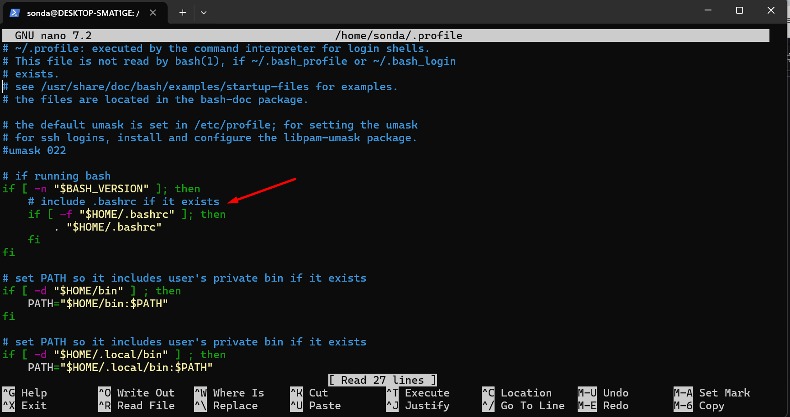

#### Interactive Non-Login Shell:

- What it is: Opening a standard terminal window inside a GUI (like Ubuntu's desktop) or typing bash inside an existing shell.

- Behavior: It primarily loads the `~/.bashrc` file.
- How to custom shell configurations

```bash
nano ~/.bashrc

# Scroll to the bottom of the .bashrc file
# Add your environment variable at the end:
export CITY='SONDA VO DOI'
```

#### Non-Interactive Non-Login Shell

- What it is: When a shell script is executed.

- Behavior: It doesn't load the standard startup files unless a specific environment variable `BASH_ENV` is set.

#### Non-Interactive Login Shell

- What it is: Very rare; used for specific remote command executions.

## Alias

### What is an Alias?

- An alias is a user-defined shortcut for a command. For example, instead of typing a long path or a complex command every time, you can define a short keyword to do the work for you.

- Syntax: `alias name='<command>'`

- Example: `alias gohome='cd ~'` allows you to simply type gohome to return to your home directory.

- Note on Quotes: Using quotes (e.g., `'cd ~'`) prevents Bash from expanding special characters (like the tilde) immediately, ensuring the command is interpreted correctly every time the alias is run.

### Viewing Alias

- To see them, enter the alias command without arguments

```bash
alias
```

### Managing Aliases

- View all aliases: Simply type `alias` to see a list of all shortcuts currently active in your session.

- Remove an alias: Use the command `unalias <name>`.

- Scope: By default, an alias is temporary. It only exists in the current terminal session. If you start a "sub-shell" (typing bash inside your terminal) or restart your computer, the alias will disappear.

### Making Aliases Permanent

- To ensure your shortcuts are available every time you open a terminal, you must add them to your shell's startup file:
  - Open your `~/.bashrc` file by `nano ~/.bashrc`.
  - Add the alias definition line to the bottom of file.
  - Save and exit. The next time you start a shell, the alias will be loaded automatically.

## Configure the Bash shell

### `shopt` vs `set`: Why both?

- The instructor clarifies the distinction between these two mechanisms:
  - `set` command: Used for options inherited from the original **shell** (sh). These are maintained for compatibility across different shell environments.
  - `shopt` command: Used for options that are specific to **Bash**. These features were developed later and are not part of the standard POSIX shell definition.

### `set` Command

- The `set` command uses a somewhat counter-intuitive syntax for toggling features
- Enable a feature: Use a minus sign `set -[letter]`
- Disable a feature: Use a plus sign `set +[letter]`
- More detail: https://www.gnu.org/software/bash/manual/html_node/The-Set-Builtin.html

#### Key Feature: X-Trace

- Syntax: `set -x`
- Purpose: It prints every command the shell executes internally to the terminal before running it.
- Use Case: Debugging complex commands, aliases, and expansions.
- Example:

```bash
set -x
# Running ls might reveal it is actually executing ls --color=auto.
ls
# ls --color=auto

# it shows how the shell translates shorthand like ~/Desktop into the full absolute path (e.g., /home/user/Desktop).
cd ~/Desktop
#  /home/user/Desktop
```

### `shopt` command

- Enable an option: Use `-s` (set) followed by the option name `shopt -s [option]`
- Disable an option: Use `-u` (unset) followed by the option name `shopt -u [option]`

#### Practical Examples

- `autocd` Allows you to change directories by simply typing the folder path without the `cd` command
- `cdspell` Automatically corrects minor spelling errors (typos) in directory names when using the cd command

## Command substitution

- What is Command Substitution?
  - Command substitution tells Bash to: Run a specific command. Capture its output (the text it prints). Place that text exactly where the substitution was written.

- Syntax: Use a dollar sign followed by parentheses: `command "<text> $(command)"`
  - You should almost always wrap your command substitution in double quotes `" "`
  - Without quotes: Bash might try to "help" you by splitting your output into separate words or interpreting special characters, which often ruins the formatting.
  - With quotes: Bash treats the entire output of the substituted command as a single block of text, preserving its structure.

- Example:

```bash
echo -e "Directory Listing:\n$(ls)"
echo "My path is $(pwd)"
echo "Home size: $(du -sh ~)"
echo "There are $(ls | wc -l) files here."
echo 'The size of my house directory is: '"$(du -sh ~)"
echo 'There'"'"'re '"$(ls | wc -l)"' files in the current directory'
```

## Style terminal line use `tput` and `infocmp` command

## Shel expansions

- **Shell Expansion** is a process where **Bash** "rewrites" or parses your command before it is actually executed.

### Filename expansion or Pathname Expansion

- More detail in [Wildcards (File name expansion - Globbing)](#wildcards-file-name-expansion---globbing)

### Tilde expansion - `~`

- The character `~` (tilde) acts as a pointer to your home directory
  - **The Mechanism**: By default, the shell replaces `~` with the value stored in the `HOME` environment variable.
  - **Variable Dependency**: If you change the value of the `HOME` variable (e.g., `HOME='/'`), the `~` character will then expand to that new path instead.
  - Current Working Directory `~+`: Using `~+` expands to the value of $PWD (your current working directory). This is a quick way to reference where you are currently located in the file system.

```bash
echo ~
echo ~+
```

### Variable expansion - `$`

- More detail in [Viewing Variables](#viewing-variables)

| Priority                   | Syntax          | Why use it? (Pros)                                                                                                                            | Risks (Cons)                                                                                                            |
| -------------------------- | --------------- | --------------------------------------------------------------------------------------------------------------------------------------------- | ----------------------------------------------------------------------------------------------------------------------- |
| 1. Highest (Best Practice) | `"${VARIABLE}"` | Maximum Safety. Combines curly braces and double quotes. Prevents Word Splitting, File Expansion (globbing), and ambiguity when joining text. | None (slightly more typing).                                                                                            |
| 2. High                    | `"$VARIABLE"`   | Prevents Word Splitting. Ensures the variable content is treated as a single string even if it contains spaces or special characters.         | Can be ambiguous if you want to append text directly to the variable name (e.g., `"$HOMEpath"`).                        |
| 3. Medium                  | `${VARIABLE}`   | Defines Boundaries. Clearly tells Bash where the variable name ends. Essential for appending text (e.g., `${NAME}ing`).                       | Vulnerable to Word Splitting and Globbing if the variable value contains spaces or `*`.                                 |
| 4. Lowest                  | `$VARIABLE`     | Simple & Quick. Only safe if you are 100% sure the variable contains no spaces and you don't need to join it with other text.                 | High Risk. Can cause scripts to crash or delete the wrong files if the variable contains spaces or wildcard characters. |

### Shell Parameter Expansion

- How to manipulate strings directly during expansion using the `${}` syntax

| Feature        | Syntax                   | Description                                          | Example                                                |
| -------------- | ------------------------ | ---------------------------------------------------- | ------------------------------------------------------ |
| String Length  | `${#VAR}`                | Returns the length of the string (number of bytes).  | `echo "${#HOME}"`                                      |
| Substring      | `${VAR:offset:length}`   | Extracts a portion of the string starting at offset. | `export VAR="hello" → echo "${VAR:1:3}" → "ell"`       |
| Replacement    | `${VAR/search/replace}`  | Replaces the first occurrence of a pattern.          | `export VAR="hello" → echo "${VAR/l/LL}" → "heLLo"`    |
| Global Replace | `${VAR//search/replace}` | Replaces all occurrences of a pattern.               | `export VAR="hello" → echo "${VAR//l/LL}" → "heLLLLo"` |

### Arithmetic Expansion

- The shell allows arithmetic to be performed by expansion. This allows us to use the shell prompt as a calculator
- Syntax: `$((expression))`

| Operator | Description                                         |
| -------- | --------------------------------------------------- |
| +        | Addition                                            |
| -        | Subtraction                                         |
| \*       | Multiplication                                      |
| /        | Division (integer arithmetic, result is an integer) |
| %        | Modulo (remainder)                                  |
| \*\*     | Exponentiation                                      |

```bash
echo $((2 + 2))
# 4

echo $(($((5**2)) * 3))
# 75
```

### Word Splitting

#### What is Word Splitting?

- Word splitting is the process where Bash divides a command line into separate segments or "words."
  - The first word is treated as the command (the program to execute).
  - The subsequent words are treated as individual arguments or parameters passed to that program.

```bash
touch a.txt b.txt
# is split into three words, telling the touch program to create two distinct files
```

- If you have multiple spaces or tabs between words, Bash treats the entire sequence as a single delimiter.

```bash
touch  file1.txt      file2.txt

# still only creates two files, because the extra spaces are collapsed during the splitting process
```

#### The Role of IFS

- The splitting happens based on the Internal Field Separator (IFS) variable. By default, Bash looks for three specific characters to determine where one word ends and the next begins:
  - Space -> Hex: 20
  - Tab -> Hex: 09
  - Newline -> Hex: 0a

```bash
echo "${IFS}" | hexdump

# 0000000 0920 0a0a
# 0000004
```

#### Disabling Splitting with Quotes - `' '`

- To prevent Bash from splitting a string that contains spaces, you must use quoting. This is essential when dealing with file names or data that contain spaces.
- Both single (`'`) and double (`"`) quotes disable word splitting, though they behave differently regarding other expansions (which is a deeper topic for later)

```bash
# Without Quotes

touch a file.txt

# creates two files: a and file.txt.
```

```bash
# With Quotes

touch 'a file.txt'

# creates exactly one file named a file.txt
```

### No Quotes vs Single Quotes `''` vs Double Quotes `""`

- No quotes: All available shell expansions are being applied
- Single quotes - `''`: All expansions are disabled, word splitting is disabled
- Double quotes:
  - Disables most expansions, such as tilde expansion `~`, filename expansion `*`, word splitting,...
  - However certain expansions are still enabled: Variable and Arithmetic expansion and substitution command are still working

- The Three Levels of Quoting

| Quoting Style       | Variable Expansion ($) | File Expansion (\*) | Word Splitting | Use Case                                                                         |
| ------------------- | ---------------------- | ------------------- | -------------- | -------------------------------------------------------------------------------- |
| No Quotes           | Yes                    | Yes                 | Yes            | Use when you want Bash to fully process everything (risky with spaces).          |
| Double Quotes `""`  | Yes                    | No                  | No             | Use to keep variables intact while preventing files from being globbed or split. |
| Single Quotes `' '` | No                     | No                  | No             | Use for "literal" text where you want Bash to ignore everything inside.          |

- To visualize the difference, imagine we have a variable `DIR="/home/user/my docs"` and a file named `report.txt`.

| Command Style                      | Behavior ("The Shield")                                                                  | Resulting Action                                                                                                                                                                                                                                 |
| ---------------------------------- | ---------------------------------------------------------------------------------------- | ------------------------------------------------------------------------------------------------------------------------------------------------------------------------------------------------------------------------------------------------ |
| No Quotes `cat $DIR/*.txt`         | No Shield. Everything is fair game.                                                      | 1. `$DIR` expands to `/home/user/my docs`.<br>2. Word Splitting breaks that into two paths because of the space.<br>3. `*.txt` expands to `report.txt`.<br>**Result:** `cat` tries to find `/home/user/my`, `docs`, and `report.txt` separately. |
| Double Quotes `cat "${DIR}/*.txt"` | Partial Shield. Protects against word splitting and globbing, but allows `$` expansions. | 1. `$DIR` expands to `/home/user/my docs`.<br>2. No Word Splitting happens.<br>3. No Globbing happens; `*.txt` stays literal.<br>**Result:** `cat` looks for one literal file named `/home/user/my docs/*.txt` (and fails).                      |
| Single Quotes `cat '$DIR/*.txt'`   | Full Shield. Everything inside is literal. No exceptions.                                | 1. No expansion, no splitting, no globbing.<br>**Result:** `cat` looks for a file literally named `$DIR/*.txt`.                                                                                                                                  |

### Shell expensions: Be careful!

- The process: Bash follows a strict order
  - First, the command is being expanded
  - Then, word splitting is applied
  - Quotes are being removed
  - Command is being executed

#### The Danger of "Accidental" Commands

- Example 1: Let's say we got a folder and the filename of the first file was echo

```
bash_caution/
├── echo # first file in bash_caution folder
├── f.txt
└── g.txt
```

```bash
ls .
# echo  f.txt  g.txt
*
# f.txt g.txt
```

#### Filenames as Flags (The "Minus" Problem)

- Example 2 : If you want to create a file which is literally named -al

```bash
touch -al

# touch: invalid option -- 'l'
# Try 'touch --help' for more information.

# solution
touch ./-al
```

- Example 3 : If you have a file literally named -al, running `ls *` expands to `ls -al`

```
bash_caution/
├── -al
├── echo
├── f.txt
└── g.txt
```

```bash
# problem
ls *

# -rwxrwxrwx 1 sonda sonda 0 Apr  3 16:28 echo
# -rwxrwxrwx 1 sonda sonda 0 Apr  3 16:29 f.txt
# -rwxrwxrwx 1 sonda sonda 0 Apr  3 16:29 g.txt

# solution

ls ./*

# ./-al  ./echo  ./f.txt  ./g.txt
```

More detail: [The Problem: File Names as Commands](#the-problem-file-names-as-commands)

#### The "Golden Rule" of Variables

- You must always wrap your variables in double quotes: `"$VAR"`.

```
# If a folder name contains a space (e.g a folder)
a folder/
├──
```

```bash
touch $PWD/a.txt

# touch: cannot touch 'Guide/bash_caution/a': No such file or directory
# touch: cannot touch 'folder/file.txt': No such file or directory

# the command above fails because PWD have a white space

echo "${PWD}"
# /mnt/d/udemy/Mastering Linux The Comprehensive Guide/bash_caution/a folder
# Bash will perform word splitting after expanding the variable. This turns one path into two separate arguments, leading to "No such file or directory" errors.

# the solution

touch "$PWD/file.txt"
# With Quotes: "$PWD/file.txt" ensures the entire path is treated as a single word, even if the path contains spaces.
```

#### Best practice

- Try to refer to filenames in the same directory as `./file.txt`
- And, for the quotes: Always use the quoting style that is as restrictive as possible
  - Prefer single quotes: `'hello world'`
  - If this is not possible, use double quotes:
    - `echo "hello ${USER}"`
    - `echo 'hello '"${USER}"`
- Use no quoting only if there's no ambiguity, or you want all expansions to be applied:
  - Example for no ambiguity:
    - `ls -al` (would be annoying: 'ls' '-al')
    - Here we want all expansions: `echo ./*.txt`

### Escaping

#### Handling Whitespace

- The default action of a space in Bash is word splitting (separating arguments). To treat a filename with spaces as a single argument, you have two choices:

- Backslash Escaping: Placing a `\` before the space (e.g., `A\ folder/`).
- Quoting: Wrapping the entire path in double quotes (e.g., `"A folder/"` or `'A folder/'`).

#### Printing Quotes

- If you want to print a literal double quote (`"`), you cannot simply type `echo "`. Bash will think you are starting a "quoting area" and wait for you to close it. Instead, you can:

- Escape it: `echo \"`

- Nest it: Place the double quote inside single quotes: `echo '"'`.
- Nest it: Place the single quote inside double quotes: `echo "'"`.

#### The "Single Quote" Exception

- Escaping is also a feature that "rewrites" `/` expands our command as well
- The single quotes `'` disable all "rewrites" `/` expansions
- Thus, also the backslash is disabled
- Problem

```bash
# this one does not print out a single single quote
echo '\''
```

- Solution

```bash
echo '123'"'"'456'
echo '123'\''456'

# Close the current single-quoted area: '
# Insert the single quote using a backslash: \' (outside of any quotes) or double quotes: "'"
# Re-open a new single-quoted area: '
```

### Brace expansion

- Brace expansion is a powerful feature in Bash 4 used to generate arbitrary strings or sequences. It allows users to streamline repetitive tasks, such as creating multiple files or listing specific extensions, by wrapping comma-separated strings or ranges in curly braces `{}`

- String Lists: You can provide a comma-separated list within braces to generate specific variations of a string

```bash
echo data.{csv,txt}

# data.csv data.txt
```

- Sequence Generation: Brace expansion can automatically generate a range of characters or numbers using the `..` syntax

```bash
echo {a..z}.txt

# a.txt b.txt c.txt ... z.txt
```

- Syntax Rules and Limitations
  - No Spaces: There must be no unquoted spaces inside the braces.
  - No Quotes: The braces themselves must not be inside single or double quotes

```bash
echo "{a,b}" # incorrect
# {a,b}

echo "data".{csv,txt}
# data.csv data.txt
```

### Command substitution

- More detail [Command substitution](#command-substitution)

### Process Substitution

- Process substitution is a powerful feature that allows you to treat the output (or input) of a command as if it were a temporary file
- This is especially useful for commands that expect file arguments rather than standard input (pipes)

#### Output-to-Input Substitution

- Syntax: `<(command)`
- This is the most common form. Bash executes command, saves the output to a temporary named pipe (or a file in `/dev/fd/`), and replaces the expression with the path to that "file.

```bash
echo <(true)

# /dev/fd/63
```

- The Problem: Some tools, like diff, require two files to compare. Normally, you would have to save command outputs to disk first

```bash
ls folder1 > f1.txt
ls folder2 > f2.txt
diff f1.txt f2.txt
```

- The Solution:
  - Use process substitution to do it in one line without creating manual garbage files:
  - Bash automatically creates the temporary path (e.g., /dev/fd/63) and cleans it up immediately after the command finishes.

```bash
diff <(ls folder1) <(ls folder2)
```

- Another example

```bash
wc -l < <(ls)

# `<`: redirection input
# `<(ls)`: process substitution
```

#### Input-from-Output Substitution

- Syntax: `>(command)`
- This syntax is used when you want to send the output of a process to another command that acts as a destination, treating that command like a file you are writing into

```
echo "test" > >(cat)

# `>`: redirection output
# `>(cat)`: another command that acts as a destination
```

- Asynchronous Behavior: Because the command inside the parentheses runs in a subshell, it may finish slightly after the main command. This is why you might see your terminal prompt ($) appear before the output of the subshell is printed

## Choosing the Right Tool: Pipe vs. Substitutions

### Use Pipe `|`

- When: The next command is designed to read from Standard Input (STDIN) (e.g., grep, awk, sed, cat, sort).

- Pro Tip: This is the most standard and efficient method in Linux because it streams data directly between processes without creating temporary files.

### Use Process Substitution `<(command)`

- When: The next command requires a physical file path as an argument, or when you need to compare the outputs of two commands simultaneously.

- Example: `diff <(ls folder1) <(ls folder2)`

- Why: You cannot use a pipe here because diff requires two separate files to perform a comparison. Process Substitution "tricks" the command into thinking the output is a file.

### Use Command Substitution `$()`

- When: You want to save the output into a variable or embed the result directly into another command as a text string.

- Example: `echo "The number of files is: $(ls | wc -l)"`

- Why: This evaluates the command inside the parentheses first and then replaces the `$()` block with the resulting text.

| Feature   | Pipe (`                                                | `)                                                              | Process Substitution (`<( )`) |
| --------- | ------------------------------------------------------ | --------------------------------------------------------------- | ----------------------------- |
| Usage     | Passes stdout of one command to stdin of another.      | Passes a file path to a command.                                |
| Limit     | Only connects one command to the next.                 | Can provide multiple inputs to a single command (e.g., `diff`). |
| Variables | Sometimes runs in a subshell, making variables tricky. | Allows more complex redirection in scripts.                     |

# Bash Shell

## Shell autocompletion

- To make use of shell autocompletion, start typing a file or directory name and **press Tab**
- The shell will progressively narrow your choices, displaying possible matches below the line you’re typing on

## How to execute several commands

- The semicolon allows you to chain commands together so they run sequentially (one after the other).

- Syntax: `command1 ; command2 ; command3`

- Execution: The shell runs command1, waits for it to finish, then runs command2, and so on.

- Trailing Semicolon: You can put a semicolon at the very end of the line, but it is optional and usually omitted.

-Example: `echo -n "Hello " ; echo "World"`

## The `echo` command

- The primary purpose of echo is to output text to the terminal.
- **Quotes**: In Bash, single quotes are used to wrap strings
- Working with Options
  - `-n` (No newline): By default, echo adds a line break at the end. Using `-n` prevents this, causing the terminal prompt to appear immediately after the output.

  - `-e` (Enable backslash escapes): This allows the command to interpret special characters like `\n` as an actual line break within the string.

  - Combining Options: You can use options separately (e.g., `-n -e`) or combine them into a single block (e.g., `-ne` or `-en`). The order usually does not matter for most Unix commands

```
echo -e 'This is my car\nThis is my car'

# This is my car
# This is my car

echo -en "Danh sách mua sắm:\n\t* Táo\n\t* Chuối\n"

# Danh sách mua sắm:
#     * Táo
#     * Chuối
```

## The `pwd` command

- `pwd` (Print Working Directory): Use this command to display the full path of your current location.

```bash
pwd
# home/sonda
```

## The `cd` command

- The `cd` command is used to move between folders. You can navigate using different types of paths:

- Linux/Unix Structure: There are no drive letters (like C:). Everything starts from the root folder (`/`).

- Home Directory: Represented by the tilde (`~`)` symbol, this is your user-specific folder (e.g., /home/username or /Users/username on macOS)

- Navigation Methods

| Command                | Result                                                                        |
| :--------------------- | :---------------------------------------------------------------------------- |
| **`pwd`**              | **Print Working Directory**: Displays the full path of the current directory. |
| **`cd [folder]`**      | Moves into a subfolder of your current directory (e.g., `cd Desktop`).        |
| **`cd /`**             | Moves to the **Root** directory (the base of the entire system).              |
| **`cd ..`**            | Moves up one level to the **Parent** directory.                               |
| **`cd ../..`**         | Moves up two levels.                                                          |
| **`cd ~`** or **`cd`** | Returns you instantly to your **Home** directory.                             |
| **`cd -`**             | Moves back to the previous directory you were in.                             |

- Pro-Tips for Efficiency
  - Tab Autocomplete: Type the first few letters of a folder name and press Tab. The shell will automatically complete the name for you, saving time and preventing typos.

- Example absolute path

```bash
[me@linuxbox usr]$ pwd
/# usr

[me@linuxbox usr]$ cd /usr/bin
[me@linuxbox bin]$ pwd
# /usr/bin
```

- Example relative path

```bash
[me@linuxbox usr]$ pwd
/# usr

[me@linuxbox usr]$ cd ./bin
[me@linuxbox bin]$ pwd
# /usr/bin
```

## The `ls` Command

- The `ls` command shows the contents of your current working directory.
  - Context: By default, it operates on your Present Working Directory (PWD), but it can be pointed at any path.

- Command Options (Flags)

| Command                | Description                                                         |
| :--------------------- | :------------------------------------------------------------------ |
| **`ls`**               | List files/folders in the current directory.                        |
| **`ls -a`**            | List **all** files (including hidden files starting with `.`).      |
| **`ls -t`**            | Sort contents by **time** (newest first).                           |
| **`ls -r`**            | **Reverse** the sorting order.                                      |
| **`ls -rt`**           | Sort by time in reverse (useful to see newest files at the bottom). |
| **`ls [path]`**        | List contents of a **specific folder** (e.g., `ls /etc`).           |
| **`ls --color=never`** | Disable colorized output.                                           |
| **`ls -l`**            | Display results in long format                                      |

- Directory Arguments
  - You can provide a specific path as an argument to see what is inside a different folder without leaving your current location.

```bash
# will list everything in the root directory while you stay in your home folder

ls ~
```

- Combined Flags: `ls -la` is a very common shortcut to see all files in a detailed list format.

```bash
ls -la

# drwxr-xr-x  2 user user  4096 Mar 10 10:00 Desktop
# -rw-r--r--  1 user user   220 Mar 10 09:00 .bashrc
```

- Linux `ls -l` Output Breakdown

| Component                   | Example        | Description                                                                                                                                                                                                |
| :-------------------------- | :------------- | :--------------------------------------------------------------------------------------------------------------------------------------------------------------------------------------------------------- |
| **File Type & Permissions** | `drwxr-xr-x`   | The first character indicates the type (`d` for directory, `-` for regular file). The next 9 characters represent permissions for **Owner**, **Group**, and **Others** ($r$=read, $w$=write, $x$=execute). |
| **Hard Links**              | `2`            | The number of hard links pointing to the file or directory.                                                                                                                                                |
| **Owner**                   | `user`         | The username of the account that owns the file.                                                                                                                                                            |
| **Group**                   | `user`         | The name of the group that has specific permissions for this file.                                                                                                                                         |
| **Size**                    | `4096`         | The file size in bytes. (Tip: Use `ls -lh` to see this in "human-readable" format like KB or MB).                                                                                                          |
| **Timestamp**               | `Mar 10 10:00` | The date and time the file was last modified.                                                                                                                                                              |
| **Name**                    | `Desktop`      | The actual name of the file or directory.                                                                                                                                                                  |

## The `stat` command

- The stat command gives you more information about the name, size, number of blocks, type of file, inode, number of links, permissions, UID and GID, and atime, mtime, and ctime

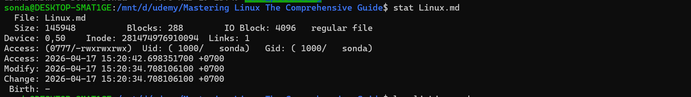

## Basic file operations

### The `touch` command

- While commonly used to create new files, its primary technical purpose is different.

- Primary Use: To create an empty file (or multiple files) quickly.

- Example:

```bash
# creates two empty files simultaneously.
touch file1 file2
```

- Technical Function: It modifies the timestamp of a file.
  - If the file does not exist, touch creates it.

  - If the file already exists, touch updates its "last modified" timestamp to the current time without changing the file's content.

### The `mkdir` Command

- This command stands for "make directory."

- Purpose: To create a new folder (directory).

- Example:

```bash
# creates a folder named "ready" in the current location.
mkdir ready
```

- Distinguishing Files vs. Folders: `*` In a standard terminal, they might look identical in plain text.
  - Colors: You can use `ls --color` to visually differentiate them (folders are typically blue, while files are white/grey). Most modern terminals support this by default.

### The `mv` Command

- The `mv` command is versatile because it handles both moving and renaming in a single utility.

- Moving a File: To move a file into a folder, use `mv [filename] [destination_folder]`.

- Example:

```bash
mv ann.txt ready/
```

- Renaming a File: To rename a file, "move" it to a new name in the same location.

- Example:

```bash
mv max.txt maximilian.txt
```

- Move and Rename at Once: You can change both the location and the name simultaneously.

Example:

```bash
mv maximilian.txt ready/max.txt
```

- Pro Tip: Instead of using `cd` to check if a move worked, use `ls [folder_name]` to peek into a directory without leaving your current one.

### The `cp` Command

- The cp command creates duplicates of files or directories.

- Copying a File: Use `cp [source] [destination]`.

- Example:

```bash
cp laura.txt laura_backup.txt
cp laura.txt ./ready # cp laura.txt ready
```

- Copying to a Folder: You can copy a file into a different directory while optionally giving it a new name.

- Example:

```bash
cp laura.txt ready/lauren.txt
```

- Copying Directories (-R): By default, cp cannot copy folders. To copy a folder and all its contents, you must use the recursive flag: -R.

- Example:

```bash
cp -R ready ready_backup
```

### The `rm` Command

- The `rm` command is the standard way to delete files, but it comes with a major warning.

- Deleting Files: Use `rm [option] filename` or list multiple files to delete them at once.

- Example:

```bash
rm ann.txt eva.txt
```

- ⚠️ The Danger Zone: Unlike clicking "Delete" in a graphic interface, `rm` does not send files to a Trash or Bin. They are permanently deleted immediately.

- Deleting Directories (-r): To delete a folder and everything inside it, you must use the recursive flag -r (or -R).

- Example:

```bash
rm -r ready_backup/
```

- `rm -i`: This option enables interactive mode by asking you for acceptance before deleting

```bash
rm -i output.txt

# rm: remove regular file 'output.txt'?
```

- `rm -f` : The `-f` option deletes the file by force, without any interaction from the user

### The `rmdir` Command

- Because rm -r is so powerful and risky, rmdir serves as a "safety first" alternative.

- Usage: `rmdir [folder_name]`

- The Safety Catch: This command only works if the directory is completely empty. If there is even one file inside, Bash will block the command and give you an error.

- Hidden Files: A folder might look empty in your file explorer but still fail to delete via rmdir. This is often due to hidden files (files starting with a dot, like .DS_Store or .thumbs.db). To see these, use ls -a.

- You must delete the hidden files first before rmdir will work.

### Read file Command (`cat`,`head`, `tail`)

#### The `cat` Command

- The most basic way to view a file is cat (concatenate). It prints the entire content of a file directly into the terminal.

- Usage: `cat filename.txt`

- Pro Tip: You can use globbing (e.g., `cat *.txt`) to output multiple files at once.

- The "Binary" Warning: Avoid using `cat` on binary files (like JPEGs). This outputs gibberish and can send "special commands" to your terminal that may break its behavior, requiring a restart.

#### `head` and `tail` Commands

| Command | Function                      | Default  | Customization      |
| ------- | ----------------------------- | -------- | ------------------ |
| head    | Shows the beginning of a file | 10 lines | `head -n [number]` |
| tail    | Shows the end of a file       | 10 lines | `tail -n [number]` |

#### The `less` command

- The `less` command is a powerful tool for viewing large files (like books or log files) in the terminal without loading the entire file into memory at once, which avoids the performance issues common with the `cat `command.

- Key Navigation and Features
  - Basic Movement: Use the arrow keys to scroll line-by-line.
  - Paging: Press **F** to move forward a full page and **B** to move backward a full page.
  - Jumping to Content: You can navigate to a specific part of the file by typing a percentage (e.g., **50p**) to jump to the middle of the document.
  - Status Information: Pressing the equals sign `=` displays information about your current position in the file.
  - Line Numbers: Typing `-N` (uppercase) and pressing Enter toggles the display of row numbers for better orientation.

- Searching and Exiting
  - Use `/` followed by a keyword for a forward search (from your current position down).
  - Use `?` followed by a keyword for a backward search (from your current position up).

- Quitting: Simply press the `Q` key to exit the program and return to the command promp

#### The Word Count Program (`wc` command)

- The `wc` command provides information about the internal structure of a file. By default, running wc filename.txt outputs three values: line count, word count, and byte count.

- Key Flags:
  - `-l`: Counts only the lines (the most common use case).

  - `-w`: Counts only the words.

  - `-c`: Counts the bytes. (Note: Historically "c" stood for "character" when 1 character equaled 1 byte, a naming convention that remains today.)

- Example: `wc filename.txt`

#### Disk Usage (`du` command)

- The `du` command tells you how much space a file or directory actually occupies on your storage.

- Behavior and Summaries:
  - Running `du` by itself shows the size of every item in the current directory - Example: `du`.
  - `du filename.txt` shows the size of a specific file.
  - `-s`: Provides a total summary of a directory rather than listing every subfolder.
  - To avoid confusion over block sizes, use the `-h` flag. This forces the output into a "Human Readable" format (e.g., 168K, 10M, 2G)

#### How to edit files

- There's no build-in text editor for bash
- We have to install additional software for that
- 4 quite popular options are:
  - pico / nano: A simple editor for text files in bash
  - vi / vim: A more advanced text editor
- The install process depends on the system you're using
  - Mac `brew install nano`
  - Ubuntu `apt-get install -y nano`

## Pipelines

### The `tee` command

- The `tee` command reads **standard input-stdin 0** and copies it to both **standard output-stdout 1** (allowing the data to continue down the pipeline) and to one or more files

- Syntax
  - Basic usage: `command | tee output.txt`
  - Appending: `command | tee -a output.txt` (The `-a` flag prevents overwriting the file).

- How it looks in a chain `echo "Hello" | tee hello.txt | wc -c`
  - `echo` sends "Hello" to the pipe.

  - `tee` catches "Hello", writes it into hello.txt, and then passes "Hello" out to the next pipe.

  - `wc -c` receives "Hello" and counts the characters.

- Practical Use Case: Logging and Debugging: `ping google.com 2>&1 | tee network_log.txt`
  - `ping` command to troubleshoot internet issues
  - Why `2>&1` ? As we learned earlier, errors (stderr) usually bypass pipes. By redirecting stderr to stdout first, tee can "see" the error messages.
  - The Result: You can watch the ping results in real-time to see when your connection drops, but you also create a `network_log.txt` file that you can send to your ISP as proof of the failure

- Why is it called "tee"?
  - The name comes from a T-junction used in plumbing. Just like a pipe shaped like a "T" splits water into two directions, the tee command splits your data stream into two directions: the file and the terminal.

### The `grep` Command

- `grep` is a powerful program used to find text patterns within files

- Key Usage & Parameters:
  - Basic Syntax: grep -F "pattern" filename

  - The `-F` Flag (Fixed Strings): By default, grep uses "Regular Expressions" (complex search patterns). Using -F tells grep to treat the pattern as a plain, literal string, making it simpler to use for beginners.

  - Standard Input (stdin): Like sort and `uniq`, `grep` is frequently used in pipes: `command | grep "pattern"`

- Why Avoid Binary Data? While grep can technically scan any file (including images or archives), the lecture strongly advises against using it on binary files for three reasons:
  - False Positives: You might accidentally match a random byte sequence that isn't actually the text you're looking for.

  - Performance: `grep` is optimized for text; scanning large binary files can be extremely slow.

  - Terminal Corruption: Binary files contain non-printable characters. If grep finds a match and tries to print it, those characters can "break" your terminal, causing it to display gibberish or change settings unexpectedly

- Practical Examples
  - Filtering File Lists: `ls | grep -F "file"`. Only filenames containing the word "file" will be displayed

## Text Processing

### The `sort` command

- The sort program sorts the contents of standard input, or one or more files specified on the command line, and sends the results to standard output
- By default, it sorts lines in alphabetical order and prints the result to the screen (stdout) without modifying the original file
- Syntax: `sort [option] [file_path | stdin(0)]`
- Key Parameters:
  - `-r` (Reverse): Sorts the data in descending order (Z to A).

  - `-n` (Numerical): Sorts based on numerical value rather than just the first digit (e.g., ensuring "10" comes after "2").

  - `-k` (Column/Key): Sorts by a specific column (e.g., -k 2 to sort by last names).

  - `-c` (Check): Checks if a file is already sorted.

  - `-u` (Unique): Sorts the file and removes duplicates in a single step.

- Practical Use Case:
  - Standard: `sort users.txt`
  - Using Pipes: `cat users.txt | sort`
  - We pipe the results into `head` to limit the results to the first 10 lines. We can produce a numerically sorted list to show the 10 largest consumers of space this way `du -s /usr/share/* | sort -nr | head`
  - **William Shotts** By default, `sort` sees this line as having two fields. The first field contains these characters: "William". The second field contains these characters: "Shotts". This means that whitespace characters (spaces and tabs) are used as delimiters between fields

```bash
du -s /usr/share/* | sort -nr | head

# 509940 /usr/share/locale-langpack
# 242660 /usr/share/doc
# 197560 /usr/share/fonts
# 179144 /usr/share/gnome
# 146764 /usr/share/myspell
# 144304 /usr/share/gimp
# 135880 /usr/share/dict
# 76508 /usr/share/icons
# 68072 /usr/share/apps
# 62844 /usr/share/foomatic
```

```bash
ls -l /usr/bin | sort -nrk 5 | head

# -rwxr-xr-x 1 root root 8234216 2016-04-07 17:42 inkscape
# -rwxr-xr-x 1 root root 8222692 2016-04-07 17:42 inkview
# -rwxr-xr-x 1 root root 3746508 2016-03-07 23:45 gimp-2.4
# -rwxr-xr-x 1 root root 3654020 2016-08-26 16:16 quanta
# -rwxr-xr-x 1 root root 2928760 2016-09-10 14:31 gdbtui
# -rwxr-xr-x 1 root root 2928756 2016-09-10 14:31 gdb
# -rwxr-xr-x 1 root root 2602236 2016-10-10 12:56 net
# -rwxr-xr-x 1 root root 2304684 2016-10-10 12:56 rpcclient
# -rwxr-xr-x 1 root root 2241832 2016-04-04 05:56 aptitude
# -rwxr-xr-x 1 root root 2202476 2016-10-10 12:56 smbcacls
```

#### Multiple sort keys

- distros.txt file

```
Distribution   Version   Release Date
SUSE           10.2      12/07/2006
Fedora         10        11/25/2008
SUSE           11.0      06/19/2008
Ubuntu         8.04      04/24/2008
Fedora         8         11/08/2007
SUSE           10.3      10/04/2007
Ubuntu         6.10      10/26/2006
Fedora         7         05/31/2007
Ubuntu         7.10      10/18/2007
Ubuntu         7.04      04/19/2007
SUSE           10.1      05/11/2006
Fedora         6         10/24/2006
Fedora         9         05/13/2008
Ubuntu         6.06      06/01/2006
Ubuntu         8.10      10/30/2008
Fedora         5         03/20/2006
```

- We want to perform an alphabetic sort on the first field and then a numeric sort on the second field. `sort` allows multiple instances of the `-k` option so that multiple sort keys can be specified
- Here is the syntax for our multikey sort `sort --key=1,1 --key=2n distros.txt`
  - The first key `--key=1,1`, we specified 1,1, which means “start at field 1 and end at field 1
  - The second key `--key=2n`, which means field 2 is the sort key and that the sort should be numeric
- An option letter may be included at the end of a key specifier to indicate the type of sort to
  be performed. These option letters are the same as the global options for the `sort` command
  - b (ignore leading blanks)
  - n (numeric sort)
  - r (reverse sort)

#### Offsets in `--key`

- The key option allows specification of **offsets** within fields, so we can define keys within fields
  `sort -k 3.7nbr -k 3.1nbr -k 3.4nbr distros.txt` or `sort --key 3.7nbr -k 3.1nbr --key 3.4nbr distros.txt`
  - By specifying `-k 3.7`, we instruct sort to use a sort key that begins at the seventh character within the third field, which corresponds to the start of the year
  - Likewise, we specify `-k 3.1` and `-k 3.4` to isolate the month and day portions of the date

#### Some files don’t use tabs and spaces as field delimiters

```
head /etc/passwd

# root:x:0:0:root:/root:/bin/bash
# daemon:x:1:1:daemon:/usr/sbin:/bin/sh
# bin:x:2:2:bin:/bin:/bin/sh
# sys:x:3:3:sys:/dev:/bin/sh
# sync:x:4:65534:sync:/bin:/bin/sync
# games:x:5:60:games:/usr/games:/bin/sh
# man:x:6:12:man:/var/cache/man:/bin/sh
# lp:x:7:7:lp:/var/spool/lpd:/bin/sh
# mail:x:8:8:mail:/var/mail:/bin/sh
# news:x:9:9:news:/var/spool/news:/bin/sh
```

- So how would we `sort` this file using a key field? `sort` provides the `-t` option to define the
  field separator character ` sort -t ':' -k 7 /etc/passwd | head`. By specifying the colon character as the field separator, we can sort on the seventh field

### The `uniq` command

- The `uniq` command is used to filter out or identify repeated lines in a dataset.

- **Important Limitation**: `uniq` only detects duplicate lines that are adjacent (directly below one another). Because of this, data must almost always be passed through the `sort` command before being piped into `uniq`.

- Common Use Cases:
  - **Removing Duplicates**: sort file.txt | uniq

  - **Finding Only Duplicates**: Using the `-d` flag (e.g., `sort file.txt | uniq -d`) will print only the lines that appeared more than once.

- The Efficient Method: `sort -u users.txt`. This uses the built-in unique flag within the sort command to handle both tasks at once

### The `tr` command

- The `tr` command is used for character-level replacements within a pipe. It does not look for whole words, but rather maps individual characters from one set to another.
- Basic Replacement: You can replace specific characters (e.g., changing 'B' to 'D').

```bash
echo 'bash' | tr 'b' 'd'

# dash
```

- Multiple Characters: If you provide multiple characters, `tr` maps them positionally (e.g., the 1st character of set A is replaced by the 1st of set B).

```bash
echo 'sonda vo doi' | tr 'sonda' 'haopt'

# haopt va pai
```

- Unequal Ranges: If the replacement set is smaller than the search set, tr typically uses the last character of the replacement set for all remaining matches.

```bash
echo 'sonda vo doi' | tr 'a-z' '1-2'

# 22221 22 222

echo 'sonda ban that vo doi' | tr 'a-z' '1-9.'

# ...41 21. .81. .. 4.9
# Because
# 1 2 3 4 5 6 7 8 9 .
# a b c d e f j h i j k ...
# so the characters outside the range a-i are replaced by .
```

- Character Ranges: You can use ranges like `a-z` and `A-Z`. This is a feature of the `tr` program itself, not the shell, and is commonly used to **convert text to uppercase**

```bash
echo 'awesome' | tr 'a-z' 'A-Z'

# AWESOME
```

- Deleting Characters: Using the -d flag allows you to remove specific characters, such as deleting all spaces in a string.

```bash
echo 'sonda vo doi' | tr -d ' '

# sondavodoi

echo 'sonda vo doi' | tr -d 's'

# onda vo doi
```

### The `rev` Command (Reverse Command)

- The `rev` command is a straightforward tool used to reverse the order of characters in a string.

```bash
echo 'sonda vo doi' | rev

# iod ov adnos
```

### The `cut` command

- The `cut` command, a powerful tool for extracting specific sections of data from files or standard input
- If the text contains Unicode characters (UTF-8), do not use `cut`. `cut`good for ASCII, `awk/perl` good for Unicode

#### Cutting by Bytes (-b)

- This mode extracts data based on exact byte positions.

- Usage: `cut -b 1-10` retrieves the first 10 bytes.

- System Differences: The instructor demonstrates that commands like uptime vary by operating system (e.g., Linux vs. macOS), often adding leading spaces. You must account for these variations when defining byte ranges.

#### Cutting by Characters (-c)

- While similar to byte-cutting, this mode is essential for multi-byte characters (like German umlauts ö or Emojis).

- The Difference: An Emoji might take up 3–4 bytes. If you use `-b` to cut in the middle of those bytes, the terminal will display a broken or "replacement" character. Using `-c` ensures you extract the full character regardless of its byte size.

- Ranges: You can specify a single character (`-c 2`), a range (`-c 1-5`), or everything from a point onward (`-c 2-`).

#### Cutting by Fields (-f)

- This is described as the most powerful mode, allowing you to extract data based on columns or "fields."

- Delimiters (`-d`): By default, cut expects **Tab** characters as separators. To use a different separator (like a space), you must define the delimiter using `-d`.

- Field Selection: You can pick specific columns, such as `-f 1` for the first field or `-f 1,3` for the first and third.

- The "Empty Field" Trap: If your data has consecutive delimiters (e.g., two spaces in a row), cut treats the space between them as an empty field. This requires careful counting to reach the correct data.

```bash
uptime
#   16:28:12 up  2:01,  1 user,  load average: 0.00, 0.00, 0.00
# The output above has one space at the beginning of the line.

uptime | cut -d " " -f 2
# 16:29:35
```

### The `sed` command

- The name `sed` is short for stream editor. It performs text editing on a stream of text, either a set of specified files or standard input
- A crucial takeaway is that sed is not identical across all systems:
  - macOS (OS X): Uses the **FreeBSD implementation**.
  - Linux: Typically uses **GNU sed**.
  - The Impact: While basic substitutions usually work the same way, complex scripts may behave differently depending on the operating system. It is best practice to test your sed commands on the specific platforms where they will run.

#### s (substitute) command.

- Syntax: `sed 's/search_pattern/replacement/flags'`
- Delimiters: While the forward slash (/) is the standard delimiter, you can technically use other characters as long as they are consistent throughout the command.
- The `g` (Global) Flag: By default, sed only replaces the first occurrence in a line. Adding the `g` flag ensures all occurrences are replaced.
- `sed` supports Regular Expressions (regex) for its search patterns
- Example:

```bash
echo 'hello world' | sed 's/world/bash/g'
# hello bash
```

## The `find` Command

- The `find` program searches **a given directory (and its subdirectories)** for files based on a variety of attributes
- Unlike basic bash globbing (using wildcards like `*`), find allows for highly specific search queries based on file attributes
- The basic syntax requires the command followed by the starting path: `find [path]`
  - Performance Note: Searching large directories (like the root directory) can take a long time. You can terminate a hanging or long-running process by pressing **Ctrl + C**.

#### Find file types

| File Type | Description                   | Example Command     |
| --------- | ----------------------------- | ------------------- |
| b         | Block special device file     | `find /dev -type b` |
| c         | Character special device file | `find /dev -type c` |
| d         | Directory                     | `find . -type d`    |
| f         | Regular file                  | `find . -type f`    |
| l         | Symbolic link                 | `find . -type l`    |

#### Search by file size and filename

```bash
find ~ -type f -name "*.JPG" -size +1M
```

- In this example
  - We add the `-name` test followed by the wildcard pattern
  - Notice how we enclose it in quotes to prevent pathname expansion by the shell
  - We add the `-size` test followed by the string `+1M`. The leading plus `+` sign indicates that we are looking for files larger than the specified number. A leading minus `-` sign would change the meaning of the string to be smaller than the specified number. Using no sign means **“match the value exactly”**. The trailing letter `M` indicates that the unit of measurement is megabytes

- Find Size Units

  | Character | Unit                                       | Example             |
  | --------- | ------------------------------------------ | ------------------- |
  | b         | 512-byte blocks (default if no unit given) | `find . -size 10b`  |
  | c         | Bytes                                      | `find . -size 100c` |
  | w         | 2-byte words                               | `find . -size 50w`  |
  | k         | Kilobytes (1,024 bytes)                    | `find . -size 10k`  |
  | M         | Megabytes (1,048,576 bytes)                | `find . -size 5M`   |
  | G         | Gigabytes (1,073,741,824 bytes)            | `find . -size 1G`   |

#### Find Tests

- Note that in cases where a numeric argument is required, the same `+` and `-` notation discussed previously can be applied

| Test           | Description                                                                                                                                                         | Example Command                |
| -------------- | ------------------------------------------------------------------------------------------------------------------------------------------------------------------- | ------------------------------ |
| -cmin n        | Match files or directories whose content or attributes were last modified exactly n minutes ago. Use `-n` for less than n minutes and `+n` for more than n minutes. | `find . -cmin -10`             |
| -cnewer file   | Match files or directories whose contents or attributes were modified more recently than the specified file.                                                        | `find . -cnewer reference.txt` |
| -ctime n       | Match files or directories whose contents or attributes were last modified `n*24` hours ago.                                                                        | `find . -ctime 2`              |
| -empty         | Match empty files and directories.                                                                                                                                  | `find . -empty`                |
| -group name    | Match files or directories belonging to group `name` (group name or numeric GID).                                                                                   | `find . -group developers`     |
| -iname pattern | Same as `-name` but case-insensitive.                                                                                                                               | `find . -iname "*.txt"`        |
| -inum n        | Match files with inode number `n`. Useful for finding hard links.                                                                                                   | `find / -inum 12345`           |
| -mmin n        | Match files or directories whose contents were last modified `n` minutes ago.                                                                                       | `find . -mmin -30`             |
| -mtime n       | Match files or directories whose contents were last modified `n*24` hours ago.                                                                                      | `find . -mtime -1`             |
| -name pattern  | Match files and directories with the specified wildcard pattern.                                                                                                    | `find . -name "*.log"`         |
| -newer file    | Match files and directories modified more recently than the specified file.                                                                                         | `find . -newer backup.log`     |
| -nouser        | Match files and directories that do not belong to a valid user.                                                                                                     | `find / -nouser`               |
| -nogroup       | Match files and directories that do not belong to a valid group.                                                                                                    | `find / -nogroup`              |
| -perm mode     | Match files or directories whose permissions match the specified mode (octal or symbolic).                                                                          | `find . -perm 644`             |
| -samefile name | Match files that share the same inode number as `name`.                                                                                                             | `find . -samefile file.txt`    |
| -size n        | Match files of size `n`.                                                                                                                                            | `find . -size 100M`            |
| -type c        | Match files of type `c`.                                                                                                                                            | `find . -type f`               |
| -user name     | Match files or directories belonging to `user`.                                                                                                                     | `find /home -user john`        |

#### Predefined Actions

- Having a list of results from our `find` command is useful, but what we really want to do is act on the items on the list. Fortunately, find allows actions to be performed based on the search results.

| Action  | Description                                                                                                                   | Example Command                          |
| ------- | ----------------------------------------------------------------------------------------------------------------------------- | ---------------------------------------- |
| -delete | Delete the currently matching file.                                                                                           | `find . -name "*.tmp" -delete`           |
| -ls     | Perform the equivalent of `ls -dils` on the matching file. Output is sent to standard output.                                 | `find . -type f -ls`                     |
| -print  | Output the full pathname of the matching file to standard output. This is the default action if no other action is specified. | `find . -name "*.txt" -print`            |
| -quit   | Quit immediately once a match has been made.                                                                                  | `find / -name "config.php" -print -quit` |

#### Operators

- For example, what if we needed to determine whether all the files and subdirectories in a directoryhad secure permissions? We would look for all the files with permissions that are not 0600 and the directories with permissions that are not 0700. Fortunately, find provides a way to combine tests using logical operators to create more complex logical relationships. To express the aforementioned test, we could do this

```bash
find ~ \( -type f -not -perm 0600 \) -or \( -type d -not -perm 0700 \)
```

- Explain example above

| Component         | Description                                                                                                                      |
| ----------------- | -------------------------------------------------------------------------------------------------------------------------------- |
| `find ~`          | Starts the search from the current user's Home directory.                                                                        |
| `\( ... \)`       | Escaped parentheses used to group conditions together (similar to mathematical grouping) so that the logic is applied correctly. |
| `-type f`         | Filters the search to include only regular files.                                                                                |
| `-not -perm 0600` | Finds files that **do NOT** have `0600` permissions (Owner: Read/Write; Group/Others: None).                                     |
| `-or`             | Logical OR operator: returns results if either the file condition group **OR** the directory condition group is met.             |
| `-type d`         | Filters the search to include only directories.                                                                                  |
| `-not -perm 0700` | Finds directories that **do NOT** have `0700` permissions (Owner: Full Access; Group/Others: None).                              |

- Logical Operators

| Operator | Description                                                                                                                                                                                                                                                                       |
| -------- | --------------------------------------------------------------------------------------------------------------------------------------------------------------------------------------------------------------------------------------------------------------------------------- |
| `-and`   | Match if the tests on both sides of the operator are true. When no operator is specified, `-and` is implied by default. This can be shortened to `-a `                                                                                                                            |
| `-or`    | Match if a test on either side of the operator is true. This can be shortened to `-o`                                                                                                                                                                                             |
| `-not`   | Match if the test following the operator is false. This can be abbreviated with an exclamation point `!`                                                                                                                                                                          |
| `( )`    | Group tests and operators together to form larger expressions. This controls the precedence of logical evaluations. By default, `find` evaluates expressions from left to right. Parentheses often need to be escaped (`\(` `\)`) because they have special meaning to the shell. |

- Let’s say that we have two expressions separated by a logical operator.In all cases, expr1 will always be performed; however, the operator will determine whether expr2 is performed

```bash
expr1 -operator expr2
```

| Result of `expr1` | Operator | `expr2` is...    |
| ----------------- | -------- | ---------------- |
| True              | `-and`   | Always performed |
| False             | `-and`   | Never performed  |
| True              | `-or`    | Never performed  |
| False             | `-or`    | Always performed |
